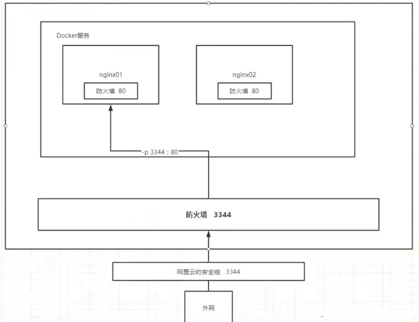
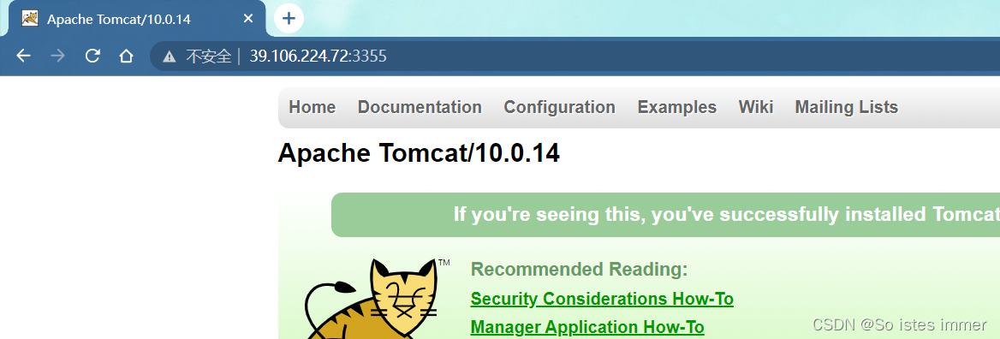
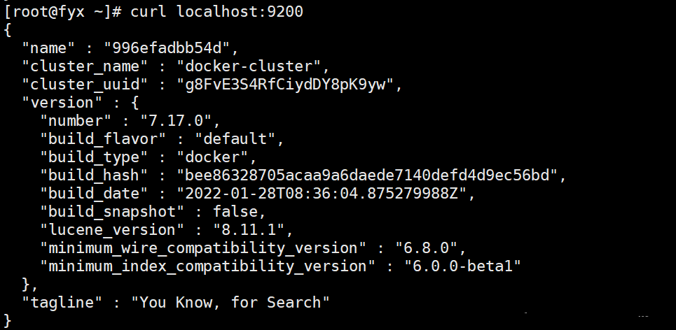
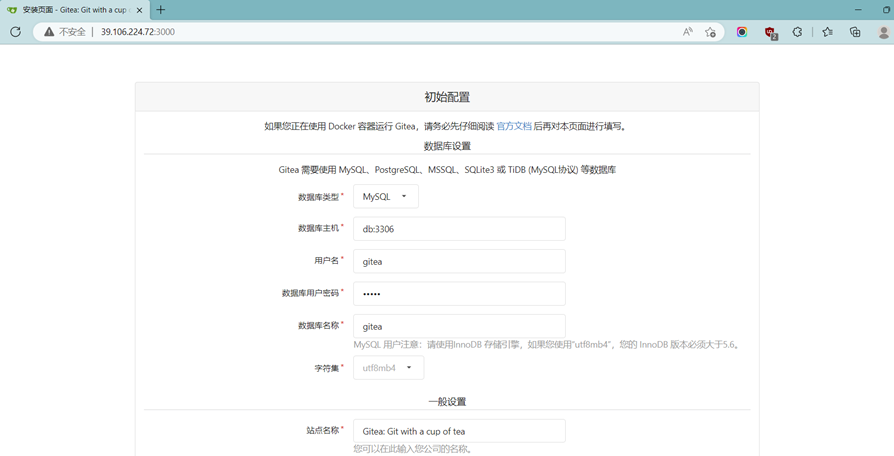
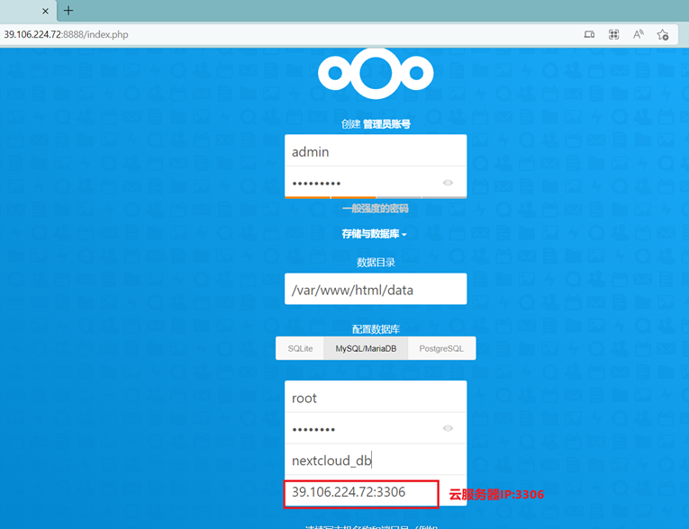
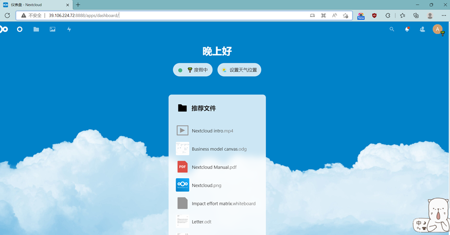

## 1. 部署Nginx

```
docker pull nginx   # 我这里就默认下最新的，不指定版本
docker images       # 检查有没有下好
# -d后台运行  --name给容器命名 -p本地主机端口:容器内部端口
docker run -d --name nginx01 -p 3344:80 nginx
```



**检测**  

①curl localhost:3344  

②浏览器访问（记得去设置阿里云的安全组，保证3344端口是允许的）

## 2. 部署Tomcat

```
docker pull tomcat                  # 下载tomcat镜像
# 创建并运行一个tomcat容器，并且做一个端口映射
docker run -d -p 3355:8080 --name tomcat01 tomcat
docker exec -it tomcat01 /bin/bash  # 进入容器
cp -r webapps.dist/* webapps        # webapps里面少点东西
```

**检测（记得去设置阿里云的安全组，保证3355端口是允许的）**



## 3. 部署ES+Kibana

```
# 能下什么版本自行去docker仓库查询
docker run -d --name elasticsearch -p 9200:9200 -p 9300:9300 -e "discovery.type=single-node" elasticsearch:7.17.0
# 由于es非常耗内存，我们可以去增加内存限制
# -e选项用于环境配置修改,-Xms设置内存初始化的大小,-Xmx设置最大能使用的内存
docker run -d --name elasticsearch -p 9200:9200 -p 9300:9300 -e "discovery.type=single-node" -e ES_JAVA_OPTS="-Xms64m -Xmx512m" elasticsearch:7.17.0
# 查看cpu使用率和内存占用情况
docker stats
# 测试es是否正常运行
curl localhost:9200
```



## 4. 安装Gitea

**系统环境：Ubuntu**

**（1）安装Docker Engine和Docker Compose**

docker-compose是一个容器管理工具，通过运行一个YAML文件帮你配置应用服务。

[官方文档](https://docs.docker.com/engine/install/ubuntu/ "官方文档")

```
sudo apt-get update // 更新apt包索引
sudo apt-get install ca-certificates curl gnupg lsb-release // 安装一些包用于使apt能够使用HTTPS去使用一个repository
 
//添加Docker的官方GPG key
sudo mkdir -p /etc/apt/keyrings
curl -fsSL https://download.docker.com/linux/ubuntu/gpg | sudo gpg --dearmor -o /etc/apt/keyrings/docker.gpg
 
// 设置一个repository
echo "deb [arch=$(dpkg --print-architecture) signed-by=/etc/apt/keyrings/docker.gpg] https://download.docker.com/linux/ubuntu $(lsb_release -cs) stable" | sudo tee /etc/apt/sources.list.d/docker.list > /dev/null
 
// 安装Docker Engine, containerd, 和Docker Compose
sudo apt-get update
sudo apt-get install docker-ce docker-ce-cli containerd.io docker-compose-plugin
 
// 验证
sudo docker run hello-world
docker compose version
```

**（2）安装Gitea(包含mysql数据库)**

[参考官方文档](https://docs.gitea.io/zh-cn/install-with-docker/#%E5%91%BD%E5%90%8D%E5%8D%B7 "参考官方文档")

在/usr/local目录下创建一个gitea目录

```
cd /usr/local && mkdir gitea && cd gitea 
```

在此目录下创建一个docker-compose.yml文件，文件内容如下：

```
version: "3"
 
networks:
  gitea:
    external: false
 
volumes:
  gitea:
    driver: local
 
services:
  server:
    image: gitea/gitea:1.16.9
    container_name: gitea
    environment:
      - USER_UID=1000
      - USER_GID=1000
      - DB_TYPE=mysql
      - DB_HOST=db:3306
      - DB_NAME=gitea
      - DB_USER=gitea
      - DB_PASSWD=gitea
    restart: always
    networks:
      - gitea
    volumes:
      - gitea:/data
      - /etc/timezone:/etc/timezone:ro
      - /etc/localtime:/etc/localtime:ro
    ports:
      - "3000:3000"
      - "222:22"
    depends_on:
      - db
 
  db:
    image: mysql:8
    restart: always
    environment:
      - MYSQL_ROOT_PASSWORD=gitea
      - MYSQL_USER=gitea
      - MYSQL_PASSWORD=gitea
      - MYSQL_DATABASE=gitea
    networks:
      - gitea
    volumes:
      - ./mysql:/var/lib/mysql
```

在后台启动 Gitea

```
docker compose up -d
```

显示 Gitea 是否正确启动

```
docker compose ps
```

配置云服务器，确保3000端口是允许被访问的。

**访问https://服务器IP:3000，然后进行配置，设置管理员的用户和账号，然后安装即可**



## 5. 安装网盘系统Nextcloud

**系统环境：Ubuntu**

**（1）首先要安装Docker**

同上

**（2）拉取mysql，并运行一个容器**

```
docker run -d --name=nextcloud_db -e MYSQL_ROOT_PASSWORD=12345678 -p 3306:3306 --restart=always mysql
```

`MYSQL_ROOT_PASSWORD`指定root用户的密码。
`--restart=always`参数能够使我们在重启docker时，自动启动相关容器。

**（3）运行一个Nextcloud容器**

```
docker run -d --name=nextcloud -p 8888:80 --restart=always nextcloud
```

**（4）浏览器输入：云服务器IP:8888**

注册管理员账号。配置数据库的时候用户root的密码见上， 数据库名字自己取。



**（5）登录后的效果**




