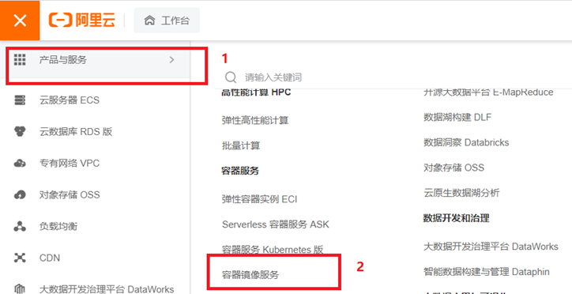

## 1. 简介

Docker 是一个**开源**的**应用容器引擎**，基于**Go语言**开发。  

我们知道，一个产品的开发和上线，往往是**两套环境**（windows和linux之别、版本问题...），而每个机器都要环境配置，费事费力。  

**Docker**让我们在打包项目的时候能够**带上环境**。

打包成一个Image（镜像）之后，我们放在Docker仓库中，别人想运行我们的项目，直接去仓库里下载即可。

Docker使用了**容器技术**。容器化是**应用程序级别**的**虚拟化技术**。容器共享一个OS。每一个容器都包含了应用程序代码和自己的环境，相互隔离（以往多个应用都是用一个环境，例如JDK，这样往往会引起端口冲突）。  

Docker的设想是交付运行环境如同海运，OS如同一个货轮，每一个在OS基础上的软件都如同一个**集装箱**。

**容器技术**：


容器相较于虚拟机，**大大节省了硬件资源，启动更加迅速**。  

如下图所示，**虚拟机**通过分配计算机的硬件资源虚拟出自己的OS。


**三个基本概念** 

- **镜像（Image）**：Docker 镜像（Image），就相当于是一个 root 文件系统。比如官方镜像 ubuntu:16.04 就包含了完整的一套 Ubuntu16.04 最小系统的 root 文件系统。
- **容器（Container）**：镜像（Image）和容器（Container）的关系，**就像是面向对象程序设计中的类和实例一样**，镜像是静态的定义，容器是镜像运行时的实体。容器可以被创建、启动、停止、删除、暂停等。
- **仓库（Repository）**：仓库可看成一个代码控制中心，用来**保存镜像**。

## 2. 安装

[参考官方文档](https://docs.docker.com/desktop/ "参考官方文档")

我这里租了个服务器，系统为**CentOS 7.9**

**（1）卸载旧版本的docker**

```
sudo yum remove docker docker-client docker-client-latest docker-common docker-latest docker-latest-logrotate docker-logrotate docker-engine
```

[Invalid configuration value: failovermethod=priority in /etc/yum.repos.d/redhat.repo报错解决](https://blog.csdn.net/weixin_43865008/article/details/122074359 "Invalid configuration value: failovermethod=priority in /etc/yum.repos.d/redhat.repo报错解决")

**（2）安装yum-utils包并换源**

```
sudo yum install -y yum-utils
//换阿里云的源，别用国外的源
sudo yum-config-manager --add-repo http://mirrors.aliyun.com/docker-ce/linux/centos/docker-ce.repo
sudo yum-config-manager --add-repo https://download.docker.com/linux/centos/docker-ce.repo
```

**（3）安装Docker Engine 和 containerd**

```
// 更新yum软件包索引
yum makecache fast  
sudo yum install docker-ce docker-ce-cli containerd.io
```

**（4）启动Docker**

```
sudo systemctl start docker
```

**（5）测试是否安装成功**

```
docker version
```

**（6）卸载**

```
// 卸载依赖
sudo yum remove docker-ce docker-ce-cli containerd.io 
// 删除资源
sudo rm -rf /var/lib/docker
sudo rm -rf /var/lib/containerd
```

**（7）配置阿里云镜像加速**

登录自己的阿里云




```
sudo mkdir -p /etc/docker
sudo tee /etc/docker/daemon.json <<-'EOF'
{
  "registry-mirrors": ["https://tgad4z51.mirror.aliyuncs.com"]
}
EOF
sudo systemctl daemon-reload
sudo systemctl restart docker
```

## 3. 常用命令

### 3.1 帮助命令

```
docker version     # 显示docker的版本信息
docker info        # 显示docker的系统信息，包括镜像和容器的数量
docker --help      # 帮助命令
docker xxx --help  # docker xxx命令的帮助
```

### 3.2 镜像命令

**（1）docker images 查看所有本地主机上的镜像**

```
[root@fyx ~]# docker images
REPOSITORY    TAG       IMAGE ID       CREATED        SIZE
hello-world   latest    feb5d9fea6a5   4 months ago   13.3kB

REPOSITORY 镜像的仓库源
TAG        镜像的标签
IMAGE ID   镜像的id
CREATED    镜像的创建时间
SIZE       镜像的大小

# 可选项
-a         列出所有的镜像
-q         只显示镜像的id
```

**（2）docker search 搜索镜像**

```
docker search mysql                      # 搜索mysql镜像
docker search mysql --filter=STARS=3000  # 可选项--filter表示过滤,需要至少3000stars的
```

**（3）docker pull 下载镜像**

```
docker pull mysql      # 默认下载最新的
docker pull mysql:5.7  # 下载指定版本的（具体有什么版本的可去官方仓库中查询）
```

**（4）docker rmi 删除镜像**

```
docker rmi -f 镜像id                  # 删除指定镜像
docker rmi -f 镜像id 镜像id           # 删除多个镜像
docker rmi -f $(docker images -aq)   # 删除全部镜像
```

### 3.3 容器命令

有了镜像才可以创建容器，这里我们以centos为例。

```
docker pull centos
```

新建容器并启动

```
docker run [可选参数] image
# 参数说明
--name="Name"   # 设置容器名字，用于区分容器
-d,--detach     # 后台运行容器并打印容器ID（必须要有一个前台进程，否则容器会自动停止）
-it             # 使用交互方式运行，进入容器查看内容
-p              # 指定容器端口
   -p ip:主机端口:容器端口
   -p 主机端口:容器端口
   -p 容器端口
-P              # 随机指定端口
```

启动并进入容器

```
[root@fyx ~]# docker run -it centos /bin/bash
[root@1bce69c44b4e /]# ls
bin  etc   lib      lost+found  mnt  proc  run   srv  tmp  var
dev  home  lib64  media       opt  root  sbin  sys  usr
```

退出容器

```
exit        # 容器停止并退出
Ctrl+p+q    # 容器不停止退出
```

列出所有运行的容器

```
docker ps      # 列出当前正在运行的容器
docker ps -a   # 列出当前正在运行的容器+历史运行的容器
docker ps -aq  # 只显示容器的编号
```

删除容器

```
docker rm 容器id    # 删除指定容器，不能删除正在运行的容器，强制删除用rm -f
docker rm -f $(docker ps -aq) # 删除所有容器
```

启动和停止容器的操作

```
docker start 容器id        # 启动容器
docker restart 容器id      # 重启容器
docker stop 容器id         # 停止当前正在允许的容器
docker kill 容器id         # 强制停止当前容器
```

### 3.4 docker logs查看日志

```
# 自己写一段shell脚本
docker run -d centos /bin/sh -c "while true;do echo love;sleep 2;done"
# 显示日志
docker logs -tf --tail 10 容器id
```

### 3.5 查看容器中的进程信息

```
docker top 容器id
```

### 3.6 查看镜像的源数据

```
docker inspect 容器id
```

### 3.7 进入当前正在运行的容器

```
docker exec -it 容器id /bin/bash    # 进入容器后开启一个新的终端
docker attach 容器id                # 进入容器正在执行的终端，不会启动新的进程
```

### 3.8 从容器内拷贝文件到主机上

```
docker cp 容器id:源文件路径 主机目标路径
```

## 4. Docker图形化管理工具 portainer

下载portainer，创建并运行一个容器

```
docker run -d -p 8088:9000 --restart=always -v /var/run/docker.sock:/var/run/docker.sock --privileged=true portainer/portainer-ce
```

访问测试

```
云服务器IP:8088
```


## 5. 镜像

**镜像**是一种轻量级的、可执行的独立软件包，包含软件运行所需要的所有内容，包括代码、库、环境变量和配置文件。  

**获取docker镜像方式**：自己制作、从docker仓库中拿、拷贝别人的。

**docker镜像加载原理**

docker镜像实际上是由一层一层的文件系统组成的，我们称之为**UnionFS(联合文件系统)**。


在docker镜像最底层的是**bootfs(boot file system)**，和典型的Linux/Unix系统一样，包含bootloader和kernel，bootloader主要用于引导加载kernel。  

**rootfs(root file system)**，在bootfs之上，就是各种不同的操作系统，如Ubuntu,Centos等等。

再往上面可以叠加其它镜像文件，上面的镜像依赖下面的镜像。

Docker镜像都是只读的，启动一个**容器**时，Docker会在最顶层加载一个读写文件系统作为容器。  

这一层就是我们通常所说的容器层，容器之下的都叫镜像层。

**下载镜像我们也是分层下载的***保存当前容器状态，做一个新的镜像**

```
docker pull tomcat                 # 下载tomcat镜像
docker run -it tomcat /bin/bash    # 新建容器，以交互的方式进入容器
# 由于官方默认webapps下面没有文件，我们自己拷贝进去一些基本文件
cp -r webapps.dist/* webapps
exit                               # 退出容器
docker run -d tomcat               # 创建一个容器，并后台运行
docker ps                          # 拿到容器id
# 保存当前容器状态，提交成为一个镜像
# docker commit -m="提交的描述信息" -a="作者" 容器id 目标镜像名:[TAG]
docker commit -a="fyx" -m="add webapps app" 37e55e6618eb tomcat02:1.0
docker images                      # 查看我们提交的镜像
```


## 6. 数据卷

docker可将应用和环境打包成一个镜像。容器是镜像的实例化。  

我们的数据如果都在容器中，**一旦容器删除，数据就会丢失**。  

**数据卷技术**可将容器产生的数据**同步到本地**，容器之间也可以共享，从而实现容器数据的持久化。  

当本地和容器可以实现目录映射，修改容器配置就不必进入容器，有了映射**直接在本地修改即可**。

### 6.1 使用数据卷（volumes）

创建一个容器，-v选项表示携带一个数据卷，选项后面是一个目录的映射。

```
docker run -v 主机目录:容器内目录 image 
```

**实例1**

将本地/home/test目录与容器的/home目录进行映射

-it 选项对应/bin/bash，表示分配一个shell用于和容器交互

```
docker run -it -v /home/test:/home centos /bin/bash
```

接着，我在容器的/home目录下面新建了一个hello.java，如下图


在本地/home/test目录下面我们可以看到数据已经同步

**实例2：mysql数据持久化**

拉取镜像

```
docker pull mysql:8.0
```

启动一个mysql容器，MYSQL_ROOT_PASSWORD用于设置密码

这里将mysql容器的配置文件目录和数据目录都做了一个本地

```
docker run --name mysql01 -d -p 3310:3306 -v /home/mysql/conf:/etc/mysql/conf.d -v /home/mysql/data:/var/lib/mysql -e MYSQL_ROOT_PASSWORD=123456 mysql:8.0
```

查看本地/home/mysql/data目录


可以用Navicat测试一下数据库的连接，并且创建一个test数据库

再次查看本地/home/mysql/data目录，数据已更新，多了一个test数据库

### 6.2 具名挂载和匿名挂载

指定路径挂载，-v 宿主机路径:容器内路径

**匿名挂载**, -v 容器内路径

-P 表示随机分配端口，-v后面只指明了容器中要挂载

```
docker run -d -P --name nginx01 -v /etc/nginx nginx
```

**具名挂载**， -v 卷名:容器内路径

```
docker run -d -P --name nginx02 -v juming-nginx:/etc/nginx nginx
```

查看volume的情况，匿名挂载会随机分配一个volume name，如下图

```
docker volume ls
```


具名挂载，我们可通过**docker inspect 卷名**获取容器中的目录挂载到本地的位置


