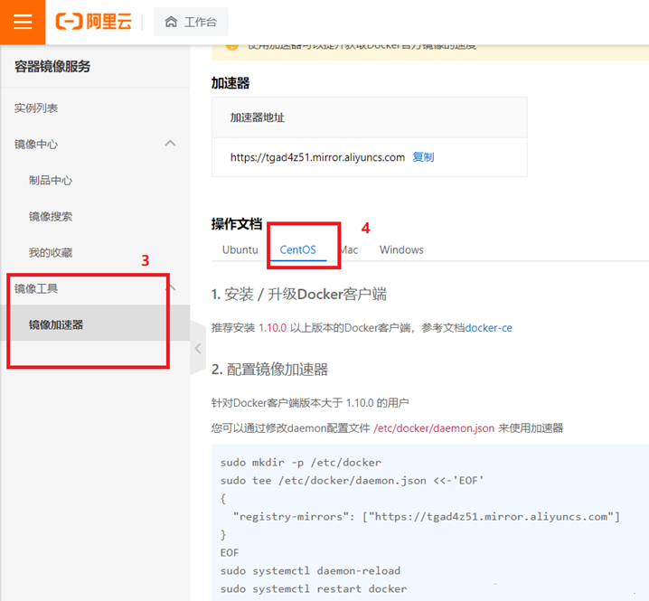

## 1. 简介

Docker 是一个**开源**的**应用容器引擎**，基于**Go语言**开发。  

我们知道，一个产品的开发和上线，往往是**两套环境**（windows和linux之别、版本问题...），而每个机器都要环境配置，费事费力。  

**Docker**让我们在打包项目的时候能够**带上环境**。

打包成一个Image（镜像）之后，我们放在Docker仓库中，别人想运行我们的项目，直接去仓库里下载即可。

Docker使用了**容器技术**。容器化是**应用程序级别**的**虚拟化技术**。容器共享一个OS。每一个容器都包含了应用程序代码和自己的环境，相互隔离（以往多个应用都是用一个环境，例如JDK，这样往往会引起端口冲突）。  

Docker的设想是交付运行环境如同海运，OS如同一个货轮，每一个在OS基础上的软件都如同一个**集装箱**。

**容器技术**：


容器相较于虚拟机，**大大节省了硬件资源，启动更加迅速**。  

如下图所示，**虚拟机**通过分配计算机的硬件资源虚拟出自己的OS。


**三个基本概念** 

- **镜像（Image）**：Docker 镜像（Image），就相当于是一个 root 文件系统。比如官方镜像 ubuntu:16.04 就包含了完整的一套 Ubuntu16.04 最小系统的 root 文件系统。
- **容器（Container）**：镜像（Image）和容器（Container）的关系，**就像是面向对象程序设计中的类和实例一样**，镜像是静态的定义，容器是镜像运行时的实体。容器可以被创建、启动、停止、删除、暂停等。
- **仓库（Repository）**：仓库可看成一个代码控制中心，用来**保存镜像**。

## 2. 安装

[参考官方文档](https://docs.docker.com/desktop/ "参考官方文档")

我这里租了个服务器，系统为**CentOS 7.9**

**（1）卸载旧版本的docker**

```
sudo yum remove docker docker-client docker-client-latest docker-common docker-latest docker-latest-logrotate docker-logrotate docker-engine
```

[Invalid configuration value: failovermethod=priority in /etc/yum.repos.d/redhat.repo报错解决](https://blog.csdn.net/weixin_43865008/article/details/122074359 "Invalid configuration value: failovermethod=priority in /etc/yum.repos.d/redhat.repo报错解决")

**（2）安装yum-utils包并换源**

```
sudo yum install -y yum-utils
//换阿里云的源，别用国外的源
sudo yum-config-manager --add-repo http://mirrors.aliyun.com/docker-ce/linux/centos/docker-ce.repo
sudo yum-config-manager --add-repo https://download.docker.com/linux/centos/docker-ce.repo
```

**（3）安装Docker Engine 和 containerd**

```
// 更新yum软件包索引
yum makecache fast  
sudo yum install docker-ce docker-ce-cli containerd.io
```

**（4）启动Docker**

```
sudo systemctl start docker
```

**（5）测试是否安装成功**

```
docker version
```

**（6）卸载**

```
// 卸载依赖
sudo yum remove docker-ce docker-ce-cli containerd.io 
// 删除资源
sudo rm -rf /var/lib/docker
sudo rm -rf /var/lib/containerd
```

**（7）配置阿里云镜像加速**

登录自己的阿里云





```
sudo mkdir -p /etc/docker
sudo tee /etc/docker/daemon.json <<-'EOF'
{
  "registry-mirrors": ["https://tgad4z51.mirror.aliyuncs.com"]
}
EOF
sudo systemctl daemon-reload
sudo systemctl restart docker
```


