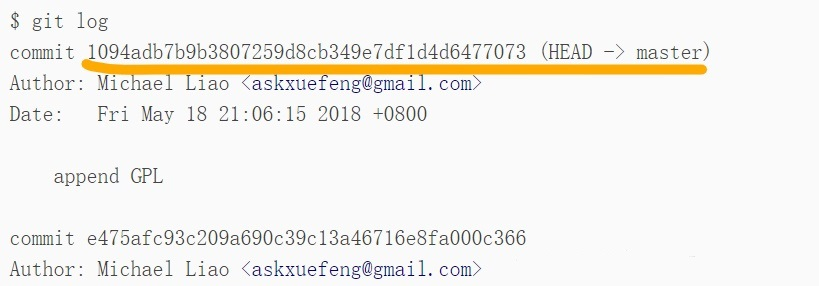

Git是目前世界上最先进的**分布式版本控制系统**。

**安装git**就不说了。

## 1. 创建版本库

```
git init     // 把当前目录变成Git可以管理的仓库
```

执行完，当前目录会多一个 `.git` 的目录，该目录我们称之为**版本库**（Repository）。

版本库中有一个叫 **stage** 的暂存区，还有 Git 为我们自动创建的第一个分支 **master**，以及指向master的一个指针叫 **HEAD**。


建议用这两步来提交文件,提交的文件要和 `.git` 目录在同一目录

```
git add xxx                  // 把文件修改添加到暂存区
git commit -m "提交的说明"     // 把暂存区的所有内容提交到当前分支
```

## 2. 版本回退

查看提交历史，`--pretty=oneline` 参数可简化日志的输出，只能查看当前版本之前的 `commit id`。

```
git log 
```



记录你的每一次命令，可查询当前版本之后的`commit id`。

```
git reflog
```

**HEAD**表示当前版本

回退到上一个版本用 **HEAD^**，回退到上上一个版本用 **HEAD^^**，回退到100个版本之前用**HEAD~100**

```
git reset --hard HEAD^
```

上面是想后回退，**向前回退**，--hard 后面跟对应的commit id，版本号没必要写全，前几位就可以了，Git会自动去找

```
git reset --hard 1094a
```

## 3. 撤销修改

如果你想修改的文件还未添加到暂存区

```
git checkout -- file
```

如果你想修改的文件已经添加到了暂存区，用下面两步撤销

```
git reset HEAD <file>
git checkout -- file
```

如果你想修改的文件已经 commit 了，参考上面的版本回退

## 4. 删除文件

你在工作区删除了一个文件，工作区和版本库就不一致了，`git status`命令会立刻告诉你哪些文件被删除了  

如果想从版本库中删除该文件

```
git rm xxx文件
git commit -m "说明文字"
```

如果你是误删的，并且该文件已经被提交到版本库，可以恢复

```
git checkout -- xxx文件
```

`git checkout` 其实是用版本库里的版本替换工作区的版本，无论工作区是修改还是删除，都可以还原。

## 5. 远程仓库

**（1）直接克隆远程库**

先在github上面创建一个仓库

```
git clone git@github.com:你的github账户名/仓库名.git
```

如果有多个人协作开发，那么每个人各自从远程克隆一份就可以了。  

Git支持多种协议，包括**https**，但**ssh协议**速度最快（默认的 git:// 使用ssh）。

**（2）先有本地库，再想关联远程库**

在github上面创建一个仓库。

将本地库和远程库相关联，远程库的名字就是origin，这是Git默认的叫法，也可以改成别的。

```
git remote add origin git@github.com:你的GitHub账户名/仓库名.git
```

把本地库的所有内容推送到远程库上，实际上是把当前分支master推送到远程

```
git push -u origin master
```

第一次推送master分支时，加上了` -u` 参数，Git不但会把本地的master分支内容推送的远程新的master分支，还会把本地的master分支和远程的master分支关联起来，以后推送或者拉取就可以简化命令。

从现在起，只要本地作了提交(commit)，就可以通过命令把本地master分支的最新修改推送至GitHub。

```
git push origin master
```

**（3）解除本地和远程库的绑定关系**

```
git remote rm origin
```

## 6. 分支管理

### 6.1 基础操作

创建分支

```
git branch 分支名
```

切换分支

```
git checkout 分支名
或
git switch 分支名
```

创建并切换分支

```
git checkout -b 分支名
或
git switch -c 分支名
```

查看当前分支，该命令会列出所有分支,当前分支前面会标一个 * 号

```
git branch
```

之后我们就可以在该分支上修改文件，add、commit

切换回master分支

```
git checkout master
```

当前分支为master，git merge命令用于合并指定分支到当前分支

```
git merge 分支名
```

合并完成后，想删除刚合并的那个分支

```
git branch -d 分支名
```

### 6.2 合并冲突

如果你在某一个分支修改了文件，切换到master分支又修改了同一个文件，再进行git merge合并的时候，这种合并就可能会引发冲突。

```cobol
git status        // 告诉我们冲突的文件
```

直接打开冲突文件， Git会用`<<<<<<<`，`=======`，`>>>>>>>`标记出不同分支的内容  

这时，需要我们手动编辑文件，使两个分支发生冲突的地方保持一致，再进行add和commit

### 6.3 分支管理策略

`master`分支应该是非常稳定的，也就是仅用来发布新版本，平时不能在上面干活。  

干活都在dev分支上，到某个时候，比如1.0版本发布时，再把dev分支合并到`master`上，在`master`分支发布1.0版本。

我们在git merge分支的时候，默认使用 **Fast forward** 模式，在该模式下，会丢失合并信息。

加上`--no-ff`参数可以用普通模式合并，Git就会在merge时生成一个新的commit，这样，从分支历史上就可以看出分支信息。

```
git merge --no-ff -m "说明信息" 分支名称
// 查看分支历史
git log --graph --pretty=oneline --abbrev-commit
```

### 6.4 bug分支

想象这样一个场景：你在dev分支上的工作还没有完成，无法commit，但是需要立马修复一个bug（代号101），你就需要把当前工作现场 “储藏” 起来，修复完bug之后再继续工作。

```
// 现在我在dev分支干活
git stash                   // 把当前工作现场“储藏”起来
// 现在，用git status查看工作区，就是干净的。假设你要在master分支上修复bug
git checkout master         // 切换到master分支
git checkout -b issue-101   // 创建并切换到issue-101分支
// 修复完bug后
git add xxx文件 
git commit -m "fix bug 101"
git switch master           // 切换到master分支
git merge --no-ff -m "merged bug fix 101" issue-101 # 合并issue-101分支
git branch -d issue-101     // 删除issue-101分支
git switch dev              // 回到dev分支继续干活
git status                  // 瞅一眼目前状态
git stash list              // 查看刚才保存的工作现场
git stash apply             // 恢复stash全部内容,也可以恢复指定stash,指令后面要加东西
git stash drop              // 删除stash内容
git stash pop               // 上面两步可用这一步代替
git stash list              // 再次查看，就看不到任何stash内容了
```

在master分支上修复了bug后，这个bug其实在当前dev分支上也存在，如果你想在dev分支上修复同样的bug，可用重复一遍上述操作，也可以使用`cherry-pick`命令来复制一个特定的 commit 到当前分支。

```
git cherry-pick xxx // 后面的xxx填你要复制的那个commit的id,你上面提交的时候会看到,也可用git log查看
```

### 6.5 多人协作

```
git remote      // 查看远程库的信息
git remote -v   // 显示更详细的信息
git push origin <branch-name>   // 推送自己的修改
```

如果推送失败，则因为远程分支比你的本地更新，需要先用git pull试图合并。

如果合并有冲突，则解决冲突，并在本地提交。没有冲突或者解决掉冲突后，再次推送。

```
git push origin <branch-name>
```

如果git pull提示no tracking information，则说明本地分支和远程分支没有创建链接关系，用下面的命令

```
git branch --set-upstream-to <branch-name> origin/<branch-name>
```

### 6.6 创建远程分支

```
git checkout -b dev      // 新建本地分支dev，并切换
git push origin dev:dev  // 这个时候远程也创建了一个dev分支
git branch -a            // 查看所有分支
```

## 7. 标签管理

```
// 查看分支
git branch
// 切换到需要打标签的分支上         
git checkout master
// 打一个新标签,<tagname>比如可以为v1.0
git tag <tagname>
// 查看所有标签    
git tag
// 查看标签信息              
git show <tagname>
// 删除标签   
git tag -d <tagname> 
```

默认标签是打在最新提交的commit上的。

想给之前的 commit 打标签需要找到 `commit id`。

```
git tag 标签名 commit_id
```

还可以创建带有说明的标签, 用-a指定标签名，-m指定说明文字，下面是一个例子

```
git tag -a v0.1 -m "version 0.1 released" 1094adb
```

创建的标签都只存储在本地，不会自动推送到远程。要推送某个标签到远程。

```
git push origin <tagname>

// 一次性推送全部尚未推送到远程的本地标签
git push origin --tags
```

如果标签已经推送到远程，要删除远程标签就麻烦一点，先从本地删除，然后，从远程删除

```
git tag -d <tagname>
git push origin :refs/tags/<tagname>
```


