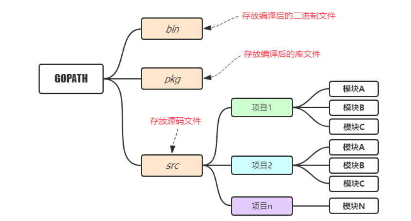
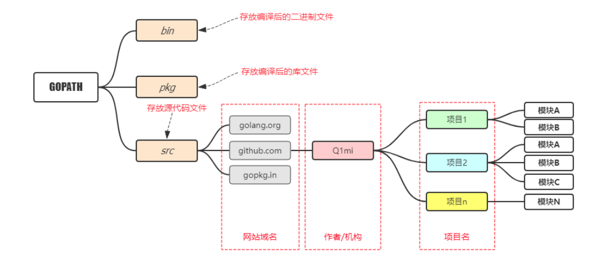
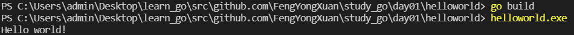

## 1. 简介

**Go**（又称 **Golang**），Google开发、开源，2009年11月正式宣布推出

编译型语言，语法和C相近，十分简洁

开发效率高，自带垃圾回收

执行性能好

**编译型语言和解释型语言的区别**

> 编译性语言需要先编译成**可执行文件**才能运行，只需编译一次，以后要再运行时，直接使直接运行exe文件即可。所以**运行效率高**。**典型**：C、C++。
> 
> 解释型语言不需要事先编译，直接将源代码解释成机器码并立即执行，所以只要某一平台提供了相应的解释器即可运行该程序。所以**跨平台性好**。**典型**：python、JavaScript

## 2. 配置环境

详细步骤：

1. 在自己的电脑上新建一个目录 D:\go（存放我编写的Go语言代码）

2. 在环境变量里，新建一项：GOPATH:D:\go

3. 在D:\go下新建三个文件夹，分别是：bin、src、pkg

4. 把 D:\go\bin 这个目录添加到PATH这个环境变量的后面

5. 你电脑上GOPATH应该是有默认值的，通常是USERPROFILE%/go，你把这一项删掉，自己按照上面的步骤新建一个就可以了。

## 3. Go项目结构

**适合个人开发者**



**目前流行的项目结构**



## 4.安装Go语言开发工具包

打开cmd 窗口，可以通过下面的命令设置go proxy：

```
go env -w GOPROXY=https://goproxy.io,direct
```

打开vscode，按下`Ctrl+Shift+P`

在输入框中输入`go:install`，选择`Go:Install/Update Tools`

在弹出的窗口选中所有，并点击“ 确定” 按钮，进行安装

## 5. 案例

main.go

```
package main
 
import "fmt"
 
//注意：函数外面不能放具体的语句，只能放一些变量、常量、函数的声明
//程序的入口
func main() {
	fmt.Println("Hello world!")
}
```

```
go build
helloworld.exe
```



如果想指定生成的可执行文件的名字：

```
go build -o hello.exe
```

> **go build报错**
> 
> go: go.mod file not found in current directory or any parent directory; see 'go help modules'
> 
> **解决**：在终端输入`go env -w GO111MODULE=auto`

可以像执行脚本文件一样执行Go代码

```
go run main.go
```

①先编译形成一个可执行文件 ②将可执行文件拷贝到GOPATH/bin

```
go install
```

## 6. 交叉编译

Go支持跨平台编译

Mac 下编译 Linux 和 Windows平台 64位 可执行程序：

```
CGO_ENABLED=0 GOOS=linux GOARCH=amd64 go build
CGO_ENABLED=0 GOOS=windows GOARCH=amd64 go build
```

Linux 下编译 Mac 和 Windows 平台64位可执行程序：

```
CGO_ENABLED=0 GOOS=darwin GOARCH=amd64 go build
CGO_ENABLED=0 GOOS=windows GOARCH=amd64 go build
```

Windows下编译Mac平台64位可执行程序：

```
SET CGO_ENABLED=0
SET GOOS=darwin
SET GOARCH=amd64
go build
```

Windows下编译linux平台64位可执行程序：

```
SET CGO_ENABLED=0  // 禁用CGO
SET GOOS=linux  // 目标平台是linux
SET GOARCH=amd64  // 目标处理器架构是amd64
go build
```

## 7. 变量

变量组成：字母、数字和下划线，需要以字母或下划线开头

Go语言中有25个关键字：

```
    break        default      func         interface    select
    case         defer        go           map          struct
    chan         else         goto         package      switch
    const        fallthrough  if           range        type
    continue     for          import       return       var
```

有37个保留字 

变量声明格式为：var 变量名 变量类型

```
var name string
var age int
var isOk bool
```

还支持**批量变量声明**：

```
var (
    a string
    b int
    c bool
    d float32
)
```

定义变量推荐使用小驼峰式的命名方法

GO语言中声明的变量必须使用，旧版本的GO是编译不过去的

同一作用域不能重复声明同名的变量

```
package main
 
import "fmt"
 
var (
	name string
	age int
	isOk bool
)
 
func main() {
  name = "fyx"
	age = 20
	isOk = false
	fmt.Print(name)
	fmt.Println(age)
	fmt.Printf("isOk:%t", isOk)
}
```

结果

```
fyx20
isOk:false
```

有时候我们会省略变量的类型，因为编译器会根据右边的值自动推导变量的类型

```
var name = "fyx"
var age = 18
```

在**函数内部**，可以使用更简略的 `:=` 方式声明并初始化变量，如 m := 5

在使用多重赋值时，如果想要忽略某个值，可以使用`匿名变量`。 匿名变量用一个下划线`_`表示

匿名变量不占用命名空间，不会分配内存

```
func foo() (int, string) {
	return 10, "fyx"
}

func main() {
	x, _ := foo()
	_, y := foo()
	fmt.Println("x=", x)
	fmt.Println("y=", y)
}
```

## 8. 常量

```
const pi = 3.1415
```

多个常量也可以一起声明

```
const (
    pi = 3.1415
    e = 2.7182
)
```

声明多个常量时，如果省略了值则表示和上面一行的值相同

```
const (
    n1 = 100
    n2
    n3
)
```

`iota`是go语言的常量计数器，只能在常量的表达式中使用。

`iota`在const关键字出现时将被重置为0。

const中每新增一行常量声明将使`iota`计数一次(iota可理解为const语句块中的**行索引**)。

在定义枚举时很有用。

```
const (
		n1 = iota //0
		n2        //1
		n3        //2
		n4        //3
	)
```

```
const (
		n1 = iota //0
		n2 = 100  //100
		n3 = iota //2
		n4        //3
	)
```

```
const (
		a, b = iota + 1, iota + 2 //1,2
		c, d                      //2,3
		e, f                      //3,4
	)
```

定义数量级

```
const (
		_  = iota
		KB = 1 << (10 * iota)
		MB = 1 << (10 * iota)
		GB = 1 << (10 * iota)
		TB = 1 << (10 * iota)
		PB = 1 << (10 * iota)
	)
```

## 9. 数据类型

### 9.1 整型

有符号：int 8、int 16、int 32、int 64   
无符号：uint 8、uint 16、uint 32、uint 64  
特殊：uint（32位os上就是uint32，64位os上就是uint64）、int（32位os上就是int32，64位os上就是int64）、uintptr（无符号整型，用于存放一个指针）

**进制之间的转换输出**

```
package main
 
import "fmt"
 
func main() {
	// 十进制
	var a int = 10
	fmt.Printf("%d \n", a) // 10
	// 以二进制形式输出
	fmt.Printf("%b \n", a) // 1010
	// 八进制
	var b int = 10
	fmt.Printf("%o \n", b) // 12
	// 十六进制，以0x开头
	var c int = 0xff
	fmt.Printf("%x \n", c) // ff
	fmt.Printf("%X \n", c) // FF
}
```

### 9.2 浮点型

Go支持两种浮点数：float32和float64   

float32最大值：math.MaxFloat32  

float64最大值：math.MaxFloat64

```
package main
 
import "fmt"
 
func main() {
	f1 := 1.23456
	fmt.Printf("%T\n", f1) //默认Go语言中的小数都是float64类型
	f2 := float32(1.23456)
	fmt.Printf("%T\n", f2) //float32
}
```

### 9.3 复数

有complex64和complex128两种

```
package main
 
import "fmt"
 
func main() {
	var c1 complex64 = 1 + 2i
	var c2 complex128 = 2 + 3i
	fmt.Println(c1) // (1+2i)
	fmt.Println(c2) // (2+3i)
}
```

### 9.4 布尔值

Go语言中以bool类型进行声明布尔型数据  

bool类型的变量默认为false  

bool型无法参与数值运算，也无法与其他类型进行转换

### 9.5 字符串

Go语言中的字符串是用双引号包裹的，单引号包裹的是字符。

有些特殊字符需要转义：\r(回车符)、\n(换行符)、\t(制表符)、\'(单引号)、\''(双引号)、\\(反斜杠)

定义多行字符串需要用到**反引号**

```
package main
 
import "fmt"
 
func main () {
	path := "'C:\\Users\\admin\\Desktop\\learn_go\\src\\github.com'"
	fmt.Println(path)
	s := "I'm ok"
	fmt.Println(s)
	s2 := `
		when we were
		young
	`
	fmt.Println(s2)
}
```

输出

```
I'm ok
 
                when we were
                young
```

**字符串的常用操作**  

len(str)                                              求长度  

+或fmt.Sprintf                                   拼接字符串  

strings.Split                                       分割  

strings.contains                                 判断是否包含  

strings.HasPrefix/strings.HasSuffix   前缀/后缀判断

strings.Index(),strings.LastIndex()     子串出现的位置

strings.Join([]string, string)                 用指定字符将数组中的元素进行拼接


