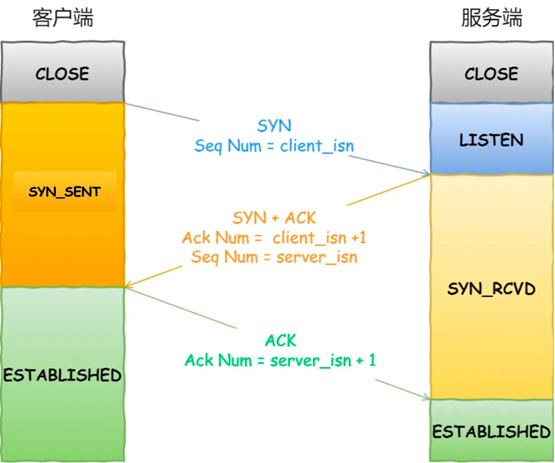
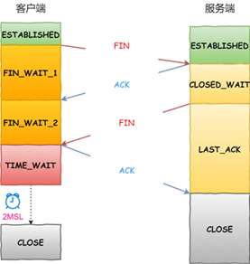

### 1. Http和Https的区别

**Http**：数据在客户端和服务器之间以**明文**传输，容易受到中间人的攻击和篡改数据。没有加密和解密过程，性能稍高。

**Https**：使用**SSL**或**TSL**协议对传输数据进行**加密**。由于需要进行加密和解密，性能上会稍微有些损耗。

在建立Https连接时，服务器首先通过数字证书把**公钥**传给客户端，客户端使用**公钥**加密一串随机码，服务端使用**私钥**解密，拿到这串随机码，这串随机码就作为**对称密钥**，用于加密后续的通信内容。（**非对称密钥**：公钥和私钥，用于早期的密钥交换和身份验证）

http和https使用的**默认端口**也不一样，http是80，https是443。

### 2. OSI七层模型、TCP/IP四层模型，做了哪些优化

**OSI七层模型**：物理层、数据链路层、网络层、传输层、会话层、表示层、应用层

**TCP/IP四层模型**：网络接口层、网络层、传输层、应用层

**优化**：TCP/IP模型将一些OSI模型中的层次进行了合并与简化，例如，去掉了会话层和表示层，将它们的功能直接集成在应用层中，简化了协议设计和实现，提高了模型的可操作性和效率。例如，将物理层和数据链路层合并为一个 网络接口层，简化了低层通信的实现，减少了复杂性。

### 3. 网络七层协议中，tcp属于哪层，http属于哪层

- **TCP（传输控制协议）** 属于 **传输层**（第4层）。传输层负责在两个节点之间提供可靠的传输服务，TCP就是一种面向连接、可靠的数据传输协议。

- **HTTP（超文本传输协议）** 属于 **应用层**（第7层）。应用层直接为用户提供服务，HTTP是用于在客户端和服务器之间传输超文本数据（如网页）的协议。

### 4. TCP和UDP区别

**UDP**

- 无连接的非可靠传输层协议
- 向上提供一条不可靠的逻辑信道
- 面向报文流

**TCP**

- 面向连接的传输控制协议
- 向上提供一条全双工的可靠逻辑信道
- 面向字节流

### 5. 私有地址

- A类：10.0.0.0 - 10.255.255.255
- B类：172.16.0.0 - 172.31.255.255
- C类：192.168.0.0 - 192.168.255.255

### 6. 在浏览器输入URL后的过程（网页提交之后发生了什么事）

1. **DNS查询**：查看浏览器缓存-->操作系统缓存-->查找本地host文件，看是否有该域名的IP地址映射。
   
   => 如果本地没有缓存，浏览器会向DNS服务器发送一个DNS查询请求，以获取域名对应的IP地址。

2. **TCP连接**：浏览器要和该IP建立TCP连接。

3. **客户端向服务端发送HTTP请求**

4. **服务器处理HTTP请求并将响应数据返回给客户端**

5. **浏览器解析并render页面**

6. **TCP连接断开**

### 7. TCP连接的建立：3次握手

(1)客户机的TCP首先向服务器的TCP发送连接请求报文段。报文段首部中同步位SYN=1，同时选一个初始序号seq=x
(2)服务器收到请求后，如果同意连接，则向客户机发送确认，SYN=1,ACK=1,确认号ack=x+1，选择一个初始序号seq=y
(3)客户机收到确认报文段后，还要向服务器发送确认，seq=x+1，ack=y+1

**为什么不是两次握手？？**

**三次握手**能够防止旧的重复连接初始化，从而造成资源浪费。

我们考虑一个场景，客户端先发送了SYN(seq=90)报文，但是这个SYN报文被网络阻塞了，服务端并没有收到，接着客户端又重新向服务端建立连接，发送了SYN(sq=
100)报文。一个「旧SYN报文」比「最新的SYN报文」早到达了服务端，那么此时服务端就会回一个SYN+AcK报文给客户端，此报文中的确认号是91(90+1)。客户端收到后，发现自己期望收到的确认号应该是100+1，而不是90+1，于是就会回RST报文。服务端收到RST报文后，就会释放连接。后续最新的SYN抵达了服务端后，客户端与服务端就可以正常的完成三次握手了。

可以看到，如果采用两次握手建立TCP连接的场景下，服务端在向客户端发送数据前，并没有阻止掉历史连接，导致服务端建立了一个历史连接，又白白发送了数据，妥妥地浪费了服务端的资源。

**为什么一定要三次握手，两次不行吗？**

如果客户端向服务器发送的第一个连接请求因为网络原因滞留了，又发了一次，第二个请求报文段先到达服务器，建立连接，连接释放之后，第一个请求报文段才到达服务器，服务器误以为客户端又发出新的连接请求了，向客户端发送确认报文段，但是被客户端忽略了，然后服务器就在那空等，浪费资源。

**SYN攻击**

SYN攻击就是Client在短时间内伪造大量不存在的IP地址，并向Server不断地发送SYN包，Server则回复确认包，并等待Client确认，由于源地址不存在，因此Server需要不断重发直至超时，这些伪造的SYN包将长时间占用未连接队列，导致正常的SYN请求因为队列满而被丢弃，从而引起网络拥塞甚至系统瘫痪。SYN 攻击是一种典型的 **DoS/DDoS 攻击**。

### 8. TCP连接的释放：4次握手

(1)客户机打算关闭连接时，向服务器发送连接释放报文段。FIN=1,seq=u
(2)服务器收到后发出确认，ACK=1, ack=u+1，seq=v
(3)若服务器已经没有要向客户机发送的数据，就通知TCP释放连接，FIN=1，ACK=1,ack=u+1，seq=w
(4)客户机收到连接释放报文段后，必须发出确认，ACK=1，ack=w+1,seq=u+1，然后等待一段时间后，客户机才进入连接关闭状态

### 9. 如果第二次握手服务端没有接收到信息该怎么处理

超时重传，如果服务端多次重传后仍未收到客户端的确认信息，则会认为客户端未响应，从而终止连接请求，释放资源。

### 10. 第四次挥手客户端需要等多久

在 TCP 四次挥手的过程中，客户端在发送 `FIN` 并接收到服务端的 `ACK` 后，进入 **TIME_WAIT** 状态，需要等待一段时间（通常为 2 倍的报文最大生存时间，简称 2MSL，即 Maximum Segment Lifetime）再完全关闭连接。

### 11. CDN

CDN-Content Delivery Network 内容分发网络

**核心理念**：将内容缓存在终端用户附近。

**具体来说**，在用户访问相对集中的地区放置缓存服务器(CDN边缘节点)，当用户访问网站时，由距离最近的缓存服务器来响应用户请求。 

**使用CDN技术的好处**：加速了网站的访问。安全方面，内容进行分发后，源服务器的IP会被隐藏，受到攻击的概率会大幅下降。
