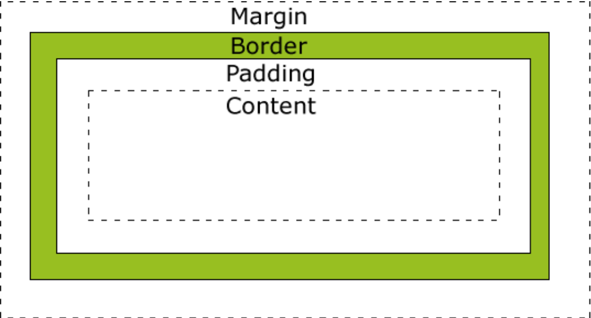
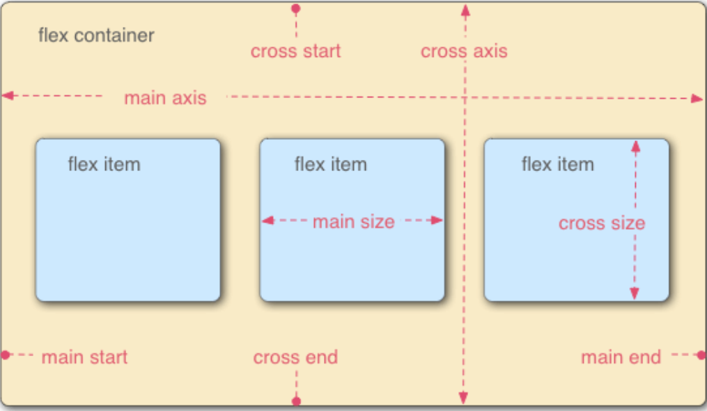

## 1.盒模型(box model)

所有HTML元素都可以看作盒子。它包括：margin(外边距)、border(边框)、padding(内边距)、content(内容)。



根据 W3C 的规范，元素的width、height属性只包含content，不包括padding和border。

IE浏览器有自己的标准，元素的width、height属性，指的是content + padding + border。

## 2.常用的CSS选择器

标签选择器、ID选择器、类选择器、后代选择器、子元素选择器、相邻兄弟选择器、通用选择器等。

## 3.CSS的权重

css的权重指在样式冲突时，某一条样式被应用的优先级。

`!important > 行内样式 > ID选择器 > 类选择器、属性选择器和伪类选择器 > 标签选择器和伪元素选择器`

## 4.如何隐藏一个元素

①display:none。这样元素在页面上不会占用任何空间，同时也不会对其他元素产生影响。

②visibility:hidden。这样元素在页面上不可见，但仍然占用空间。

③将元素的position属性设置为absolute或fixed，然后将元素移动到屏幕外或者使其超出容器的范围之外，这样元素在页面上不可见，但仍然占用空间。

## 5.Flex布局

Flex是Flexible Box的缩写，意为弹性布局，用来为盒状模型提供最大的灵活性。

任何一个容器都可以指定为 Flex 布局。

```css
.box{
  display: flex;
} 
```

行内元素也可以使用 Flex 布局。

```
.box{
  display: inline-flex;
}
```

 Webkit 内核的浏览器，必须加上`-webkit`前缀。

```
.box{
  display: -webkit-flex; /* Safari */
  display: flex;
}
```

**注意**，设为 Flex 布局以后，子元素的`float`、`clear`和`vertical-align`属性将失效。

采用Flex布局的元素，称为**Flex容器**（flex container），它的所有子元素自动成为容器成员，成为**Flex项目**（flex item）。


容器默认存在两根轴，水平的**主轴**（main axis）和垂直的**交叉轴**（cross axis）。

**容器的6个属性如下：**

**flex-direction**：主轴的方向，即项目的排列方向。

- row(默认): 主轴为水平方向，起点在左端

- row-reverse: 主轴为水平方向，起点在右端

- column: 主轴为垂直方向，起点在上端

- column-reverse: 主轴为垂直方向，起点在下端



**flex-wrap**: 默认项目都排在一条线上，flex-wrap属性定义，如果一条轴线排不下，如何换行。

- nowrap(默认): 不换行

- wrap：换行, 第一行在上方

- wrap-reverse：换行, 第一行在下方

**flex-flow**: flex-direction和flex-wrap属性的简写形式，默认值为row nowrap

**justify-content**: 定义了项目在主轴上的对齐方式。对齐方式与轴的方向有关，假设主轴为从左到右。

- flex-start(默认)：左对齐

- flex-end：右对齐

- center: 居中

- space-between：两端对齐，项目之间的间隔都相等

- space-around：每个项目两侧的间隔相等。

**align-items**：定义项目在交叉轴上如何对齐。

- flex-start: 交叉轴的起点对齐

- flex-end: 交叉轴的终点对齐

- center: 交叉轴的中点对齐

- baseline: 项目的第一行文字的基线对齐

- stretch(默认)：如果项目未设置高度或设为auto，将占满整个容器的高度。

**align-content**：定义了多根轴线的对齐方式。如果项目只有一根轴线，该属性不起作用。

- flex-start(默认)：左对齐

- flex-end：右对齐

- center: 居中

- space-between：两端对齐，项目之间的间隔都相等

- space-around：每个项目两侧的间隔相等

**项目的6个属性如下：**

- **order**: 定义项目的排列顺序。数值越小，排列越靠前，默认为0。
  
  ```
  .item {
    order: <integer>;
  }
  ```

- **flex-grow**：定义项目的放大比例，默认为0。
  
  如果所有项目的`flex-grow`属性都为1，则它们将等分剩余空间（如果有的话）。如果一个项目的`flex-grow`属性为2，其他项目都为1，则前者占据的剩余空间将比其他项多一倍。

- **flex-shrink**：定义项目的缩小比例，默认为1。

    如果所有项目的`flex-shrink`属性都为1，当空间不足时，都将等比例缩小。如果一个项          目的`flex-shrink`属性为0，其他项目都为1，则空间不足时，前者不缩小。

- **flex-basis**：定义了在分配多余空间之前，项目占据的主轴空间（main size）。浏览器根据这个属性，计算主轴是否有多余空间。它的默认值为`auto`，即项目的本来大小。

- **flex**：flex-grow, flex-shrink和 flex-basis的简写，默认值为0 1 auto。

- **align-self**：`align-self`属性允许单个项目有与其他项目不一样的对齐方式，可覆盖`align-items`属性。默认值为`auto`，表示继承父元素的`align-items`属性，如果没有父元素，则等同于`stretch`。

        该属性可能取6个值，除了auto，其他都与align-items属性完全一致。

## 6. JavaScript中的数据类型

共8种：Number、String、Boolean、Object、null、undefined、Bigint、Symbol

其中，**Object**为引用类型(Array、Date、function)，其余为基本数据类型。

## 7.map()和forEach()

都是用于遍历数组的方法，区别在于：

forEach()对数组的每个元素执行一次回调函数，没有返回值，仅仅是遍历数组。

```
arr = [1, 2, 3, 4];
arr.forEach((num) => {
 console.log(num * 2); // 输出2 4 6 8
});
```

map()方法会对数组的每个元素执行一次回调函数，并将回调函数的返回值组成一个新的数组返回，不会修改原数组。

```
arr = [1, 2, 3, 4]; 
const newArr = arr.map((num) => {
    return num * 2; 
});
console.log(newArr); // 输出[2, 4, 6, 8]
```

## 8.ES6新增特性

**（1）新增了一种数据类型symbol，**

每个symbol类型的值都是唯一的。

```
let a = Symbol('test')
let b = Symbol('test')
a == b // false
```

**（2）新增let和const两个声明变量的关键字**

let和const声明的变量具有块级作用域。
const如果声明的变量是基本数据类型的，一旦声明就不能改变。
但如果声明的是引用数据类型，能改变。

```
const obj = {
    name: 'Tom',
    age: 16
};
obj.sex = male;
```

**（3）解构赋值**

是对赋值运算符的扩展，把 "=" 右边的对象或数组的值取出来，然后赋给左边的变量。

```
let [a,b,c] = [1,2,3];
```

**（4）新增Map对象和Set对象**

Map对象用来保存键值对，Set对象用来存储一组不重复的值。

```
let demo = new Map([['name', 'Tom'], ['age', 12]);  // 可以接受一个二维数组来创建Map对象
demo.set('sex', 'male'); // {'name' => 'Tom', 'age' => 12}
demo.get('name');
```

**（5）对象的扩展运算符（...）**

```
let obj = {name:'ren',age:12};
let another = {sex:'male'};
let someone = {...person,...another};//合并对象
console.log(someone);//{name:'ren',age:12,sex:'male'}
```

**（6）箭头函数**

```
let add = (a, b) => {
    return a+b;
}
let fn = a => a*a; // 只有一个参数,括号可以省略
```

## 9. 数组常用方法

**push**：向数组的末尾添加一个或多个元素，并返回新的长度。

**pop**：删除并返回数组的最后一个元素。 

**shift**：删除数组的第一个元素，并返回第一个元素的值。 

**unshift**：向数组的开头添加一个元素，并返回新的长度。 

**sort**：对数组进行排序。 

**reverse**：颠倒数组中元素的顺序。 

**slice（start,end）**：数组截取。 

**filter**：过滤数组。

```
let arr = [1,4,6,8,10]
let result = arr.filter(function(curValue) {
    return curValue>5;
})
console.log(result); // [ 6, 8, 10 ]
```

**map**：遍历数组，对数组的每个元素执行一次回调函数，并将回调函数的返回值组成一个新的数组返回。
