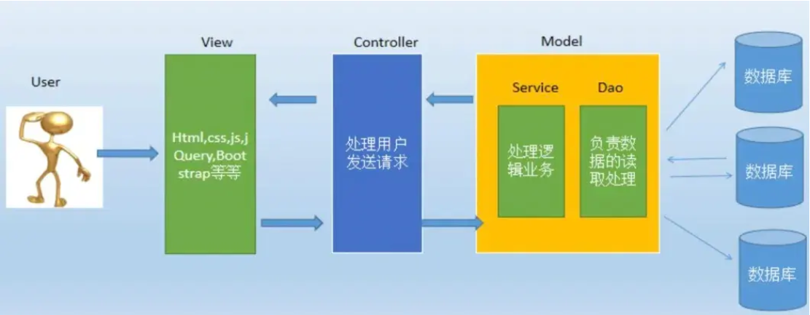
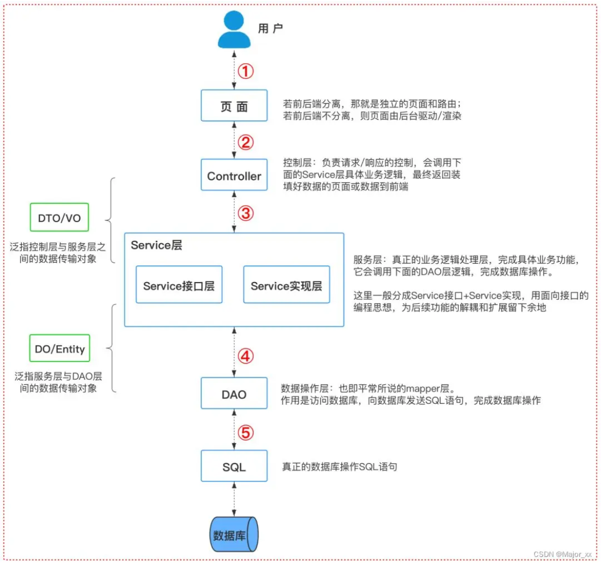

### 1. Spring框架核心特性

- **IoC容器**：Spring通过控制反转实现了对象的创建和对象间的依赖关系管理。开发者只需要定义好Bean及其依赖关系，Spring容器负责创建和组装这些对象。
- **AOP**：面向切面编程，允许开发者定义横切关注点，例如事务处理、日志管理、权限控制等，独立于业务逻辑的代码。通过AOP，可以将这些关注点模块化，提高代码的可维护性和可重用性。
- **事务管理**：Spring提供了一致的事务管理接口，支持声明式和编程式事务。开发者可以轻松地进行事务管理，而无需关心具体的事务API。
- **MVC框架**：Spring MVC是一个基于Servlet API构建的Web框架，采用了模型-视图-控制器（MVC）架构。它支持灵活的URL到页面控制器的映射，以及多种视图技术。

### 2. spring的事务，spring事务消失如何解决？

Spring事务管理支持：

- 声明式事务管理
  
  通过注解（如 `@Transactional`）或 XML 配置管理事务，减少手动代码。
  
  注解方式
  
  ```
  @Service
  public class UserService {
      @Transactional
      public void createUser(User user) {
          // 数据库操作，事务自动管理
          userRepository.save(user);
      }
  }
  ```
  
  XML方式
  
  ```
  <tx:annotation-driven transaction-manager="transactionManager"/>
  ```

- 编程式事务管理
  
  对于复杂的事务需求，可以使用 `TransactionTemplate` 进行编程式管理。
  
  ```
  @Transactional
  public class UserService {
      @Autowired
      private TransactionTemplate transactionTemplate;
  
      public void createUser(User user) {
          transactionTemplate.execute(status -> {
              try {
                  userRepository.save(user);
                  // 其他业务操作
                  return true;
              } catch (Exception e) {
                  status.setRollbackOnly(); // 手动回滚
                  return false;
              }
          });
      }
  }
  ```

**事务失效的原因包括**

- 方法调用不通过代理
  
  - Spring事务是通过 AOP 代理来处理的，如果直接在同一个类内调用带有事务注解的方法，那么该方法将不会触发代理，也就不会启动事务。
  
  ```
  public class MyService {
      @Transactional
      public void method1() {
          // 执行一些操作
          method2();  // 直接调用不会触发事务
      }
  
      @Transactional
      public void method2() {
          // 执行一些操作
      }
  }
  ```
  
  在上面的示例中，`method1()` 和 `method2()` 都有 `@Transactional` 注解，但由于 `method2()` 是由 `method1()` 直接调用的，Spring AOP 代理无法拦截 `method2()`，因此事务不会生效。
  
  - **解决方案**：避免直接调用同一类中的事务方法，或使用 **`ApplicationContext`** 来获取代理对象。

- 方法是 `private` 或 `final`
  
  - 如果目标方法是 `private` 或 `final`，Spring AOP 不能生成代理，也就无法切入这些方法，因此事务不起作用。
  
  - **解决方案**：确保事务方法是 `public`，且不是 `final` 或 `private`。

### 3. Spring事务传播机制

Spring 提供了多种事务传播行为，用来定义当一个方法调用另一个事务方法时，事务的行为方式。通过注解 `@Transactional` 的 `propagation` 属性指定传播行为。

Spring 支持以下 7 种传播行为：

| 传播行为          | 调用方无事务 | 调用方有事务 | 特点           |
| ------------- | ------ | ------ | ------------ |
| REQUIRED      | 新建事务   | 加入当前事务 | 默认选项，适合大多数场景 |
| REQUIRES_NEW  | 新建事务   | 挂起当前事务 | 独立事务，互不影响    |
| SUPPORTS      | 非事务运行  | 加入当前事务 | 对事务不强依赖      |
| NOT_SUPPORTED | 非事务运行  | 挂起当前事务 | 忽略事务         |
| MANDATORY     | 抛出异常   | 加入当前事务 | 必须在事务中运行     |
| NEVER         | 非事务运行  | 抛出异常   | 禁止事务         |
| NESTED        | 新建事务   | 嵌套事务   | 支持嵌套事务，部分回滚  |

### 4. 什么是反射？有哪些使用场景？

反射是 Java 的一种机制，允许在运行时获取类的结构信息（如类的名称、方法、字段等），并可以动态创建对象、调用方法或访问字段，而无需在编译时就明确知道类的信息。

- **依赖注入（DI）**：
  
  - Spring 容器使用反射来创建和管理对象实例。通过反射，Spring 可以动态地实例化类、调用构造方法，并将依赖项注入到类的字段或构造函数中。
  - 例如，使用 `@Autowired` 注解时，Spring 会使用反射获取该类的构造函数，并根据类型自动注入所依赖的bean。

- **AOP（面向切面编程）**：
  
  - 在实现 AOP 时，Spring 使用反射来代理目标对象，并在执行目标方法之前或之后执行切面逻辑。反射允许 Spring 在运行时动态地拦截方法调用并处理切面。

### 5. spring 常用注解有什么？

- @Autowired：主要用于自动装配bean。当Spring容器中存在与要注入的属性类型匹配的bean时，它会自动将bean注入到属性中。就跟我们new 对象一样。

- @Component：用于标记一个类作为Spring的bean。当一个类被@Component注解标记时，Spring会将其实例化为一个bean，并将其添加到Spring容器中。

- @Configuration：用于标记一个类作为Spring的配置类。配置类可以包含@Bean注解的方法，用于定义和配置bean，作为全局配置。

- @Bean：用于标记一个方法作为Spring的bean工厂方法。当一个方法被@Bean注解标记时，Spring会将该方法的返回值作为一个bean，并将其添加到Spring容器中，如果自定义配置，经常用到这个注解。

- @Service：用于标记一个类作为服务层的组件。它是@Component注解的特例，用于标记服务层的bean，一般标记在业务service的实现类。

- @Repository：标记一个类作为数据访问层的组件。它也是@Component注解的特例，用于标记数据访问层的bean。

- @Controller：用于标记一个类作为控制层的组件。它也是@Component注解的特例，用于标记控制层的bean。

### 6. Bean是否单例？

Spring 中的 Bean 默认都是单例的。

就是说，每个Bean的实例只会被创建一次，并且会被存储在Spring容器的缓存中，以便在后续的请求中重复使用。这种单例模式可以提高应用程序的性能和内存效率。

但是，Spring也支持将Bean设置为多例模式，即每次请求都会创建一个新的Bean实例。要将Bean设置为多例模式，可以在Bean定义中通过设置scope属性为"prototype"来实现。

需要注意的是，虽然Spring的默认行为是将Bean设置为单例模式，但在一些情况下，使用多例模式是更为合适的，例如在创建状态不可变的Bean或有状态Bean时。此外，需要注意的是，如果Bean单例是有状态的，那么在使用时需要考虑线程安全性问题。

### 7. SpringBoot和SpringMVC的区别？

- **SpringMVC** 主要是一个用于构建 Web 应用的框架，它处理 HTTP 请求，使用控制器（Controller）来处理请求并返回视图，但是需要开发者手动配置很多内容，如 Spring 配置文件、组件扫描。

- **SpringBoot** 是 Spring 框架的一个扩展，提供自动配置和快速启动，简化了 Spring 应用的开发和部署。

### 8. SpringMVC的底层原理

SpringMVC 是 Spring 框架中用于处理 Web 请求的模块。

SpringMVC 的工作由一个核心组件 `DispatcherServlet` 完成。**DispatcherServlet** 是一个前端控制器（Front Controller），负责接收所有的 HTTP 请求，根据请求 URL 和配置的映射规则找到对应的处理器（Controller）。

### 9. MVC分层

MVC全名是Model View Controller，是模型(model)－视图(view)－控制器(controller)的缩写，一种软件设计典范，用一种业务逻辑、数据、界面显示分离的方法组织代码。

- **视图（view）**： 为用户提供使用界面，与用户直接进行交互。

- **模型（model）**：代表一个存取数据的对象或 JAVA POJO（Plain Old Java Object，简单java对象）。它也可以带有逻辑，主要用于承载数据，并对用户提交请求进行计算的模块。模型分为两类，一类称为数据承载 Bean，一类称为业务处理Bean。所谓数据承载 Bean 是指实体类（如：User类），专门为用户承载业务数据的；而业务处理 Bean 则是指Service 或 Dao 对象， 专门用于处理用户提交请求的。

- **控制器（controller）**：用于将用户请求转发给相应的 Model 进行处理，并根据 Model 的计算结果向用户提供相应响应。它使视图与模型分离。
  
  

典型的 SpringMVC 分层结构主要包括以下几个层次： 

- 表现层（Controller 层）：处理前端请求，调用业务逻辑层，返回视图或数据（如 JSON）。

- 业务逻辑层（Service 层）：封装核心业务逻辑，处理事务，协调各个 DAO 的调用。

- 数据访问层（DAO / Repository 层）：封装对数据库的访问操作，如增删改查。

- 实体层（Entity / Model / Domain）：用于表示数据库中的表结构或业务对象。

- 

### 10. 为什么使用springboot

- 简化开发：Spring Boot通过提供一系列的开箱即用的组件和自动配置，简化了项目的配置和开发过程，开发人员可以更专注于业务逻辑的实现，而不需要花费过多时间在繁琐的配置上。
- 快速启动：Spring Boot提供了快速的应用程序启动方式，可通过内嵌的Tomcat、Jetty或Undertow等容器快速启动应用程序，无需额外的部署步骤，方便快捷。
- 自动化配置：Spring Boot通过自动配置功能，根据项目中的依赖关系和约定俗成的规则来配置应用程序，减少了配置的复杂性，使开发者更容易实现应用的最佳实践。

### 11. 怎么理解SpringBoot中的约定大于配置

Spring Boot 的“约定大于配置”原则是一种设计理念，通过减少配置和提供合理的默认值，使得开发者可以更快速地构建和部署应用程序。

Spring Boot通过「自动化配置」和「起步依赖」实现了约定大于配置的特性。

- 自动化配置：Spring Boot根据项目的依赖和环境自动配置应用程序，无需手动配置大量的XML或Java配置文件。例如，如果项目引入了Spring Web MVC依赖，Spring Boot会自动配置一个基本的Web应用程序上下文。
- 起步依赖：Spring Boot提供了一系列起步依赖，这些依赖包含了常用的框架和功能，可以帮助开发者快速搭建项目。

### 12. SpringBoot的项目结构是怎么样的？



### 13. Spring AOP的原理 ?  怎么实现AOP ? AOP、过滤器、拦截器区别？

**（1）Spring AOP的原理**

Spring AOP（面向切面编程）是 Spring 框架的重要特性，它允许开发者在不修改原有业务逻辑的基础上对程序进行增强。比如日志记录、事务管理、异常处理等。

**（2）Spring AOP的实现方式**

①基于代理的方式

根据目标对象是否实现接口，Spring AOP会选择不同的代理方式：

- JDK动态代理：如果目标对象实现了一个或多个接口，Spring AOP会使用JDK的动态代理生成代理对象。
- CGLIB动态代理：如果目标对象没有实现接口，Spring AOP会使用CGLIB生成子类代理。CGLIB通过继承目标类并重写方法实现代理功能。

②基于 AspectJ 注解的方式

通过在切面类上使用`@Aspect`注解标记，使用`@Before`、`@After`、`@Around`等注解定义不同类型的通知，使用`@Pointcut`注解定义切点。

Spring AOP 会根据**切点和通知**在运行时动态生成**增强后的代理对象**。目标对象被增强后，实际执行的是代理类。

切面（Aspect）：横切逻辑的模块化体现，包含一组通知和切点定义。

连接点（Join Point）：程序执行的某个具体点。

切点（Pointcut）：定义在哪些连接点上应用通知，通常通过表达式指定。

通知（Advice）：定义了切面在连接点上执行的具体动作。

- @Before：在方法执行之前执行通知。
- @After：在方法执行之后执行通知。
- @Around：在方法执行前后都执行通知。

**使用**

- 引入依赖spring-boot-starter-aop

- 定义切面类，使用 `@Aspect` 注解标记为切面类。定义切点（指程序中可以插入切面的具体位置）和通知（在切点处执行的具体逻辑）。
  
  ```
  @Aspect
  @Component
  public class LoggingAspect {
  
      @Pointcut("execution(* com.example.service.*.*(..))")
      public void serviceMethods() {}
  
      @Before("serviceMethods()")
      public void logBefore(JoinPoint joinPoint) {
          System.out.println("Before method: " + joinPoint.getSignature().getName());
      }
  }
  ```

- 在主类或配置类中使用@EnableAspectJAutoProxy注解启用AOP

**（3）AOP、过滤器、拦截器区别**

- AOP：是一种编程范式，它将那些影响多个类的公共行为封装到可重用的模块中，这些模块被称为切面。通过在运行时将切面的逻辑动态织入到目标对象的方法执行过程中，实现对程序的增强，如日志记录、事务管理等。
- 过滤器：是 Java Web 中的组件，它可以对进入 Servlet 容器的请求和响应进行预处理和后处理。过滤器通常用于统一的请求处理，如字符编码转换、请求参数过滤、权限验证等。
- 拦截器：在 Java Web 开发或其他框架中使用，用于在方法调用前后进行拦截和处理。拦截器可以对控制器的请求进行拦截，添加额外的处理逻辑，如日志记录、权限检查、性能监控等。拦截器通常由框架管理，在请求进入控制器方法前后执行。
- 作用范围的区别：AOP的作用范围可以是整个应用程序，包括服务层、数据访问层等。它可以对任意类的方法进行增强，只要满足切点的匹配条件。过滤器的作用范围是整个 Web 应用，对所有的请求和响应都生效。拦截器的作用范围通常是控制器层，只对控制器的请求进行拦截和处理。

### 14. 从 Spring Boot 的角度，讲讲前端请求到达 Controller 后的一系列流程

- **请求到达** `DispatcherServlet`。（`DispatcherServlet` 是 `Spring MVC` 的核心组件，负责请求的分发）
- **`DispatcherServlet` 根据 URL 映射查找对应的控制器**（Controller）。
- **控制器方法处理请求**，可能会返回视图名称或直接返回数据。
- **`DispatcherServlet` 调用 `ViewResolver` 查找视图**（如 JSP 页面或 Thymeleaf 模板）。
- **视图渲染并返回响应**给客户端。

### 15. 说一下 aop 和 ioc，有用过aop吗

AOP：面向切面编程，是一种程序设计思想，旨在通过分离横切关注点（cross-cutting concerns）来提高程序的模块化。横切关注点是那些影响到多个类或模块的功能，比如日志记录、事务管理、性能监控、安全检查等。这些功能通常与业务逻辑代码是分离的，但又需要在多个地方复用。

IoC：是一种程序设计思想，强调控制权的转移。在传统的面向对象编程中，程序的控制流由程序本身来控制。而在 IoC 中，控制权从程序转移到框架或容器。具体来说，就是对象的创建和管理不再由程序员显式控制，而是由 IoC 容器自动管理。

应用

- 导航项目 - 限流机制
  
  - 定义RateLimiterAspect切面
    
    ```
    @Before("@annotation(rateLimiter)")
        public void doBefore(JoinPoint joinPoint, RateLimiter rateLimiter) {
            // 获取限流标识
            String limitKey = getLimitKey(joinPoint, rateLimiter);
            boolean isLimit = redisService.limit(limitKey, rateLimiter.time(), rateLimiter.count());
            if (isLimit) {
                throw new RateLimiterException(rateLimiter.hintMessage());
            }
        }
    ```
  
  - 自定义注解 `@RateLimiter` 主要用于在方法级别应用限流功能。
    
    ```
    @Target(ElementType.METHOD) // 这个注解用于定义自定义注解可以应用的 Java 元素类型。在这里，ElementType.METHOD 表示该注解只能应用于方法上。
    @Retention(RetentionPolicy.RUNTIME) // 这个注解指定了自定义注解的保留策略。RetentionPolicy.RUNTIME 表示注解在运行时仍然可用。
    @Documented // 这个注解用于指示该注解应该被包含在 JavaDoc 中。
    public @interface RateLimiter {
    
        // 限流 key，如果知道了 key，则限流类型为全局
        String key() default "";
    
        // 限流类型
        RateLimiterType type() default RateLimiterType.DEFAULT;
    
        // 限流时间，单位秒
        public int time() default 60;
    
        // 限流次数
        public int count() default 10;
    
        // 提示语
        String hintMessage() default "操作频繁，请稍后再试";
    }
    ```
  
  - 使用
    
    ```
    @RateLimiter(type = RateLimiterType.IP, hintMessage = "验证码获取频繁，请稍后再试")
    public ResponseResult<CaptchaImageVO> getCode() {}
    
    @RateLimiter(type = RateLimiterType.IP, count = 1)
    public ResponseResult add(@Valid @RequestBody ClientNavCommentAddDTO addDTO) {}
    ```

### 16. bean的生命周期 / Spring Bean 加载到内存的步骤

- Spring 在启动时扫描所有 Bean，生成元数据（类名、作用域、依赖关系）。
- 实例化 Bean。属性注入
- 初始化阶段。
  - BeanPostProcessor.before。Bean 创建后，初始化前可修改 Bean。
  
  - `@PostConstruct`。执行用户定义的初始化方法。
  
  - InitializingBean.afterPropertiesSet()。如果实现了接口，会被调用。
  
  - `init-method`（XML中）。显式配置的初始化方法。
  
  - BeanPostProcessor.after。初始化后可以再次增强 Bean。
- 初始化完成后，放入一级缓存，供整个容器共享。
- 销毁 -> 当 Spring 容器关闭时，或 Bean 的生命周期结束时，Spring 会对 Bean 进行销毁操作。

### 17. springcloud异步线程注解

Spring 提供了 `@Async` 注解来支持异步方法执行。

- 在启动类上添加 `@EnableAsync` 注解来启用异步支持。

- 任何被 `@Async` 注解标注的方法都会在一个单独的线程中执行，而不会阻塞调用线程。

### 18. 怎么查看线程信息

1. 使用 `Thread` 类查看线程信息

```
public class ThreadInfo {
    public static void main(String[] args) {
        // 获取当前线程
        Thread currentThread = Thread.currentThread();

        // 获取当前线程的信息
        System.out.println("线程名称: " + currentThread.getName());
        System.out.println("线程ID: " + currentThread.getId());
        System.out.println("线程状态: " + currentThread.getState());
        System.out.println("线程优先级: " + currentThread.getPriority());
    }
}
```

2. 使用 `jstack` 命令（JVM工具）

`jstack` 是JVM自带的一个命令行工具，可以打印当前JVM进程的线程堆栈信息，这对于诊断死锁、线程状态、阻塞等问题非常有帮助。

```
// 提前找到Java进程的PID
jstack <PID>
```

3. 使用 `jconsole` 工具（JVM监控工具）

`jconsole` 是一个JVM自带的监控工具，它可以用来查看线程信息、内存使用情况、垃圾回收等。

- 在命令行输入 `jconsole`，打开图形化界面。选择要监控的Java进程。

### 19. springBoot启动类注解

在 Spring 应用中，启动类的注解主要用于标识这是一个 Spring Boot 应用的入口，并引导整个应用的启动流程。

**1. @SpringBootApplication**

它是一个复合注解，包含了多个重要的注解。

- `@SpringBootConfiguration`：继承自`@Configuration`，用于标识当前类是一个 Spring Boot 配置类。

- `@EnableAutoConfiguration`：启用 Spring Boot 的自动配置功能，根据类路径下的依赖和配置文件自动配置 Spring 组件（如 Web、JPA、Security）。

- `@ComponentScan`：自动扫描 @Component、@Service、@Repository、@Controller 等 Spring 组件，并注册到 Spring 容器。

**2. @Import**

用于导入额外的配置类或组件。可以传入一个或多个类作为参数，Spring 会将这些类作为配置类或组件注册到容器中。

```
@Import({OtherConfig.class, AnotherConfig.class})
public class MainConfig {
}
```

**3. @PropertySource**

用于加载外部的属性文件到 Spring 环境中。

```
@PropertySource("classpath:application.properties")
public class Config {
}
```

### 20. springboot底层原理

基于 Spring 框架构建，并通过一系列的增强机制简化传统 Spring 开发的复杂流程。

比如：自动配置、条件装配、内嵌服务器

- @EnableAutoConfiguration注解：注解被定义在启动类上，通过 `@SpringBootApplication` 自动包含。其作用是扫描类路径下的 `META-INF/spring.factories` 文件，加载 `EnableAutoConfiguration` 指定的所有自动配置类。

- Spring Boot 通过条件注解实现按需加载配置的能力。
  
  常见条件注解：
  
  - `@ConditionalOnClass`：仅当类路径中存在指定类时加载 Bean。
  - `@ConditionalOnMissingBean`：仅当 Spring 容器中不存在指定 Bean 时加载。
  - `@ConditionalOnProperty`：根据配置属性值加载 Bean。
  - `@ConditionalOnWebApplication`：仅当当前应用为 Web 应用时加载。

- Spring Boot 提供内嵌的 Web 服务器（如 Tomcat、Jetty 或 Undertow），开发者无需自行安装或配置。

### 21.spring 中用到哪些设计模式

**单例模式**：Spring 框架中的 Bean 默认是单例模式，即一个 Bean 在整个应用程序中只有一个实例。通过单例模式可以减少对象的创建和销毁开销，提高系统性能。

**工厂模式**：Spring 框架使用工厂模式来创建和管理 Bean 对象。`BeanFactory` 和 `ApplicationContext` 就是 Spring 中的工厂接口，它们负责根据配置信息创建和初始化 Bean 对象。通过工厂模式，将对象的创建和使用分离，提高了代码的可维护性和可扩展性。

**代理模式**：Spring AOP（面向切面编程）使用了代理模式来实现切面的功能。Spring AOP 支持 JDK 动态代理和 CGLIB 动态代理，通过代理模式可以在不修改目标对象代码的情况下，为目标对象添加额外的功能，如日志记录、事务管理等。

**策略模式**：Spring 框架中的 `ResourceLoader` 接口使用了策略模式。`ResourceLoader` 接口定义了加载资源的方法，不同的实现类可以根据不同的策略来加载资源，如从文件系统、类路径、网络等加载资源。通过策略模式，提高了代码的灵活性和可扩展性。

### 22.
