## 1.使用Maven创建Java项目（Intellij IDEA）

### 1.1 Maven简介

Maven是一个创建、管理Java项目的工具。它将项目开发和管理过程抽象成一个项目对象模型(**POM**：Project Object Model)。

Maven项目结构如下：

```
a-maven-project  项目名
├── pom.xml  项目描述文件
├── src
│   ├── main
│   │   ├── java  存放Java源码
│   │   └── resources  存放资源文件
│   └── test
│       ├── java  存放测试源码
│       └── resources  存放测试资源
└── target  存放所有编译、打包生成的文件
```

**仓库**：用于存储资源，包括各种jar包。

**本地仓库**：自己电脑上存储资源的仓库。

**远程仓库**：非本机电脑上的仓库。

包括：**中央仓库**(Maven团队维护，存储所有资源的仓库)、**私服**(部门/公司范围内存储资源的仓库，仅对内部开放，不对外共享，可从中央仓库获取资源)。

[maven仓库地址](https://mvnrepository.com/)

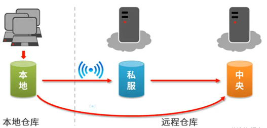

**坐标**：用于描述仓库中资源的位置。

**groupId**：定义当前Maven项目隶属组织名称。(通常是域名反写，例如：org.mybatis)

**artifactId**：定义当前Maven项目名称（通常是模块名称）

**version**：定义当前项目的版本号。

### 1.2 下载安装Maven

[Maven – Download Apache Maven](https://maven.apache.org/download.cgi)

下载完，配置好环境变量JAVA_HOME和MAVEN_HOME。验证：

```
mvn -v
```

### 1.3 配置本地仓库

①新建D:\maven\repository目录

②在下载好的MAVEN文件中找到 settings.xml，例如：`D:\apache-maven-3.8.6\conf\settings.xml`

③自定义本地仓库的位置

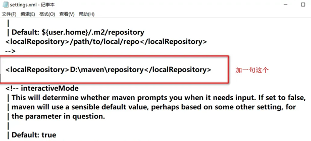

④配置阿里云镜像仓库，还是修改settings.xml

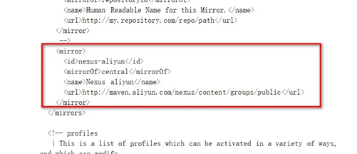

可以多加几个mirror

```
<mirror>
  <id>alimaven</id>
  <name>aliyun maven</name>
  <url>http://maven.aliyun.com/nexus/content/groups/public/</url>
  <mirrorOf>central</mirrorOf>
</mirror>

<mirror>
  <id>uk</id>
  <mirrorOf>central</mirrorOf>
  <name>Human Readable Name for this Mirror.</name>
  <url>http://uk.maven.org/maven2/</url>
</mirror>

<mirror>
  <id>CN</id>
  <name>OSChina Central</name>
  <url>http://maven.oschina.net/content/groups/public/</url>
  <mirrorOf>central</mirrorOf>
</mirror>

<mirror>
  <id>nexus</id>
  <name>internal nexus repository</name>
  <!-- <url>http://192.168.1.100:8081/nexus/content/groups/public/</url>-->
  <url>http://repo.maven.apache.org/maven2</url>
  <mirrorOf>central</mirrorOf>
</mirror>
```

### 1.4 使用Maven创建项目

**（1）配置Maven**

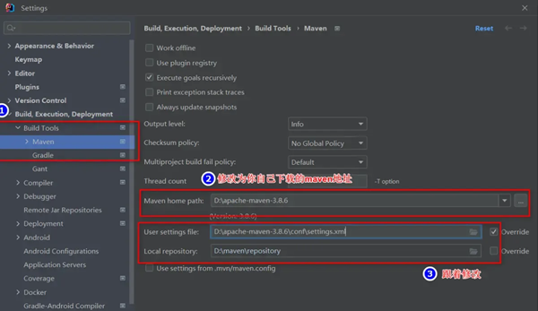

**（2）创建一般项目**

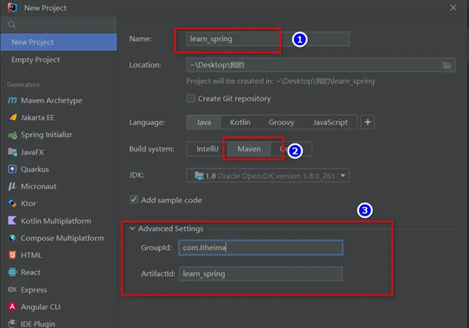

**（3）创建web项目**

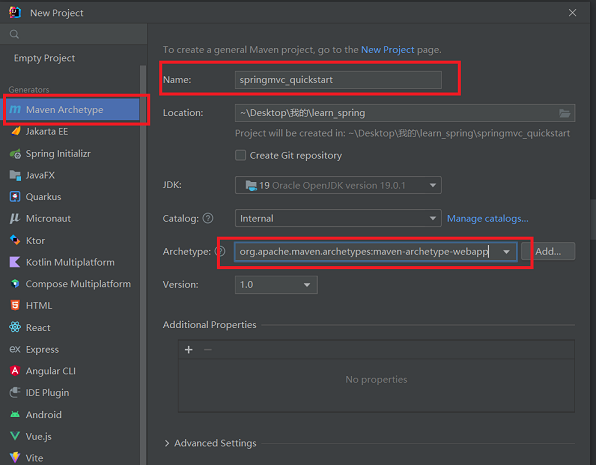

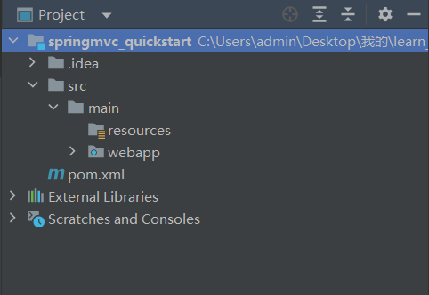

**（4）给maven项目添加依赖**

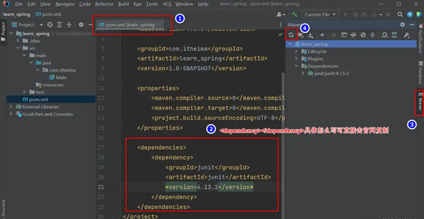

## 2. 分模块开发

将原始模块按照功能拆分成若干个子模块，方便模块间的相互调用，接口共享。

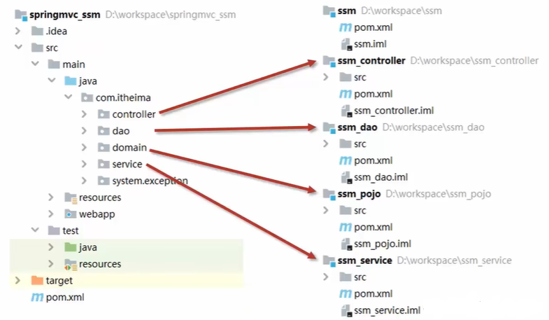

**案例：**[拆分一下这个SSM整合案例]()

**（1）创建maven模块**

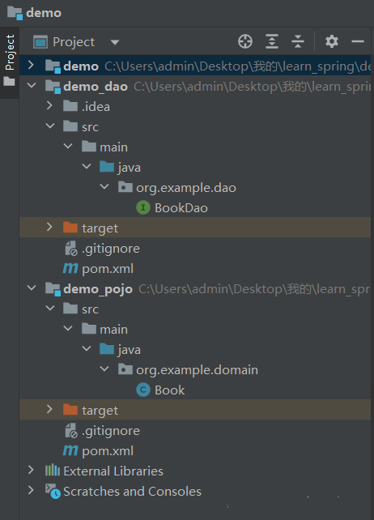

 demo项目下的pom.xml文件（主要看一下依赖）

```
<dependencies>
    <!--依赖domain运行-->
    <dependency>
      <groupId>org.example</groupId>
      <artifactId>demo_pojo</artifactId>
      <version>1.0-SNAPSHOT</version>
    </dependency>
    <!--依赖dao运行-->
    <dependency>
      <groupId>org.example</groupId>
      <artifactId>demo_dao</artifactId>
      <version>1.0-SNAPSHOT</version>
    </dependency>
    <!--其它依赖-->
    ...
</dependencies>
```

demo_pojo项目下的pom.xml文件（关注groupId和artifactId）

```
<groupId>org.example</groupId>
<artifactId>demo_pojo</artifactId>
<version>1.0-SNAPSHOT</version>
```

 demo_dao项目下的pom.xml文件（关注groupId和artifactId、依赖）

```
<groupId>org.example</groupId>
<artifactId>demo_dao</artifactId>
<version>1.0-SNAPSHOT</version>
 
<dependencies>
    <!--依赖domain运行-->
    <dependency>
        <groupId>org.example</groupId>
        <artifactId>demo_pojo</artifactId>
        <version>1.0-SNAPSHOT</version>
    </dependency>        
    <dependency>
        <groupId>org.mybatis</groupId>
        <artifactId>mybatis</artifactId>
        <version>3.5.13</version>
    </dependency>
</dependencies>
```

**（2）通过install指令安装到本地仓库**

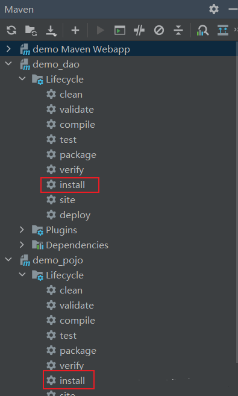

## 3. 依赖管理

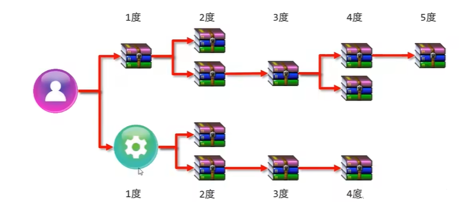

依赖具有传递性，因而demo项目下的pom.xml文件可以简化。

```
<dependencies>
    <!--依赖dao运行-->
    <dependency>
      <groupId>org.example</groupId>
      <artifactId>demo_dao</artifactId>
      <version>1.0-SNAPSHOT</version>
    </dependency>
    <!--其它依赖-->
    ...
</dependencies>
```

**可选依赖** -- 对外隐藏当前依赖的资源

```
<dependency>
    <groupId>org.example</groupId>
    <artifactId>demo_dao</artifactId>
    <version>1.0-SNAPSHOT</version>
    <optional>false</optional>
</dependency>
```

**排除依赖** -- 排除当前依赖中的某个资源

```
<dependency>
    <groupId>org.example</groupId>
    <artifactId>demo_dao</artifactId>
    <version>1.0-SNAPSHOT</version>
    <exclusions>
      <exclusion>
        <groupId>org.mybatis</groupId>
        <artifactId>mybatis</artifactId>
      </exclusion>
    </exclusions>
</dependency>
```

## 4. 聚合

**聚合**：将多个模块组织成一个整体，同时进行项目构建。

**聚合工程**：通常是一个不具有业务功能的 “空” 工程（有且仅有一个pom文件）

**作用**：当工程中某个模块发生更新时，必须保障工程中相关联的模块同步更新。

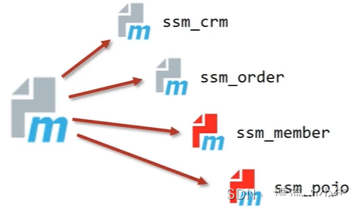

**例：**

**①创建一个demo_aggregate项目，设置打包类型为pom**

```
<groupId>org.example</groupId>
<artifactId>demo_aggregate</artifactId>
<version>1.0-SNAPSHOT</version>
<packaging>pom</packaging>
```

**②设置当前聚合工程所包含的子模块名称**

```
<!--设置管理的模块名称-->
<modules>
    <module>../demo</module>
    <module>../demo_dao</module>
    <module>../demo_pojo</module>
</modules>
```

## 5. 继承

**概念**：继承描述的是两个工程间的关系，子工程可以继承父工程的配置信息，常见于依赖关系的继承。能够**简化配置**、**减少版本冲突**。

**例**：在上面聚合工程的基础上修改配置。

**①提取一些公共性的依赖，放到在父工程demo_aggregate的pom.xml中**

```
<dependencies>
    <dependency>
        <groupId>org.springframework</groupId>
        <artifactId>spring-webmvc</artifactId>
        <version>6.0.10</version>
    </dependency>
    ...
</dependencies>
```

 **②在子工程demo、demo_dao和demo_pojo中配置当前工程依赖父工程**

```
<parent>
  <groupId>org.example</groupId>
  <artifactId>demo_aggregate</artifactId>
  <version>1.0-SNAPSHOT</version>
  <relativePath>../demo_aggregate/pom.xml</relativePath>
</parent>
```

**③在父工程demo_aggregate的pom.xml中配置子工程中可选的依赖关系**

```
<dependencies>
    <dependency>
        <groupId>junit</groupId>
        <artifactId>junit</artifactId>
        <version>4.13.2</version>
        <scope>test</scope>
    </dependency>
</dependencies>
```

**在子工程demo中使用父工程中的可选依赖**

仅需要配置`<groupId>`和`<artifactId>`，无需提供版本，版本由父工程统一提供。

```
  <dependencies>
    <dependency>
      <groupId>junit</groupId>
      <artifactId>junit</artifactId>
      <scope>test</scope>
    </dependency>
  </dependencies>
```

## 6. 属性

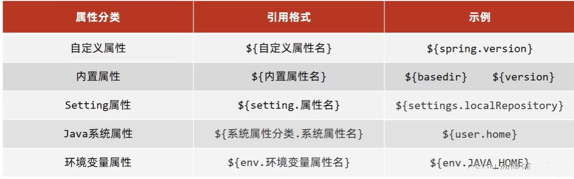

**例1**：**在配置文件pom.xml中自定义属性，从而简化配置。**

```
<!--定义属性-->
<properties>
    <spring.version>6.0.10</spring.version>
</properties>
 
<dependencies>
    <dependency>
        <groupId>org.springframework</groupId>
        <artifactId>spring-webmvc</artifactId>
        <version>${spring.version}</version>
    </dependency>
    <dependency>
        <groupId>org.springframework</groupId>
        <artifactId>spring-jdbc</artifactId>
        <version>${spring.version}</version>
    </dependency>
    <dependency>
        <groupId>org.springframework</groupId>
        <artifactId>spring-test</artifactId>
        <version>${spring.version}</version>
        <scope>test</scope>
    </dependency>
</dependencies>
```

**例2**：**资源文件引用属性。**

①pom.xml文件，自定义属性，配置过滤器

```
<!--定义属性-->
<properties>
    <jdbc.url>jdbc:mysql://localhost:3306/ssm_db</jdbc.url>
</properties>
 
<!--开启资源文件目录加载属性的过滤器-->
<build>
    <resources>
        <resource>
            <directory>${project.basedir}/src/main/resources</directory>
            <filtering>true</filtering>
        </resource>
    </resources>
</build>
```

②在资源中引用属性

/src/main/resources/jdbc.properties

```
jdbc.driver=com.mysql.cj.jdbc.Driver
jdbc.url=${jdbc.url}
jdbc.username=root
jdbc.password=123456
```

## 7. 版本管理

- SNAPSHOT（快照版本）：项目开发过程中临时输出的版本，称为快照版本。
- RELEASE（发布版本）：较为稳定的版本。

## 8. 多环境开发

不同环境下，所需要的配置可能不同。

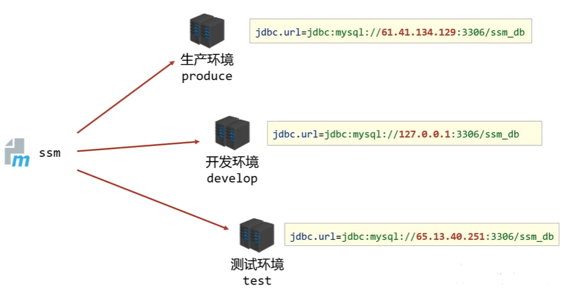

在demo_aggregate工程的pom.xml文件中配置多环境。

```
<profiles>
    <!--开发环境-->
    <profile>
        <id>env_dep</id>
        <properties>
            <jdbc.url>jdbc:mysql://127.0.0.1:3306/ssm_db</jdbc.url>
        </properties>
        <!--设置是否为默认启动环境-->
        <activation>
            <activeByDefault>true</activeByDefault>
        </activation>
    </profile>
    <!--生产环境-->
    <profile>
        <id>env_pro</id>
        <properties>
            <jdbc.url>jdbc:mysql://127.1.1.1:3306/ssm_db</jdbc.url>
        </properties>
    </profile>
    <!--开发环境-->
    <profile>
        <id>env_test</id>
        <properties>
            <jdbc.url>jdbc:mysql://127.2.2.2:3306/ssm_db</jdbc.url>
        </properties>
    </profile>
</profiles>
```

## 9. 跳过测试

**应用场景**：①功能更新中且没有开发完毕。②快速打包

**①快捷方式**

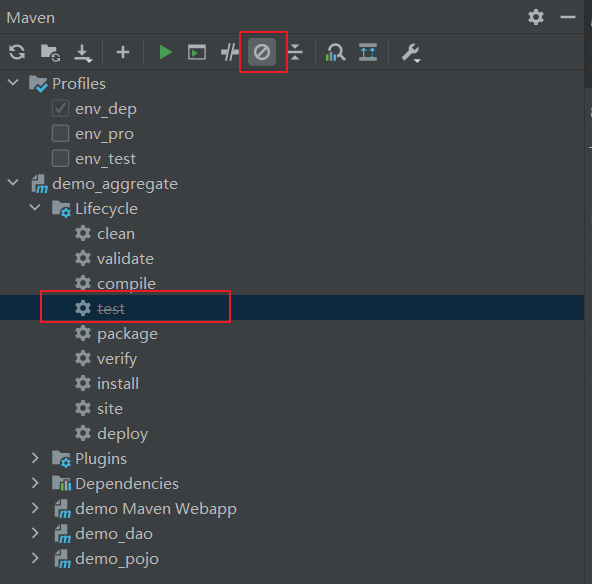

**②细粒度控制跳过测试**

```
<plugins>
    <plugin>
        <artifactId>maven-surefire-plugin</artifactId>
          <version>2.19.1</version>
          <configuration>
            <skipTests>false</skipTests>
            <!--排除不参与测试的内容-->
            <excludes>
              <exclude>**/BookServiceTest.java</exclude>
            </excludes>
          </configuration>
    </plugin>
</plugins>
```

**③maven指令**

```undefined
maven install -D skipTests
```

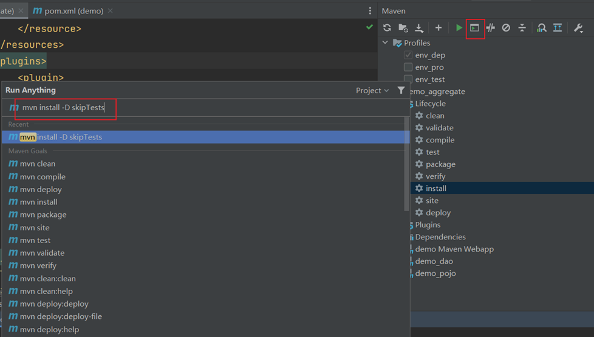
