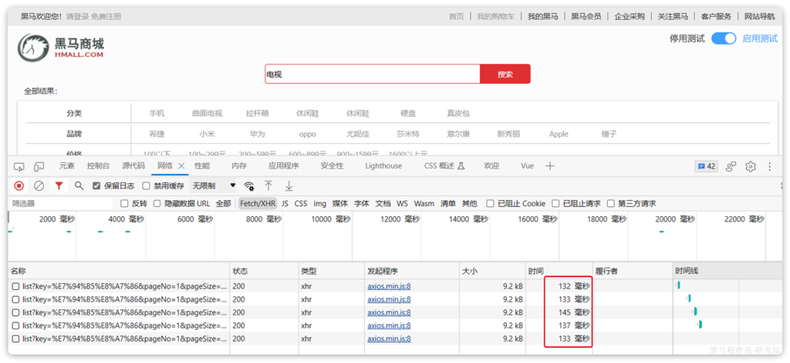
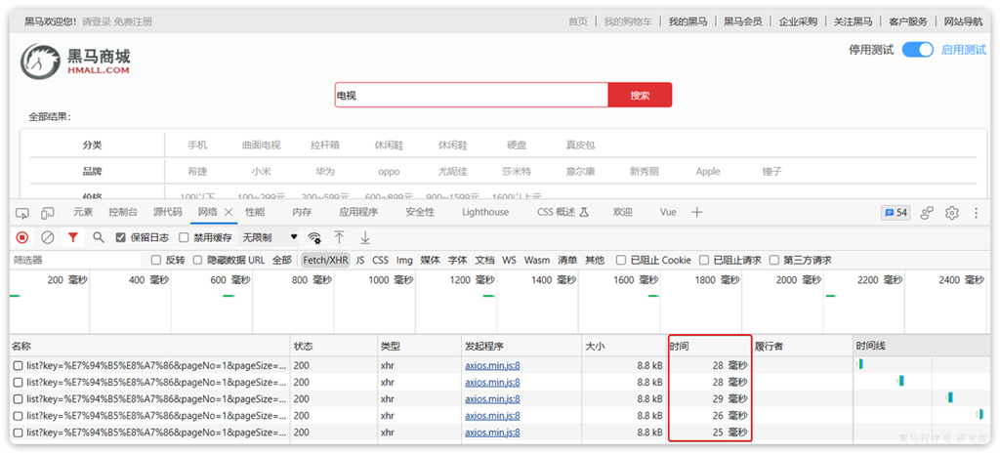
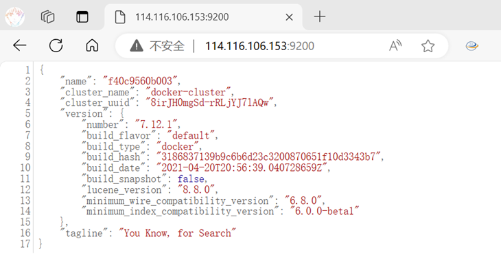
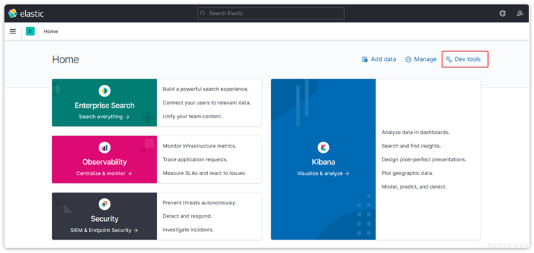
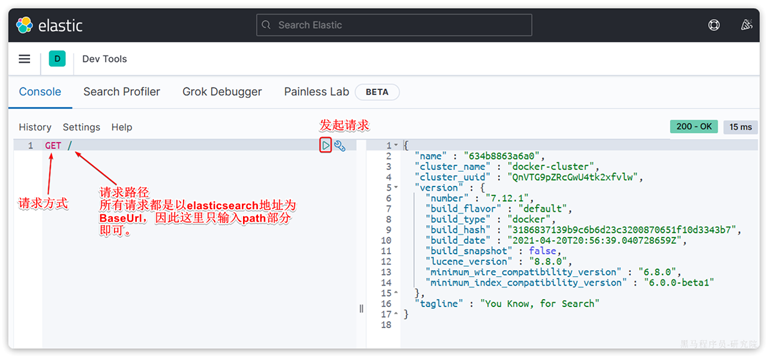

# 0.Elasticsearch

黑马商城作为一个电商项目，商品的搜索肯定是访问频率最高的页面之一。目前搜索功能是基于数据库的模糊搜索来实现的，存在很多问题。

**首先**，查询效率较低。

由于数据库模糊查询不走索引，在数据量较大的时候，查询性能很差。黑马商城的商品表中仅仅有不到9万条数据，基于数据库查询时，搜索接口的表现如图：



改为基于搜索引擎后，查询表现如下：



需要注意的是，数据库模糊查询随着表数据量的增多，查询性能的下降会非常明显，而搜索引擎的性能则不会随着数据增多而下降太多。目前仅10万不到的数据量差距就如此明显，如果数据量达到百万、千万、甚至上亿级别，这个性能差距会非常夸张。

**其次**，功能单一

数据库的模糊搜索功能单一，匹配条件非常苛刻，必须恰好包含用户搜索的关键字。而在搜索引擎中，用户输入出现个别错字，或者用拼音搜索、同义词搜索都能正确匹配到数据。

综上，在面临海量数据的搜索，或者有一些复杂搜索需求的时候，推荐使用专门的搜索引擎来实现搜索功能。

elasticsearch是全球排名第一的开源搜索引擎，支持的功能非常多，例如：代码搜索、商品搜索、解决方案搜索、地图搜索。

# 1.初识elasticsearch

## 1.1.认识和安装

Elasticsearch是由elastic公司开发的一套搜索引擎技术，它是elastic技术栈中的一部分。完整的技术栈包括：

- Elasticsearch：用于数据存储、计算和搜索

- Logstash/Beats：用于数据收集

- Kibana：用于数据可视化

整套技术栈被称为ELK，经常用来做日志收集、系统监控和状态分析等等。

整套技术栈的核心就是用来**存储**、**搜索**、**计算**的Elasticsearch，因此我们接下来学习的核心也是Elasticsearch。

我们要安装的内容包含2部分：

- elasticsearch：存储、搜索和运算

- kibana：图形化展示

Elasticsearch对外提供的是Restful风格的API，任何操作都可以通过发送http请求来完成。不过http请求的方式、路径、还有请求参数的格式都有严格的规范。这些规范我们肯定记不住，因此我们要借助于Kibana这个服务。

Kibana是elastic公司提供的用于操作Elasticsearch的可视化控制台。它的功能非常强大，包括：

- 对Elasticsearch数据的搜索、展示

- 对Elasticsearch数据的统计、聚合，并形成图形化报表、图形

- 对Elasticsearch的集群状态监控

- 它还提供了一个开发控制台（DevTools），在其中对Elasticsearch的Restful的API接口提供了**语法提示**

### 1.1.1.安装elasticsearch

通过下面的Docker命令即可安装单机版本的elasticsearch：

```
docker run -d --name es -e "ES_JAVA_OPTS=-Xms512m -Xmx512m" -e "discovery.type=single-node" \
  -v es-data:/usr/share/elasticsearch/data -v es-plugins:/usr/share/elasticsearch/plugins \
  --privileged --network hm-net -p 9200:9200 -p 9300:9300 elasticsearch:7.12.1
```

安装缓慢解决方案：[解决](https://fengyongxuan.blog.csdn.net/article/details/122753747)

```
sudo mkdir -p /etc/docker
sudo tee /etc/docker/daemon.json <<-'EOF'
{
  "registry-mirrors": ["https://tgad4z51.mirror.aliyuncs.com"]
}
EOF
sudo systemctl daemon-reload
sudo systemctl restart docker
```

注意，这里我们采用的是elasticsearch的7.12.1版本，由于8以上版本的JavaAPI变化很大，在企业中应用并不广泛，企业中应用较多的还是8以下的版本。

安装完成后，访问9200端口，即可看到响应的Elasticsearch服务的基本信息：



### 1.1.2.安装Kibana

通过下面的Docker命令，即可部署Kibana：

```Bash
docker run -d --name kibana -e ELASTICSEARCH_HOSTS=http://es:9200 --network=hm-net -p 5601:5601 kibana:7.12.1
```

安装完成后，直接访问5601端口，即可看到控制台页面。选择`Explore on my own`之后，进入主页面：



然后选中`Dev tools`，进入开发工具页面：



## 1.2.倒排索引

elasticsearch之所以有如此高性能的搜索表现，正是得益于底层的倒排索引技术。那么什么是倒排索引呢？

**倒排**索引的概念是基于MySQL这样的**正向**索引而言的。

### 1.2.1.正向索引

我们先来回顾一下正向索引。

例如有一张名为`tb_goods`的表：
