# 1.初识MQ

## 1.1.同步调用

之前说过，我们现在基于OpenFeign的调用都属于是同步调用，那么这种方式存在哪些问题呢？

举个例子，以**余额支付功能**为例来分析，首先看下整个流程：

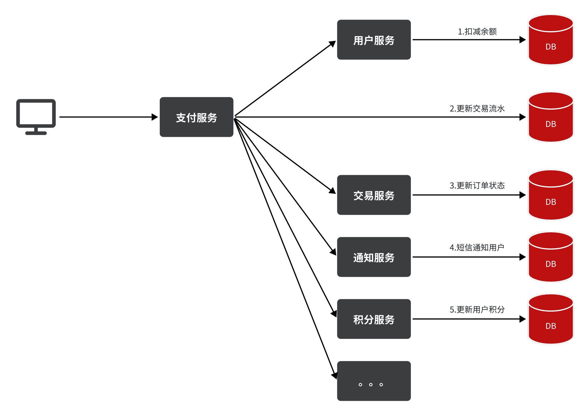

目前我们采用的是基于OpenFeign的同步调用，也就是说业务执行流程是这样的：

- 支付服务需要先调用用户服务完成余额扣减

- 然后支付服务自己要更新支付流水单的状态

- 然后支付服务调用交易服务，更新业务订单状态为已支付

三个步骤依次执行。这其中就存在3个问题：

**第一**，**拓展性差**

我们目前的业务相对简单，但是随着业务规模扩大，产品的功能也在不断完善。

在大多数电商业务中，用户支付成功后都会以短信或者其它方式通知用户，告知支付成功。假如后期产品经理提出这样新的需求，你怎么办？是不是要在上述业务中再加入通知用户的业务？

某些电商项目中，还会有积分或金币的概念。假如产品经理提出需求，用户支付成功后，给用户以积分奖励或者返还金币，你怎么办？是不是要在上述业务中再加入积分业务、返还金币业务？

。。。

最终你的支付业务会越来越臃肿，也就是说每次有新的需求，现有支付逻辑都要跟着变化，代码经常变动，拓展性不好。


**第二**，**性能下降**

由于我们采用了同步调用，调用者需要等待服务提供者执行完返回结果后，才能继续向下执行，也就是说每次远程调用，调用者都是阻塞等待状态。最终整个业务的响应时长就是每次远程调用的执行时长之和。假如每个微服务的执行时长都是50ms，则最终整个业务的耗时可能高达300ms，性能太差了。

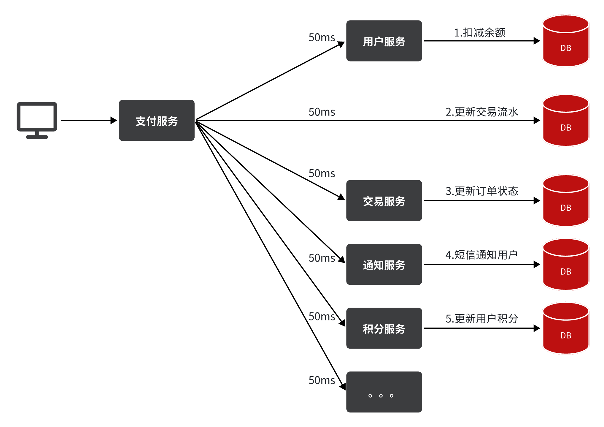

**第三，级联失败**

由于我们是基于OpenFeign调用交易服务、通知服务。当交易服务、通知服务出现故障时，整个事务都会回滚，交易失败。

这其实就是同步调用的**级联失败**问题。

但是大家思考一下，我们假设用户余额充足，扣款已经成功，此时我们应该确保支付流水单更新为已支付，确保交易成功。毕竟收到手里的钱没道理再退回去吧。

因此，这里不能因为短信通知、更新订单状态失败而回滚整个事务。

综上，同步调用的方式存在下列问题：

- 拓展性差

- 性能下降

- 级联失败

## 1.2.异步调用

异步调用方式其实就是基于消息通知的方式，一般包含三个角色：

- 消息发送者：投递消息的人，就是原来的调用方

- 消息Broker：管理、暂存、转发消息，你可以把它理解成微信服务器

- 消息接收者：接收和处理消息的人，就是原来的服务提供方
  
  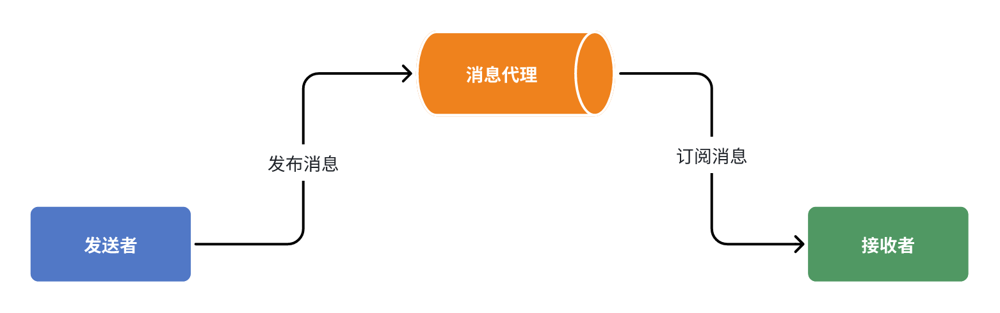

在异步调用中，发送者不再直接同步调用接收者的业务接口，而是发送一条消息投递给消息Broker。然后接收者根据自己的需求从消息Broker那里订阅消息。每当发送方发送消息后，接受者都能获取消息并处理。

这样，发送消息的人和接收消息的人就完全解耦了。

还是以余额支付业务为例：

除了扣减余额、更新支付流水单状态以外，其它调用逻辑全部取消。而是改为发送一条消息到Broker。而相关的微服务都可以订阅消息通知，一旦消息到达Broker，则会分发给每一个订阅了的微服务，处理各自的业务。

假如产品经理提出了新的需求，比如要在支付成功后更新用户积分。支付代码完全不用变更，而仅仅是让积分服务也订阅消息即可：

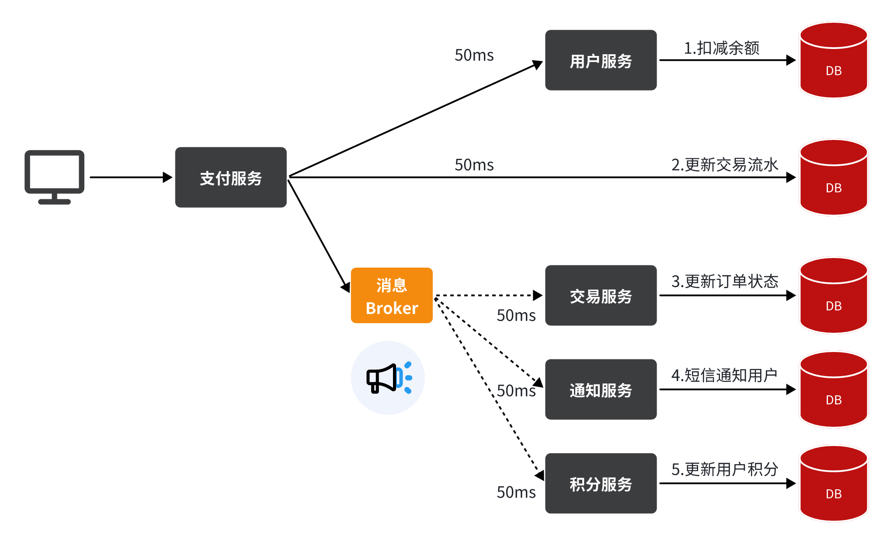

不管后期增加了多少消息订阅者，作为支付服务来讲，执行问扣减余额、更新支付流水状态后，发送消息即可。业务耗时仅仅是这三部分业务耗时，仅仅100ms，大大提高了业务性能。

另外，不管是交易服务、通知服务，还是积分服务，他们的业务与支付关联度低。现在采用了异步调用，解除了耦合，他们即便执行过程中出现了故障，也不会影响到支付服务。

综上，异步调用的优势包括：

- 耦合度更低

- 性能更好

- 业务拓展性强

- 故障隔离，避免级联失败

当然，异步通信也并非完美无缺，它存在下列缺点：

- 完全依赖于Broker的可靠性、安全性和性能

- 架构复杂，后期维护和调试麻烦

## 1.3.技术选型

消息Broker，目前常见的实现方案就是消息队列（MessageQueue），简称为MQ.

目比较常见的MQ实现：

- ActiveMQ

- RabbitMQ

- RocketMQ

- Kafka

|       | RabbitMQ             | ActiveMQ                      | RocketMQ | Kafka      |
| ----- | -------------------- | ----------------------------- | -------- | ---------- |
| 公司/社区 | Rabbit               | Apache                        | 阿里       | Apache     |
| 开发语言  | Erlang               | Java                          | Java     | Scala&Java |
| 协议支持  | AMQP，XMPP，SMTP，STOMP | OpenWire,STOMP，REST,XMPP,AMQP | 自定义协议    | 自定义协议      |
| 可用性   | 高                    | 一般                            | 高        | 高          |
| 单机吞吐量 | 一般                   | 差                             | 高        | 非常高        |
| 消息延迟  | 微秒级                  | 毫秒级                           | 毫秒级      | 毫秒以内       |
| 消息可靠性 | 高                    | 一般                            | 高        | 一般         |

据统计，目前国内消息队列使用最多的还是RabbitMQ，再加上其各方面都比较均衡，稳定性也好。

# 2.RabbitMQ

RabbitMQ是基于Erlang语言开发的开源消息通信中间件，官网地址：[https://www.rabbitmq.com/](https://www.rabbitmq.com/)

## 2.1.安装

我们同样基于Docker来安装RabbitMQ，使用下面的命令即可：

```
docker run -e RABBITMQ_DEFAULT_USER=fyx -e RABBITMQ_DEFAULT_PASS=123321 \
 -v mq-plugins:/plugins --name mq --hostname mq \
 -p 15672:15672 -p 5672:5672 --network hm-net -d rabbitmq:3-management
```

如果网络不行，需要配置docker。

```
tee /etc/docker/daemon.json <<-'EOF'
{
    "registry-mirrors": [
        "https://docker.m.daocloud.io",
        "https://dockerproxy.com",
        "https://docker.mirrors.ustc.edu.cn",
        "https://docker.nju.edu.cn"
    ]
}
EOF
```

```
systemctl restart docker
```

进入docker容器查看用户。

```java
docker exec -it mq bash 
rabbitmqctl list_users
```

发现只有一个本guest用户，创建用户fyx，并设置管理员权限，并使用户具有‘/’这个virtual host中所有资源的配置、写、读权限。

```
rabbitmqctl add_user fyx 12321
rabbitmqctl  set_user_tags fyx administrator
rabbitmqctl  set_permissions -p / fyx '.*' '.*' '.*'
```

可以看到在安装命令中有两个映射的端口：

- 15672：RabbitMQ提供的管理控制台的端口

- 5672：RabbitMQ的消息发送处理接口

安装完成后，我们访问 http://114.116.106.153:15672，即可看到管理控制台（云服务器15672、5672端口要放开）。
首次访问需要登录，默认的用户名和密码在配置文件中已经指定了。登录后即可看到管理控制台总览页面：


RabbitMQ对应的架构如图：


其中包含几个概念：

- **`publisher`**：生产者，也就是发送消息的一方。

- **`consumer`**：消费者，也就是消费消息的一方。

- **`queue`**：队列，存储消息。生产者投递的消息会暂存在消息队列中，等待消费者处理。

- **`exchange`**：交换机，负责消息路由。生产者发送的消息由交换机决定投递到哪个队列。

- **`virtual host`**：虚拟主机，起到数据隔离的作用。每个虚拟主机相互独立，有各自的exchange、queue

上述这些东西都可以在RabbitMQ的管理控制台来管理，下一节我们就一起来学习控制台的使用。

## 2.2.收发消息

### 2.2.1.交换机

我们打开Exchanges选项卡，可以看到已经存在很多交换机。点击任意交换机，即可进入交换机详情页面。仍然会利用控制台中的publish message 发送一条消息：

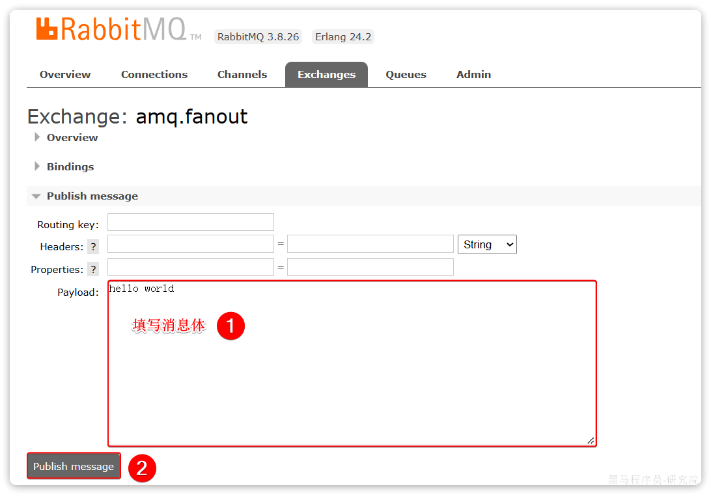

这里是由控制台模拟了生产者发送的消息。由于没有消费者存在，最终消息丢失了，这样说明交换机没有存储消息的能力。

### 2.2.2.队列

我们打开`Queues`选项卡，新建一个队列，命名为`hello.queue1`。再以相同的方式，创建一个队列，密码为`hello.queue2`，最终队列列表如下：

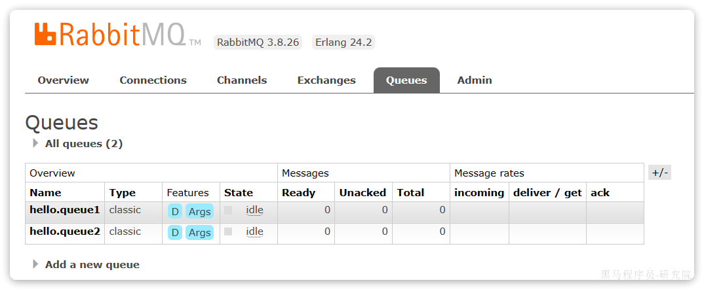

发送到交换机的消息，只会路由到与其绑定的队列，因此仅仅创建队列是不够的，我们还需要将其与交换机绑定。

### 2.2.3.绑定关系

点击`Exchanges`选项卡，点击`amq.fanout`交换机，进入交换机详情页，然后点击`Bindings`菜单，在表单中填写要绑定的队列名称。将hello.queue1、hello.queue2绑定到交换机。

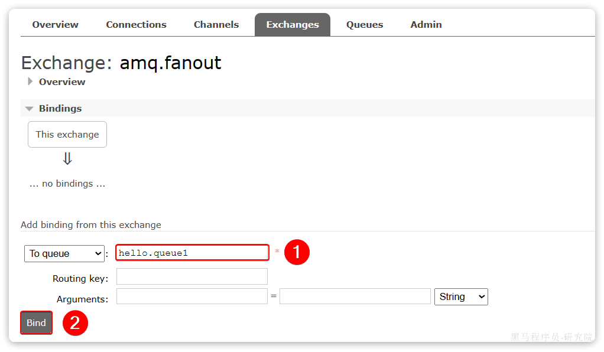

最终，绑定结果如下：

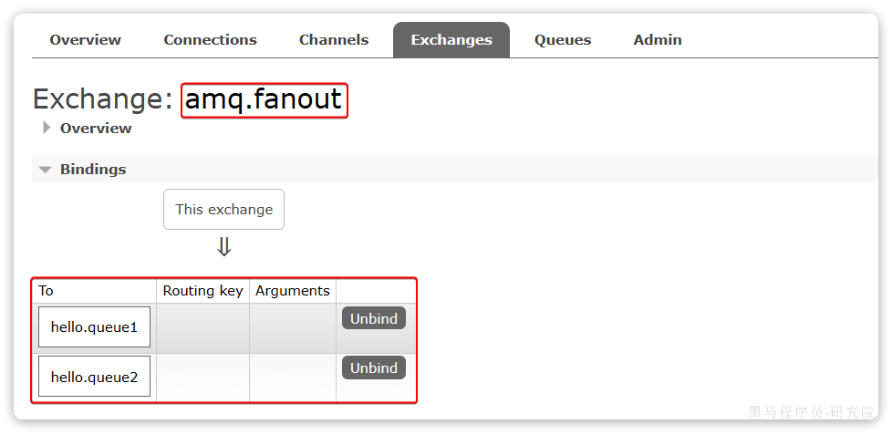

### 2.2.4.发送消息

再次回到exchange页面，找到刚刚绑定的`amq.fanout`，点击进入详情页，再次发送一条消息：

回到`Queues`页面，可以发现`hello.queue`中已经有一条消息了：

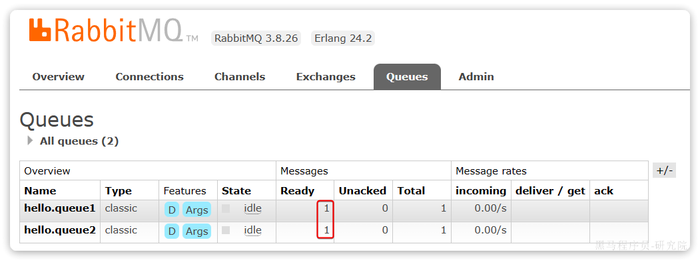

这个时候如果有消费者监听了MQ的`hello.queue1`或`hello.queue2`队列，自然就能接收到消息了。

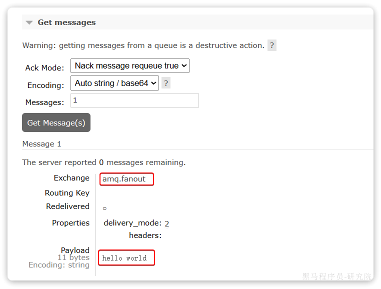

## 2.3.数据隔离

### 2.3.1.用户管理

点击`Admin`选项卡，首先会看到RabbitMQ控制台的用户管理界面：

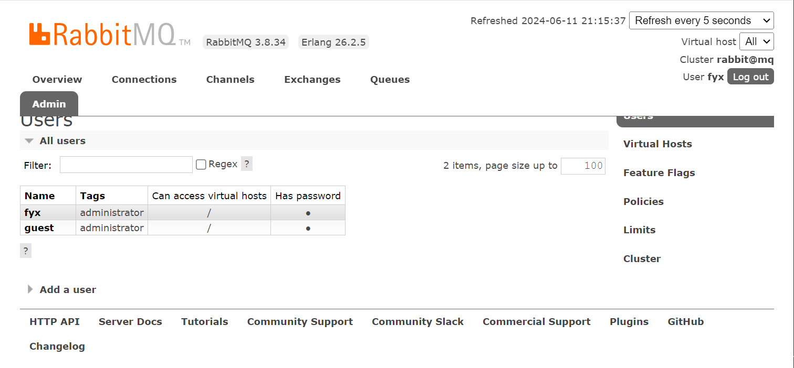

这里的用户都是RabbitMQ的管理或运维人员。仔细观察用户表格中的字段，如下：

- `Name`：`itheima`，也就是用户名

- `Tags`：`administrator`，说明`itheima`用户是超级管理员，拥有所有权限

- `Can access virtual host`： `/`，可以访问的`virtual host`，这里的`/`是默认的`virtual host`

对于小型企业而言，出于成本考虑，我们通常只会搭建一套MQ集群，公司内的多个不同项目同时使用。这个时候为了避免互相干扰， 我们会利用`virtual host`的隔离特性，将不同项目隔离。一般会做两件事情：

- 给每个项目创建独立的运维账号，将管理权限分离。

- 给每个项目创建不同的`virtual host`，将每个项目的数据隔离。

比如，我们给黑马商城创建一个新的用户，命名为`hmall`：


你会发现此时hmall用户没有任何`virtual host`的访问权限。

### 2.3.2.virtual host

我们先退出登录，切换到刚刚创建的hmall用户登录，然后点击`Virtual Hosts`菜单，进入`virtual host`管理页。可以看到目前只有一个默认的`virtual host`，名字为 `/`。

我们可以给黑马商城项目创建一个单独的`virtual host`，而不是使用默认的`/`。

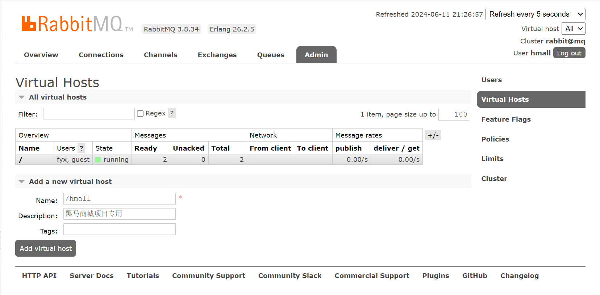

由于我们是登录`hmall`账户后创建的`virtual host`，因此回到`users`菜单，你会发现当前用户已经具备了对`/hmall`这个`virtual host`的访问权限了：

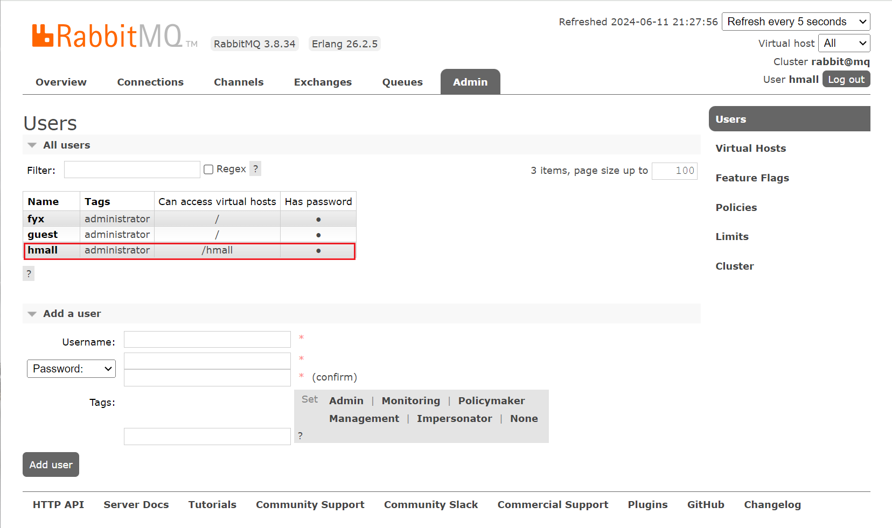

此时，点击页面右上角的`virtual host`下拉菜单，切换`virtual host`为 `/hmall`。然后再次查看queues选项卡，会发现之前的队列已经看不到了。这就是基于`virtual host` 的隔离效果。

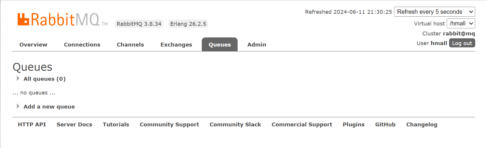

# 3.SpringAMQP
