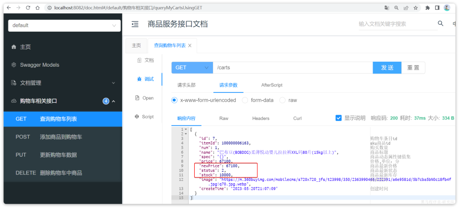

# 0.导入黑马商城项目

**环境**：CentOS Stream(CentOS 9)， JDK20

[Install Docker Engine on CentOS](https://docs.docker.com/engine/install/centos/)

卸载旧版本的docker(注意：卸载 Docker 时，存储在 /var/lib/docker/ 中的镜像、容器、卷和网络不会自动删除，需要手动查看一下)

```
sudo yum remove docker docker-client docker-client-latest docker-common docker-latest docker-latest-logrotate docker-logrotate docker-engine
```

安装yum-utils包并换源，设置仓库

```
sudo yum install -y yum-utils
// 换阿里云的源，别用国外的源
sudo yum-config-manager --add-repo http://mirrors.aliyun.com/docker-ce/linux/centos/docker-ce.repo
sudo yum-config-manager --add-repo https://download.docker.com/linux/centos/docker-ce.repo
```

安装Docker Engine, containerd, and Docker Compose

```
sudo yum install docker-ce docker-ce-cli containerd.io docker-buildx-plugin docker-compose-plugin
```

启动Docker

```
sudo systemctl start docker
```

run一个image测试一下

```
sudo docker run hello-world
```

然后创建一个通用的桥接网络

```
docker network create hm-net
```

安装MySQL

```
docker run -d --name mysql -p 3306:3306 -e TZ=Asia/Shanghai -e MYSQL_ROOT_PASSWORD=123 --network hm-net mysql
```

使用navicat远程连接mysql，导入mysql/hmall.sql

**后端项目**：/hmall，用IDEA导入项目，修改数据库连接参数

application-local.yaml

```
hm:
  db:
    host: 114.116.106.153
    pw: 123
```

启动，测试：http://localhost:8080/hi

**前端项目**：/hmall-nginx，其中就是一个nginx程序以及我们的前端代码，直接在windows下将其复制到一个**非中文、不包含特殊字符**的目录下。然后进入hmall-nginx后，利用cmd启动即可：

```
# 启动nginx
start nginx.exe
# 停止
nginx.exe -s stop
# 重新加载配置
nginx.exe -s reload
# 重启
nginx.exe -s restart
测试：http://localhost:18080
```


# 1.认识微服务

## 1.1.单体架构

单体架构（monolithic structure）：整个项目中所有功能模块都在一个工程中开发；项目部署时需要对所有模块一起编译、打包。当项目规模较小时，这种模式上手快，部署、运维也都很方便。


但随着项目的业务规模越来越大，团队开发人员不断增加，单体架构就呈现出越来越多的问题：

- **团队协作成本高**：团队数十个人同时协作开发同一个项目，由于所有模块都在一个项目中，不同模块的代码之间物理边界越来越模糊。最终要把功能合并到一个分支，绝对会陷入到解决冲突的泥潭之中。

- **系统发布效率低**：任何模块变更都需要发布整个系统，而系统发布过程中需要多个模块之间制约较多，需要对比各种文件，任何一处出现问题都会导致发布失败，往往一次发布需要数十分钟甚至数小时。

- **系统可用性差**：单体架构各个功能模块是作为一个服务部署，相互之间会互相影响，一些热点功能会耗尽系统资源，导致其它服务低可用。

## 1.2.微服务

将单体架构中的功能模块从单体应用中拆分出来，独立部署为多个服务。同时要满足下面的一些特点：

- **单一职责**：一个微服务负责一部分业务功能，并且其核心数据不依赖于其它模块。

- **团队自治**：每个微服务都有自己独立的开发、测试、发布、运维人员，团队人员规模不超过10人

- **服务自治**：每个微服务都独立打包部署，访问自己独立的数据库。并且要做好服务隔离，避免对其它服务产生影响

例如，黑马商城项目，我们就可以把商品、用户、购物车、交易等模块拆分，交给不同的团队去开发，并独立部署：


## 1.3.SpringCloud

SpringCloud框架可以说是目前Java领域最全面的微服务组件的集合了。

而且SpringCloud依托于SpringBoot的自动装配能力，大大降低了其项目搭建、组件使用的成本。对于没有自研微服务组件能力的中小型企业，使用SpringCloud全家桶来实现微服务开发可以说是最合适的选择了！


# 2.微服务拆分

## 2.1 熟悉业务

**登录业务流程**


**搜索商品**

在首页搜索框输入关键字，点击搜索即可进入搜索列表页面，该页面会调用接口：`/search/list`。

**购物车**

在搜索到的商品列表中，点击按钮`加入购物车`，即可将商品加入购物车。

加入成功后即可进入购物车列表页，查看自己购物车商品列表，同时这里还可以对购物车实现修改、删除等操作。

其中，查询购物车列表时，由于要判断商品最新的价格和状态，所以还需要查询商品信息，业务流程如下：


**下单**

在购物车页面点击`结算`按钮，会进入订单结算页面。点击提交订单，会提交请求到服务端，服务端做3件事情：

- 创建一个新的订单

- 扣减商品库存

- 清理购物车中商品

**支付**

下单完成后会跳转到支付页面，目前只支持`余额支付`。

在选择`余额支付`这种方式后，会发起请求到服务端，服务端会立刻创建一个支付流水单，并返回支付流水单号到前端。当用户输入用户密码，然后点击确认支付时，页面会发送请求到服务端，而服务端会做几件事情：

- 校验用户密码

- 扣减余额

- 修改支付流水状态

- 修改交易订单状态

## 2.2 怎么拆

**拆分目标**：粒度要小，具体来说：

- 高内聚：每个微服务的职责要尽量单一，包含的业务相互关联度高、完整度高。

- 低耦合：每个微服务的功能要相对独立，尽量减少对其它微服务的依赖，或者依赖接口的稳定性要强。

**拆分方式**：纵向拆分和横向拆分。

- 纵向拆分：按照项目的功能模块来拆分。例如黑马商城中，就有用户管理功能、订单管理功能、购物车功能、商品管理功能、支付功能等。那么按照功能模块将他们拆分为一个个服务，就属于纵向拆分。

- 横向拆分：是看各个功能模块之间有没有公共的业务部分，如果有将其抽取出来作为通用服务。例如用户登录是需要发送消息通知，记录风控数据，下单时也要发送短信，记录风控数据。因此消息发送、风控数据记录就是通用的业务功能，因此可以将他们分别抽取为公共服务：消息中心服务、风控管理服务。这样可以提高业务的复用性，避免重复开发。

由于黑马商城并不是一个完整的项目，其中的短信发送、风控管理并没有实现，而其它的业务按照**纵向拆分**，可分为以下几个微服务：

- 用户服务

- 商品服务

- 订单服务

- 购物车服务

- 支付服务

## 2.3.拆分购物车、商品服务

### 2.3.1.商品服务

在hmall中创建module，选择maven模块，并设定JDK版本。商品模块，我们起名为`item-service`。

引入依赖，编写启动类。

接下来是配置文件，可以从`hm-service`中拷贝。其中，`application.yaml`内容需要修改，剩下的`application-dev.yaml`和`application-local.yaml`直接从hm-service拷贝即可。

然后拷贝`hm-service`中与商品管理有关的代码到`item-service`。

`ItemServiceImpl`中的`deductStock`方法代码需要改动：

String sqlStatement = "com.hmall.mapper.ItemMapper.updateStock";

=> String sqlStatement = "com.hmall.item.mapper.ItemMapper.updateStock";。

导入数据库表`hm-item.sql`，将来的每一个微服务都会有自己的一个database。

接着，启动`item-service`，访问商品微服务的swagger接口文档：http://localhost:8081/doc.html

然后测试其中的根据id批量查询商品这个接口，测试参数：100002672302,100002624500,100002533430，结果如下：


### 2.3.2.购物车服务

与商品服务类似，在hmall下创建一个新的`module`，起名为`cart-service`。

然后是依赖pom.xml，然后是启动类CartApplication，然后是配置文件，同样可以拷贝自`item-service`，不过其中的`application.yaml`需要修改。

最后，把hm-service中的与购物车有关功能拷贝过来，特别注意的是`com.hmall.cart.service.impl.CartServiceImpl`，其中有两个地方需要处理：

- 需要**获取登录用户信息**，但登录校验功能目前没有复制过来，先写死固定用户id

- 查询购物车时需要**查询商品信息**，而商品信息不在当前服务，需要先将这部分代码注释

最后，还是要导入数据库表hm-cart.sql。

在启动前，同样要配置启动项的`active profile`为`local`。

然后启动`CartApplication`，访问swagger文档页面：http://localhost:8082/doc.html

我们测试其中的`查询我的购物车列表`接口，无需填写参数，直接访问：


我们注意到，其中与商品有关的几个字段值都为空！这就是因为刚才我们注释掉了查询购物车时，查询商品信息的相关代码。

那么，我们该如何在`cart-service`服务中实现对`item-service`服务的查询呢？

## 2.4.服务调用

在拆分的时候，我们发现一个问题：就是购物车业务中需要查询商品信息，但商品信息查询的逻辑全部迁移到了`item-service`服务，导致我们无法查询。

最终结果就是查询到的购物车数据不完整，因此要想解决这个问题，我们就必须改造其中的代码，把原本本地方法调用，改造成跨微服务的远程调用（RPC，即**R**emote **P**roduce **C**all）。

因此，现在查询购物车列表的流程变成了这样：


我们该如何跨服务调用，准确的说，如何在`cart-service`中获取`item-service`服务中的提供的商品数据呢？

假如我们在cart-service中能模拟浏览器，发送http请求到item-service，是不是就实现了跨微服务的**远程调用**了呢？

那么：我们该如何用Java代码发送Http的请求呢？

### 2.4.1.RestTemplate

Spring给我们提供了一个RestTemplate的API，可以方便的实现Http请求的发送。

我们在`cart-service`服务中定义一个配置类：config/RemoteCallConfig.java

### 2.4.2.远程调用

接下来，我们修改`cart-service`中的`com.hmall.cart.service.impl.``CartServiceImpl`的`handleCartItems`方法，发送http请求到`item-service`。

```
private void handleCartItems(List<CartVO> vos) {
    // TODO 1.获取商品id
    Set<Long> itemIds = vos.stream().map(CartVO::getItemId).collect(Collectors.toSet());
    // 2.查询商品
    // List<ItemDTO> items = itemService.queryItemByIds(itemIds);
    // 2.1.利用RestTemplate发起http请求，得到http的响应
    ResponseEntity<List<ItemDTO>> response = restTemplate.exchange(
            "http://localhost:8081/items?ids={ids}",
            HttpMethod.GET,
            null,
            new ParameterizedTypeReference<List<ItemDTO>>() {
            },
            Map.of("ids", CollUtil.join(itemIds, ","))
    );
    // 2.2.解析响应
    if(!response.getStatusCode().is2xxSuccessful()){
        // 查询失败，直接结束
        return;
    }
    List<ItemDTO> items = response.getBody();
    if (CollUtils.isEmpty(items)) {
        return;
    }
...
}
```

重启`cart-service`，再次测试`查询我的购物车列表`接口（item-service服务记得开），可以发现，所有商品相关数据都已经查询到了。



在这个过程中，`item-service`提供了查询接口，`cart-service`利用Http请求调用该接口。因此`item-service`可以称为服务的提供者，而`cart-service`则称为服务的消费者或服务调用者。

# 3.服务注册和发现

在上一章我们实现了微服务拆分，并且通过Http请求实现了跨微服务的远程调用。不过这种手动发送Http请求的方式存在一些问题。

试想一下，假如商品微服务被调用较多，为了应对更高的并发，我们进行了多实例部署，如图：


此时，每个`item-service`的实例其IP或端口不同，问题来了：

- item-service这么多实例，cart-service如何知道每一个实例的地址？

- http请求要写url地址，`cart-service`服务到底该调用哪个实例呢？

- 如果在运行过程中，某一个`item-service`实例宕机，`cart-service`依然在调用该怎么办？

- 如果并发太高，`item-service`临时多部署了N台实例，`cart-service`如何知道新实例的地址？

为了解决上述问题，就必须引入注册中心的概念了。

## 3.1.注册中心原理

在微服务远程调用的过程中，包括两个角色：

- 服务提供者：提供接口供其它微服务访问，比如`item-service`

- 服务消费者：调用其它微服务提供的接口，比如`cart-service`

在大型微服务项目中，服务提供者的数量会非常多，为了管理这些服务就引入了**注册中心**的概念。注册中心、服务提供者、服务消费者三者间关系如下：


流程如下：

- 服务启动时就会注册自己的服务信息（服务名、IP、端口）到注册中心

- 调用者可以从注册中心订阅想要的服务，获取服务对应的实例列表（1个服务可能多实例部署）

- 调用者自己对实例列表负载均衡，挑选一个实例

- 调用者向该实例发起远程调用

当服务提供者的实例宕机或者启动新实例时，调用者如何得知呢？

- 服务提供者会定期向注册中心发送请求，报告自己的健康状态（心跳请求）

- 当注册中心长时间收不到提供者的心跳时，会认为该实例宕机，将其从服务的实例列表中剔除

- 当服务有新实例启动时，会发送注册服务请求，其信息会被记录在注册中心的服务实例列表

- 当注册中心服务列表变更时，会主动通知微服务，更新本地服务列表

## 3.2.Nacos注册中心

目前开源的注册中心框架有很多，国内比较常见的有：

- Eureka：Netflix公司出品，目前被集成在SpringCloud当中，一般用于Java应用

- Nacos：Alibaba公司出品，目前被集成在SpringCloudAlibaba中，一般用于Java应用

- Consul：HashiCorp公司出品，目前集成在SpringCloud中，不限制微服务语言

以上几种注册中心都遵循SpringCloud中的API规范，因此在业务开发使用上没有太大差异。由于Nacos是国内产品，中文文档比较丰富，而且同时具备**配置管理**功能，因此在国内使用较多。

导入nacos.sql来存储Nacos的数据。

修改`nacos/custom.env`文件中的MYSQL_SERVICE_HOST（也就是mysql地址），修改为mysql所在主机的IP地址。

然后将`nacos`目录上传至服务器的`/root`目录。进入root目录，执行下面的docker命令：

```
docker run -d --name nacos --env-file ./nacos/custom.env -p 8848:8848 -p 9848:9848 -p 9849:9849 --restart=always nacos/nacos-server:v2.1.0-slim
```

启动完成后，访问下面地址：http://114.116.106.153:8848/nacos/（服务器需要放开8848,9848,9849端口）。

首次访问会跳转到登录页，账号密码都是nacos。

## 3.3.服务注册

接下来，我们把`item-service`注册到Nacos，步骤如下：

- 引入依赖

- 配置Nacos地址

- 重启

### 3.3.1.添加依赖

在`item-service`的`pom.xml`中添加依赖：

```
<!--nacos 服务注册发现-->
<dependency>
    <groupId>com.alibaba.cloud</groupId>
    <artifactId>spring-cloud-starter-alibaba-nacos-discovery</artifactId>
</dependency>
```

### 3.3.2.配置Nacos

在`item-service`的`application.yml`中添加nacos地址配置：

```YAML
spring:
  application:
    name: item-service # 服务名称
  cloud:
    nacos:
      server-addr: 114.116.106.153:8848 # nacos地址
```

### 3.3.3.启动服务实例

为了测试一个服务多个实例的情况，我们再配置一个`item-service`的部署实例：


然后配置启动项，注意重命名并且配置新的端口，避免冲突：


重启`item-service`的两个实例，访问nacos控制台，可以发现服务注册成功：


## 3.4.服务发现

服务的消费者要去nacos订阅服务，这个过程就是服务发现，步骤如下：

- 引入依赖

- 配置Nacos地址

- 发现并调用服务

### 3.4.1.引入依赖

服务发现除了要引入nacos依赖以外，由于还需要负载均衡，因此要引入SpringCloud提供的LoadBalancer依赖。

我们在`cart-service`中的`pom.xml`中添加下面的依赖：

```XML
<!--nacos 服务注册发现-->
<dependency>
    <groupId>com.alibaba.cloud</groupId>
    <artifactId>spring-cloud-starter-alibaba-nacos-discovery</artifactId>
</dependency>
```

可以发现，这里Nacos的依赖于服务注册时一致，这个依赖中同时包含了服务注册和发现的功能。因为任何一个微服务都可以调用别人，也可以被别人调用，即可以是调用者，也可以是提供者。

因此，等一会儿`cart-service`启动，同样会注册到Nacos。

### 3.4.2.配置Nacos地址

在`cart-service`的`application.yml`中添加nacos地址配置：

```YAML
spring:
  cloud:
    nacos:
      server-addr: 114.116.106.153:8848
```

### 3.4.3.发现并调用服务

接下来，服务调用者`cart-service`就可以去订阅`item-service`服务了。不过item-service有多个实例，而真正发起调用时只需要知道一个实例的地址。

因此，服务调用者必须利用负载均衡的算法，从多个实例中挑选一个去访问。常见的负载均衡算法有：

- 随机

- 轮询

- IP的hash

- 最近最少访问

- ...

这里我们可以选择最简单的随机负载均衡。

另外，服务发现需要用到一个工具，DiscoveryClient，SpringCloud已经帮我们自动装配，我们可以直接注入使用。

我们通过DiscoveryClient发现服务实例列表，然后通过负载均衡算法，选择一个实例去调用：

CartServiceImpl.java 加一行

```
private final DiscoveryClient discoveryClient;
```

进一步修改

```
private void handleCartItems(List<CartVO> vos) {
    // 1.获取商品id
    Set<Long> itemIds = vos.stream().map(CartVO::getItemId).collect(Collectors.toSet());
    // 2.查询商品
    // 2.1 发现item-service服务的实例列表
    List<ServiceInstance> instances = discoveryClient.getInstances("item-service");
    // 2.2 负载均衡，挑选一个实例
    ServiceInstance instance = instances.get(RandomUtil.randomInt(instances.size()));
    // 2.3.利用RestTemplate发起http请求，得到http的响应
    ResponseEntity<List<ItemDTO>> response = restTemplate.exchange(
          instance.getUri() + "/items?ids={ids}", // 请求路径
          HttpMethod.GET, // 请求方式
          null,
          new ParameterizedTypeReference<List<ItemDTO>>() {}, // 返回值类型
          Map.of("ids", CollUtil.join(itemIds, ",")) // 请求参数
    );
    // 2.4.解析响应
    if(!response.getStatusCode().is2xxSuccessful()){
        // 查询失败，直接结束
        return;
    }
    List<ItemDTO> items = response.getBody();
    if (CollUtils.isEmpty(items)) {
        return;
     }
        ...
    }
```

经过swagger测试，发现没有任何问题。

# 4.OpenFeign

在上一章，我们利用Nacos实现了服务的治理，利用RestTemplate实现了服务的远程调用。
但是远程调用的代码太复杂了，而且这种调用方式，与原本的本地方法调用差异太大，编程时的体验也不统一，一会儿远程调用，一会儿本地调用。因此，我们必须想办法改变远程调用的开发模式，让**远程调用像本地方法调用一样简单**。而这就要用到OpenFeign组件了。

其实远程调用的关键点就在于四个：

- 请求方式

- 请求路径

- 请求参数

- 返回值类型

所以，OpenFeign就利用SpringMVC的相关注解来声明上述4个参数，然后基于动态代理帮我们生成远程调用的代码，而无需我们手动再编写，非常方便。

## 4.1.快速入门

我们还是以cart-service中的查询我的购物车为例。因此下面的操作都是在cart-service中进行。

### 4.1.1.引入依赖

在`cart-service`服务的pom.xml中引入`OpenFeign`的依赖和`loadBalancer`依赖：

```
  <!--openFeign-->
  <dependency>
      <groupId>org.springframework.cloud</groupId>
      <artifactId>spring-cloud-starter-openfeign</artifactId>
  </dependency>
  <!--负载均衡器-->
  <dependency>
      <groupId>org.springframework.cloud</groupId>
      <artifactId>spring-cloud-starter-loadbalancer</artifactId>
  </dependency>
```

### 4.1.2.启用OpenFeign

接下来，我们在`cart-service`的`CartApplication`启动类上添加注解，启动OpenFeign功能：@EnableFeignClients

### 4.1.3.编写OpenFeign客户端

在`cart-service`中，定义一个新的接口，编写Feign客户端：client/ItemClient.java

```
package com.hmall.cart.client;

import com.hmall.cart.domain.dto.ItemDTO;
import org.springframework.cloud.openfeign.FeignClient;
import org.springframework.web.bind.annotation.GetMapping;
import org.springframework.web.bind.annotation.RequestParam;

import java.util.List;

@FeignClient("item-service")
public interface ItemClient {

    @GetMapping("/items")
    List<ItemDTO> queryItemByIds(@RequestParam("ids") Collection<Long> ids);
}
```

这里只需要声明接口，无需实现方法。接口中的几个关键信息：

- `@FeignClient("item-service")` ：声明服务名称

- `@GetMapping` ：声明请求方式

- `@GetMapping("/items")` ：声明请求路径

- `@RequestParam("ids") Collection<Long> ids` ：声明请求参数

- `List<ItemDTO>` ：返回值类型

有了上述信息，OpenFeign就可以利用动态代理帮我们实现这个方法，并且向`http://item-service/items`发送一个`GET`请求，携带ids为请求参数，并自动将返回值处理为`List<ItemDTO>`。

我们只需要直接调用这个方法，即可实现远程调用了。

### 4.1.4.使用FeignClient

在`cart-service`的`com.hmall.cart.service.impl.CartServiceImpl`中改造代码，直接调用`ItemClient`的方法：

```
private void handleCartItems(List<CartVO> vos) {
    // 1.获取商品id
    Set<Long> itemIds = vos.stream().map(CartVO::getItemId).collect(Collectors.toSet());
    // 2.查询商品
    List<ItemDTO> items = itemClient.queryItemByIds(itemIds);
    if (CollUtils.isEmpty(items)) {
        return;
    }
    ...
}
```

feign替我们完成了服务拉取、负载均衡、发送http请求的所有工作。而且还省去了RestTemplate的注册。

## 4.2.连接池

Feign底层发起http请求，依赖于其它的框架。其底层支持的http客户端实现包括：

- HttpURLConnection：默认实现，不支持连接池

- Apache HttpClient ：支持连接池

- OKHttp：支持连接池

因此我们通常会使用带有连接池的客户端来代替默认的HttpURLConnection。比如，我们使用OK Http.

### 4.2.1.引入依赖

在`cart-service`的`pom.xml`中引入依赖：

```
<!--OK http 的依赖 -->
<dependency>
  <groupId>io.github.openfeign</groupId>
  <artifactId>feign-okhttp</artifactId>
</dependency>
```

### 4.2.2.开启连接池

在`cart-service`的`application.yml`配置文件中开启Feign的连接池功能：

```
feign:
  okhttp:
    enabled: true # 开启OKHttp功能
```

重启服务，连接池就生效了。

### 4.2.3.验证

我们可以打断点验证连接池是否生效，在`org.springframework.cloud.openfeign.loadbalancer.FeignBlockingLoadBalancerClient`中的`execute`方法中打断点：

Debug方式启动cart-service，请求一次查询我的购物车方法，进入断点，可以发现这里底层的实现已经改为`OkHttpClient`。


## 4.3.最佳实践

将来我们要把与下单有关的业务抽取为一个独立微服务:`trade-service`。

先来看一下`hm-service`中原本与下单有关的业务逻辑。入口在`com.hmall.controller.OrderController`的`createOrder`方法，然后调用了`IOrderService`中的`createOrder`方法。由于下单时前端提交了商品id，为了计算订单总价，需要查询商品信息。

也就是说，如果拆分了交易微服务（`trade-service`），它也需要远程调用`item-service`中的根据id批量查询商品功能。这个需求与`cart-service`中是一样的。

因此，我们就需要在`trade-service`中再次定义`ItemClient`接口，这不是重复编码吗？ 有什么办法能加避免重复编码呢？

### 4.3.1.思路分析

相信大家都能想到，避免重复编码的办法就是**抽取**。不过这里有两种抽取思路：

- 思路1：抽取到微服务之外的公共module

- 思路2：每个微服务自己抽取一个module

如图：


方案1抽取更加简单，工程结构也比较清晰，但缺点是整个项目耦合度偏高。

方案2抽取相对麻烦，工程结构相对更复杂，但服务之间耦合度降低。

由于item-service已经创建好，无法继续拆分，因此这里我们采用方案1.

### 4.3.2.抽取Feign客户端

在`hmall`下定义一个新的module，命名为hm-api，添加pom.xml依赖，然后把ItemDTO和ItemClient都拷贝过来，最终结构如下。


现在，任何微服务要调用`item-service`中的接口，只需要引入`hm-api`模块依赖即可，无需自己编写Feign客户端了。

### 4.3.3.扫描包

接下来，我们在`cart-service`的`pom.xml`中引入`hm-api`模块：

```
  <!--feign模块-->
  <dependency>
      <groupId>com.hmall</groupId>
      <artifactId>hm-api</artifactId>
      <version>1.0.0</version>
  </dependency>
```

删除`cart-service`中原来的ItemDTO和ItemClient，这里因为`ItemClient`现在定义到了`com.hmall.api.client`包下，而cart-service的启动类定义在`com.hmall.cart`包下，扫描不到`ItemClient`。

解决办法很简单，在cart-service的启动类上添加声明即可，两种方式：

- 方式1：声明扫描包：`@EnableFeignClients(basePackages = "com.hmall.api.client")`

- 方式2：声明要用的FeignClient：`@EnableFeignClients(clients={ItemClient.class})`

## 4.4.日志配置

OpenFeign只会在FeignClient所在包的日志级别为**DEBUG**时，才会输出日志。而且其日志级别有4级：

- **NONE**：不记录任何日志信息，这是默认值。

- **BASIC**：仅记录请求的方法，URL以及响应状态码和执行时间

- **HEADERS**：在BASIC的基础上，额外记录了请求和响应的头信息

- **FULL**：记录所有请求和响应的明细，包括头信息、请求体、元数据。

Feign默认的日志级别就是NONE，所以默认我们看不到请求日志。

### 4.4.1.定义日志级别

在hm-api模块下新建一个配置类，定义Feign的日志级别：config/FeginClientConfig

```
package com.hmall.api.config;

import feign.Logger;
import org.springframework.context.annotation.Bean;

public class DefaultFeignConfig {
    @Bean
    public Logger.Level feignLogLevel(){
        return Logger.Level.FULL;
    }
}
```

### 4.4.2.配置

接下来，要让日志级别生效，还需要配置这个类。有两种方式（在cart-service的启动类上声明）：

- **局部**生效：在某个`FeignClient`中配置，只对当前`FeignClient`生效

```Java
@FeignClient(value = "item-service", configuration = DefaultFeignConfig.class)
```

- **全局**生效：在`@EnableFeignClients`中配置，针对所有`FeignClient`生效。

```Java
@EnableFeignClients(defaultConfiguration = DefaultFeignConfig.class)
```

日志格式：

```
15:17:04:160 DEBUG 93780 --- [nio-8082-exec-4] c.h.cart.mapper.CartMapper.selectList    : ==>  Preparing: SELECT id,user_id,item_id,num,name,spec,price,image,create_time,update_time FROM cart WHERE (user_id = ?)
15:17:04:186 DEBUG 93780 --- [nio-8082-exec-4] c.h.cart.mapper.CartMapper.selectList    : ==> Parameters: 1(Long)
15:17:04:256 DEBUG 93780 --- [nio-8082-exec-4] c.h.cart.mapper.CartMapper.selectList    : <==      Total: 1
15:17:04:356 DEBUG 93780 --- [nio-8082-exec-4] com.hmall.api.client.ItemClient          : [ItemClient#queryItemByIds] ---> GET http://item-service/items?ids=100000006163 HTTP/1.1
15:17:04:356 DEBUG 93780 --- [nio-8082-exec-4] com.hmall.api.client.ItemClient          : [ItemClient#queryItemByIds] ---> END HTTP (0-byte body)
15:17:05:086  INFO 93780 --- [ent-executor-20] com.alibaba.nacos.common.remote.client   : [7f168f7f-4562-4acd-8100-c21ae4beb098] Receive server push request, request = NotifySubscriberRequest, requestId = 26
15:17:05:086  INFO 93780 --- [ent-executor-20] com.alibaba.nacos.common.remote.client   : [7f168f7f-4562-4acd-8100-c21ae4beb098] Ack server push request, request = NotifySubscriberRequest, requestId = 26
15:17:07:038 DEBUG 93780 --- [nio-8082-exec-4] com.hmall.api.client.ItemClient          : [ItemClient#queryItemByIds] <--- HTTP/1.1 200  (2684ms)
15:17:07:038 DEBUG 93780 --- [nio-8082-exec-4] com.hmall.api.client.ItemClient          : [ItemClient#queryItemByIds] connection: keep-alive
15:17:07:038 DEBUG 93780 --- [nio-8082-exec-4] com.hmall.api.client.ItemClient          : [ItemClient#queryItemByIds] content-type: application/json
15:17:07:038 DEBUG 93780 --- [nio-8082-exec-4] com.hmall.api.client.ItemClient          : [ItemClient#queryItemByIds] date: Mon, 27 May 2024 07:17:07 GMT
15:17:07:038 DEBUG 93780 --- [nio-8082-exec-4] com.hmall.api.client.ItemClient          : [ItemClient#queryItemByIds] keep-alive: timeout=60
15:17:07:038 DEBUG 93780 --- [nio-8082-exec-4] com.hmall.api.client.ItemClient          : [ItemClient#queryItemByIds] transfer-encoding: chunked
15:17:07:038 DEBUG 93780 --- [nio-8082-exec-4] com.hmall.api.client.ItemClient          : [ItemClient#queryItemByIds] 
15:17:07:038 DEBUG 93780 --- [nio-8082-exec-4] com.hmall.api.client.ItemClient          : [ItemClient#queryItemByIds] [{"id":"100000006163","name":"巴布豆(BOBDOG)柔薄悦动婴儿拉拉裤XXL码80片(15kg以上)","price":67100,"stock":10000,"image":"https://m.360buyimg.com/mobilecms/s720x720_jfs/t23998/350/2363990466/222391/a6e9581d/5b7cba5bN0c18fb4f.jpg!q70.jpg.webp","category":"拉拉裤","brand":"巴布豆","spec":"{}","sold":11,"commentCount":33343434,"isAD":false,"status":2}]
15:17:07:045 DEBUG 93780 --- [nio-8082-exec-4] com.hmall.api.client.ItemClient          : [ItemClient#queryItemByIds] <--- END HTTP (371-byte body)
```

# 5.继续拆分微服务

将hm-service中的其它业务也都拆分为微服务，包括：

- user-service：用户微服务，包含用户登录、管理等功能

- trade-service：交易微服务，包含订单相关功能

- pay-service：支付微服务，包含支付相关功能

其中交易服务、支付服务、用户服务中的业务都需要知道当前登录用户是谁，目前暂未实现，先将用户id写死。

**思考**：如何才能在每个微服务中都拿到用户信息？如何在微服务之间传递用户信息？

在上述业务中，包含大量的微服务调用，将被调用的接口全部定义为FeignClient，将其与对应的DTO放在hm-api模块。

## 5.1 用户微服务

配置依赖pom.xml，创建启动类，配置文件`application.yaml`

将hm-service下的hmall.jks文件拷贝到user-service下的resources目录，这是JWT加密的秘钥文件：

复制hm-service中所有与user、address、jwt有关的代码。

导入数据库hm-user.sql。

给user-service配置启动项，设置profile为local。

测试：启动UserApplication，访问：http://localhost:8084/doc.html#/default/用户相关接口/loginUsingPOST


## 5.2 交易微服务

配置依赖pom.xml，创建启动类，配置文件`application.yaml`

复制hm-service中所有与trade有关的代码，导入数据库hm-trade.sql。

在交易服务中，用户下单时需要做下列事情：

- **根据id查询商品列表**

- 计算商品总价

- 保存订单

- **扣减库存**

- **清理购物车商品**

其中，查询商品、扣减库存都是与商品有关的业务，在item-service中有相关功能；清理购物车商品是购物车业务，在cart-service中有相关功能。

#### 5.2.1 抽取ItemClient接口

首先是**扣减库存**，在`item-service`中的对应业务接口在ItemController.java中的deduckStock。

我们将这个接口抽取到`hm-api`模块的`com.hmall.api.client.ItemClient`中:

```
@PutMapping("/items/stock/deduct")
    void deductStock(@RequestBody List<OrderDetailDTO> items);
```

将接口参数的`OrderDetailDTO`抽取到`hm-api`模块的`com.hmall.api.dto`包下（删掉原来位置上的(OrderDetailDTO）。

#### 5.2.2 抽取CartClient接口

接下来是**清理购物车商品**，在`cart-service`中的对应业务接口CartController.java中的deleteCartItemByIds。我们在`hm-api`模块的`com.hmall.api.client`包下定义一个`CartClient`接口：

```
package com.hmall.api.client;

import org.springframework.cloud.openfeign.FeignClient;
import org.springframework.web.bind.annotation.DeleteMapping;
import org.springframework.web.bind.annotation.RequestParam;

import java.util.Collection;

@FeignClient("cart-service")
public interface CartClient {
    @DeleteMapping("/carts")
    void deleteCartItemByIds(@RequestParam("ids") Collection<Long> ids);
}
```

### 5.2.3 改造OrderServiceImpl

接下来，就可以改造OrderServiceImpl中的逻辑，将本地方法调用改造为基于FeignClient的调用，部分修改代码如下：

```
@Service
@RequiredArgsConstructor
public class OrderServiceImpl extends ServiceImpl<OrderMapper, Order> implements IOrderService {

    private final ItemClient itemClient;
    private final IOrderDetailService detailService;
    private final CartClient cartClient;

    @Override
    @Transactional
    public Long createOrder(OrderFormDTO orderFormDTO) {
        ...
        // 1.3.查询商品
        List<ItemDTO> items = itemClient.queryItemByIds(itemIds);
        ...

        // 3.扣减库存
        try {
            itemClient.deductStock(detailDTOS);
        } catch (Exception e) {
            throw new RuntimeException("库存不足！");
        }

        // 4.清理购物车商品
        cartClient.deleteCartItemByIds(itemIds);
        return order.getId();
    }
    ...
}
```

给trade-service配置启动项，设置profile为local。

启动TradeApplication，访问[http://localhost:8085/doc.html](http://localhost:8085/doc.html#/default/%E8%AE%A2%E5%8D%95%E7%AE%A1%E7%90%86%E6%8E%A5%E5%8F%A3/queryOrderByIdUsingGET)，测试查询订单接口(请求参数：1654779387523936258)：


## 5.3 支付微服务

配置依赖pom.xml，创建启动类，配置文件`application.yaml`

复制hm-service中所有与trade有关的代码，导入数据库hm-pay.sql。

在支付服务中，基于用户余额支付时需要做下列事情：

- **扣减用户余额**

- 标记支付单状态为已支付

- **标记订单状态为已支付**

其中，**扣减用户余额**是在`user-service`中有相关功能；**标记订单状态**则是在`trade-service`中有相关功能。因此交易服务要调用他们，必须通过OpenFeign远程调用。我们需要将上述功能抽取为FeignClient.

### 5.3.1 抽取UserClient接口

首先是**扣减用户余额**，在`user-service`中的对应业务接口在userController.java。我们将这个接口抽取到`hm-api`模块的`com.hmall.api.client.UserClient`中。

```
package com.hmall.api.client;

import org.springframework.cloud.openfeign.FeignClient;
import org.springframework.web.bind.annotation.PutMapping;
import org.springframework.web.bind.annotation.RequestParam;

@FeignClient("user-service")
public interface UserClient {
    @PutMapping("/users/money/deduct")
    void deductMoney(@RequestParam("pw") String pw,@RequestParam("amount") Integer amount);
}
```

### 5.3.2 抽取TradeClient接口

接下来是**标记订单状态**，在`trade-service`中的对应业务接口在OrderController.java。我们将这个接口抽取到`hm-api`模块的`com.hmall.api.client.TradeClient`中。

```
package com.hmall.api.client;

import org.springframework.cloud.openfeign.FeignClient;
import org.springframework.web.bind.annotation.PathVariable;
import org.springframework.web.bind.annotation.PutMapping;

@FeignClient("trade-service")
public interface TradeClient {
    @PutMapping("/orders/{orderId}")
    void markOrderPaySuccess(@PathVariable("orderId") Long orderId);
}
```

### 5.3.3 改造PayOrderServiceImpl

接下来，就可以改造`PayOrderServiceImpl`中的逻辑，将本地方法调用改造为基于`FeignClient`的调用，完整代码如下：

```
@Service
@RequiredArgsConstructor
public class PayOrderServiceImpl extends ServiceImpl<PayOrderMapper, PayOrder> implements IPayOrderService {

    private final UserClient userClient;
    private final TradeClient tradeClient;

    ...

    @Override
    @Transactional
    public void tryPayOrderByBalance(PayOrderFormDTO payOrderDTO) {
        // 1.查询支付单
        PayOrder po = getById(payOrderDTO.getId());
        // 2.判断状态
        if(!PayStatus.WAIT_BUYER_PAY.equalsValue(po.getStatus())){
            // 订单不是未支付，状态异常
            throw new BizIllegalException("交易已支付或关闭！");
        }
        // 3.尝试扣减余额
        userClient.deductMoney(payOrderDTO.getPw(), po.getAmount());
        // 4.修改支付单状态
        boolean success = markPayOrderSuccess(payOrderDTO.getId(), LocalDateTime.now());
        if (!success) {
            throw new BizIllegalException("交易已支付或关闭！");
        }
        // 5.修改订单状态
        tradeClient.markOrderPaySuccess(po.getBizOrderNo());
    }
    ...
}
```

给`pay-service`配置启动项，设置profile为local。

测试：http://localhost:8086/doc.html
