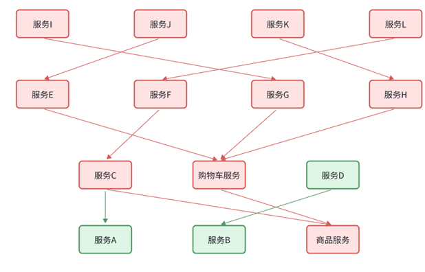
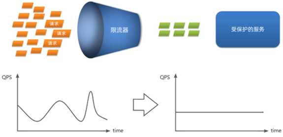
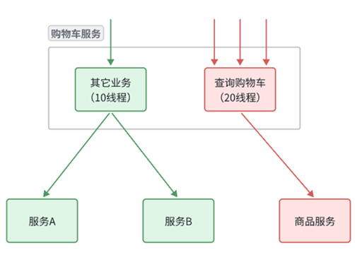
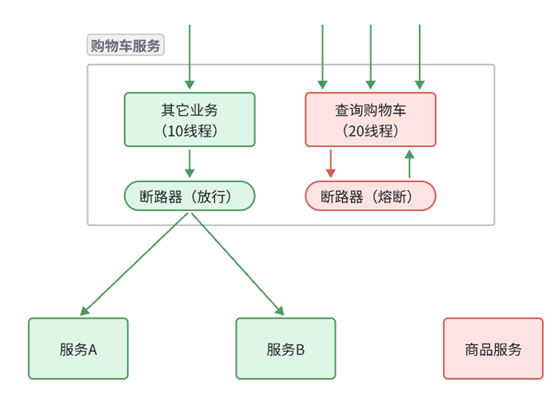
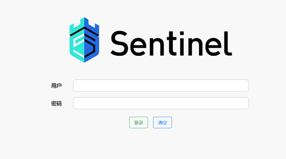
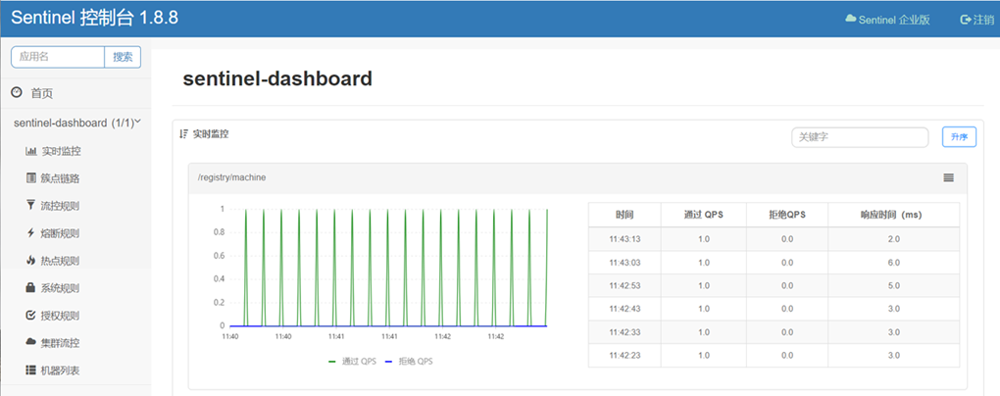

## 0. 问题引入

**业务健壮性问题**

例如在查询购物车列表业务中，需要查询最新的商品信息，与购物车数据做对比，提醒用户。

如果商品服务查询时发生故障，查询购物车列表时也会发生异常。

但从业务角度来说，为了提升用户体验，即便是商品查询失败，购物车列表也应该正确展示出来，哪怕是不包含最新的商品信息。

**级联失败问题**（**雪崩问题**）

还是查询购物车的业务，假如商品服务业务并发较高，占用过多Tomcat连接。可能会导致商品服务的所有接口响应时间增加，延迟变高，甚至是长时间阻塞直至查询失败。

此时查询购物车业务需要等待商品查询结果，从而导致整个业务的响应时间也变长，甚至阻塞至无法访问。

依次类推，整个微服务群中与购物车服务、商品服务等有调用关系的服务可能都会出现问题，最终导致整个集群不可用。



## 1. 微服务保护

微服务保护的方案有很多，比如：

- 请求限流

- 线程隔离

- 服务熔断

这些方案或多或少都会导致服务的体验上略有下降，比如请求限流，降低了并发上限；线程隔离，降低了可用资源数量；服务熔断，降低了服务的完整度，部分服务变的不可用或弱可用。因此这些方案都属于**服务降级**的方案。但通过这些方案，服务的健壮性得到了提升。

### 1.1 请求限流

服务故障最重要原因，就是**并发太高**！解决了这个问题，就能避免大部分故障。

当然，接口的并发不是一直很高，而是突发的。因此请求限流，就是**限制或控制**接口访问的并发流量，避免服务因流量激增而出现故障。

请求限流往往会有一个**限流器**，数量高低起伏的并发请求曲线，经过限流器就变的非常平稳。这就像是水电站的大坝，起到蓄水的作用，可以通过开关控制水流出的大小，让下游水流始终维持在一个平稳的量。



### 1.2 线程隔离

当一个业务接口响应时间长，而且并发高时，**就可能耗尽服务器的线程资源**，导致服务内的其它接口受到影响。所以我们必须把这种影响降低，或者缩减影响的范围。

为了避免某个接口故障或压力过大导致整个服务不可用，我们可以限定每个接口可以使用的资源范围，也就是将其 “隔离” 起来。

如图所示，给查询购物车业务限定可用线程数量上限为20，这样即便查询购物车的请求因为查询商品服务而出现故障，也不会导致服务器的线程资源被耗尽，从而影响到其它接口。



### 1.3 服务熔断

线程隔离虽然避免了雪崩问题，但故障服务（商品服务）依然会拖慢购物车服务（服务调用方）的接口响应速度。而且商品查询的故障依然会导致查询购物车功能出现故障，购物车业务也变的不可用了。

所以，我们要做两件事情：

- **编写服务降级逻辑**：就是服务调用失败后的处理逻辑，根据业务场景，可以抛出异常，也可以返回友好提示或默认数据。

- **异常统计和熔断**：统计服务提供方的异常比例，当比例过高表明该接口会影响到其它服务，应该拒绝调用该接口，而是直接走降级逻辑。



## 2. Sentinel

### 2.1 介绍和安装

微服务保护的技术有很多，但在目前国内使用较多的还是Sentinel。

Sentinel是阿里巴巴开源的一款服务保护框架，目前已经加入SpringCloudAlibaba中。[官方网站](https://sentinelguard.io/zh-cn/)。

Sentinel 的使用可以分为两个部分:

- **核心库**（Jar包）：不依赖任何框架/库，能够运行于 Java 8 及以上的版本的运行时环境，同时对 Dubbo / Spring Cloud 等框架也有较好的支持。在项目中引入依赖即可实现服务限流、隔离、熔断等功能。

- **控制台**（Dashboard）：Dashboard 主要负责管理推送规则、监控、管理机器信息等。

为了方便监控微服务，我们先把Sentinel的控制台搭建出来。

1）下载jar包

下载地址：[Releases · alibaba/Sentinel · GitHub](https://github.com/alibaba/Sentinel/releases)

2）运行

将jar包放在任意非中文、不包含特殊字符的目录下，重命名为`sentinel-dashboard.jar`：

然后运行如下命令：

```
java -Dserver.port=8090 -Dcsp.sentinel.dashboard.server=localhost:8090 -Dproject.name=sentinel-dashboard -jar sentinel-dashboard.jar
```

其它启动时可配置参数可参考官方文档：[启动配置项 · alibaba/Sentinel Wiki · GitHub](https://github.com/alibaba/Sentinel/wiki/%E5%90%AF%E5%8A%A8%E9%85%8D%E7%BD%AE%E9%A1%B9)

3）访问

访问 [http://localhost:8090](http://localhost:8090) ，就可以看到sentinel的控制台了：



需要输入账号和密码，默认都是：sentinel

登录后，即可看到控制台，默认会监控sentinel-dashboard服务本身：



### 2.2 微服务整合

## 3. 请求限流

## 4. 线程隔离

## 5. 服务熔断
