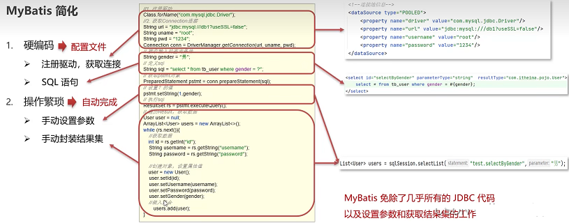
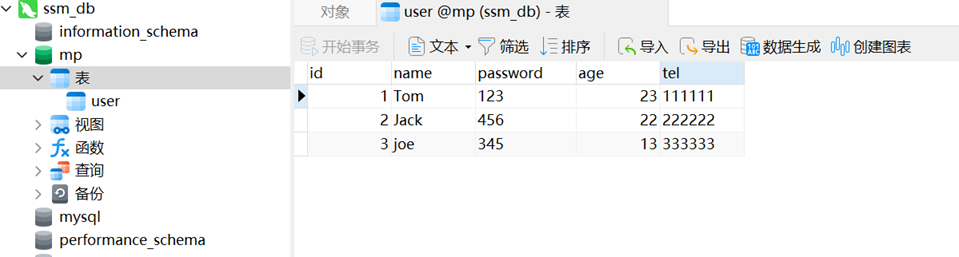
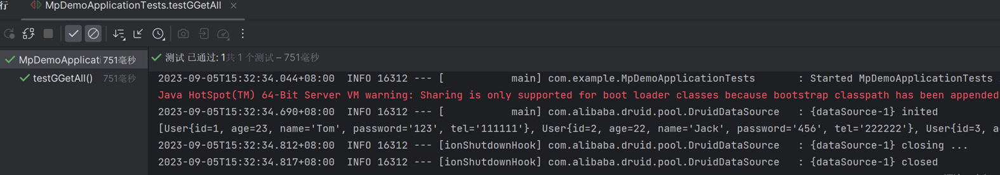
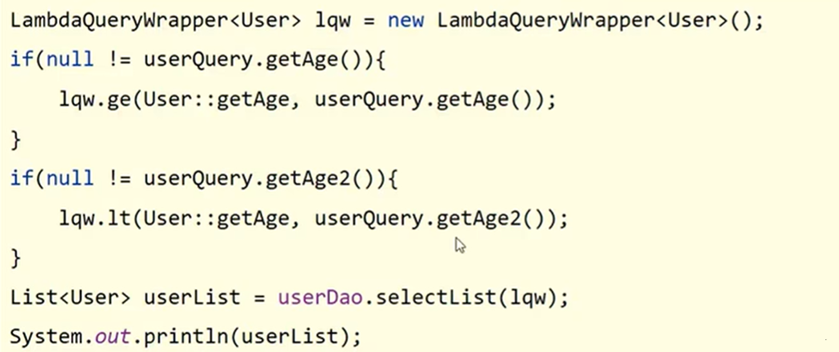
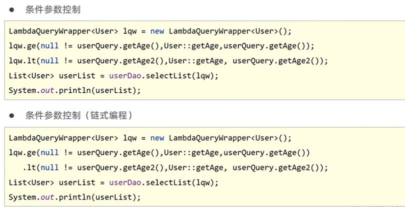
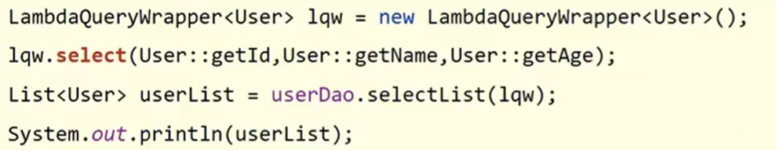
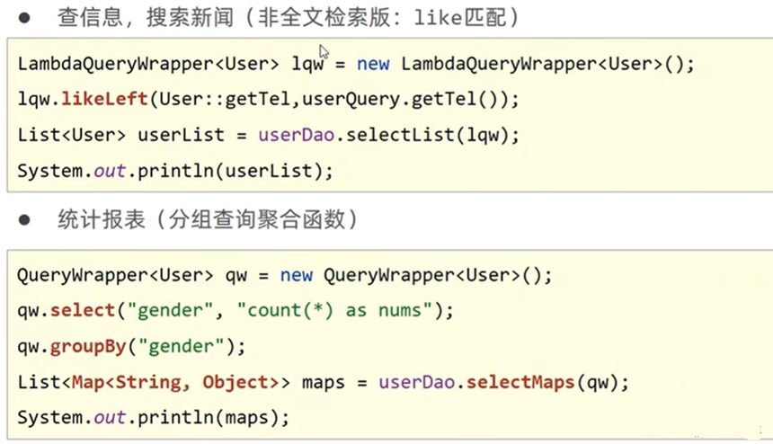
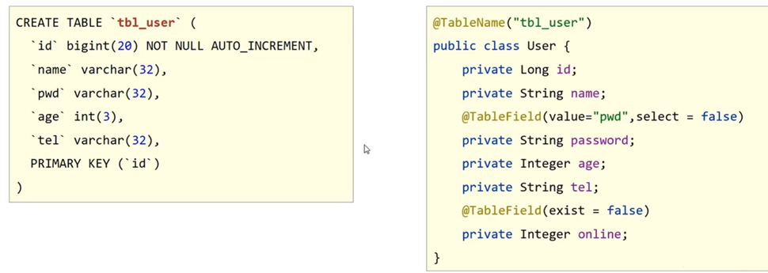
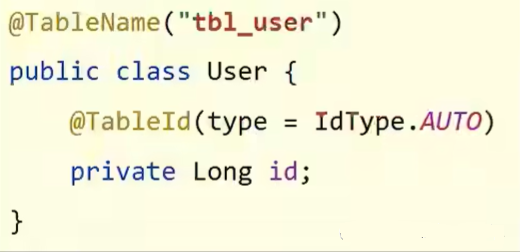
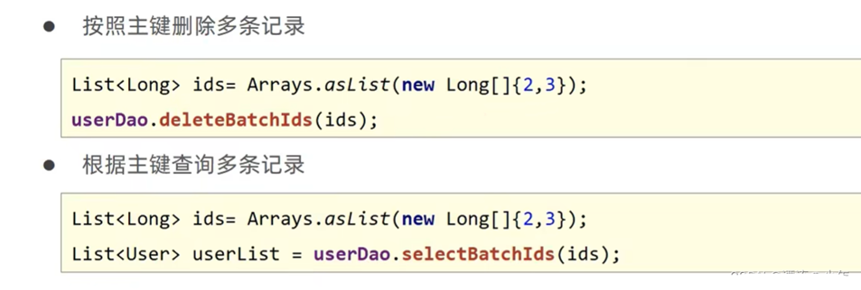

## 1.简介

**MyBatis**是一款优秀的**持久层框架**，用于简化JDBC开发。

**持久层**：负责将数据保存到数据库的那一层代码。（JavaEE：表现层、业务层、持久层）。



## 2.入门案例

**（1）新建tb_user表，添加数据。（mysql+Navicat）**

```
create database mybatis;
use mybatis;

drop table if exists tb_user;

create table tb_user(
    id int primary key auto_increment,
    username varchar(20),
    password varchar(20),
    gender char(1),
    addr varchar(30)
);

INSERT INTO tb_user VALUES(1, '张三', '123', '男', '北京');
INSERT INTO tb_user VALUES(2, '李四', '234', '女', '天津');
INSERT INTO tb_user VALUES(3, '王五', '11', '男', '西安');
```

**（2）用Maven新建项目，在pom.xml中添加依赖。**

mybatis、mysql-connector-java、junit、log4j-slf4j-impl、logback-classic

```
    <dependencies>
        <dependency>
            <groupId>org.mybatis</groupId>
            <artifactId>mybatis</artifactId>
            <version>3.5.13</version>
        </dependency>

        <dependency>
            <groupId>mysql</groupId>
            <artifactId>mysql-connector-java</artifactId>
            <version>8.0.32</version>
        </dependency>

        <dependency>
            <groupId>junit</groupId>
            <artifactId>junit</artifactId>
            <version>4.13.2</version>
            <scope>test</scope>
        </dependency>

        <dependency>
            <groupId>org.apache.logging.log4j</groupId>
            <artifactId>log4j-slf4j-impl</artifactId>
            <version>2.20.0</version>
        </dependency>

        <dependency>
            <groupId>ch.qos.logback</groupId>
            <artifactId>logback-classic</artifactId>
            <version>1.4.6</version>
        </dependency>
    </dependencies>
```

**（3）编写MyBatis核心配置文件和SQL映射文件**

/src/main/resources/mybatis-config.xml

```
<?xml version="1.0" encoding="UTF-8" ?>
<!DOCTYPE configuration
        PUBLIC "-//mybatis.org//DTD Config 3.0//EN"
        "http://mybatis.org/dtd/mybatis-3-config.dtd">
<configuration>
    <environments default="development">
        <environment id="development">
            <transactionManager type="JDBC"/>
            <dataSource type="POOLED">
                <!--数据库连接信息-->
                <property name="driver" value="com.mysql.cj.jdbc.Driver"/>
                <property name="url" value="jdbc:mysql:///mybatis?useSSL=false"/>
                <property name="username" value="root"/>
                <property name="password" value="123456"/>
            </dataSource>
        </environment>
    </environments>
    <mappers>
        <!-- 加载sql映射文件-->
        <mapper resource="UserMapper.xml"/>
    </mappers>
</configuration>
```

/src/main/resources/UserMapper.xml

```
<?xml version="1.0" encoding="UTF-8" ?>
<!DOCTYPE mapper
        PUBLIC "-//mybatis.org//DTD Mapper 3.0//EN"
        "http://mybatis.org/dtd/mybatis-3-mapper.dtd">
<mapper namespace="test">
    <select id="selectAll" resultType="org.example.pojo.User">
        select * from tb_user;
    </select>
</mapper>
```

**（4）创建实体类和测试类**

/src/main/java/org/example/pojo/User.java(类中的那一堆函数都可以自动生成)

```
package org.example.pojo;

public class User {
    private  Integer id;
    private  String username;
    private  String password;
    private  String addr;

    public Integer getId() {
        return id;
    }

    public void setId(Integer id) {
        this.id = id;
    }

    public String getUsername() {
        return username;
    }

    public void setUsername(String username) {
        this.username = username;
    }

    public String getPassword() {
        return password;
    }

    public void setPassword(String password) {
        this.password = password;
    }

    public String getAddr() {
        return addr;
    }

    public void setAddr(String addr) {
        this.addr = addr;
    }

    @Override
    public String toString() {
        return "User{" +
                "id=" + id +
                ", username='" + username + '\'' +
                ", password='" + password + '\'' +
                ", addr='" + addr + '\'' +
                '}';
    }
}
```

/src/main/java/org/example/pojo/MyBatisDemo.java

```
package org.example.pojo;

import org.apache.ibatis.io.Resources;
import org.apache.ibatis.session.SqlSession;
import org.apache.ibatis.session.SqlSessionFactory;
import org.apache.ibatis.session.SqlSessionFactoryBuilder;

import java.io.IOException;
import java.io.InputStream;
import java.util.List;

public class MyBatisDemo {
    public static void main(String[] args) throws IOException {
        //1. 加载mybatis的核心配置文件，获取SqlSessionFactory
        String resource = "mybatis-config.xml";
        InputStream inputStream = Resources.getResourceAsStream(resource);
        SqlSessionFactory sqlSessionFactory = new SqlSessionFactoryBuilder().build(inputStream);
        //2.获取sqlSession对象，用它来执行sql
        SqlSession sqlSession = sqlSessionFactory.openSession();
        //3.执行sql
        List<User> users = sqlSession.selectList("test.selectAll");
        System.out.println(users);
        //4.释放资源
        sqlSession.close();
    }
}
```


**（5）使用Mapper代理方式改进上述案例**

上面的例子中，`List<User> users = sqlSession.selectList("test.selectAll")`用到了硬编码，改进如下。

设置SQL映射文件的`namespace`属性。在Mapper接口中定义方法，方法名就是SQL映射文件中sql语句的id，并保持参数类型和返回值类型一致。

src/main/java/org/example/mapper/UserMapper.java

```
package org.example.mapper;

import org.example.pojo.User;
import java.util.List;

public interface UserMapper {

    List<User> selectAll();
}
```

src/main/resources/org/example/mapper/UserMapper.xml

```
<?xml version="1.0" encoding="UTF-8" ?>
<!DOCTYPE mapper
        PUBLIC "-//mybatis.org//DTD Mapper 3.0//EN"
        "http://mybatis.org/dtd/mybatis-3-mapper.dtd">
<mapper namespace="org.example.mapper.UserMapper">
    <select id="selectAll" resultType="org.example.pojo.User">
        select * from tb_user;
    </select>
</mapper>
```

修改mybatis-config.xml文件

```
<mappers>
<!--<mapper resource="org/example/mapper/UserMapper.xml"/>-->
    <package name="org.example.mapper"/>
</mappers>
```

通过SqlSession的getMapper方法获取Mapper接口的代理对象。调用对应的方法完成sql的执行。

/src/main/java/org/example/pojo/MyBatisDemo.java

```
package org.example.pojo;

import org.apache.ibatis.io.Resources;
import org.apache.ibatis.session.SqlSession;
import org.apache.ibatis.session.SqlSessionFactory;
import org.apache.ibatis.session.SqlSessionFactoryBuilder;
import org.example.mapper.UserMapper;

import java.io.IOException;
import java.io.InputStream;
import java.util.List;

public class MyBatisDemo {
    public static void main(String[] args) throws IOException {
        //1. 加载mybatis的核心配置文件，获取SqlSessionFactory
        String resource = "mybatis-config.xml";
        InputStream inputStream = Resources.getResourceAsStream(resource);
        SqlSessionFactory sqlSessionFactory = new SqlSessionFactoryBuilder().build(inputStream);
        //2.获取sqlSession对象，用它来执行sql
        SqlSession sqlSession = sqlSessionFactory.openSession();
        //3.执行sql
        UserMapper userMapper = sqlSession.getMapper(UserMapper.class);
        List<User> users = userMapper.selectAll();
        System.out.println(users);
        //4.释放资源
        sqlSession.close();
    }
}
```

## 3.Mybatis核心配置文件详解

mybatis-config.xml

```
<?xml version="1.0" encoding="UTF-8" ?>
<!DOCTYPE configuration
        PUBLIC "-//mybatis.org//DTD Config 3.0//EN"
        "http://mybatis.org/dtd/mybatis-3-config.dtd">
<configuration>
    <!-- 指定一个包名，MyBatis 会在包名下面搜索需要的 Java Bean-->
    <typeAliases>
        <package name="org.example.pojo"/>
    </typeAliases>

    <environments default="development">
    <!-- environments配置数据库连接环境信息，可以配置多个environment，通过default属性切换不同的environment  -->
        <environment id="development">
            <transactionManager type="JDBC"/>
            <dataSource type="POOLED">
                <!--数据库连接信息-->
                <property name="driver" value="com.mysql.cj.jdbc.Driver"/>
                <property name="url" value="jdbc:mysql:///mybatis?useSSL=false"/>
                <property name="username" value="root"/>
                <property name="password" value="123456"/>
            </dataSource>
        </environment>
        <environment id="test">
            <transactionManager type="JDBC"/>
            <dataSource type="POOLED">
                <property name="driver" value="com.mysql.cj.jdbc.Driver"/>
                <property name="url" value="jdbc:mysql:///mybatis?useSSL=false"/>
                <property name="username" value="root"/>
                <property name="password" value="123456"/>
            </dataSource>
        </environment>
    </environments>
    <mappers>
        <package name="org.example.mapper"/>
    </mappers>
</configuration>
```

UserMapper.xml（这里的resultType可以简写）

```
<?xml version="1.0" encoding="UTF-8" ?>
<!DOCTYPE mapper
        PUBLIC "-//mybatis.org//DTD Mapper 3.0//EN"
        "http://mybatis.org/dtd/mybatis-3-mapper.dtd">
<mapper namespace="org.example.mapper.UserMapper">
    <select id="selectAll" resultType="user">
        select * from tb_user;
    </select>
</mapper>
```

## 4.配置文件完成增删改查

### 4.1 创建表tb_brand和实体类brand

创建数据库表的脚本

```
drop table if exists tb_brand;

create table tb_brand
(
    id int primary key auto_increment,
    brand_name varchar(20),
    company_name varchar(20),
    ordered int,
    description varchar(100),
    status int
);

insert into tb_brand(brand_name, company_name, ordered, description, status) values 
                ('三只松鼠', '三只松鼠股份有限公司', 5, '好吃不上火', 0),
       ('华为', '华为技术有限公司', 100, '全球领先的ICT基础设施和智能终端提供商', 1),
             ('小米', '小米科技有限公司', 50, '让每个人都能享受科技的乐趣', 1);

select * from tb_brand;
```

src/main/java/org/example/pojo/Brand.java

```
package org.example.pojo;

public class Brand {
    private Integer id;
    private String brandName;
    private String companyName;
    private Integer ordered;
    private String description;
    private Integer status;

    public Integer getId() {
        return id;
    }

    public void setId(Integer id) {
        this.id = id;
    }

    public String getBrandName() {
        return brandName;
    }

    public void setBrandName(String brandName) {
        this.brandName = brandName;
    }

    public String getCompanyName() {
        return companyName;
    }

    public void setCompanyName(String companyName) {
        this.companyName = companyName;
    }

    public Integer getOrdered() {
        return ordered;
    }

    public void setOrdered(Integer ordered) {
        this.ordered = ordered;
    }

    public String getDescription() {
        return description;
    }

    public void setDescription(String description) {
        this.description = description;
    }

    public Integer getStatus() {
        return status;
    }

    public void setStatus(Integer status) {
        this.status = status;
    }

    @Override
    public String toString() {
        return "Brand{" +
                "id=" + id +
                ", brandName='" + brandName + '\'' +
                ", companyName='" + companyName + '\'' +
                ", ordered=" + ordered +
                ", description='" + description + '\'' +
                ", status=" + status +
                '}';
    }
}
```

### 4.2 MybatisX插件

Mybatis是一款基于IDEA的快速开发插件。

**主要功能：** XML和接口方法相互跳转。根据接口方法生成statement。


### 4.3 查询 - 所有结果、单条件查询、多条件查询

**（1）mybatis配置文件**

src/main/resources/mybatis-config.xml

```
<?xml version="1.0" encoding="UTF-8" ?>
<!DOCTYPE configuration
        PUBLIC "-//mybatis.org//DTD Config 3.0//EN"
        "http://mybatis.org/dtd/mybatis-3-config.dtd">
<configuration>
    <!-- 指定一个包名，MyBatis 会在包名下面搜索需要的 Java Bean-->
    <typeAliases>
        <package name="org.example.pojo"/>
    </typeAliases>

    <environments default="development">
    <!-- environments配置数据库连接环境信息，可以配置多个environment，通过default属性切换不同的environment  -->
        <environment id="development">
            <transactionManager type="JDBC"/>
            <dataSource type="POOLED">
                <!--数据库连接信息-->
                <property name="driver" value="com.mysql.cj.jdbc.Driver"/>
                <property name="url" value="jdbc:mysql:///mybatis?useSSL=false"/>
                <property name="username" value="root"/>
                <property name="password" value="123456"/>
            </dataSource>
        </environment>
    </environments>
    <mappers>
        <package name="org.example.mapper"/>
    </mappers>
</configuration>
```

**（2）编写Mapper接口的方法和SQL映射文件**

数据库表的字段和实体类的属性名称不一样，则不能自动封装数据。

**解决：**

- 起别名，select xx as xx

- sql片段

- resultMap

**多条件：**

- 散装参数：@Param("SQL中参数占位符名称")

- 实体类封装参数

- map集合

src/main/resources/org/example/mapper/BrandMapper.xml

```
<?xml version="1.0" encoding="UTF-8" ?>
<!DOCTYPE mapper
        PUBLIC "-//mybatis.org//DTD Mapper 3.0//EN"
        "http://mybatis.org/dtd/mybatis-3-mapper.dtd">
<mapper namespace="org.example.mapper.BrandMapper">
    <resultMap id="brandResultMap" type="brand">
        <!--id：完成主键字段的映射、result：完成一般字段的映射-->
        <result column="brand_name" property="brandName" />
        <result column="company_name" property="companyName" />
    </resultMap>
    <select id="selectAll" resultMap="brandResultMap">
        select *
        from tb_brand;
    </select>
    <select id="selectAllById" resultMap="brandResultMap">
        select *
        from tb_brand where id=#{id};
    </select>
    <select id="selectByCondition" resultMap="brandResultMap">
        select *
        from tb_brand
        where status = #{status}
          and company_name like #{companyName}
          and brand_name like #{brandName}
    </select>
</mapper>
```

src/main/java/org/example/mapper/BrandMapper.java

```
package org.example.mapper;

import org.example.pojo.Brand;
import java.util.List;

public interface BrandMapper {
    public List<Brand> selectAll();

    Brand selectAllById(int id);

    // 1.散装参数
    //List<Brand> selectByCondition(@Param("status") int status, @Param("companyName") String companyName, @Param("brandName") String brandName);
    // 2.封装实体类对象
    List<Brand> selectByCondition(Brand brand);
}
```

**（3）编写测试代码**

src/test/java/org/example/test/MyBatisTest.java

```
package org.example.test;

import org.apache.ibatis.io.Resources;
import org.apache.ibatis.session.SqlSession;
import org.apache.ibatis.session.SqlSessionFactory;
import org.apache.ibatis.session.SqlSessionFactoryBuilder;
import org.example.mapper.BrandMapper;
import org.example.pojo.Brand;
import org.junit.Test;

import java.io.IOException;
import java.io.InputStream;
import java.util.List;

public class MyBatisTest {

    @Test
    public void testSelectAll() throws IOException {
        // 1. 加载mybatis的核心配置文件，获取SqlSessionFactory
        String resource = "mybatis-config.xml";
        InputStream inputStream = Resources.getResourceAsStream(resource);
        SqlSessionFactory sqlSessionFactory = new SqlSessionFactoryBuilder().build(inputStream);
        // 2.获取sqlSession对象，用它来执行sql
        SqlSession sqlSession = sqlSessionFactory.openSession();
        // 3.获取Mapper接口的代理对象，执行方法
        BrandMapper brandMapper = sqlSession.getMapper(BrandMapper.class);
        List<Brand> brands = brandMapper.selectAll();
        System.out.println(brands);

        // 单条件查询
        int id = 1;
        Brand brand = brandMapper.selectAllById(id);
        System.out.println(brand);

        // 多条件（散装参数）
        int status = 1;
        String companyName = "%"+"华为"+"%";
        String brandName = "%"+"华为"+"%";
        // List<Brand> brands = brandMapper.selectByCondition(status, companyName, brandName);
        // 多条件（封装实体类对象）
        Brand brand = new Brand();
        brand.setStatus(status);
        brand.setCompanyName(companyName);
        brand.setBrandName(brandName);
        List<Brand> brands = brandMapper.selectByCondition(brand);
        System.out.println(brands);

        //4.释放资源
        sqlSession.close();
    }
}
```

### 4.4 查询 - 动态查询 - 多条件、单条件

动态SQL：sql语句会随着用户的输入或外部条件的变化而变化。毕竟，用户输入筛选条件时，不一定会填写所有条件。

可使用 **if 标签的test属性**进行条件判断。

存在的问题：第一个条件没有逻辑运算符and，如果省略第一个条件，sql语句会语法报错。

解决：使用`<where/>`标签或使用恒等式where 1=1 <if>and xxx</if> <if>and xxx</if>...

BrandMapper.java同上

BrandMapper.xml

```
<select id="selectByCondition" resultMap="brandResultMap">
    select *
    from tb_brand
    <where>
        <if test="status != null">status = #{status}</if>
        <if test="companyName != null">and company_name like #{companyName}</if>
        <if test="brandName != null">and brand_name like #{brandName}</if>
    </where>
</select>
```

MyBatisTest.java

```
int status = 1;
String companyName = "%"+"华为"+"%";
String brandName = "%"+"华为"+"%";
Brand brand = new Brand();
//brand.setStatus(status);
brand.setCompanyName(companyName);
brand.setBrandName(brandName);
List<Brand> brands = brandMapper.selectByCondition(brand);
System.out.println(brands);
```

从多个条件中选择一个。可以使用choose标签，类似于switch语句。

如果用户什么条件都不选，为防止sql语法错误，可使用`<where>`标签或

```
where <choose>
        <when>...</when>
        <otherwise>1=1</otherwise>
    </choose>
```

BrandMapper.java

```
package org.example.mapper;

import org.apache.ibatis.annotations.Param;
import org.example.pojo.Brand;
import java.util.List;

public interface BrandMapper {
    public List<Brand> selectAll();

    Brand selectAllById(int id);

    List<Brand> selectByCondition(Brand brand);

    List<Brand> selectByConditionSingle(Brand brand);
}
```

BrandMapper.xml

```
<select id="selectByConditionSingle" resultMap="brandResultMap">
    select *
    from tb_brand
    <where>
        <choose>
            <when test="status != null">status = #{status}</when>
            <when test="companyName != null">company_name like #{companyName}</when>
            <when test="brandName != null">brand_name like #{brandName}</when>
        </choose>
    </where>
</select>
```

MyBatisTest.java

```
int status = 1;
String companyName = "%"+"华为"+"%";
String brandName = "%"+"华为"+"%";
Brand brand = new Brand();
brand.setStatus(status);
//brand.setCompanyName(companyName);
//brand.setBrandName(brandName);
List<Brand> brands = brandMapper.selectByConditionSingle(brand);
System.out.println(brands);
```

### 4.5 添加

在数据添加成功后，需要获取插入数据库数据的主键的值。比如，添加订单和订单项。

添加完订单，同时需要添加订单项，订单项中需要设置所属订单的id。

**解决**：利用useGeneratedKeys属性和keyProperty属性。

userGeneratenKeys(true) ：是否使用自增主键  

keyProperty("对应数据表的实体类中的属性“） ：把uGK对应的主键注入到这个类中的属性。

BrandMapper.xml

```
<insert id="add" useGeneratedKeys="true" keyProperty="id">
    insert into tb_brand(brand_name, company_name, ordered, description, status)
    values (#{brandName}, #{companyName}, #{ordered}, #{description}, #{status})
</insert>
```

BrandMapper.java

```
package org.example.mapper;

import org.apache.ibatis.annotations.Param;
import org.example.pojo.Brand;
import java.util.List;

public interface BrandMapper {
    public List<Brand> selectAll();

    Brand selectAllById(int id);

    List<Brand> selectByCondition(Brand brand);

    List<Brand> selectByConditionSingle(Brand brand);

    void add(Brand brand);
}
```

MyBatisTest.java

```
int status = 1;
String companyName = "字节跳动";
String brandName = "字节跳动";
String description = "激发创造, 丰富生活";
int ordered = 100;

Brand brand = new Brand();
brand.setStatus(status);
brand.setCompanyName(companyName);
brand.setBrandName(brandName);
brand.setDescription(description);
brand.setOrdered(ordered);
brandMapper.add(brand);
Integer id = brand.getId();
System.out.println(id);
sqlSession.commit();  // 提交事务
```

### 4.6 修改 - 修改全部字段、修改动态字段

BrandMapper.xml

```
<update id="update">
    update tb_brand
    set
        brand_name = #{brandName},
        company_name = #{companyName},
        ordered = #{ordered},
        description = #{description},
        status = #{status}
    where id = #{id};
</update>


<update id="update">
    update tb_brand
    <set>
        <if test="brandName != null and brandName !=''">
            brand_name = #{brandName},
        </if>
        <if test="companyName != null and companyName !=''">
            company_name = #{companyName},
        </if>
        <if test="ordered != null">
            ordered = #{ordered},
        </if>
        <if test="description != null and description !=''">
            description = #{description},
        </if>
        <if test="status != null">
            status = #{status}
        </if>
    </set>
    where id = #{id};
</update>
```

BrandMapper.java

```
package org.example.mapper;

import org.apache.ibatis.annotations.Param;
import org.example.pojo.Brand;
import java.util.List;

public interface BrandMapper {
    public List<Brand> selectAll();

    Brand selectAllById(int id);

    List<Brand> selectByCondition(Brand brand);

    List<Brand> selectByConditionSingle(Brand brand);

    void add(Brand brand);

    int update(Brand brand);
}
```

MyBatisTest.java

```
int status = 1;
String companyName = "字节跳动";
String brandName = "字节跳动";
String description = "字节，激发创造, 丰富生活";
int ordered = 100;
int id = 5;

Brand brand = new Brand();
brand.setStatus(status);
brand.setCompanyName(companyName);
brand.setBrandName(brandName);
brand.setDescription(description);
brand.setOrdered(ordered);
brand.setId(id);
int count = brandMapper.update(brand);
System.out.println(count);  // 最后打印输出1
sqlSession.commit();  // 提交事务
```

### 4.7 删除 - 删除一个、批量删除

批量删除：mybatis会将参数封装成一个map集合。

可使用@Param注解改变map集合的默认key的名称。默认名称为array。

BrandMapper.xml

```
<delete id="deleteById">
    delete from tb_brand where id = #{id};
</delete>
<delete id="deleteByIds">
    delete from tb_brand where id
    in
        <foreach collection="ids" item="id" separator="," open="(" close=")">
            #{id}
        </foreach>;
</delete>
```

BrandMapper.java

```
package org.example.mapper;

import org.apache.ibatis.annotations.Param;
import org.example.pojo.Brand;
import java.util.List;

public interface BrandMapper {
    public List<Brand> selectAll();

    Brand selectAllById(int id);

    List<Brand> selectByCondition(Brand brand);

    List<Brand> selectByConditionSingle(Brand brand);

    void add(Brand brand);

    int update(Brand brand);

    void deleteById(int id);

    void deleteByIds(@Param("ids") int[] ids);
}
```

MyBatisTest.java

```
int id = 5;
brandMapper.deleteById(id);
sqlSession.commit();  // 提交事务

int[] ids = {3,4};
brandMapper.deleteByIds(ids);
sqlSession.commit();  // 提交事务
```

## 5.注解开发

实现复杂功能，使用注解开发比配置文件更方便。

实现简单功能，还是使用配置文件更清晰。

src/main/resources/mybatis-config.xml

```
<?xml version="1.0" encoding="UTF-8" ?>
<!DOCTYPE configuration
        PUBLIC "-//mybatis.org//DTD Config 3.0//EN"
        "http://mybatis.org/dtd/mybatis-3-config.dtd">
<configuration>
    <!-- 指定一个包名，MyBatis 会在包名下面搜索需要的 Java Bean-->
    <typeAliases>
        <package name="org.example.pojo"/>
    </typeAliases>

    <environments default="development">
    <!-- environments配置数据库连接环境信息，可以配置多个environment，通过default属性切换不同的environment  -->
        <environment id="development">
            <transactionManager type="JDBC"/>
            <dataSource type="POOLED">
                <!--数据库连接信息-->
                <property name="driver" value="com.mysql.cj.jdbc.Driver"/>
                <property name="url" value="jdbc:mysql:///mybatis?useSSL=false"/>
                <property name="username" value="root"/>
                <property name="password" value="123456"/>
            </dataSource>
        </environment>
    </environments>
    <mappers>
        <package name="org.example.mapper"/>
    </mappers>
</configuration>
```

src/main/java/org/example/mapper/UserMapper.java

```
package org.example.mapper;

import org.apache.ibatis.annotations.Select;
import org.example.pojo.User;

public interface UserMapper {

    @Select("select * from tb_user where id = #{id}")
    User selectById(int id);
}
```

src/main/java/org/example/pojo/User.java

```
package org.example.pojo;

public class User {
    private  Integer id;
    private  String username;
    private  String password;
    private  String addr;

    public Integer getId() {
        return id;
    }

    public void setId(Integer id) {
        this.id = id;
    }

    public String getUsername() {
        return username;
    }

    public void setUsername(String username) {
        this.username = username;
    }

    public String getPassword() {
        return password;
    }

    public void setPassword(String password) {
        this.password = password;
    }

    public String getAddr() {
        return addr;
    }

    public void setAddr(String addr) {
        this.addr = addr;
    }

    @Override
    public String toString() {
        return "User{" +
                "id=" + id +
                ", username='" + username + '\'' +
                ", password='" + password + '\'' +
                ", addr='" + addr + '\'' +
                '}';
    }
}
```

src/test/java/org/example/test/UserMapperTest.java

```
package org.example.test;

import org.apache.ibatis.io.Resources;
import org.apache.ibatis.session.SqlSession;
import org.apache.ibatis.session.SqlSessionFactory;
import org.apache.ibatis.session.SqlSessionFactoryBuilder;
import org.example.mapper.UserMapper;
import org.example.pojo.User;
import org.junit.Test;

import java.io.IOException;
import java.io.InputStream;

public class UserMapperTest {

    @Test
    public void test() throws IOException {
        String resource = "mybatis-config.xml";
        InputStream inputStream = Resources.getResourceAsStream(resource);
        SqlSessionFactory sqlSessionFactory = new SqlSessionFactoryBuilder().build(inputStream);
        // 获取sqlSession对象，用它来执行sql
        SqlSession sqlSession = sqlSessionFactory.openSession();
        // 获取Mapper接口的代理对象，执行方法
        UserMapper userMapper = sqlSession.getMapper(UserMapper.class);

        User user = userMapper.selectById(1);
        System.out.println(user);
        sqlSession.close();
    }
}
```

## 6. MyBatisPlus

MyBatisPlus是基于MyBatis框架基础上开发的增强型工具，旨在简化开发、提高效率。

### 6.1 入门案例

**①创建SpringBoot项目，添加Spring Web和Mysql driver**

**②手动在pom.xml文件中添加mybatis plus和druid依赖**

```
<dependency>
  <groupId>com.baomidou</groupId>
  <artifactId>mybatis-plus-boot-starter</artifactId>
  <version>3.5.3.1</version>
</dependency>
<dependency>
  <groupId>com.alibaba</groupId>
  <artifactId>druid</artifactId>
  <version>1.2.18</version>
</dependency>
```

**③创建数据库mp，创建User表。**



**④ JDBC配置（application.yml）**

```
spring:
  datasource:
    type: com.alibaba.druid.pool.DruidDataSource
    driver-class-name: com.mysql.cj.jdbc.Driver
    url: jdbc:mysql://localhost:3306/mp?serverTimezone=UTC
    username: root
    password: root
```

**⑤制作实体类（类名与数据库表名类似，类的属性和表字段对应）**

domain.User.java

```
package com.example.domain;

public class User {
    private long id;
    private int age;
    private String name, password, tel;

    public long getId() {
        return id;
    }

    @java.lang.Override
    public java.lang.String toString() {
        return "User{" +
                "id=" + id +
                ", age=" + age +
                ", name='" + name + '\'' +
                ", password='" + password + '\'' +
                ", tel='" + tel + '\'' +
                '}';
    }

    public void setId(long id) {
        this.id = id;
    }

    public int getAge() {
        return age;
    }

    public void setAge(int age) {
        this.age = age;
    }

    public String getName() {
        return name;
    }

    public void setName(String name) {
        this.name = name;
    }

    public String getPassword() {
        return password;
    }

    public void setPassword(String password) {
        this.password = password;
    }

    public String getTel() {
        return tel;
    }

    public void setTel(String tel) {
        this.tel = tel;
    }
}
```

**⑥定义数据接口，继承BaseMapper**

dao.UserDao.java

```
package com.example.dao;

import com.baomidou.mybatisplus.core.mapper.BaseMapper;
import com.example.domain.User;
import org.apache.ibatis.annotations.Mapper;

@Mapper
public interface UserDao extends BaseMapper<User> {
}
```

**⑦测试类测试功能**

数据层CRUD开发

```
package com.example;

import com.example.dao.UserDao;
import com.example.domain.User;
import org.junit.jupiter.api.Test;
import org.springframework.beans.factory.annotation.Autowired;
import org.springframework.boot.test.context.SpringBootTest;

import java.util.List;

@SpringBootTest
class MpDemoApplicationTests {

    @Autowired
    private UserDao userDao;

    @Test
    void testSave() {
        User user = new User();
        user.setName("鼠鼠");
        user.setPassword("666");
        user.setAge(13);
        user.setTel("88888");
        userDao.insert(user);
    }

    @Test
    void testDelete() {
        userDao.deleteById(4);
    }

    @Test
    void testUpdate() {
        User user = new User();
        user.setId(1L);
        user.setName("Tom88");
        user.setPassword("tom888");
        userDao.updateById(user);
    }

    @Test
    void testGetById() {
        User user = userDao.selectById(2L);
        System.out.println(user);
    }

    @Test
    void testGetAll() {
        List<User> userList = userDao.selectList(null);
        System.out.println(userList);
    }
}
```



### 6.2 Lombok

**Lombok，一个Java类库，提供了一组注解，简化POJO实体类的开发。**

在pom.xml中添加依赖

```
<dependency>
  <groupId>org.projectlombok</groupId>
  <artifactId>lombok</artifactId>
</dependency>
```

domain.User.java

```
package com.example.domain;

import lombok.Getter;
import lombok.Setter;
import lombok.ToString;

@Setter
@Getter
@ToString
public class User {
    private long id;
    private int age;
    private String name, password, tel;
}
```

或

```
package com.example.domain;

import lombok.Data;

@Data
public class User {
    private long id;
    private int age;
    private String name, password, tel;
}
```

### 6.3 分页查询

设置分页拦截器作为Spring管理的bean。

config.Mpconfig.java

```
package com.example.config;

import com.baomidou.mybatisplus.extension.plugins.MybatisPlusInterceptor;
import com.baomidou.mybatisplus.extension.plugins.inner.PaginationInnerInterceptor;
import org.springframework.context.annotation.Bean;
import org.springframework.context.annotation.Configuration;

@Configuration
public class MpConfig {
    @Bean
    public MybatisPlusInterceptor mpInterceper() {
        // 1. 定义Mp拦截器
        MybatisPlusInterceptor mpInterceptor = new MybatisPlusInterceptor();
        mpInterceptor.addInnerInterceptor(new PaginationInnerInterceptor());
        return mpInterceptor;
    }
}
```

测试类

```
@Test
void testGetByPage() {
  IPage page = new Page(1, 2);
  userDao.selectPage(page, null);
  System.out.println("当前页码值：" + page.getCurrent());
  System.out.println("每页显示数：" + page.getSize());
  System.out.println("一共多少页：" + page.getPages());
  System.out.println("一共多少条数据：" + page.getTotal());
  System.out.println("数据：" + page.getRecords());
}
```

## 7. 条件查询、多条件查询

MyBatisPlus将书写复杂的SQL查询条件进行了封装，使用编程的形式完成查询条件的组合。

```
@Test
void testGetByCondition() {
    // 方式一：按条件查询
    QueryWrapper<User> qw = new QueryWrapper<User>();
    qw.lt("age", 20);
    List<User> userList = userDao.selectList(qw);
    System.out.println(userList);

    // 方式二：lambda格式
    QueryWrapper<User> qw2 = new QueryWrapper<User>();
    qw2.lambda().lt(User::getAge, 10);
    List<User> userList2 = userDao.selectList(qw2);
    System.out.println(userList2);

    // 方式三：lambda格式
    LambdaQueryWrapper<User> qw3 = new LambdaQueryWrapper<User>();
    qw3.lt(User::getAge, 10);
    List<User> userList3 = userDao.selectList(qw3);
    System.out.println(userList3);
 
    // 多条件查询
    LambdaQueryWrapper<User> lqw = new LambdaQueryWrapper<User>();
    // 10到30岁之间
    // lqw.lt(User::getAge, 30).gt(User::getAge, 10);
    // 小于10岁或大于30岁
    lqw.lt(User::getAge, 10).or().gt(User::getAge, 30);
    List<User> userList4 = userDao.selectList(lqw);
}
```

## 8. 条件查询null判定

封装User模型的查询条件，这里age是具有上下限的，User类里面的age作为下限，这里的age2作为上限。

domain.query.UserQuery.java

```
package com.example.domain.query;
 
import com.example.domain.User;
import lombok.Data;
 
@Data
public class UserQuery extends User {
    private int age2;
}
```

**① if语句控制**



**②条件参数控制**



## 9. 查询投影

查询结果包含模型类中的部分属性。



查询结果包含模型类中未定义的属性。


## 10. 查询条件




## 11. @TableField注解和@TableName注解

问题一：表字段和编码属性设计不同步  

问题二：编码中添加了数据库中未定义的属性  

问题三：设定某个字段不参与查询，比如密码pwd字段  

问题四：表名与编码开发设计不同步

前三个问题采用`@TableField注解`，问题四采用`@TableName注解`



## 12. id生成策略控制

不同的表，应用不同的id生成策略。

- 日志：自增（1，2，3....）
- 购物订单：特殊规则（FQ23948c232e）
- 外卖单：关联地区、日期等信息

**使用@TableId注解**



- AUTO(0)：使用数据库id自增策略控制id生成

- NONE(1)：不设置id生成策略

- INPUT(2)：用户手工输入id

- ASSIGN_ID(3)：雪花算法生成id(可兼容数值型与字符串型)

- ASSIGN_UUID(4)：以UUID生成算法作为id生成策略

## 13. 多记录操作



## 14. 逻辑删除

删除操作的问题：业务数据从数据库中丢弃

逻辑删除：为数据设置是否可用状态字段，删除时设置字段为不可用状态，数据保留在数据库中。

具体使用`@TableLogic`注解
