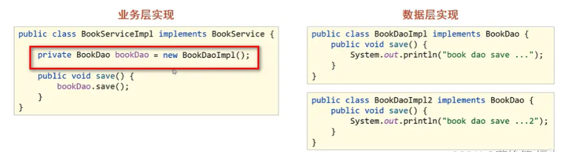
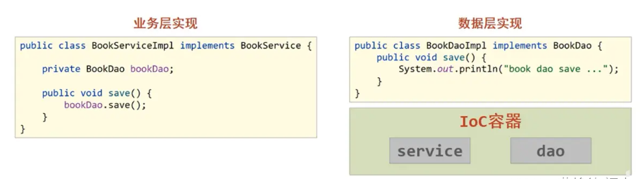
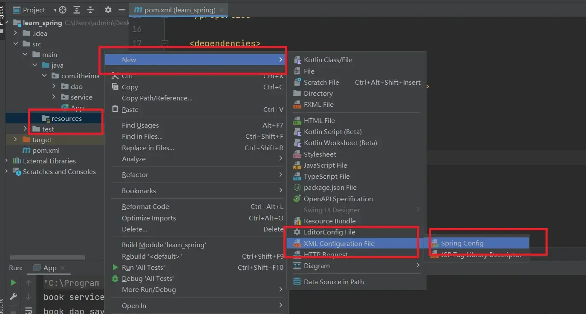
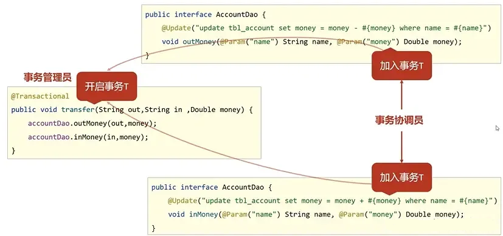

## 1.IoC容器

如果我现在想换一个类去new，比如：private BookDao bookDao = new BookDaoImpl2();

那么我需要重新编译、测试、部署。



**IoC(Inversion of Control)控制反转思想**：使用对象时，由主动new对象转换为由外部提供对象，此过程中对象创建控制权由**程序**转移到**外部**。

Spring技术对IoC思想进行了实现。Spring提供了一个**IoC容器**，来充当IoC思想的**外部**。

IoC容器负责对象的创建和初始化，这些对象我们统称为Bean。此外，IoC容器还能将内部有依赖关系的bean进行关系绑定。

Spring这样做的原因：**解耦**。



**入门案例**

（1）在pom.xml中添加spring依赖

```
<dependency>
    <groupId>org.springframework</groupId>
    <artifactId>spring-context</artifactId>
    <version>6.1.10</version>
</dependency>
```

（2）定义类（/src/main/java/com/itheima）

dao/BookDao.java

```
package com.itheima.dao;

public interface BookDao {
    public void save();
}
```

dao/impl/BookDaoImpl.java

```
package com.itheima.dao.impl;
import com.itheima.dao.BookDao;

public class BookDaoImpl implements BookDao {
    public void save() {
        System.out.println("book dao save...");
    }
}
```

service/BookService.java

```
package com.itheima.service;

public interface BookService {
    public void save();
}
```

service/impl/BookServiceImpl.java

```
package com.itheima.service.impl;

import com.itheima.dao.BookDao;
import com.itheima.service.BookService;

public class BookServiceImpl implements BookService{
    // 删除业务层中使用new的方式创建的dao对象
    private BookDao bookDao;

    public void save() {
        System.out.println("book service save ...");
        bookDao.save();
    }

    // 提供对应的set方法,由容器执行
    public void setBookDao(BookDao bookDao) {
        this.bookDao = bookDao;
    }
}
```

（3）创建spring配置文件



/src/main/resources/applicationContext.xml

```
<?xml version="1.0" encoding="UTF-8"?>
<beans xmlns="http://www.springframework.org/schema/beans"
       xmlns:xsi="http://www.w3.org/2001/XMLSchema-instance"
       xsi:schemaLocation="http://www.springframework.org/schema/beans http://www.springframework.org/schema/beans/spring-beans.xsd">
    <!--配置bean-->
    <!--id属性表示给bean起名字，class属性表示给bean定义类型-->
    <bean id="bookDao" class="com.itheima.dao.impl.BookDaoImpl"/>
    <bean id="bookService" class="com.itheima.service.impl.BookServiceImpl">
        <!--配置server与dao的关系-->
        <!--property标签表示配置当前bean的属性,name属性表示配置哪一个具体的属性,ref属性表示参照哪一个bean-->
        <property name="bookDao" ref="bookDao"/>
    </bean>
</beans>
```

（4）测试

/src/main/java/com/itheima/App.java

```
package com.itheima;

import com.itheima.service.BookService;
import org.springframework.context.ApplicationContext;
import org.springframework.context.support.ClassPathXmlApplicationContext;

public class App {
    public static void main(String[] args) {
        // 获取IoC容器
        ApplicationContext ctx = new ClassPathXmlApplicationContext("applicationContext.xml");
        // 获取bean（根据bean配置id获取）
        BookService bookService = (BookService) ctx.getBean("bookService");
        bookService.save();
    }
}
```

## 2.Bean

**bean的基础配置**

id：容器可以通过id唯一确定一个bean。

class：bean的类型，即bean对应的类

```
<bean id="bookDao" class="com.itheima.dao.impl.BookDaoImpl"/>
```

**bean的别名配置**

name：可定义多个别名，使用逗号、分号、空格分隔。

```
<bean id="bookDao" name="dao bookDaoImpl" class="com.itheima.dao.impl.BookDaoImpl" />
```

**bean的作用范围**

scope：singleton（单例）(默认)、prototype（非单例）

```
<bean id="bookDao" class="com.itheima.dao.impl.BookDaoImpl" scope="prototype"/>
```

bean默认为单例。

适合交给容器管理的bean：表现层对象、业务层对象、数据层对象

不适合交给容器管理的bean：封装实体的域对象。(这些对象的成员变量有自己的值)

**实例化bean**

/src/main/java/com/itheima/dao/BookDao.java

```
package com.itheima.dao;

public interface BookDao {
    public void save();
}
```

/src/main/java/com/itheima/dao/impl/BookDaoImpl.java

```
package com.itheima.dao.impl;
import com.itheima.dao.BookDao;

public class BookDaoImpl implements BookDao {
    public BookDaoImpl() {
        System.out.println("book dao constructor is running ....");
    }

    public void save() {
        System.out.println("book dao save...");
    }
}
```

/src/main/resources/applicationContext.xml

```
<?xml version="1.0" encoding="UTF-8"?>
<beans xmlns="http://www.springframework.org/schema/beans"
       xmlns:xsi="http://www.w3.org/2001/XMLSchema-instance"
       xsi:schemaLocation="http://www.springframework.org/schema/beans http://www.springframework.org/schema/beans/spring-beans.xsd">

    <bean id="bookDao" class="com.itheima.dao.impl.BookDaoImpl"/>
</beans>
```

/src/main/java/com/itheima/App.java

```
package com.itheima;

import com.itheima.dao.BookDao;
import org.springframework.context.ApplicationContext;
import org.springframework.context.support.ClassPathXmlApplicationContext;

public class App{
    public static void main(String[] args) {
            ApplicationContext ctx = new ClassPathXmlApplicationContext("applicationContext.xml");
            BookDao bookDao = (BookDao) ctx.getBean("bookDao");
            bookDao.save();
    }
}
```

**bean的生命周期**

bean生命周期：bean从创建到销毁的整体过程。

- 初始化容器 
  
  - 创建对象
  
  - 执行构造方法
  
  - 执行属性注入（set操作）
  
  - 执行bean初始化方法

- 使用bean
  
  - 执行业务操作

- 关闭容器
  
  - 执行bean销毁方法

**bean生命周期控制的两种方法**

/src/main/java/com/itheima/dao/BookDao.java

```
package com.itheima.dao;

public interface BookDao {
    public void save();
}
```

/src/main/java/com/itheima/App.java

```
package com.itheima;

import com.itheima.dao.BookDao;
import org.springframework.context.support.ClassPathXmlApplicationContext;

public class App{
    public static void main(String[] args) {
            ClassPathXmlApplicationContext ctx = new ClassPathXmlApplicationContext("applicationContext.xml");
            BookDao bookDao = (BookDao) ctx.getBean("bookDao");
            bookDao.save();
            ctx.registerShutdownHook();
            // ctx.close();
    }
}
```

**（1）配置bean**

/src/main/java/com/itheima/dao/impl/BookDaoImpl.java

```
package com.itheima.dao.impl;
import com.itheima.dao.BookDao;

public class BookDaoImpl implements BookDao {

    public void save() {
        System.out.println("book dao save...");
    }

    // bean初始化对应的操作
    public void init() {
        System.out.println("init...");
    }

    // bean销毁前对应的操作
    public void destroy() {
        System.out.println("destroy...");
    }
}
```

/src/main/resources/applicationContext.xml

```
<?xml version="1.0" encoding="UTF-8"?>
<beans xmlns="http://www.springframework.org/schema/beans"
       xmlns:xsi="http://www.w3.org/2001/XMLSchema-instance"
       xsi:schemaLocation="http://www.springframework.org/schema/beans http://www.springframework.org/schema/beans/spring-beans.xsd">

    <bean id="bookDao" class="com.itheima.dao.impl.BookDaoImpl" init-method="init" destroy-method="destroy" />
</beans>
```

**（2）使用接口**

/src/main/java/com/itheima/dao/impl/BookDaoImpl.java

```
package com.itheima.dao.impl;
import com.itheima.dao.BookDao;
import org.springframework.beans.factory.DisposableBean;
import org.springframework.beans.factory.InitializingBean;

public class BookDaoImpl implements BookDao, InitializingBean, DisposableBean {

    public void save() {
        System.out.println("book dao save...");
    }

    @Override
    public void afterPropertiesSet() throws Exception {
        System.out.println("init...");
    }

    @Override
    public void destroy() throws Exception {
        System.out.println("destroy...");
    }
}
```

/src/main/resources/applicationContext.xml

```
<?xml version="1.0" encoding="UTF-8"?>
<beans xmlns="http://www.springframework.org/schema/beans"
       xmlns:xsi="http://www.w3.org/2001/XMLSchema-instance"
       xsi:schemaLocation="http://www.springframework.org/schema/beans http://www.springframework.org/schema/beans/spring-beans.xsd">

    <bean id="bookDao" class="com.itheima.dao.impl.BookDaoImpl" />
</beans>
```

## 3. 依赖注入

**依赖注入(DI：dependence injection)**：在容器中建立bean与bean之间的依赖关系的整个过程。

向一个bean中传递数据有三种方法：**setter注入**、**构造器注入**、**自动装配**

/src/main/java/com/itheima/dao/BookDao.java

```
package com.itheima.dao;

public interface BookDao {
    public void save();
}
```

/src/main/java/com/itheima/dao/impl/BookDaoImpl.java

```
package com.itheima.dao.impl;
import com.itheima.dao.BookDao;

public class BookDaoImpl implements BookDao {

    public void save() {
        System.out.println("book dao save...");
    }
}
```

/src/main/java/com/itheima/service/BookService.java

```
package com.itheima.service;

public interface BookService {
    public void save();
}
```

/src/main/java/com/itheima/App.java

```
package com.itheima;
import com.itheima.service.BookService;
import org.springframework.context.ApplicationContext;
import org.springframework.context.support.ClassPathXmlApplicationContext;

public class App{
    public static void main(String[] args) {
        ApplicationContext ctx = new ClassPathXmlApplicationContext("applicationContext.xml");
        BookService bookService = (BookService) ctx.getBean("bookService");
        bookService.save();
    }
}
```

**（1）setter注入**

/src/main/java/com/itheima/service/impl/BookServiceImpl.java

```
package com.itheima.service.impl;
import com.itheima.dao.BookDao;
import com.itheima.service.BookService;

public class BookServiceImpl implements BookService {
    private BookDao bookDao;
    private int connectionNumber;

    // 在bean中定义引用类型属性并提供可访问的set方法
    public void setBookDao(BookDao bookDao) {
        this.bookDao = bookDao;
    }

    // 在bean中定义简单类型属性并提供可访问的set方法
    public void setConnectionNumber(int connectionNumber) {
        this.connectionNumber = connectionNumber;
    }

    public void save() {
        System.out.println("book service save ..." + connectionNumber);
        bookDao.save();
    }
}
```

/src/main/resources/applicationContext.xml

```
<?xml version="1.0" encoding="UTF-8"?>
<beans xmlns="http://www.springframework.org/schema/beans"
       xmlns:xsi="http://www.w3.org/2001/XMLSchema-instance"
       xsi:schemaLocation="http://www.springframework.org/schema/beans http://www.springframework.org/schema/beans/spring-beans.xsd">

    <bean id="bookDao" class="com.itheima.dao.impl.BookDaoImpl" />
    <bean id="bookService" class="com.itheima.service.impl.BookServiceImpl">
        <!--配置中使用property标签的ref属性注入引用类型对象-->
        <property name="bookDao" ref="bookDao" />
        <!--配置中使用property标签的value属性注入简单类型数据-->
        <property name="connectionNumber" value="10" />
    </bean>
</beans>
```

**（2）构造器注入**

/src/main/java/com/itheima/service/impl/BookServiceImpl.java

```
package com.itheima.service.impl;
import com.itheima.dao.BookDao;
import com.itheima.service.BookService;

public class BookServiceImpl implements BookService {
    private BookDao bookDao;
    private int connectionNumber;

    public BookServiceImpl(BookDao bookDao, int connectionNumber) {
        this.bookDao = bookDao;
        this.connectionNumber = connectionNumber;
    }

    public void save() {
        System.out.println("book service save ..." + connectionNumber);
        bookDao.save();
    }
}
```

/src/main/resources/applicationContext.xml

```
<?xml version="1.0" encoding="UTF-8"?>
<beans xmlns="http://www.springframework.org/schema/beans"
       xmlns:xsi="http://www.w3.org/2001/XMLSchema-instance"
       xsi:schemaLocation="http://www.springframework.org/schema/beans http://www.springframework.org/schema/beans/spring-beans.xsd">

    <bean id="bookDao" class="com.itheima.dao.impl.BookDaoImpl" />
    <bean id="bookService" class="com.itheima.service.impl.BookServiceImpl">
        <constructor-arg name="bookDao" ref="bookDao"/>
        <constructor-arg name="connectionNumber" value="10"/>
    </bean>
</beans>
```

**（3）自动装配**

依赖自动装配：IoC容器根据bean所依赖的资源在容器中自动查找并注入到bean中的过程称为自动装配。

/src/main/java/com/itheima/service/impl/BookServiceImpl.java

```
package com.itheima.service.impl;
import com.itheima.dao.BookDao;
import com.itheima.service.BookService;

public class BookServiceImpl implements BookService {
    private BookDao bookDao;

    public void setBookDao(BookDao bookDao) {
        this.bookDao = bookDao;
    }

    public void save() {
        System.out.println("book service save ...");
        bookDao.save();
    }
}
```

/src/main/resources/applicationContext.xml

```
<?xml version="1.0" encoding="UTF-8"?>
<beans xmlns="http://www.springframework.org/schema/beans"
       xmlns:xsi="http://www.w3.org/2001/XMLSchema-instance"
       xsi:schemaLocation="http://www.springframework.org/schema/beans http://www.springframework.org/schema/beans/spring-beans.xsd">

    <bean id="bookDao" class="com.itheima.dao.impl.BookDaoImpl" />
    <bean id="bookService" class="com.itheima.service.impl.BookServiceImpl" autowire="byType"/>
</beans>
```

## 4. 集合注入

/src/main/java/com/itheima/dao/impl/BookDaoImpl.java

```
package com.itheima.dao.impl;
import com.itheima.dao.BookDao;
import java.util.*;

public class BookDaoImpl implements BookDao {

    private int[] array;
    private List<String> list;
    private Set<String> set;
    private Map<String,String> map;
    private Properties properties;

    public void setArray(int[] array) {
        this.array = array;
    }

    public void setList(List<String> list) {
        this.list = list;
    }

    public void setSet(Set<String> set) {
        this.set = set;
    }

    public void setMap(Map<String, String> map) {
        this.map = map;
    }

    public void setProperties(Properties properties) {
        this.properties = properties;
    }

    public void save() {
        System.out.println("book dao save ...");
        System.out.println("遍历数组:" + Arrays.toString(array));
        System.out.println("遍历List" + list);
        System.out.println("遍历Set" + set);
        System.out.println("遍历Map" + map);
        System.out.println("遍历Properties" + properties);
    }
}
```

/src/main/resources/applicationContext.xml

```
<?xml version="1.0" encoding="UTF-8"?>
<beans xmlns="http://www.springframework.org/schema/beans"
       xmlns:xsi="http://www.w3.org/2001/XMLSchema-instance"
       xsi:schemaLocation="http://www.springframework.org/schema/beans http://www.springframework.org/schema/beans/spring-beans.xsd">

    <bean id="bookDao" class="com.itheima.dao.impl.BookDaoImpl">
        <!--数组注入-->
        <property name="array">
            <array>
                <value>100</value>
                <value>200</value>
            </array>
        </property>
        <!--list集合注入-->
        <property name="list">
            <list>
                <value>itcast</value>
                <value>itheima</value>
            </list>
        </property>
        <!--set集合注入-->
        <property name="set">
            <set>
                <value>itcast</value>
                <value>itheima</value>
            </set>
        </property>
        <!--map集合注入-->
        <property name="map">
            <map>
                <entry key="country" value="china"/>
                <entry key="province" value="henan"/>
            </map>
        </property>
        <!--Properties注入-->
        <property name="properties">
            <props>
                <prop key="country">china</prop>
                <prop key="province">henan</prop>
            </props>
        </property>
    </bean>
</beans>
```

/src/main/java/com/itheima/App.java

```
package com.itheima;

import com.itheima.dao.BookDao;
import org.springframework.context.ApplicationContext;
import org.springframework.context.support.ClassPathXmlApplicationContext;

public class App {
    public static void main( String[] args ) {
        ApplicationContext ctx = new ClassPathXmlApplicationContext("applicationContext.xml");
        BookDao bookDao = (BookDao) ctx.getBean("bookDao");
        bookDao.save();
    }
}
```

## 5.管理第三方资源

以开源连接池 **Druid** 为例。

**（1）在pom.xml中添加依赖druid**

pom.xml

```
<dependency>
    <groupId>com.alibaba</groupId>
    <artifactId>druid</artifactId>
    <version>1.2.23</version>
</dependency>
```

**（2）配置bean**

/src/main/resources/applicationContext.xml

```
<?xml version="1.0" encoding="UTF-8"?>
<beans xmlns="http://www.springframework.org/schema/beans"
       xmlns:xsi="http://www.w3.org/2001/XMLSchema-instance"
       xsi:schemaLocation="http://www.springframework.org/schema/beans http://www.springframework.org/schema/beans/spring-beans.xsd">

    <bean id="dataSource" class="com.alibaba.druid.pool.DruidDataSource">
        <property name="driverClassName" value="com.mysql.jdbc.Driver"/>
        <property name="url" value="jdbc:mysql://localhost:3306/spring_db"/>
        <property name="username" value="root"/>
        <property name="password" value="root"/>
    </bean>
</beans>
```

**（3）测试输出**

/src/main/java/com/itheima/App.java

```
package com.itheima;
import org.springframework.context.ApplicationContext;
import org.springframework.context.support.ClassPathXmlApplicationContext;
import javax.sql.DataSource;

public class App {
    public static void main( String[] args ) {
        ApplicationContext ctx = new ClassPathXmlApplicationContext("applicationContext.xml");
        DataSource dataSource = (DataSource) ctx.getBean("dataSource");
        System.out.println(dataSource);
    }
}
```

**（4）加载properties文件**

上面Druid的配置我们往往放在一个文件中，所以修改如下，其它不变

/src/main/resources/jdbc.properties

```
jdbc.driver=com.mysql.jdbc.Driver
jdbc.url=jdbc:mysql://127.0.0.1:3306/spring_db
jdbc.username=root
jdbc.password=root
```

/src/main/resources/applicationContext.xml

```
<?xml version="1.0" encoding="UTF-8"?>
<!--1.开启context命名空间-->
<beans xmlns="http://www.springframework.org/schema/beans"
       xmlns:xsi="http://www.w3.org/2001/XMLSchema-instance"
       xmlns:context="http://www.springframework.org/schema/context"
       xsi:schemaLocation="
            http://www.springframework.org/schema/beans
            http://www.springframework.org/schema/beans/spring-beans.xsd
            http://www.springframework.org/schema/context
            http://www.springframework.org/schema/context/spring-context.xsd
        ">
    <!--2.使用context空间加载properties文件-->
    <context:property-placeholder location="classpath*:*.properties"/>
    <!--3.使用属性占位符${}读取properties文件中的属性-->
    <bean id="dataSource" class="com.alibaba.druid.pool.DruidDataSource">
        <property name="driverClassName" value="${jdbc.driver}"/>
        <property name="url" value="${jdbc.url}"/>
        <property name="username" value="${jdbc.username}"/>
        <property name="password" value="${jdbc.password}"/>
    </bean>
</beans>
```

## 6.注解开发

### 6.1 定义bean

**（1）使用@Component定义bean**

@Component注解有三个衍生注解

- @Controller：用于表现层bean定义

- @Service：用于业务层bean定义

- @Repository：用于数据层bean定义

src/main/java/com/itheima/dao/BookDao.java

```
package com.itheima.dao;

public interface BookDao {
    public void save();
}
```

src/main/java/com/itheima/dao/impl/BookDaoImpl.java

```
package com.itheima.dao.impl;
import com.itheima.dao.BookDao;
import org.springframework.stereotype.Repository;

@Repository("bookDao")
public class BookDaoImpl implements BookDao {
    public void save() {
        System.out.println("book dao save ...");
    }
}
```

**（2）配置文件中通过组件扫描加载bean**

/src/main/resources/applicationContext.xml

```
<?xml version="1.0" encoding="UTF-8"?>
<beans xmlns="http://www.springframework.org/schema/beans"
       xmlns:xsi="http://www.w3.org/2001/XMLSchema-instance"
       xmlns:context="http://www.springframework.org/schema/context"
       xsi:schemaLocation="http://www.springframework.org/schema/beans
            http://www.springframework.org/schema/beans/spring-beans.xsd http://www.springframework.org/schema/context https://www.springframework.org/schema/context/spring-context.xsd">
    <context:component-scan base-package="com.itheima.dao.impl"/>
</beans>
```

**（3）测试**

/src/main/java/com/itheima/App.java

```
package com.itheima;
import com.itheima.dao.BookDao;
import org.springframework.context.ApplicationContext;
import org.springframework.context.support.ClassPathXmlApplicationContext;

public class App {
    public static void main( String[] args ) {
        ApplicationContext ctx = new ClassPathXmlApplicationContext("applicationContext.xml");
        BookDao bookDao = (BookDao) ctx.getBean("bookDao");
        System.out.println(bookDao);
    }
}
```

### 6.2 纯注解开发

Spring3.0开启了纯注解开发模式，使用Java类代替配置文件

在上面的基础上进行修改：

删掉applicationContext.xml，新增：/src/main/java/com/itheima/config/SpringConfig.java

```
package com.itheima.config;
import org.springframework.context.annotation.ComponentScan;
import org.springframework.context.annotation.Configuration;

// @Configuration用于设定当前类为配置类
// @ComponentScan用于设定扫描路径，此注解只能添加一次，多个数据使用{"",""}的格式
@Configuration
@ComponentScan("com.itheima")
public class SpringConfig {
}
```

/src/main/java/com/itheima/App.java

```
package com.itheima;
import com.itheima.config.SpringConfig;
import com.itheima.dao.BookDao;
import org.springframework.context.ApplicationContext;
import org.springframework.context.annotation.AnnotationConfigApplicationContext;

public class App {
    public static void main( String[] args ) {
        ApplicationContext ctx = new AnnotationConfigApplicationContext(SpringConfig.class);
        BookDao bookDao = (BookDao) ctx.getBean("bookDao");
        System.out.println(bookDao);
    }
}
```

### 6.3 bean的作用范围和生命周期函数

在上面的基础上进行修改

/src/main/java/com/itheima/dao/impl/BookDaoImpl.java

```
package com.itheima.dao.impl;
import com.itheima.dao.BookDao;
import org.springframework.context.annotation.Scope;
import org.springframework.stereotype.Repository;
import javax.annotation.PostConstruct;
import javax.annotation.PreDestroy;

@Repository("bookDao")
@Scope("singleton")
public class BookDaoImpl implements BookDao {
    public void save() {
        System.out.println("book dao save ...");
    }
    @PostConstruct
    public void init() {
        System.out.println("init...");
    }
    @PreDestroy
    public void destroy() {
        System.out.println("destroy...");
    }
}
```

/src/main/java/com/itheima/App.java

```
package com.itheima;
import com.itheima.config.SpringConfig;
import org.springframework.context.annotation.AnnotationConfigApplicationContext;

public class App {
    public static void main( String[] args ) {
        AnnotationConfigApplicationContext ctx = new AnnotationConfigApplicationContext(SpringConfig.class);
        ctx.close();
    }
}
```

### 6.4 依赖注入

在上面的基础上修改

/src/main/resources/jdbc.properties

```
name=itheima
```

/src/main/java/com/itheima/config/SpringConfig.java

```
package com.itheima.config;
import org.springframework.context.annotation.ComponentScan;
import org.springframework.context.annotation.Configuration;
import org.springframework.context.annotation.PropertySource;

@Configuration
@ComponentScan("com.itheima")
@PropertySource({"jdbc.properties"})
public class SpringConfig {
}
```

/src/main/java/com/itheima/service/BookService.java

```
package com.itheima.service;

public interface BookService {
    public void save();
}
```

/src/main/java/com/itheima/service/impl/BookServiceImpl.java

```
package com.itheima.service.impl;
import com.itheima.dao.BookDao;
import com.itheima.service.BookService;
import org.springframework.beans.factory.annotation.Autowired;
import org.springframework.beans.factory.annotation.Value;
import org.springframework.stereotype.Service;

@Service
public class BookServiceImpl implements BookService {
    @Autowired
    private BookDao bookDao;

    @Value("100")
    private String connectionNum;

    @Value("${name}")
    private String name;

    public void save() {
        System.out.println("book service save ..."+connectionNum+name);
        bookDao.save();
    }
}
```

/src/main/java/com/itheima/App.java

```
package com.itheima;
import com.itheima.config.SpringConfig;
import com.itheima.service.BookService;
import org.springframework.context.annotation.AnnotationConfigApplicationContext;

public class App {
    public static void main( String[] args ) {
        AnnotationConfigApplicationContext ctx = new AnnotationConfigApplicationContext(SpringConfig.class);
        BookService bookService = ctx.getBean(BookService.class);
        bookService.save();
    }
}
```

### 6.5 管理第三方bean

pom.xml

```
<dependency>
    <groupId>com.alibaba</groupId>
    <artifactId>druid</artifactId>
    <version>1.2.23</version>
</dependency>
```

/src/main/java/com/itheima/config/JdbcConfig.java

```
package com.itheima.config;
import com.alibaba.druid.pool.DruidDataSource;
import com.itheima.dao.BookDao;
import org.springframework.beans.factory.annotation.Value;
import org.springframework.context.annotation.Bean;
import javax.sql.DataSource;

public class JdbcConfig {
    //1.定义一个方法获得要管理的对象
    @Value("com.mysql.jdbc.Driver")
    private String driver;
    @Value("jdbc:mysql://localhost:3306/spring_db")
    private String url;
    @Value("root")
    private String userName;
    @Value("root")
    private String password;

    //2.添加@Bean，表示当前方法的返回值是一个bean
    //@Bean修饰的方法，形参根据类型自动装配
    @Bean
    public DataSource dataSource(BookDao bookDao){
        System.out.println(bookDao);
        DruidDataSource ds = new DruidDataSource();
        ds.setDriverClassName(driver);
        ds.setUrl(url);
        ds.setUsername(userName);
        ds.setPassword(password);
        return ds;
    }
}
```

/src/main/java/com/itheima/config/SpringConfig.java

```
package com.itheima.config;
import org.springframework.context.annotation.ComponentScan;
import org.springframework.context.annotation.Configuration;
import org.springframework.context.annotation.Import;

@Configuration
@ComponentScan("com.itheima")
// @Import:导入配置信息
@Import({JdbcConfig.class})
public class SpringConfig {
}
```

/src/main/java/com/itheima/App.java

```
package com.itheima;
import com.itheima.config.SpringConfig;
import org.springframework.context.annotation.AnnotationConfigApplicationContext;
import javax.sql.DataSource;

public class App {
    public static void main(String[] args) {
        AnnotationConfigApplicationContext ctx = new AnnotationConfigApplicationContext(SpringConfig.class);
        DataSource dataSource = ctx.getBean(DataSource.class);
        System.out.println(dataSource);
    }
}
```

## 7.AOP

### 7.1 核心概念

**AOP(Aspect Oriented Programming)面向切面编程**：一种编程范式，指导开发者如何组织程序结构。

**作用**：在不惊动原始设计的基础上为其进行功能增强。

**连接点(JoinPoint)**：程序执行过程中的任意位置

**切入点(PointCut)**：匹配连接点的式子

**通知(Advice)**：在切入点执行的操作

**切面(Aspect)**：描述通知与切入点的对应关系

### 7.2 小案例

**目标**：在接口执行前输出当前系统时间。

**（1）导入依赖spring-context、aspectjweaver**

pom.xml

```
<dependency>
    <groupId>org.springframework</groupId>
    <artifactId>spring-context</artifactId>
    <version>6.1.10</version>
</dependency>
<dependency>
    <groupId>org.aspectj</groupId>
    <artifactId>aspectjweaver</artifactId>
    <version>1.9.22.1</version>
    <scope>runtime</scope>
</dependency>
```

**（2）定义dao接口与实现类**

/src/main/java/com/itheima/dao/BookDao.java

```
package com.itheima.dao;

public interface BookDao {
    public void save();
    public void update();
}
```

/src/main/java/com/itheima/dao/impl/BookDaoImpl.java

```
package com.itheima.dao.Impl;
import com.itheima.dao.BookDao;
import org.springframework.stereotype.Repository;

@Repository
public class BookDaoImpl implements BookDao {

    public void save() {
        System.out.println(System.currentTimeMillis());
        System.out.println("book dao save ...");
    }

    public void update(){
        System.out.println("book dao update ...");
    }
}
```

**（3）定义通知类**

/src/main/java/com/itheima/aop/MyAdvice.java

```
package com.itheima.aop;
import org.aspectj.lang.annotation.Aspect;
import org.aspectj.lang.annotation.Before;
import org.aspectj.lang.annotation.Pointcut;
import org.springframework.stereotype.Component;

//通知类必须配置成Spring管理的bean
@Component
//设置当前类为切面类类
@Aspect
public class MyAdvice {
    //设置切入点，要求配置在方法上方
    @Pointcut("execution(void com.itheima.dao.BookDao.update())")
    private void pt(){}

    //设置在切入点pt()的前面运行当前操作（前置通知）
    @Before("pt()")
    public void method(){
        System.out.println(System.currentTimeMillis());
    }
}
```

/src/main/java/com/itheima/config/SpringConfig.java

```
package com.itheima.config;
import org.springframework.context.annotation.ComponentScan;
import org.springframework.context.annotation.Configuration;
import org.springframework.context.annotation.EnableAspectJAutoProxy;

@Configuration
@ComponentScan("com.itheima")
//开启注解开发AOP功能
@EnableAspectJAutoProxy
public class SpringConfig {
}
```

**（4）测试**

/src/main/java/com/itheima/App.java

```
package com.itheima;
import com.itheima.config.SpringConfig;
import com.itheima.dao.BookDao;
import org.springframework.context.ApplicationContext;
import org.springframework.context.annotation.AnnotationConfigApplicationContext;

public class App {
    public static void main(String[] args) {
        ApplicationContext ctx = new AnnotationConfigApplicationContext(SpringConfig.class);
        BookDao bookDao = ctx.getBean(BookDao.class);
        bookDao.update();
    }
}
```

### 7.3 AOP工作流程

- Spring容器启动

- 读取所有切面配置中的切入点

- 初始化bean，判定bean对应类中的方法是否匹配到任意切入点

- 匹配失败，获取的bean还是原来的bean

- 匹配成功，获取的bean是原始对象的代理对象，从而不仅能运行原来的一些方法，还能运行增强的内容。

### 7.4 通知类型

前置通知

后置通知

环绕通知（重点）

返回后通知

抛出异常后通知

### 7.5 AOP通知获取数据

①获取切入点方法的参数

- JoinPoint：使用于前置、后置、返回后、抛出异常后通知

- ProceedJoinPoint：适用于环绕通知

②获取切入点方法的返回值

- 返回后通知

- 环绕通知

③获取切入点方法的运行异常信息

- 抛出异常后通知

- 环绕通知

pom.xml和SpringConfig.java同上面的案例

/src/main/java/com/itheima/dao/BookDao.java

```
package com.itheima.dao;

public interface BookDao {
    public String findName(int id);
}
```

/src/main/java/com/itheima/dao/impl/BookDaoImpl.java

```
package com.itheima.dao.impl;

import com.itheima.dao.BookDao;
import org.springframework.stereotype.Repository;

@Repository
public class BookDaoImpl implements BookDao {
    public String findName(int id) {
        System.out.println("id:"+id);
        return "fyx";
    }
}
```

/src/main/java/com/itheima/aop/MyAdvice.java

```
package com.itheima.aop;
import org.aspectj.lang.JoinPoint;
import org.aspectj.lang.ProceedingJoinPoint;
import org.aspectj.lang.annotation.*;
import org.springframework.stereotype.Component;
import java.util.Arrays;

//通知类必须配置成Spring管理的bean
@Component
//设置当前类为切面类类
@Aspect
public class MyAdvice {
    //设置切入点，要求配置在方法上方
    @Pointcut("execution(* com.itheima.dao.BookDao.findName(..))")
    private void pt(){}

    //设置在切入点pt()的前面运行当前操作（前置通知）
    @Before("pt()")
    public void before(JoinPoint jp) {
        Object[] args = jp.getArgs();
        System.out.println(Arrays.toString(args));
        System.out.println("before advice ...");
    }

    // @After("pt()")
    public void after(JoinPoint jp) {
        Object[] args = jp.getArgs();
        System.out.println(Arrays.toString(args));
        System.out.println("after advice ...");
    }

    //@Around("pt()")
    public Object around(ProceedingJoinPoint pjp) throws Throwable {
        Object[] args = pjp.getArgs();
        System.out.println(Arrays.toString(args));
        args[0] = 666;
        Object ret = pjp.proceed(args); // 获取参数处理之后再发送回去
        return ret;
    }

    //@AfterReturning(value="pt()",returning = "ret")
    public void afterReturning(String ret) {
        System.out.println("afterReturning advice " + ret);
    }

    //@AfterThrowing(value="pt()",throwing = "t")
    public void afterThrowing(Throwable t) {
        System.out.println("afterThrowing advice " + t);
    }
}
```

/src/main/java/com/itheima/App.java

```
package com.itheima;

import com.itheima.config.SpringConfig;
import com.itheima.dao.BookDao;
import org.springframework.context.ApplicationContext;
import org.springframework.context.annotation.AnnotationConfigApplicationContext;

public class App {
    public static void main(String[] args) {
        ApplicationContext ctx = new AnnotationConfigApplicationContext(SpringConfig.class);
        BookDao bookDao = ctx.getBean(BookDao.class);
        String name = bookDao.findName(100);
        System.out.println(name);
    }
}
```

### 7.6 AOP补充案例

**需求**：网盘分享链接输入密码时处理尾部多余空格

pom.xml和/src/main/java/com/itheima/config/SpringConfig.java同上面的案例

/src/main/java/com/itheima/dao/ResourcesDao.java

```
package com.itheima.dao;

public interface ResourcesDao {
    boolean readResources(String url, String password);
}
```

/src/main/java/com/itheima/dao/impl/ResourcesDaoImpl.java

```
package com.itheima.dao.impl;

import com.itheima.dao.ResourcesDao;
import org.springframework.stereotype.Repository;

@Repository
public class ResourcesDaoImpl implements ResourcesDao {
    public boolean readResources(String url, String password) {
        // 模拟校验
        return password.equals("root");
    }
}
```

/src/main/java/com/itheima/service/ResourcesService.java

```
package com.itheima.service;

public interface ResourcesService {
    public boolean openURL(String url, String password);
}
```

/src/main/java/com/itheima/service/impl/ResourcesServiceImpl.java

```
package com.itheima.service.impl;

import com.itheima.dao.ResourcesDao;
import com.itheima.service.ResourcesService;
import org.springframework.beans.factory.annotation.Autowired;
import org.springframework.stereotype.Service;

@Service
public class ResourcesServiceImpl implements ResourcesService {
    @Autowired
    private ResourcesDao resourcesDao;

    @Override
    public boolean openURL(String url, String password) {
        return resourcesDao.readResources(url, password);
    }
}
```

/src/main/java/com/itheima/aop/DateAdvice.java

```
package com.itheima.aop;

import org.aspectj.lang.ProceedingJoinPoint;
import org.aspectj.lang.annotation.*;
import org.springframework.stereotype.Component;

@Component
@Aspect
public class DateAdvice {
    //设置切入点，要求配置在方法上方
    @Pointcut("execution(boolean com.itheima.service.*Service.openURL(*,*))")
    private void servicePt(){}

    @Around("DateAdvice.servicePt()")
    public Object around(ProceedingJoinPoint pjp) throws Throwable {
        Object[] args = pjp.getArgs();
        for(int i = 0; i < args.length; i++) {
            // 判断参数是不是字符串
            if(args[i].getClass().equals(String.class)) {
                args[i] = args[i].toString().trim();
            }
        }
        Object ret = pjp.proceed(args);
        return ret;
    }
}
```

/src/main/java/com/itheima/App.java

```
package com.itheima;

import com.itheima.config.SpringConfig;
import com.itheima.service.ResourcesService;
import org.springframework.context.ApplicationContext;
import org.springframework.context.annotation.AnnotationConfigApplicationContext;

public class App {
    public static void main(String[] args) {
        ApplicationContext ctx = new AnnotationConfigApplicationContext(SpringConfig.class);
        ResourcesService resourcesService = ctx.getBean(ResourcesService.class);
        boolean flag = resourcesService.openURL("https://pan.baidu.com/hh", "root ");
        System.out.println(flag);
    }
}
```

## 8.spring事务

spring事务]的作用：保证在数据层或业务层的一系列数据库操作同成功或同失败。

### 8.1 案例：模拟银行账户间的转账业务

**需求**：A账户减钱，B账户加钱

**分析**：

①数据层提供基础操作，指定账户减钱、加钱

②业务层提供转账操作(transfer)，调用减钱与加钱的操作

③提供2个账号和操作金额执行转账操作

④基于Spring整合MyBatis环境搭建上述操作

**（1）创建数据库和配置文件**

数据库名：spring_db

表名：tbl_account

| id  | name | money |
| --- | ---- | ----- |
| 1   | Jack | 1000  |
| 2   | Rose | 1000  |

/src/main/resources/jdbc.properties

```
jdbc.driver=com.mysql.cj.jdbc.Driver
jdbc.url=jdbc:mysql://localhost:3306/spring_db?useSSL=false
jdbc.userName=root
jdbc.password=123456
```

**（2）导入依赖和其它配置**

pom.xml中导入的依赖有：spring-context、spring-jdbc、mybatis、mybatis-spring、druid、mysql-connector-java、spring-test、junit（spring-context、spring-jdbc、spring-test要版本一致）

/src/main/java/com/itheima/config/MybatisConfig.java

```
package com.itheima.config;

import org.mybatis.spring.SqlSessionFactoryBean;
import org.mybatis.spring.mapper.MapperScannerConfigurer;
import org.springframework.context.annotation.Bean;
import javax.sql.DataSource;

public class MybatisConfig {
    @Bean
    public SqlSessionFactoryBean sqlSessionFactory(DataSource dataSource) {
        SqlSessionFactoryBean ssfb = new SqlSessionFactoryBean();
        ssfb.setTypeAliasesPackage("com.itheima.domain");
        ssfb.setDataSource(dataSource);
        return ssfb;
    }

    @Bean
    public MapperScannerConfigurer mapperScannerConfigurer() {
        MapperScannerConfigurer msc = new MapperScannerConfigurer();
        msc.setBasePackage("com.itheima.dao");
        return msc;
    }
}
```

/src/main/java/com/itheima/config/JdbcConfig.java

```
package com.itheima.config;

import com.alibaba.druid.pool.DruidDataSource;
import org.springframework.beans.factory.annotation.Value;
import org.springframework.context.annotation.Bean;
import org.springframework.jdbc.datasource.DataSourceTransactionManager;
import org.springframework.transaction.PlatformTransactionManager;
import javax.sql.DataSource;

public class JdbcConfig {
    // 读取配置文件jdbc.properties的信息
    @Value("${jdbc.driver}")
    private String driver;
    @Value("${jdbc.url}")
    private String url;
    @Value("${jdbc.userName}")
    private String userName;
    @Value("${jdbc.password}")
    private String password;

    @Bean
    public DataSource dataSource() {
        DruidDataSource ds = new DruidDataSource();
        ds.setDriverClassName(driver);
        ds.setUrl(url);
        ds.setUsername(userName);
        ds.setPassword(password);
        return ds;
    }

    // 配置事物管理器,mybatis使用的是jdbc事务
    @Bean
    public PlatformTransactionManager transactionManager(DataSource dataSource) {
        DataSourceTransactionManager transactionManager = new DataSourceTransactionManager();
        transactionManager.setDataSource(dataSource);
        return transactionManager;
    }
}
```

/src/main/java/com/itheima/config/SpringConfig.java

```
package com.itheima.config;

import org.springframework.context.annotation.ComponentScan;
import org.springframework.context.annotation.Configuration;
import org.springframework.context.annotation.Import;
import org.springframework.context.annotation.PropertySource;
import org.springframework.transaction.annotation.EnableTransactionManagement;

@Configuration
@ComponentScan("com.itheima")
@PropertySource("classpath:jdbc.properties")
@Import({JdbcConfig.class, MybatisConfig.class})
// 开启注解式事务驱动
@EnableTransactionManagement
public class SpringConfig {
}
```

**（3）数据层和业务层代码**

/src/main/java/com/itheima/dao/AccountDao.java

```
package com.itheima.dao;

import org.apache.ibatis.annotations.Param;
import org.apache.ibatis.annotations.Update;

public interface AccountDao {
    @Update("update tbl_account set money = money + #{money} where name = #{name}")
    void inMoney(@Param("name") String name, @Param("money") Double money);

    @Update("update tbl_account set money = money - #{money} where name = #{name}")
    void outMoney(@Param("name") String name, @Param("money") Double money);
}
```

/src/main/java/com/itheima/service/AccountService.java

```
package com.itheima.service;
import org.springframework.transaction.annotation.Transactional;

public interface AccountService {
    /**
     * 转账操作
     * @param out 传出方
     * @param in 转入方
     * @param money 金额
     */
    //配置当前接口方法具有事务
    @Transactional
    public void transfer(String out,String in ,Double money) ;
}
```

/src/main/java/com/itheima/service/impl/AccountServiceImpl.java

```
package com.itheima.service.impl;

import com.itheima.dao.AccountDao;
import com.itheima.service.AccountService;
import org.springframework.beans.factory.annotation.Autowired;
import org.springframework.stereotype.Service;

@Service
public class AccountServiceImpl implements AccountService {

    @Autowired
    private AccountDao accountDao;

    public void transfer(String out,String in ,Double money) {
        accountDao.outMoney(out,money);
        // int i = 1/0;
        accountDao.inMoney(in,money);
    }
}
```

**（4）测试**

/src/test/java/com/itheima/service/AccountServiceTest.java

```
package com.itheima.service;

import com.itheima.config.SpringConfig;
import org.junit.Test;
import org.junit.runner.RunWith;
import org.springframework.beans.factory.annotation.Autowired;
import org.springframework.test.context.ContextConfiguration;
import org.springframework.test.context.junit4.SpringJUnit4ClassRunner;
import java.io.IOException;

@RunWith(SpringJUnit4ClassRunner.class)
@ContextConfiguration(classes = SpringConfig.class)
public class AccountServiceTest {

    @Autowired
    private AccountService accountService;

    @Test
    public void testTransfer() throws IOException {
        accountService.transfer("Jack","Rose",100D);
    }
}
```

如果不用事务，在AccountServiceImpl.java的转账操作中，A账户减钱 ，B账户加钱，中间如果抛异常，减钱操作成功，加钱操作失败。这显然是不合适的。

### 8.2 Spring事务角色

事务管理员：发起事务方，在Spring中通常指代业务层开启事务的方法。

事务协调员：加入事务方，在Spring中通常指代数据层方法，也可以是业务层方法。



### 8.3 进阶版案例

**需求**：A账户减钱，B账户加钱，数据库记录转账日志（无论转账成功与否）。

**分析**：

① 基于上方案例增加日志模块，实现在数据库中记录日志

② 业务层转账操作：减钱、加钱、记录日志

③ 默认记录日志操作和转账操作同属一个事务，为了保证转账失败还能记录日志，需要设置记录日志的业务层接口上事务的传播行为REQUIRES_NEW(需要新事务)

在上述案例的基础上修改。

**（1）建表tbl_log**（id为主键，设置自动递增，可以为null）

| id  | info | createDate |
| --- | ---- | ---------- |
| 0   |      |            |

**（2）数据层和业务层代码**

/src/test/java/com/itheima/dao/LogDao.java

```
package com.itheima.dao;
import org.apache.ibatis.annotations.Insert;

public interface LogDao {
    @Insert("insert into tbl_log(info,createDate) values(#{info},now())" )
    void log(String info);
}
```

/src/main/java/com/itheima/service/LogService.java

```
package com.itheima.service;

import org.springframework.transaction.annotation.Propagation;
import org.springframework.transaction.annotation.Transactional;

public interface LogService {
    //propagation设置事务属性：传播行为设置为当前操作需要新事务
    @Transactional(propagation = Propagation.REQUIRES_NEW)
    void log(String out, String in, Double money);
}
```

/src/main/java/com/itheima/service/impl/LogServiceImpl.java

```
package com.itheima.service.impl;

import com.itheima.dao.LogDao;
import com.itheima.service.LogService;
import org.springframework.beans.factory.annotation.Autowired;
import org.springframework.stereotype.Service;

@Service
public class LogServiceImp implements LogService {
    @Autowired
    private LogDao logDao;

    public void log(String out, String in, Double money) {
        logDao.log("转账操作由"+out+"到"+in+",金额："+money);
    }
}
```

**（3）转账操作略作修改**

/src/main/java/com/itheima/service/impl/AccountServiceImpl.java

```
package com.itheima.service.impl;

import com.itheima.dao.AccountDao;
import com.itheima.service.AccountService;
import com.itheima.service.LogService;
import org.springframework.beans.factory.annotation.Autowired;
import org.springframework.stereotype.Service;

@Service
public class AccountServiceImpl implements AccountService {
    @Autowired
    private AccountDao accountDao;

    // 该接口类只有一个实现类，这里自动装配的其实是实现类
    @Autowired
    private LogService logService;

    public void transfer(String out,String in ,Double money) {
        try {
            accountDao.outMoney(out,money);
            // int i = 1/0;
            accountDao.inMoney(in,money);
        } finally {
            logService.log(out, in, money);
        }
    }
}
```

**（4）测试代码不变**
