SpringBoot是由Pivotal团队提供的全新框架， 其设计目的是用来简化Spring应用的初始搭建以及开发过程。

## 1. 创建入门工程案例

**①创建新模块，选择Spring初始化，并配置模块相关基础信息**

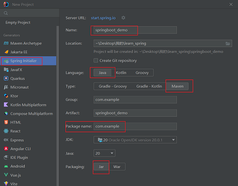

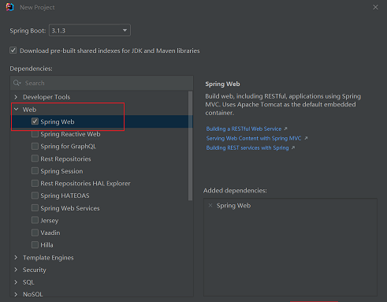

**②开发控制器类** 

controller/BookController.java

```
package com.example.controller;

import org.springframework.web.bind.annotation.GetMapping;
import org.springframework.web.bind.annotation.PathVariable;
import org.springframework.web.bind.annotation.RequestMapping;
import org.springframework.web.bind.annotation.RestController;

@RestController
@RequestMapping("/books")
public class BookController {

    @GetMapping("/{id}")
    public String getById(@PathVariable Integer id) {
        System.out.println("id ==> " + id);
        return "hello, spring boot!";
    }
}
```

**③运行自动生成的Application类**

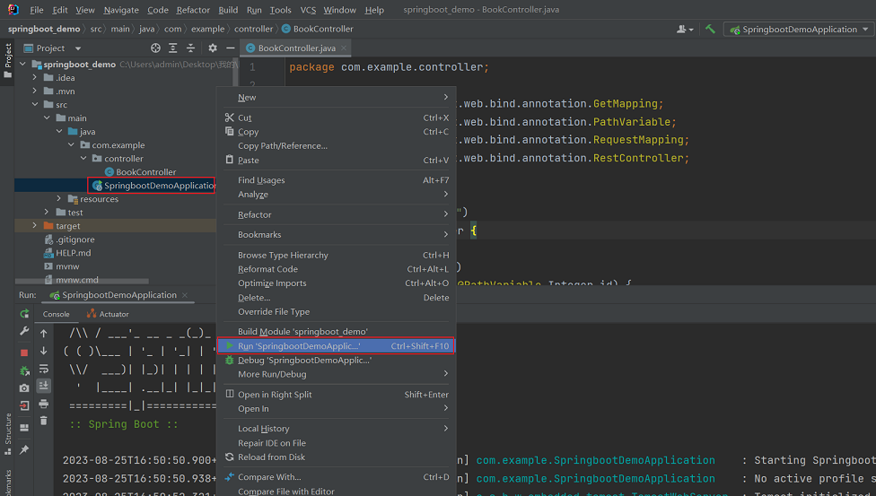

## 2. Spring和SpringBoot程序对比

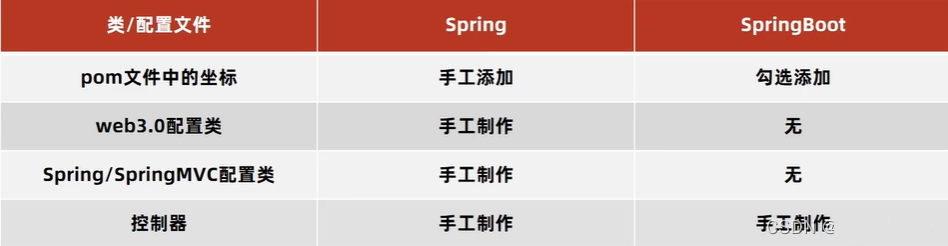

看一下SpringBoot项目的pom.xml

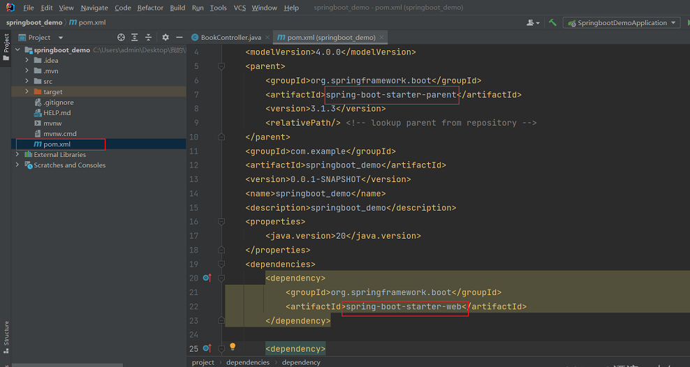

**spring-boot-starter-web**：定义了当前项目所使用的所有项目目标，以达到减少依赖配置的目的。

**spring-boot-starter-parent**：所有SpringBoot项目要继承的项目，定义了若干个坐标版本号。（依赖管理，而非依赖）

SpringBoot的引导类是项目的入口，运行main方法就可以启动项目。

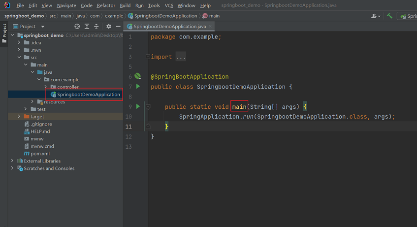

SpringBoot项目内置Tomcat服务器。

如何变更依赖项，比如换个jetty服务器。

pom.xml（可能因为版本问题，需要配置一下`<jakarta-servlet.version>5.0.0</jakarta-servlet.version>`）

```
<properties>
  <java.version>20</java.version>
  <jakarta-servlet.version>5.0.0</jakarta-servlet.version>
</properties>
<dependencies>
  <dependency>
    <groupId>org.springframework.boot</groupId>
    <artifactId>spring-boot-starter-web</artifactId>
    <exclusions>
      <exclusion>
        <groupId>org.springframework.boot</groupId>
        <artifactId>spring-boot-starter-tomcat</artifactId>
      </exclusion>
    </exclusions>
    </dependency>

    <dependency>
      <groupId>org.springframework.boot</groupId>
      <artifactId>spring-boot-starter-jetty</artifactId>
    </dependency>
</dependencies>
```

## 3. 从SpringBoot官网创建工程

[Spring Boot官网](https://spring.io/projects/spring-boot "Spring Boot")

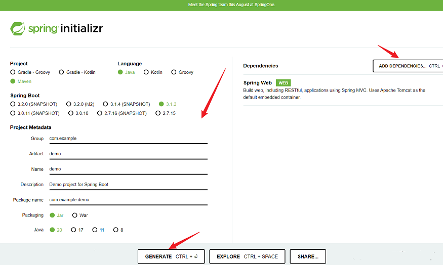

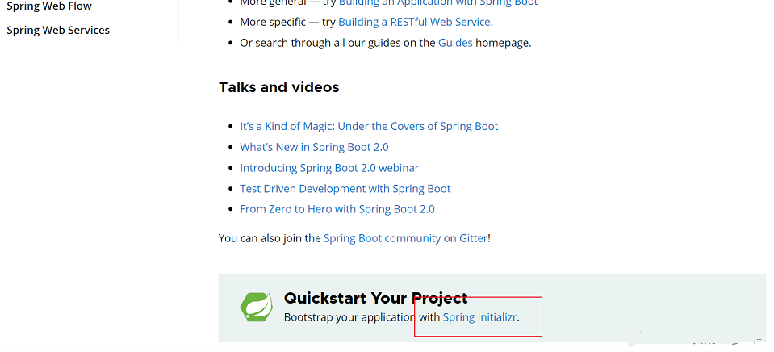

## 4. SpringBoot项目快速启动

使用JAR包，方便前端用户快速启动后台项目。


**具体操作：**

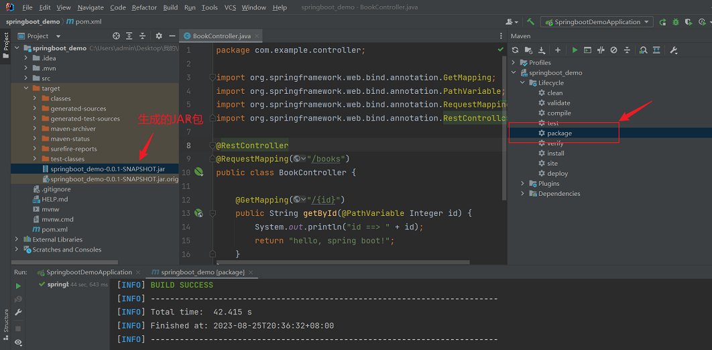

**执行指令：**

```cobol
java -jar springboot_demo-0.0.1-SNAPSHOT.jar
```

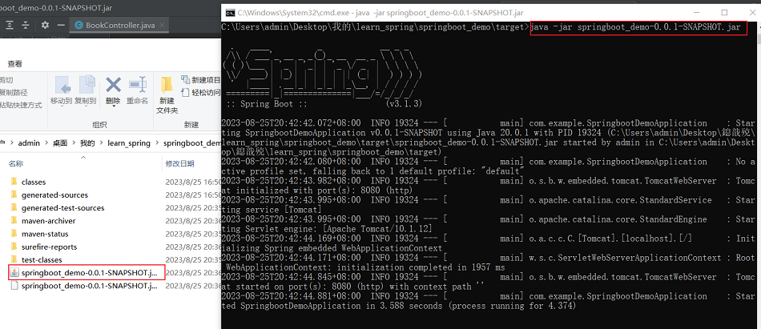

## 5. 配置文件格式（3种）

**例**：修改服务器端口。（3种）

src/main/resources/application.properties

```cobol
server.port=80
```

 src/main/resources/application.yml（**主要用这种**）

```vbscript
server:  port: 80
```

  src/main/resources/application.yaml

```vbscript
server:  port: 80
```

**SpringBoot配置文件加载优先级**：/application.properties > application.yml > application.yaml

## 6. yaml数据格式

yaml，一种数据序列化格式。

优点：容易阅读、以数据为中心，重数据轻格式。

yam文件扩展名：.yml(主流)、.yaml 

**语法规则：**  

- 大小写敏感

- 属性值前面添加空格。（空格和冒号要隔开）  

- \# 表示注释

**数组格式：**

```
enterprise:
  name: abc
  age: 16
  tel: 111111
  subject:
    - Java
    - C
    - C++
```

**yaml数据读取方式（3种）**

application.yml

```
lesson: SpringBoot
 
server:
  port: 80
 
enterprise:
  name: abc
  age: 16
  tel: 111111
  subject:
    - Java
    - C
    - C++
```

**controller/BookController.java 有下面三种写法**

**① @Value（直接读取）**

```
package com.example.controller;
 
import org.springframework.beans.factory.annotation.Value;
import org.springframework.web.bind.annotation.GetMapping;
import org.springframework.web.bind.annotation.PathVariable;
import org.springframework.web.bind.annotation.RequestMapping;
import org.springframework.web.bind.annotation.RestController;
 
@RestController
@RequestMapping("/books")
public class BookController {
 
    @Value("${lesson}")
    private String lesson;
 
    @Value("${server.port}")
    private Integer port;
 
    @Value("${enterprise.subject[0]}")
    private String subject_0;
 
    @GetMapping("/{id}")
    public String getById(@PathVariable Integer id) {
        System.out.println(lesson);
        System.out.println(port);
        System.out.println(subject_0);
        return "hello, spring boot!";
    }
}
```

**② Environmet（封装后读取）**

```
package com.example.controller;
 
import org.springframework.beans.factory.annotation.Autowired;
import org.springframework.core.env.Environment;
import org.springframework.web.bind.annotation.GetMapping;
import org.springframework.web.bind.annotation.PathVariable;
import org.springframework.web.bind.annotation.RequestMapping;
import org.springframework.web.bind.annotation.RestController;
 
@RestController
@RequestMapping("/books")
public class BookController {
    
    @Autowired
    private Environment environment;
 
    @GetMapping("/{id}")
    public String getById(@PathVariable Integer id) {
        System.out.println(environment.getProperty("lesson"));
        System.out.println(environment.getProperty("server.port"));
        System.out.println(environment.getProperty("enterprise.age"));
        System.out.println(environment.getProperty("enterprise.subject[1]"));
        return "hello, spring boot!";
    }
}
```

**③ 实体类封装属性（封装后读取）**

```
package com.example.controller;
 
import com.example.domain.Enterprise;
import org.springframework.beans.factory.annotation.Autowired;
import org.springframework.web.bind.annotation.GetMapping;
import org.springframework.web.bind.annotation.PathVariable;
import org.springframework.web.bind.annotation.RequestMapping;
import org.springframework.web.bind.annotation.RestController;
 
@RestController
@RequestMapping("/books")
public class BookController {
 
    @Autowired
    private Enterprise enterprise;
 
    @GetMapping("/{id}")
    public String getById(@PathVariable Integer id) {
        System.out.println(enterprise);
        return "hello, spring boot!";
    }
}
```

需要额外封装一个类domain/enterprise.java

```
package com.example.domain;
 
import org.springframework.boot.context.properties.ConfigurationProperties;
import org.springframework.stereotype.Component;

import java.util.Arrays;
 
@Component
@ConfigurationProperties(prefix = "enterprise")
public class Enterprise {
    private String name;
    private Integer age;
    private String tel;
    private String[] subject;
 
    public void setName(String name) {
        this.name = name;
    }
 
    public void setAge(Integer age) {
        this.age = age;
    }
 
    public void setTel(String tel) {
        this.tel = tel;
    }
 
    public void setSubject(String[] subject) {
        this.subject = subject;
    }
 
    @Override
    public String toString() {
        return "Enterprise{" +
                "name='" + name + '\'' +
                ", age=" + age +
                ", tel='" + tel + '\'' +
                ", subject=" + Arrays.toString(subject) +
                '}';
    }
}
```

pom.xml也需要额外添加一个依赖

```
<dependency>
  <groupId>org.springframework.boot</groupId>
  <artifactId>spring-boot-configuration-processor</artifactId>
  <optional>true</optional>
</dependency>
```

## 7. 多环境开发

resources/application.xml

```
spring:
  profiles:
    active: pro
 
---
# 开发
spring:
  config:
    activate:
      on-profile: dev
server:
  port: 80
 
---
# 生产
spring:
  config:
    activate:
      on-profile: pro
server:
  port: 81
 
---
# 测试
spring:
  config:
    activate:
      on-profile: test
server:
  port: 82
```

**使用命令行启动多环境**

```
java -jar xxx.jar --spring.profiles.active=test --server.port=88 
```

参数加载的优先顺序可以从官网获得：[Core Features](https://docs.spring.io/spring-boot/docs/current/reference/html/features.html#features.external-config "Core Features")

## 8. Maven与SpringBoot关联操作

在开发中，关于环境配置，应该以Maven为主，SpringBoot为辅。

**①Maven中设置多环境属性**

pom.xml

```
  <profiles>
		<profile>
			<id>dev</id>
			<properties>
				<profile.active>dev</profile.active>
			</properties>
		</profile>
		<profile>
			<id>pro</id>
			<properties>
				<profile.active>pro</profile.active>
			</properties>
			<activation>
				<activeByDefault>true</activeByDefault>
			</activation>
		</profile>
		<profile>
			<id>test</id>
			<properties>
				<profile.active>test</profile.active>
			</properties>
		</profile>
	</profiles>
```

使用插件对资源文件开启对默认占位符的解析

```
<plugin>
  <groupId>org.apache.maven.plugins</groupId>
  <artifactId>maven-resources-plugin</artifactId>
  <version>3.3.1</version>
  <configuration>
    <encoding>UTF-8</encoding>
    <useDefaultDelimiters>true</useDefaultDelimiters>
  </configuration>
</plugin>
```

**②SpringBoot引入Maven属性**

application.yml

```
spring:
  profiles:
    active: ${profile.active}
---
# 开发
spring:
  config:
    activate:
      on-profile: dev
server:
  port: 80
---
# 生产
spring:
  config:
    activate:
      on-profile: pro
server:
  port: 81
---
# 测试
spring:
  config:
    activate:
      on-profile: test
server:
  port: 82
```

**③Maven打包，进行测试**

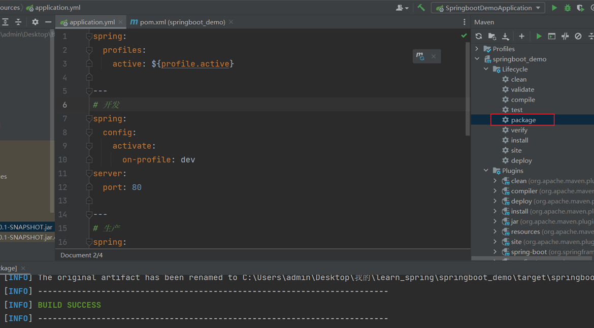

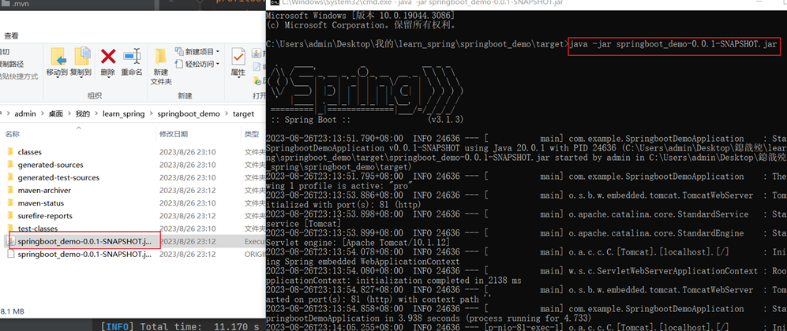

## 9. 配置文件分类

SpringBoot中4级配置文件

- 1级：file:config/application.yml【最高】

- 2级：file:application.yml

- 3级：classpath:config/application.yml

- 4级：classpath:application.yml【最低】

作用：

- 1级与2级留做系统打包后设置通用属性

- 3级与4级用于系统开发阶段设置通用属性

## 10. 整合JUnit

**Spring整合JUnit**

```
@Runwith(SpringJUnit4ClassRunner.class) // 设置运行器
@ContextConfiguration(classes = SpringConfig.class)  // 加载环境
public class UserServiceTest {

  @Autowired 
  private BookService bookService;  // 注入测试对象

  @Test 
  public void testSave(){
    bookService.save(); // 测试功能
  }
}
```

 **SpringBoot整合JUnit**

```
@SpringBootTest
class Springboot07JunitApplicationTests {
  @Autowired
  private BookService bookService;

  @Test
  public void testSave(){
    bookService.save();
  }
}
```

**测试类注解：@SpringBootTest**

作用：设置JUnit加载的SpringBoot启动类

## 11. 整合mybatis

**①使用spring initializr初始化项目的时候，添加依赖。**

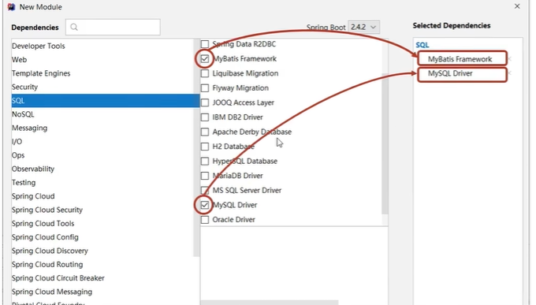

**②设置数据源application.yml**

```
spring:
  datasource:
    driver-class-name: com.mysql.cj.jdbc.Driver
    url: jdbc:mysql://localhost:3306/ssm_db
    username: root
    password: root
```

**注意**：SpringBoot版本低于2.4.3，Mysql驱动版本大于8.0时，需要在url连接串中配置时区。

```cobol
jdbc:mysql://localhost:3306/ssm_db?serverTimezone=UTC
```

**③定义数据层接口与映射配置**

```
@Mapper
public interface UserDao {
    @select("select * from user")
    public List<User> getAll();
}
```

## 12. 基于SpringBoot实现ssm整合

在上文的基于Spring的SSM案例上进行修改。[SSM整合小案例 · 源码](https://github.com/yx-Feng/myblogs/tree/main/code/java/springmvc)

> 1.pom.xml
> 配置起步依赖，必要的资源坐标(druid)
> 
> 2.application.yml
> 设置数据源、端口等
> 
> 3,配置类
> 全部删除
> 
> 4.dao
> 设置@Mapper
> 
> 5.测试类
> 6.页面
> 放置在resources目录下的static目录中

**① 创建项目**

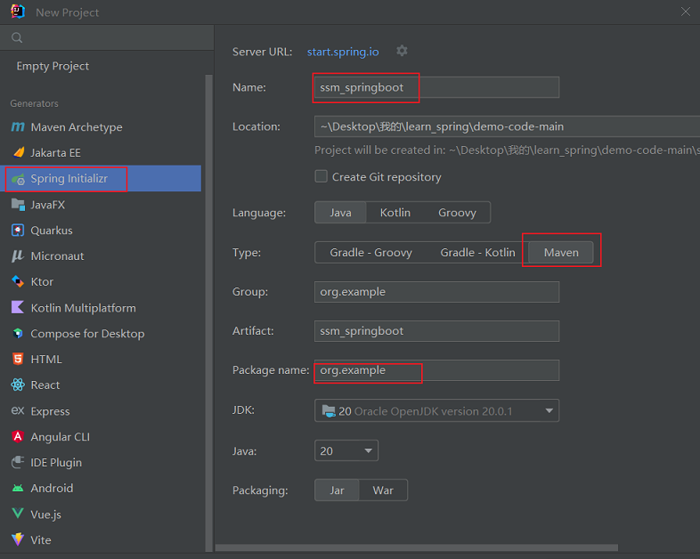

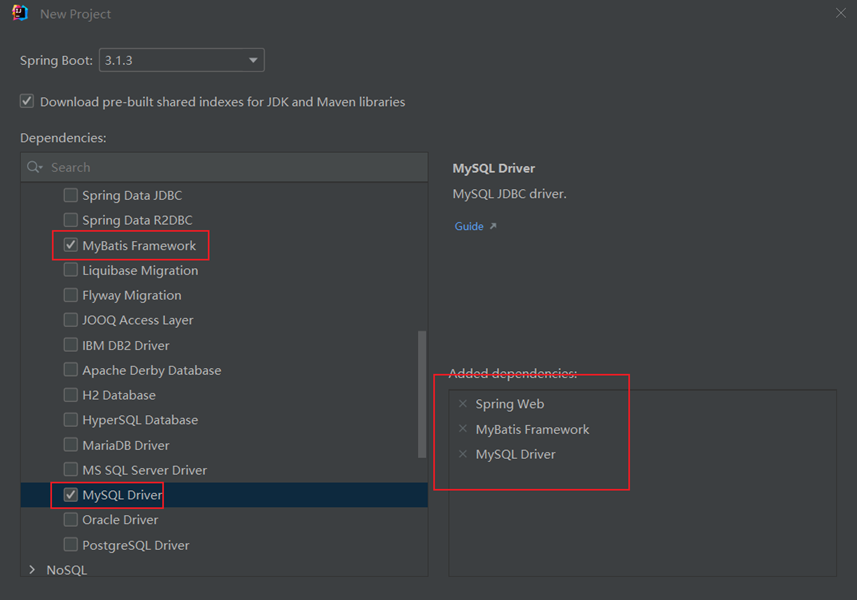

 **② 在pom.xml中添加druid依赖**

```
<dependency>
  <groupId>com.alibaba</groupId>
  <artifactId>druid</artifactId>
  <version>1.2.18</version>
</dependency>
```

**③ 配置application.yml**

```
server:
  port: 80
 
spring:
  datasource:
    type: com.alibaba.druid.pool.DruidDataSource
    driver-class-name: com.mysql.cj.jdbc.Driver
    url: jdbc:mysql://localhost:3306/ssm_db
    username: root
    password: 123456
```

**④ 删除配置类，设置@Mapper。使用@SpringBootTest简化配置类。**

**⑤ 静态资源放在resources目录下的static目录下**

[源码地址](https://github.com/yx-Feng/myblogs/tree/main/code/java/springboot/ssm_springboot)
