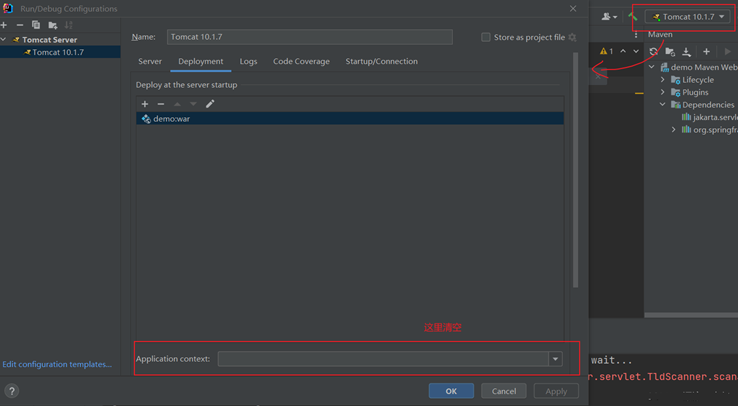

SpringMVC是一种基于Java实现MVC模型的**轻量级web框架**。

SpringMVC技术与Servlet技术功能等同，均属于**web层**（表现层）开发技术，相比于Servlet使用简单，开发便捷。

## 1.入门案例

**（1）使用Maven创建web项目，新建源码目录**


**（2）在pom.xml中导入依赖jakarta.servlet-api、spring-webmvc**

**（3）在IDEA中配置Tomcat**

首先去官网下载Tomcat10安装包。


修改Maven目录下的settings.xml文件。我的在D:\apache-maven-3.8.6\conf\settings.xml。

在`<profile></profile>`中间添加如下内容，指定JDK版本。

```
<id>jdk-19</id>  
<activation>  
   <activeByDefault>true</activeByDefault>  
   <jdk>19</jdk>  
</activation>
<properties>
   <project.build.sourceEncoding>UTF-8</project.build.sourceEncoding>
   <maven.compiler.source>19</maven.compiler.source>  
   <maven.compiler.target>19</maven.compiler.target> 
   <maven.compiler.compilerVersion>19</maven.compiler.compilerVersion> 
</properties>
```

**（4）创建控制器类**

src/main/java/org/example/controller/UserController.java

```
package org.example.controller;

import org.springframework.stereotype.Controller;
import org.springframework.web.bind.annotation.RequestMapping;
import org.springframework.web.bind.annotation.ResponseBody;

@Controller
public class UserController {
    // 设置当前操作的访问路径
    @RequestMapping("/save")
    // 设置当前操作的返回值类型
    @ResponseBody
    public String save() {
        System.out.println("user save...");
        return "{'module':'springmvc'}";
    }
}
```

**（5）初始化SpringMVC环境，设定SpringMVC加载对应的bean**

src/main/java/org/example/config/SpringMvcConfig.java

```
package org.example.config;

import org.springframework.context.annotation.ComponentScan;
import org.springframework.context.annotation.Configuration;

@Configuration
@ComponentScan("org.example.controller")
public class SpringMvcConfig {
}
```

**（6）初始化Servlet容器，加载SpringMVC环境，设置处理的请求**

src/main/java/org/example/config/ServletContainerConfig.java

```
package org.example.config;

import org.springframework.web.context.WebApplicationContext;
import org.springframework.web.context.support.AnnotationConfigWebApplicationContext;
import org.springframework.web.servlet.support.AbstractDispatcherServletInitializer;

public class ServletContainerConfig extends AbstractDispatcherServletInitializer {

    // 加载springMVC容器配置
    @Override
    protected WebApplicationContext createServletApplicationContext() {
        AnnotationConfigWebApplicationContext ctx = new AnnotationConfigWebApplicationContext();
        ctx.register(SpringMvcConfig.class);
        return ctx;
    }

    // 加载spring容器配置
    @Override
    protected WebApplicationContext createRootApplicationContext() {
        return null;
    }

    // 设置哪些请求归属springMVC处理
    @Override
    protected String[] getServletMappings() {
        return new String[]{"/"};
    }
}
```


**Tomcat控制台输出中文乱码解决：**

修改tomcat目录下的logging.properties文件，我的在D:\apache-tomcat-10.1.7\conf\logging.properties。

找到java.util.logging.ConsoleHandler.encoding = UTF-8改为：

```
java.util.logging.ConsoleHandler.encoding = GBK
```

## 2. 入门案例工作流程分析

**启动服务器初始化过程：**

①服务器启动，执行了ServletContainerConfig类，初始化web容器。

②执行createServletApplicationContext方法，创建了WebApplicationContext对象。

③加载SpringMvcConfig配置类。

④执行@ComponentScan，加载对应的bean。

⑤加载UserController，每个@RequestMapping的名称对应一个具体的方法。

⑥执行getServletMappings方法，规定所有的请求都通过SpringMVC


**单次请求过程**：

①web容器发现所有的请求都经过SpringMVC，将请求交给SpringMVC处理。

②解析请求路径/save，执行对应的方法save()

③检测到有@ResponseBody直接将save()方法的返回值作为响应体返回给请求方。

## 3. bean加载控制

**因为功能不同，如何避免Spring错误地加载到SpringMVC的bean？**

上面的入门案例只有controller目录，假设现在有了dao目录和service目录的内容，加载Spring配置文件的时候，需要精准扫描bean。

src/main/java/org/example/config/SpringConfig.java

```
package org.example.config;

import org.springframework.context.annotation.ComponentScan;
import org.springframework.context.annotation.Configuration;

@Configuration
@ComponentScan({"org.example.dao", "org.example.service"})
public class SpringConfig {
}
```

**Servlet容器配置也要改变**

src/main/java/org/example/config/ServletContainerConfig.java

```
package org.example.config;

import org.springframework.web.context.WebApplicationContext;
import org.springframework.web.context.support.AnnotationConfigWebApplicationContext;
import org.springframework.web.servlet.support.AbstractDispatcherServletInitializer;

public class ServletContainerConfig extends AbstractDispatcherServletInitializer {

    // 加载springMVC容器配置
    @Override
    protected WebApplicationContext createServletApplicationContext() {
        AnnotationConfigWebApplicationContext ctx = new AnnotationConfigWebApplicationContext();
        ctx.register(SpringMvcConfig.class);
        return ctx;
    }

    // 加载spring容器配置
    @Override
    protected WebApplicationContext createRootApplicationContext() {
        AnnotationConfigWebApplicationContext ctx = new AnnotationConfigWebApplicationContext();
        ctx.register(SpringConfig.class);
        return ctx;
    }

    // 设置哪些请求归属springMVC处理
    @Override
    protected String[] getServletMappings() {
        return new String[]{"/"};
    }
}
```

**简化版本**

```
package org.example.config;
import org.springframework.web.servlet.support.AbstractAnnotationConfigDispatcherServletInitializer;

public class ServletContainerConfig extends AbstractAnnotationConfigDispatcherServletInitializer {

    @Override
    protected Class<?>[] getRootConfigClasses() {
        return new Class[]{SpringConfig.class};
    }

    @Override
    protected Class<?>[] getServletConfigClasses() {
        return new Class[]{SpringMvcConfig.class};
    }

    @Override
    protected String[] getServletMappings() {
        return new String[]{"/"};
    }
}
```

## 4. 请求与响应

### 4.1 请求映射路径

在类上面统一设置 `@RequestMapping` 注解，统一设置访问路径前缀。  

在上文案例的基础上进行修改。

src/main/java/org/example/controller/UserController.java

```
package org.example.controller;

import org.springframework.stereotype.Controller;
import org.springframework.web.bind.annotation.RequestMapping;
import org.springframework.web.bind.annotation.ResponseBody;

@Controller
@RequestMapping("/user")
public class UserController {
    // 设置当前操作的访问路径
    @RequestMapping("/save")
    // 设置当前操作的返回值类型
    @ResponseBody
    public String save() {
        System.out.println("user save...");
        return "{'module':'springmvc'}";
    }

    @RequestMapping("/delete")
    // 设置当前操作的返回值类型
    @ResponseBody
    public String delete() {
        System.out.println("user delete...");
        return "{'module':'user delete'}";
    }
}
```

### 4.2 普通请求参数的传递

src/main/java/org/example/controller/UserController.java

```
package org.example.controller;

import org.springframework.stereotype.Controller;
import org.springframework.web.bind.annotation.RequestMapping;
import org.springframework.web.bind.annotation.ResponseBody;

@Controller
public class UserController {

    @RequestMapping("/commonParam")
    @ResponseBody
    public String commonParam(String name, int age) {
        System.out.println("参数 =>" + name + age);
        return "{'module':'common param'}";
    }
}
```

**请求参数名和形参名不同，可以使用RequestParam()方法。**

```
public String commonParam(@RequestParam("name") String name, @RequestParam("age") int age){
}
```

**使用postman测试接口。**

**Get请求**


**Post请求**


### 4.3 其它类型的参数的传递

**pojo类、json对象参数传参**

src/main/java/org/example/controller/UserController.java

```
package org.example.controller;

import org.example.domain.User;
import org.springframework.stereotype.Controller;
import org.springframework.web.bind.annotation.RequestBody;
import org.springframework.web.bind.annotation.RequestMapping;
import org.springframework.web.bind.annotation.ResponseBody;

@Controller
public class UserController {

    @RequestMapping("/pojoParam")
    @ResponseBody
    public String pojoParam(User user) {
        System.out.println("pojo类参数 =>" + user);
        return "{'module':'pojo param'}";
    }

    @RequestMapping("/pojoParamForJson")
    @ResponseBody
    public String pojoParamForJson(@RequestBody User user) {
        System.out.println("json对象参数 =>" + user);
        return "{'module':'pojo for json param'}";
    }
}
```

src/main/java/org/example/domain/User.java

```
package org.example.domain;

public class User {
    private String name;
    private int age;

    @Override
    public String toString() {
        return "User{" +
                "name='" + name + '\'' +
                ", age=" + age +
                '}';
    }

    public String getName() {
        return name;
    }

    public void setName(String name) {
        this.name = name;
    }

    public int getAge() {
        return age;
    }

    public void setAge(int age) {
        this.age = age;
    }
}
```

**json对象传参需要在pom.xml中额外导入jackson-databind依赖，并且在配置文件中使用EnableWebMvc注解，用于json数据的自动类型转换。**

src/main/java/org/example/config/SpringMvcConfig.java

```
package org.example.config;

import org.springframework.context.annotation.ComponentScan;
import org.springframework.context.annotation.Configuration;
import org.springframework.web.servlet.config.annotation.EnableWebMvc;

@Configuration
@ComponentScan("org.example.controller")
@EnableWebMvc
public class SpringMvcConfig {
}
```


**日期型参数传递**

src/main/java/org/example/controller/UserController.java

```
package org.example.controller;

import org.springframework.format.annotation.DateTimeFormat;
import org.springframework.stereotype.Controller;
import org.springframework.web.bind.annotation.RequestMapping;
import org.springframework.web.bind.annotation.ResponseBody;

import java.util.Date;

@Controller
public class UserController {

    @RequestMapping("/dateParam")
    @ResponseBody
    public String pojoParam(Date date,
                            @DateTimeFormat(pattern = "yyyy-MM-dd") Date date1,
                            @DateTimeFormat(pattern = "yyyy/MM/dd HH:mm:ss") Date date2) {
        System.out.println("参数date =>" + date);
        System.out.println("参数date1 =>" + date1);
        System.out.println("参数date2 =>" + date2);
        return "{'module':'date param'}";
    }
}
```

### 4.4 响应

**响应页面**、**文本数据**、**POJO对象**

src/main/java/org/example/controller/UserController.java

```
package org.example.controller;

import org.example.domain.User;
import org.springframework.stereotype.Controller;
import org.springframework.web.bind.annotation.RequestMapping;
import org.springframework.web.bind.annotation.ResponseBody;

@Controller
public class UserController {

    @RequestMapping("/toJumpPage")
    public String toJumpPage(){
       System.out.println("跳转页面");
       return "page.jsp";
    }

    @RequestMapping("/toText")
    @ResponseBody
    public String toText(){
        System.out.println("返回文本数据");
        return "response text";
    }

    @RequestMapping("/toJsonPOJO")
    @ResponseBody
    public User toJsonPOJO(){
        System.out.println("返回json对象数据");
        User user = new User();
        user.setAge(16);
        user.setName("lisi");
        return user;
    }
}
```

 src/main/webapp/page.jsp

```
<html>
<body>
<h2>This is page.jsp</h2>
</body>
</html>
```

### 4.5 删除请求url的前缀

请求的url默认要有一个项目名称xxx的前缀，比如：`http://localhost:8080/xxx/commonParam`。

想删掉这个前缀，需要配置一下，如下图：



## 5. REST风格

**REST(Representational State Transfer)**，表现形式转换，其实就是访问资源的url的风格。  

根据REST风格对资源进行访问称为**RESTful**。

| http://localhost/users   | 查询全部用户信息 | GET(查询)     |
| ------------------------ | -------- | ----------- |
| http://localhost/users/1 | 查询指定用户信息 | GET(查询)     |
| http://localhost/users   | 添加用户信息   | POST(新增/保存) |
| http://localhost/users   | 修改用户信息   | PUT(修改/更新)  |
| http://localhost/users   | 删除用户信息   | SELETE(删除)  |

**传统风格**

```
http://localhost/user/getById?id=1
http://localhost/user/saveUser
```

书接上文。就改一下UserController.java文件。 

- **@RequestParam**用于接收url地址传参或表单传参
- **@RequestBody**用于接收json数据
- **@PathVariable**用于接收路径参数

src/main/java/org/example/controller/UserController.java

```
package org.example.controller;
import org.example.domain.User;
import org.springframework.stereotype.Controller;
import org.springframework.web.bind.annotation.*;

@Controller
public class UserController {

    @RequestMapping(value = "/users", method = RequestMethod.POST)
    @ResponseBody
    public String save(@RequestBody User user) {
        System.out.println("user save..." + user);
        return "{'module':'user save'}";
    }

    @RequestMapping(value = "/users/{id}", method = RequestMethod.DELETE)
    @ResponseBody
    public String delete(@PathVariable Integer id) {
        System.out.println("user delete..." + id);
        return "{'module':'user delete'}";
    }

    @RequestMapping(value = "/users", method = RequestMethod.PUT)
    @ResponseBody
    public String update(@RequestBody User user) {
        System.out.println("user update..." + user);
        return "{'module':'user update'}";
    }

    @RequestMapping(value = "/users/{id}", method = RequestMethod.GET)
    @ResponseBody
    public String getById(@PathVariable Integer id) {
        System.out.println("user getById..." + id);
        return "{'module':'user getById'}";
    }

    @RequestMapping(value = "/users", method = RequestMethod.GET)
    @ResponseBody
    public String getAll() {
        System.out.println("user getAll...");
        return "{'module':'user getAll'}";
    }
}
```

**简化版本**

**@RestController**注解等同于 **@Controller** 和 **@ResponseBody** 两个注解组合。

```
package org.example.controller;

import org.example.domain.User;
import org.springframework.web.bind.annotation.*;

@RestController
@RequestMapping("/users")
public class UserController {

    @PostMapping
    public String save(@RequestBody User user) {
        System.out.println("user save..." + user);
        return "{'module':'user save'}";
    }

    @DeleteMapping("/{id}")
    public String delete(@PathVariable Integer id) {
        System.out.println("user delete..." + id);
        return "{'module':'user delete'}";
    }

    @PutMapping
    public String update(@RequestBody User user) {
        System.out.println("user update..." + user);
        return "{'module':'user update'}";
    }

    @GetMapping("/{id}")
    public String getById(@PathVariable Integer id) {
        System.out.println("user getById..." + id);
        return "{'module':'user getById'}";
    }

    @GetMapping
    public String getAll() {
        System.out.println("user getAll...");
        return "{'module':'user getAll'}";
    }
}
```

## 6. SSM整合案例

[SSM整合小案例 · 源码](https://github.com/yx-Feng/myblogs/tree/main/code/java/springmvc)

### 6.1 整合配置(config目录)

- Spring - SpringConfig
- MyBatis - MyBatisConfig、JdbcConfig、jdbc.properties
- SpringMVC - ServletConfig、SpringMvcConfig

### 6.2 功能模块

**模型（domain目录）**：Book.java  

**数据层（dao目录）**：BookDao.java  

**业务层（service目录）**：BookService.java、BookServiceImpl.java(service/impl目录)

**业务层接口测试**：BookServiceTest.java  

**表现层接口测试**：postman

在**pom.xml**中引入spring-webmvc、spring-jdbc、spring-test、mybatis、mybatis-spring、mysql-connector-java、druid、junit、jakarta.servlet-api、jackson-databind。

**数据库表的设计**


### 6.3 统一前端接收数据的格式

查询成功/失败，特殊消息存到msg中

```
{
    "code":xxx,
    "data":{}或[{},{}...]或null,
    "msg":"xxx",
}
```

针对以上设计，设置数据返回类 `controller/Result.java` 和响应编码类` controller/Code.java`。

### 6.4 异常处理

**各个层级均出现可能异常，异常处理代码书写在哪一层？  
—— 所有的异常均抛出到表现层进行处理。**

**项目异常分类**

**业务异常（BusinessException）**：规范的用户行为产生的异常、不规范的用户行为产生的异常  

**系统异常（SystemException）**：项目运行过程中可预计且无法避免的异常  

**其他异常（Exception）**：编程人员未预期到的异常

**异常处理器**：集中、统一地处理项目中出现的异常。

**①自定义系统级异常和业务级异常**  
exception/SystemException.java和exception/BusinessException.java

**②自定义异常编码**  
controller/Code.java

**③拦截处理异常**  
controller/ProjectExceptionAdvice.java

### 6.5 前后台协调

前端文件放在webapp目录下。  
放行css,js,pages登资源的访问权限：config/SpringMvcSupport.java。

**完成增删改查业务。**


## 7. 拦截器

### 7.1 简介

拦截器（Interceptor）是一种动态拦截方法调用的机制。

**作用：**

- 在指定的方法调用前后执行预先设定后的代码。
- 阻止原始方法的执行。

**拦截器与过滤器的区别**

归属不同：Filter属于Servlet技术，Interceptor属于SpringMVC技术  
拦截内容不同：Filter对所有访问进行增强，Interceptor仅针对SpringMVC的访问进行增强。

### 7.2 入门案例

**制作拦截器功能类**  
src/main/java/org/example/controller/interceptor/ProjectInterceptor.java

```
package org.example.controller.interceptor;

import jakarta.servlet.http.HttpServletRequest;
import jakarta.servlet.http.HttpServletResponse;
import org.springframework.stereotype.Component;
import org.springframework.web.servlet.HandlerInterceptor;
import org.springframework.web.servlet.ModelAndView;

@Component
public class ProjectInterceptor implements HandlerInterceptor {
    @Override
    public boolean preHandle(HttpServletRequest request, HttpServletResponse response, Object handler) throws Exception {
        System.out.println("preHandle...");
        return true;
        // return false; // 用来终止原始操作
    }

    @Override
    public void postHandle(HttpServletRequest request, HttpServletResponse response, Object handler, ModelAndView modelAndView) throws Exception {
        System.out.println("postHandle...");
    }

    @Override
    public void afterCompletion(HttpServletRequest request, HttpServletResponse response, Object handler, Exception ex) throws Exception {
        System.out.println("afterCompletion...");
    }
}
```

**配置拦截器的执行位置**

src/main/java/org/example/config/SpringMvcConfig.java

```
package org.example.config;

import org.example.controller.interceptor.ProjectInterceptor;
import org.springframework.beans.factory.annotation.Autowired;
import org.springframework.context.annotation.ComponentScan;
import org.springframework.context.annotation.Configuration;
import org.springframework.web.servlet.config.annotation.EnableWebMvc;
import org.springframework.web.servlet.config.annotation.InterceptorRegistry;
import org.springframework.web.servlet.config.annotation.WebMvcConfigurer;

@Configuration
@ComponentScan({"org.example.controller"})
@EnableWebMvc
public class SpringMvcConfig implements WebMvcConfigurer {
    @Autowired
    private ProjectInterceptor projectInterceptor;

    // 配置拦截器
    @Override
    public void addInterceptors(InterceptorRegistry registry) {
        registry.addInterceptor(projectInterceptor).addPathPatterns("/books", "/books/*");
    }
}
```

src/main/java/org/example/config/ServletConfig.java

```
package org.example.config;

import org.springframework.web.servlet.support.AbstractAnnotationConfigDispatcherServletInitializer;

public class ServletConfig extends AbstractAnnotationConfigDispatcherServletInitializer {

    @Override
    protected Class<?>[] getRootConfigClasses() {
        return new Class[0];
    }

    @Override
    protected Class<?>[] getServletConfigClasses() {
        return new Class[]{SpringMvcConfig.class};
    }

    @Override
    protected String[] getServletMappings() {
        return new String[]{"/"};
    }
}
```

src/main/java/org/example/controller/BookController.java

```
package org.example.controller;

import org.example.domain.Book;
import org.springframework.web.bind.annotation.*;

@RestController
@RequestMapping("/books")
public class BookController {

    @PostMapping
    public String save(@RequestBody Book book) {
        System.out.println("book save..." + book);
        return "{'module':'book save'}";
    }

    @PutMapping
    public String update(@RequestBody Book book) {
        System.out.println("book save..." + book);
        return "{'module':'book update'}";
    }

    @DeleteMapping("/{id}")
    public String delete(@PathVariable Integer id) {
        System.out.println("book save..." + id);
        return "{'module':'book delete'}";
    }

    @GetMapping("/{id}")
    public String getById(@PathVariable Integer id) {
        System.out.println("book getById..." + id);
        return "{'module':'book getById'}";
    }

    @GetMapping
    public String getAll() {
        System.out.println("book getAll...");
        return "{'module':'book getAll'}";
    }
}
```

src/main/java/org/example/domain/Book.java

```
package org.example.domain;

public class Book {
    private Integer id;
    private String type;
    private String name;
    private String description;

    @Override
    public String toString() {
        return "Book{" +
                "id=" + id +
                ", type='" + type + '\'' +
                ", name='" + name + '\'' +
                ", description='" + description + '\'' +
                '}';
    }

    public Integer getId() {
        return id;
    }

    public void setId(Integer id) {
        this.id = id;
    }

    public String getType() {
        return type;
    }

    public void setType(String type) {
        this.type = type;
    }

    public String getName() {
        return name;
    }

    public void setName(String name) {
        this.name = name;
    }

    public String getDescription() {
        return description;
    }

    public void setDescription(String description) {
        this.description = description;
    }
}
```

配置Tomcat，并运行。发送Post请求：http://localhost:8080/books。控制台输出如下：


### 7.3 拦截器的执行流程


### 7.4 拦截器链的运行顺序


