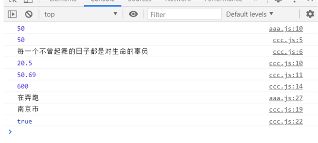

## 1.let、var和const

let相较于var具有块级作用域。

在ES6开发中，建议优先使用const，只有需要改变某个标识符的时候才用let。

const修饰的标识符为常量，使用的时候必须赋初值，之后不可以再赋值，我们可以利用const来保证数据的安全性 。

常量的含义是指向的对象不能修改，但是可以改变对象内部的属性。

```
const obj = {
    name: 'Bill',
    age: 45,
}
obj.name = 'kobe';    //这是可以改变的
```

## 2.对象字面量的增强写法

**对象字面量**：包围在一个花括号 ”{}“ 中的0个或多个键值对。

```
<script>
  // 1.属性的增强写法
  const name = 'Bill Gates';
  const age = 18;
  const height = 1.88;
  // ES5的写法
  // const obj = {
  //   name: name,
  //   age: age,
  //   height: height,
  // }
  // ES6增强写法
  const obj = {
    name,
    age,
    height,
  }//给obj添加name、age、height三个属性，值从同名变量找
  console.log(obj);

  // 2.函数的增强写法
  //ES5的写法
  // const obj2 = {
  //   run: function (){
  //   },
  //   eat: function () { 
  //   }
  // }
  //ES6的增强写法
  const obj2 = {
    run(){
    },
    eat(){
    }
  }
</script>
</body>
</html>
```

## 3.filter、map、reduce

**（1）filter**

函数里面要传一个**回调函数**，函数必须返回一个boolean值。

当返回true时，函数内部会自动将这次回调的元素加入到新数组中，返回false的时候，就会过滤掉这次的元素。

**（2）map**  

如果你想对数组里的所有元素进行一个变换，就可以用这个函数，也是传一个回调函数作为参数  

**（3）reduce**  

可以对数组的所有元素做一个汇总  

reduce(参数1，参数2）  

```
reduce(function (preValue,n) {
    return preValue + n
}, 0)
```

参数1是一个回调函数，preValue是回调函数上一次的返回值，参数2是preValue的初始值

```
<script>
  const app = new Vue({
    el:'#app',
    data:{
    }
  })
  //1.filter函数的使用
  const nums = [10,20,222,111,333,60];
  let newNums = nums.filter(function (n) {
    return n < 100        //筛选小于100的数
  })
  console.log(newNums);

  //2.map函数的使用
  let newNums2 = newNums.map(function (n) {
    return n*2          //对筛选完的数乘2
   })
  console.log(newNums2);

  //3.reduce函数的使用
  let total = newNums2.reduce(function (preValue, n) {
    return preValue + n   //汇总
  },0)
  console.log(total);

  //三个函数合起来写，体现了函数编程思想
  let total2 = nums.filter(function (n) {
    return n<100
  }).map(function (n) {
    return n*2
  }).reduce(function (preValue,n) {
    return preValue+n
  },0)
  console.log(total2)

  //使用箭头函数，更简洁
  let total3 = nums.filter(n => n<100).map(n => n*2).reduce((preValue,n) => preValue+n)
  console.log(total3)
</script>
</body>
</html>
```

## 4.箭头函数的使用和this指向

定义函数的方式：  

**（1）用function**  

```
const aaa = function() {}
```

**（2）用对象字面量**  

```
const obj = {
  bbb: function() {},
  bbb() {}
}
```

**（3）ES6里面的箭头函数**  

```
const ccc = (参数列表) => {}
```

**没参数**：`const obj = () => {}  `

**有参数**：  

有一个参数: `const product = num => { return num * num }  `

有两个参数: `const sum = (num1,num2) => {return num1 + num2}`  

当函数体中只有一行代码时，可以这样简写（不用写return）：`const sum = (num1,num2) => num1 + num2 `

```
<!DOCTYPE html>
<html lang="en">
<head>
  <meta charset="utf-8">
  <title>Title</title>
</head>
<body>
<script>
  setTimeout(function () {
    console.log(this)   //window
  }, 1000)
  setTimeout(() => {
    console.log(this)   //window
  }, 1000)

  const obj = {
    aaa(){
      setTimeout(function () {
        console.log(this) //window
      }, 1000)
      setTimeout(() => {
        console.log(this) //obj
      }, 1000)
    },
    bbb(){
      setTimeout(function () {
        setTimeout(function () {
          console.log(this)   //window
        }, 1000)
        setTimeout(() => {
          console.log(this)   //window
        }, 1000)
      }, 1000)

      setTimeout(() => {
        setTimeout(function () {
          console.log(this)   //window
        }, 1000)    
        setTimeout(() => {
          console.log(this)   //obj
        }, 1000)
      }, 1000)
    }
  }
  obj.aaa()
  obj.bbb()
</script>
</body>
</html>
```

## 5.Promise

promise是ES6中的一个重要特性，是异步编程的一种解决方案。

**什么时候我们会处理异步事件？**

一种常见的场景：网络请求

我们封装一个网络请求的函数，因为不能立即拿到结果，所以不能像简单的3+4=7一样将结果返回。

所以往往我们会传入另外一个函数，在数据请求成功时，将数据通过传入的函数回调回去。

如果网络请求非常复杂时，会出现**回调地狱**。

**Promise基本语法**

我们用一个定时器来模拟异步事件。异步操作之后会有三种状态。

- pending: 等待状态，比如正在进行网络请求或定时器没有到时间

- fulfill：满足状态，当我们主动回调了resolve时，就处于该状态，并且会回调.then()

- reject：拒绝状态，当我们主动回调了reject时，就处于该状态，并且会回调.catch()

```
  new Promise((resolve, reject) => {
    setTimeout(() => {
      resolve('Hello World'); // 成功的时候调用resolve
      // reject('Error Message'); // 失败的时候调用reject
    }, 1000)
  }).then(data => {
    console.log(data)
  }).catch(err => {
    console.log(err)
  })
```

**Promise的链式调用**

```
  new Promise((resolve, reject) => {
    setTimeout(() => {
      resolve('aaa')
    }, 1000)
  }).then(res => {
    console.log(res);
    return Promise.resolve(res + '111');
  }).then(res => {
    console.log(res);
    return Promise.resolve(res + '222');
    // return Promise.reject('error message');
  }).then(res => {
    console.log(res);
  }).catch(err => {
    console.log(err);
  })
```

进一步简化

```
  new Promise((resolve, reject) => {
    setTimeout(() => {
      resolve('aaa')
    }, 1000)
  }).then(res => {
    console.log(res);
    return res + '111';
  }).then(res => {
    console.log(res);
    return res + '222';
    //throw 'error message';
  }).then(res => {
    console.log(res);
  }).catch(err => {
    console.log(err);
  })
```

## 6.模块化的使用

三个文件

index.html

aaa.js，定义一些变量和函数并导出

ccc.js，导入aaa.js里的一些变量和函数

**index.html**

```
<!DOCTYPE html>
<html lang="en">
<head>
  <meta charset="UTF-8">
  <title>Title</title>
</head>
<body>
<!--type属性为module，表示把它当成一个模块来处理-->
<script src="aaa.js" type="module"></script>
<script src="ccc.js" type="module"></script>
</body>
</html>
```

**aaa.js**

```
let name="小明"
let age = 20
let flag = true

function sum(sum1,sum2){
  return sum1+sum2
}

if(flag){
  console.log(sum(20,30))
}

//第一种导出
export {
  flag, sum
}

//第二种导出
export var width=20.5
export var height=50.69

//第三种，导入函数或类
function product(num1,num2){
  return num1*num2
}
class person{
  run(){
    console.log("在奔跑")
  }
}

//可以定义的时候导出，也可以定义完了像这样一起导出
export {product,person}

//export default
var address="南京市"
export default address
```

**ccc.js**

```
// 第一种导入
import {flag,sum} from "./aaa.js"

if(flag){
  console.log(sum(20,30))
  console.log("每一个不曾起舞的日子都是对生命的辜负")
}

// 第二种导入
import {width,height} from "./aaa.js"
console.log(width)
console.log(height)

// 第三种导入function/class
import {product,person} from "./aaa.js"
console.log(product(20,30))
const p = new person()
p.run()

//导入default模块，这个时候可以自己命名传过来的某个功能（但是一个模块里只能有一个，多了导入的时候，就不知道导入哪个了）
import addr from "./aaa.js"
console.log(addr)

//全部一起导入
import * as all from "./aaa.js"
console.log(all.flag)
```


