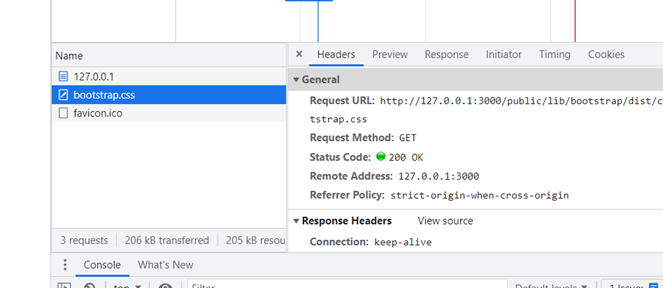
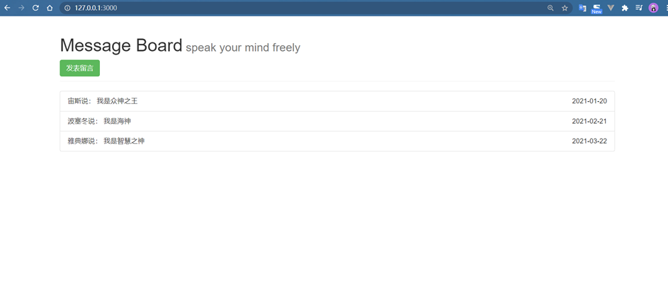
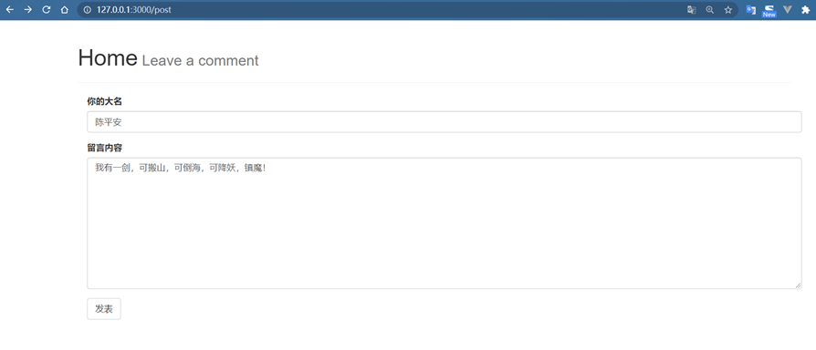
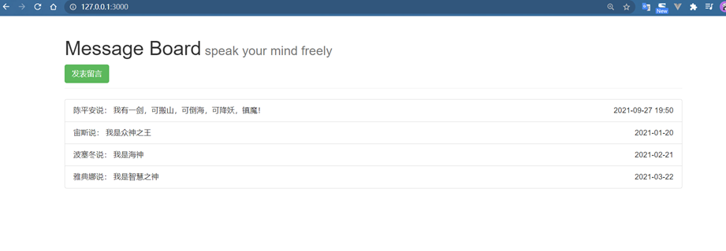

## 1. Node.js简介

**是什么？**

官网解释：Node.js is a JavaScript runtime built on Chrome's V8 JavaScript engine.

node不是一门语言，不是库，不是框架 => **是一个JavaScript运行时环境（runtime）**

以前只有浏览器能解析执行js，现在node.js也可以，node.js为 js 提供一些服务器级别的操作API，例如文件读写、网络通信、http服务器。

node.js构建在chrome的V8引擎之上。

（Google Chrome的V8引擎是目前公认运行js最快的，node.js的作者Ryan Dahl把Google Chrome的V8引擎移植出来，开发了node.js）

**能做什么？**

- web服务器后台

- 命令行工具：npm，hexo等都是用node写的（git是用C语言写的）

**npm(node package manager)** => 世界上最大的开源库生态系统，绝大多数的js相关的包都存放在了npm上，一条命令就可以下载，很方便

- [npm官网](https://www.npmjs.com/ "npm官网")能搜索到的包，都可以用npm指令下载

- 安装了node会自动安装npm

- 常用指令
  
  - npm init  
  
  - npm init -y  可以跳过向导，快速生成  
  
  - npm install以一次性把dependencies选项中的依赖项全部安装，简写：npm i  
  
  - npm insatll 包名，简写：npm i  
  
  - npm install --save，简写：npm i -S  
  
  - npm uninstall 包名，简写：npm un 包名（只删除包，package.json中依然保留信息）  
  
  - npm uninstall --save 包名，简写：npm un -S 包名（删除包的同时会把依赖信息也删掉）  
  
  - npm help，查看使用帮助  
  
  - npm 命令 --help，查看指定命令的使用帮助，比如去查uninstall的简写：npm uninstall --help

- npm存储包文件的服务器再国外，有时候速度很慢
  
  - `npm config set registry http://registry.npm.taobao.org`
  
  - 查看npm配置信息：npm config list，这样配置以后，以后用npm install下载会默认走淘宝的服务器

**案例**

创建 helloworld.js

```
var foo = 'helle nodejs'
console.log(foo)
```

打开终端，执行：ndoe helloworld.js

## 2. 文件操作

浏览器中的js无文件操作能力，但是node中的js有。

**读文件**

```
// 1. 使用require方法加载fs核心模块
var fs = require('fs')
// 2. 读取文件
fs.readFile('./data/hello.txt',function(error, data) {
    console.log(data.toString())
})
```

不加toString()显示的是16进制的数据。

- 第一个参数：要读取的文件路径

- 第二个参数：是一个回调函数 
  
  - 读取成功  => error = null, data = 数据
  
  - 读取失败  => error = 错误对象，data = null

**写文件**

```
var fs = require('fs')

fs.writeFile('./data/poem.txt', '到乡翻似烂柯人', function (err) {
    if(error) {
        console.log('写入失败')
    } else {
        console.log('写入成功')
    }
})
```

文件写入成功，erro=null

文件写入错误，error就是错误对象

## 3. 简单的http服务

我们可以用node构建一个web服务器，在node中专门提供了一个核心模块：http。

```
//1. 加载http核心模块
var http = require('http')

//2. 创建一个Server实例
var server = http.createServer()

//3. 当客户端请求过来，就会自动触发服务器的request请求事件，然后执行第二个参数：回调处理函数
//request 请求对象，用来获取客户端的一些请求信息，例如请求路径
//response 响应对象，用来给客户端发送响应信息
server.on('request', function(request, response) {
    console.log('收到客户端情求了，请求路径是：' + request.url)

    // reponse 对象有一个方法： write ,可以用来给客户端发送响应数据
    // write 可以使用多次， 但是最后一定要用end来结束响应，否则客户端会一直等待
    // request.url获得的是端口号之后的那一部分路径
    var url = request.url
    if(url === '/') {
        response.end('This is index page')
    } else if(url === '/profile') {
        response.end('This is profile')
    } else {
        response.end('404 not found')
    }
})

//4.绑定端口号，启动服务器
server.listen(3000, function() {
    console.log('服务器启动成功，可通过http://127.0.0.1:3000来进行访问')
})
```

如果我的响应数据是一个对象，要转为字符串 `response.end(JSON.stringify(products))`。

```
var products = [
        {
            name: '苹果',
            price: 40
        },
        {
            name: '梨',
            price: 20
        },
        {
            name: '西瓜',
            price: 30
        },
    ]
```

**中文乱码问题**

服务器默认发送的内容是utf-8编码的，但浏览器默认按照当前操作系统的默认编码进行解析，中文操作系统默认是gbk

=> 加一行 `res.setHeader('Content-Type', 'text/plain; charset=utf-8')`

**传文件**

```
var http = require('http')
var fs = require('fs')

var server = http.createServer()

server.on('request', function(req,res) {
    var url = req.url

    if(url == '/') {
        fs.readFile('./resource/index.html', function(err, data) {
            if(err) {
                res.setHeader('Content-Type', 'text/plain; charset=utf-8')
                res.end('文件读取失败，请稍后重试！')
            } else {
                res.setHeader('Content-Type', 'text/html; charset=utf-8')
                res.end(data)
            }
        })
    }
})

server.listen(5000, function() {
    console.log('服务器启动成功，可通过http://127.0.0.1:5000来进行访问')
})
```

**传图片**

改一下Content-Type，而且图片就不需要编码了 `res.setHeader('Content-Type', 'image/jpeg')`

**ip地址和端口号的概念**

IP地址用来定位计算机，端口号用来定位具体的应用程序。（端口的范围值 0-65536）

## 4. 模块系统

Nodejs为JavaScript提供了很多服务器级别的API，这些API绝大多数都被包装到了一个具名的核心模块中了

**例如**：文件操作的fs模块、http服务构建的http模块、path路径操作模块、os操作系统信息模块...

如果你要用，就需要通过**require**的方式来导入

**核心模块**

```
var os = require('os')
var path = require('path') 

// 获取当前机器的CPU信息
console.log(os.cpus())
// memory内存
console.log(os.totalmem())
// extname-extension name扩展名
console.log(path.extname('d:/python_code/1/main.py'))
```

**自己编写的文件模块**

a.js

```
var res = require('./b.js')

console.log(res.foo)
console.log(res.add(10, 30))
```

b.js

```
var foo = '追忆似水年华'

exports.foo = '追忆似水年华'    //这里导出的foo和上面的foo不是同一个变量
exports.add = function (x, y) {
    return x + y
}
```

## 5. 使用模板引擎

1.安装  npm install art-template

2.用require方法加载

3.查文档，使用模板引擎的API

模板引擎不关心你的字符串内容，只关心自己能认识的模板标记语法，例如 {{ }}，该语法被称之为mustache语法(八字胡语法)

```
var template = require('art-template')
var fs = require('fs')

fs.readFile('./tpl.html',function(err,data) {
  if(err) {
      return console.log('读取文件失败！')
  }

  // 模板引擎的render方法需要接收字符串
  // 默认读取到的data是二进制
  var ret = template.render(data.toString(), {
      title: 'Template',
    name: 'Jack',
    age: 18,
    province: '北京市',
    hobbies: [
    '写代码',
    '看动漫',
    '听歌',
    ]
  })

  console.log(ret)
})
```

**tpl.html**

```
<!DOCTYPE html>
<html lang="en">
<head>
  <meta charset="utf-8">
  <title>{{ title }}</title>
</head>
<body>
<p>大家好，我叫：{{ name }}</p>
<p>今年{{ age }}岁了</p>
<p>我来自{{ province }}</p>
<p>我喜欢：{{each hobbies}} {{ $value }} {{/each}}</p>
</body>
</html>
```

## 6. 服务端渲染和客户端渲染

**客户端渲染过程**

1.浏览器发出请求，收到服务器响应的html页面字符串(含模板引擎)

2.浏览器从上到下依次解析该页面

3.在解析过程中发现ajax异步请求，则再次发起新的请求，请求获得数据

4.用服务器的响应结果来渲染模板引擎

**服务端渲染过程**

服务端在将页面发给客户端之前，已经将页面渲染处理过了

**小结**

①服务端渲染的数据可以被爬虫抓取到，而客户端渲染，因为它的数据都是异步加载的，所以难以被爬虫抓取

②通常，网站都是服务端渲染和客户端渲染相结合的

例如，京东的商品列表就采用服务端渲染，目的为了SEO(Search Engine Optimization)搜索引擎优化，用户用搜索引擎可以搜索到; 而商品评论列表，无需SEO优化，并且异步获取评论数据可以提高用户体验，因而采用客户端渲染。

## 7. 处理网站中的静态资源

为了让目录结构保持统一清晰，我们约定，将所有的html文件都放在**views文件夹**中

浏览器在收到HTML响应内容之后，就要开始从上到下一次解析  

当在解析的过程中，如果发现link、script、img、iframe、video、audio等带有src或href(link)属性标签的时候(具有外链资源)，浏览器就会自动对这些资源**发起新的请求**。

为了方便统一处理这些**静态资源**，我们把所有静态资源都放在**public文件夹**中。

从下图可知，浏览器对静态资源bootstrap.css发起了新的请求。



## 8. 留言本案例（node.js）

下载模板引擎，安装 boostrap 

boostrap依赖于jquery，所以还要安装jquery

安装用于格式化时间的模块

```
npm install art-template bootstrap jquery silly-datetime
```

记得将下载好的 boostrap 和 jquery 这两个第三方库放到 **/public/lib** 目录下

**服务端入口文件app.js**

```
var http = require('http')
var fs = require('fs')
var template = require('art-template')
var url = require('url')
var sd = require('silly-datetime')

var comments = [
    {
        name: '宙斯',
        message: '我是众神之王',
        dateTime: '2021-01-20'
    },
    {
        name: '波塞冬',
        message: '我是海神',
        dateTime: '2021-02-21'
    },
    {
        name: '雅典娜',
        message: '我是智慧之神',
        dateTime: '2021-03-22'
    },
]

http.createServer(function(req,res) {
        // url.parse方法将路径解析为一个方便操作的对象，第二个参数为true表示将查询字符串转为一个对象
        var parseObj = url.parse(req.url, true)
        // 单独获取不包含查询字符串的路径部分
        var pathname = parseObj.pathname
        if(pathname === '/') {
            fs.readFile('./views/index.html',function(err,data) {
                if(err) {
                    return res.end('404 Not Found.')
                }
                var htmlStr = template.render(data.toString(), {
                    comments: comments
                })
                res.end(htmlStr)
            })
        } else if(pathname === '/post') {
            fs.readFile('./views/post.html', function (err, data) {
                if (err) {
                    return res.end('404 Not Found.')
                }
                res.end(data)
            })
        } else if(pathname.indexOf('/public/') === 0) {
            //如果请求路径是以/public/开头的，则我认为你要获取public中的某个资源
            //所以可以把请求路径当作文件路径来进行读取
            fs.readFile('.' + pathname, function(err, data) {
                if(err){
                    return res.end('404 Not Found.')
                }
                res.end(data)
            })
        } else if(pathname === '/pinglun') {
            // 1. 获取表单提交的数据
            var comment = parseObj.query
            // 2. 将当前时间添加到数据对象中
            comment.dateTime = sd.format(new Date(), 'YYYY-MM-DD HH:mm')
            comments.unshift(comment)
            // 3. 让用户重定向到首页 /
            // 302状态码表示临时重定向，浏览器收到该状态码就会自动去响应头找Location
            res.statusCode = 302
            res.setHeader('Location','/')
            res.end()
        } else {
            fs.readFile('./views/404.html', function(err, data) {
                if(err) {
                    return res.end('404 Not Found.')
                }
                res.end(data)
            })
        }
    })
    .listen(3000,function () {
        console.log('running...')
    })
```

**留言板首页渲染 view/index.html**

```
<!DOCTYPE html>
<html>
<head>
    <meta charset="utf-8">
    <title>留言本</title>
    <link rel="stylesheet" href="/public/lib/bootstrap/dist/css/bootstrap.css">
</head>
<body>
    <div class="header container">
        <div class="page-header">
            <h1>Message Board<small> speak your mind freely</small></h1>
            <a class="btn btn-success" href="/post">发表留言</a>
        </div>
    </div>
    <div class="comments container">
        <ul class="list-group">
            <!--这里的each 是art-template的模板语法-->
            {{each comments}}
            <li class="list-group-item">{{ $value.name }}说： {{ $value.message }}<span class="pull-right">{{ $value.dateTime }}</span></li>
            {{/each}}
        </ul>
    </div>
</body>
</html>
```

**用户在首页点击“发表留言”之后跳转的页面**

```
<!DOCTYPE html>
<html lang="en">
<head>
    <meta charset="utf-8">
    <title>发表留言</title>
    <link rel="stylesheet" href="/public/lib/bootstrap/dist/css/bootstrap.css">
</head>
<body>
    <div class="header container">
        <div class="page-header">
            <h1>Home<small> Leave a comment</small></h1>
        </div>
        <div class="comments container">
            <form action="/pinglun" method="get">
                <div class="form-group">
                    <label for="input_name">你的大名</label>
                    <input type="text" class="form-control" required minlength="2" maxlength="10" id="input_name" name="name" placeholder="请写入你的姓名"></input>
                </div>
                <div class="form-group">
                    <label class="textarea_message">留言内容</label>
                    <textarea class="form-control" name="message" id="textarea_message" cols="30" rows="10" required minlength="5" maxlength="100"></textarea>
                </div>
                <button type="submit" class="btn btn-default">发表</button>
            </form>
        </div>
    </div>
</body>
</html>
```

**404处理404.html**

```
<!DOCTYPE html>
<html lang="en">
    <head>
        <meta charset="utf-8">
        <title>404</title>
    </head>
    <body>
        <h1>抱歉！您要访问的页面失灵啦...</h1>
    </body>
</html>
```

**首页**



**点击“发表留言”**



**写完留言，点击"发表"，页面自动跳转到首页**



## 9. commonJS模块规范

使用require方法来加载模块  

使用exports接口对象用来导出模块中的成员

- 如果要导出多个成员：exports.xxx = xxx 或者 module.exports = {}  

- 如果要导出单个成员：module.exports = xxx

require 模块加载的路径中的相对路径不能省略 **./**  

fs.readFile 中的文件加载路径可以省略 **./**

## 10. package.json

每一个项目都要有一个**package.json**，这个文件就像产品的说明书一样，记录了项目的信息

=> 该文件可以用**npm init**来初始化创建

安装一个包 `npm i art-template --save`，再看看package.json

```
{
  "name": "test",
  "version": "1.0.0",
  "description": "这是一个测试文件",
  "main": "main.js",
  "scripts": {
    "test": "echo \"Error: no test specified\" && exit 1"
  },
  "author": "fyx",
  "license": "ISC",
  "dependencies": {
    "art-template": "^4.13.2"
  }
}
```

我们发现在dependencies这个选项中就记录了第三方包的名称 (npm5 以后的版本安装包不加--save参数也会自动保存依赖信息)

向上标号^是定义了向后（新）兼容依赖。

- 指如果art-template的版本是超过4.13.2，并在**大版本号**（4）上相同，就允许下载最新版本的 art-template库包，例如实际上运行npm install时候下载的具体版本可能是4.13.10。

- 如果前面是~，则表示匹配最近的**小版本**。比如，匹配4.13.9，不能匹配4.14.0。

执行这个命令的时候，在项目根目录下会新增一个node_modules文件夹，你会发现这里面有很多包，这是因为art-template包本身依赖了很多其它包，同样，这些包也可能依赖了其它包。（如果不小心删除了node_modules文件夹，只要有package.json，就可以用npm install命令把要依赖的包安装回来。）

但是，package.json只会记录最上层的art-template。

**package.json和package-lock.json**

npm5以前是不会有package-lock.json这个文件的，npm5以后才加入了这个文件。当你安装包的时候，会自动创建或更新该文件。  

- package-lock.json文件会保存node_modules中所有包的信息(版本、下载地址)，这样重新npm install的时候速度就可以提升。  

- 该文件的另一个作用是**锁**定安装时的包的版本号，因为package.json文件只能锁定大版本，也就是版本号的第一位，并不能锁定后面的小版本。该文件保证了在不同时间或者不同npm下载源之下，用户下载到的依赖包的版本都一样。

## 11. Express的引入

Express是一个基于node.js的**后端框架**。快速、简单、极简。通过它，可以轻松地构建各种web应用。例如：接口服务、传统的web网站、开发工具集成等。

Express本身是极简的，仅仅提供了web开发的基础功能，但是它通过**中间件**的方式集成了许多外部插件来处理HTTP请求。

- bodey-parser: 解析HTPP请求体

- compression: 压缩HTTP响应

- cookie-parser: 解析cookie数据

- cors: 处理跨域资源请求

- morgan: HTTP请求日志记录

**安装**

```
npm init -y
npm i -S express
```

**起步**

```
const express = require('express')
const app = express()
 
// get请求
app.get('/', (req,res) => {
  res.send('get /')
})
 
// post请求
app.post('/', (req,res) => {
  res.send('post /')
})
 
// put请求
app.put('/user', (req,res) => {
  res.send('put user')
})
 
// delete请求
app.delete('/user', (req,res) => {
  res.send('delete user')
})
 
app.listen(3000, () => {
  console.log(`Server running at http://localhost:3000/`)
})
```

打开终端执行：node app.js，浏览器访问： localhost:3000，也可以用**postman**来测试

**请求和响应**

```
const express = require('express')
const app = express()
 
app.get('/', (req,res) => {
  console.log(req.url)
  console.log(req.method)
  console.log(req.headers)
  console.log('请求参数 ', req.query)
  res.cookie('foo', 'bar')
  res.cookie('a', 123)
  // send方法可以直接传对象，但是node中的end方法不能直接传，只能转成字符串
  res.status(201)
  res.send({
    foo: 'bar'
  })
})
 
app.listen(3000, () => {
  console.log(`Server running at http://localhost:3000/`)
})
```

req和res对象用来处理请求和响应的数据。

**三种访问静态资源的方式**

```
// 我在/public/img目录下有一个a.jpg文件
//访问路径：http://127.0.0.1:3000/public/img/a.jpg
app.use('/public', express.static('./public'))
 
//访问路径：http://127.0.0.1:3000/static/img/a.jpg
//可以把/static看成是/public的别名
app.use('/static', express.static('./public')) 
 
//访问路径：http://127.0.0.1:3000/img/a.jpg
app.use(express.static('./public')) 
```

app.js

```
 const express = require('express')
 const app = express()
 
// 公开指定目录
// 只要这样做就可以直接通过/public/xxx的方式访问public目录中的资源
app.use('/public/', express.static('./public/'))
 
app.get('/', function (req, res) {
	res.send('hello express!')
})
 
app.get('/about', function(req, res) {
	res.send('我是about')
})
 
 app.listen(3000, function(){
 	console.log('The server is running at port 3000...')
 })
```


**在Express中使用模板引擎**

```
npm i -S art-template express-art-template
```

app.js

```
const express = require('express')
const app = express()
 
// 第一个参数art表示使用art-template模板引擎渲染以.art为后缀名的文件
// 第一个参数也可以自己指定为html，这样配置你的模板文件就要以.html为后缀名
// express-art-template是用来将art-template整合到Express中
app.engine('art', require('express-art-template'))
 
// Express为response对象提供了一个render方法
// render方法默认不可用，需要先配置模板引擎
// 默认会去项目中的views目录下去找模板文件，所以第一个参数不写路径
app.get('/', function (req, res) {
	res.render('admin.art',{
		content: '爱自己是终身浪漫的开始'
	})
})
 
app.listen(3000, function () {
	console.log('The server is running at port 3000...')
})
```

**views/admin.art**

```
<!DOCTYPE html>
<html lang="en">
	<head>
		<meta charset="utf-8">
		<title></title>
	</head>
	<body>
		<h1>{{ content }}</h1>
	</body>
</html>
```

如果想要修改默认的views视图渲染存储目录，这样改 => `app.set('views', 目录路径)`

## 12. nodemon

nodemon是一个基于Node.js开发的第三方命令行工具，可以实时检测到代码的变化并重启服务器

```
npm install -g nodemon        //安装
```

> nodemon app.js报错：无法加载文件 C:\Users\gxf\AppData\Roaming\npm\nodemon.ps1，因为在此系统上禁止运行脚本 
> 
> **解决**：打开powerShell，输入Start-Process powershell -Verb runAs 从普通模式转至管理员模式
> 
> 输入set-ExecutionPolicy RemoteSigned，然后输入Y 或者A回车即可
