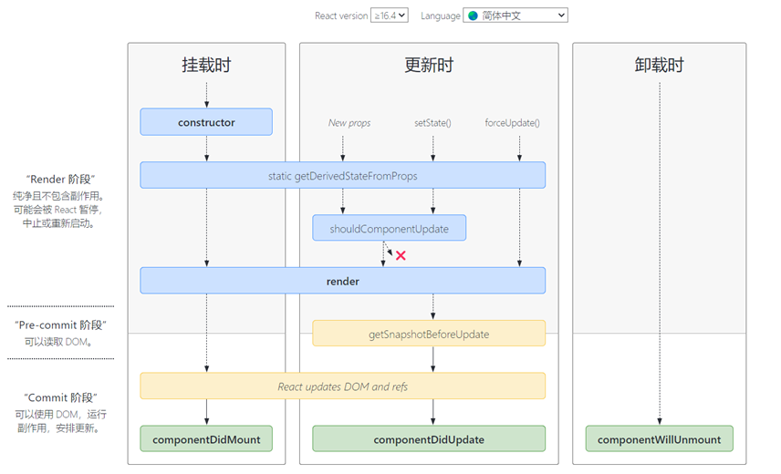

## 1. 简介

React是一个用于构建用户界面的JavaScript 库，或者更准确地说，是一个将数据渲染成HTML视图的JavaScript 库（Facebook开源）

**原生js的缺陷**：直接操作DOM，浏览器会进行大量的重绘重排，效率低下，而且没有组件化编码方案，代码复用率低

**React特点：**  

①采用组件化模式，声明式编码，提高开发效率和组件复用率  

②在React Native中可以使用React语法进行**移动端开发**  

③使用**虚拟DOM**+优秀的**Diffing算法**，尽量减少与真实DOM的交互（数据先渲染成虚拟DOM，然后虚拟DOM再映射成为页面中的真实DOM，当数据增加时，会先在原有DOM上比较，如果没有才会增加新DOM，而不会把原来所有的数据再渲染一遍）

**demo.html**

```
<!DOCTYPE html>
<html>
  <head>
    <meta charset="UTF-8"></meta>
    <title>hello_react</title>
  </head>
  <body>
    <!-- 准备好一个容器 -->
    <div id="test"></div>
    <!-- 引入react核心库 -->
    <script type="text/javascript" src="./js/react.development.js"></script>
    <!-- 引入react-dom, 用于支持react操作DOM -->
    <script type="text/javascript" src="./js/react-dom.development.js"></script>
    <!-- 引入babel，用于将jsx转为js -->
    <script type="text/javascript" src="./js/babel.min.js"></script>

    <script type="text/babel">
      // 1.创建虚拟DOM
      const VDOM = <h1>Hello, React</h1>

      // 2.渲染虚拟DOM到页面
      ReactDOM.render(VDOM, document.getElementById('test'))
    </script>
  </body>
</html>
```

**js文件（点击对应url链接，右击鼠标另存为即可）** 

- **react.development.js**：react的核心文件 [链接](https://unpkg.com/react@17/umd/react.development.js)

- **babel.min.js**：将ES6转换为ES5，将jsx转换为js [链接](https://unpkg.com/@babel/standalone/babel.min.js)

- **react-dom.development.js**：react的扩展库，用来操作DOM的  [链接](https://unpkg.com/react-dom@17.0.2/umd/react-dom.development.js)
  
  **注意**：react.development.js要在react-dom.development.js之前引入，因为后者依赖于前者

创建虚拟DOM的时候，如果想换行，可以这样写

```
const VDOM = (
   <div>
     <h1><span>Hello</span></h1>
   </div>
)
```

**关于虚拟DOM**

①本质是object类型的对象

②虚拟DOM比较"轻"，真实DOM比较"重" ，因为虚拟DOM是React内部在用，无需真实DOM那么多属性  

③虚拟DOM最终会被React转换为真实DOM，呈现在页面上

**JSX（JavaScript XML）**

react定义的一种类似于XML的JS扩展语法: JS + XML

本质是  React.createElement(components, props, ...children)方法的语法糖

**语法规则**：

①定义虚拟DOM的时候不要加引号  

②标签中混入**js表达式**（不是js语句）时要用{}  

③样式的类名用className，不用class  

④内联样式，用style={{key:value}}的形式去写 

⑤只有一个根标签，也就是说最外面只能有一个标签包着

```
const data = 'Hello React'
const VDOM = (
   <div>
     <h2 className="title">
        <span style={{color:'white'}}>{data}</span>
     </h2>
     <input type="text"/>
   </div>
)
```

```
<!DOCTYPE html>
<html>
  <head>
    <meta charset="UTF-8"></meta>
    <title>hello_react</title>
  </head>
  <body>
    <div id="test"></div>
    <script type="text/javascript" src="./js/react.development.js"></script>
    <script type="text/javascript" src="./js/react-dom.development.js"></script>
    <script type="text/javascript" src="./js/babel.min.js"></script>

    <script type="text/babel">
      const data = ['React', 'Vue', 'Angular']
      const VDOM = (
        <div>
          <h1>前端js框架列表</h1>
          <ul>
            {
              data.map((item, index)=>{
                return <li key={index}>{item}</li>
              })
            }
          </ul>
        </div>
      )
      ReactDOM.render(VDOM, document.getElementById('test'))
    </script>
  </body>
</html>
```

**模块化和组件化**

js模块化：将一个大的js文件按照特定功能拆成一个个小的js文件，目的是提高js的复用率

组件化：拆的不仅仅是js了，它将一个页面拆成一个个组件，每个组件不仅包含js，还包含html，css，img等等

**函数式组件和类式组件**

函数式组件

```
// 其它代码同上
<script type="text/babel">
  function MyComponent() {
     console.log(this);  // 此处的this是undefined,因为babel编译后开启了strict模式
     return <h2>我是函数定义的组件</h2>
  }
  ReactDOM.render(<MyComponent/>, document.getElementById('test'))
</script>
```

类式组件

```
// 其它代码同上
<script type="text/babel">
  class MyComponent extends React.Component {
    render() {
      return <h2>我是类定义的组件</h2>
    }
  }
  ReactDOM.render(<MyComponent/>, document.getElementById('test'))
</script>
```

**引入favicon.ico**

①favicon.ico图片扔在项目根目录即可  

②引入(其实不引入也会自动加载的)

```cobol
<link rel="shortcut icon" type="image/x-icon" href="/favicon.ico">
```

对于chrome浏览器，目录正确，**但是显示不出来的情况**，是**缓存**的问题 => 按**ctrl+f5键**强制刷新

**插件推荐**

浏览器：React Developer Tools [链接](https://chrome.pictureknow.com/extension?id=b02ac2064fdb4f888357cecbf6487592)

vscode：Live Preview

## 2. 组件的三大属性

### 2.1 state

state是组件中最重要的一个属性，值是**对象**（可包含多个key-value组合）

组件被称为 “ 状态机 ”，通过更新组件的state来更新对应的页面显示（重新渲染组件）

**注意：**

①组件中render方法中的this为组件实例对象  

②组件自定义的方法中的this位undefined，如何解决？  

=> 通过函数对象的bind函数强制绑定this 或者 使用箭头函数  

③状态数据，需要通过setState()函数来修改，不能直接更改

state_demo.html（点击切换 ”炎热“ 和 ”凉爽“ 关键词）

```
<!DOCTYPE html>
<html>
  <head>
    <meta charset="UTF-8"></meta>
    <title></title>
  </head>
  <body>
    <div id="test"></div>

    <script type="text/javascript" src="./js/react.development.js"></script>
    <script type="text/javascript" src="./js/react-dom.development.js"></script>
    <script type="text/javascript" src="./js/babel.min.js"></script>

    <script type="text/babel">
      class Weather extends React.Component {
        constructor(props) {
          super(props)
          this.state = { isHot: false }
          // 类中的方法默认开启了局部的strict模式，所以changeWeather中的this位undefined
          // 解决changeWeather中this指向的问题
          this.cWeather = this.changeWeather.bind(this)
        }
        render() {
          const {isHot} = this.state
          return <h2 onClick={this.cWeather}>今天天气很{isHot ? '炎热' : '凉爽'}</h2>
        }
        changeWeather() {
          // 状态state不可直接修改,需要通过setState方法
          const isHot = this.state.isHot
          this.setState({isHot:!isHot})
        }
      }
      ReactDOM.render(<Weather/>, document.getElementById('test'))
    </script>
  </body>
</html>
```

**简化写法(推荐)**

```
<script type="text/babel">
      class Weather extends React.Component {
        constructor(props) {
          super(props)
        }
        state = { isHot: false }
        render() {
          const { isHot } = this.state
          return <h2 onClick={this.changeWeather}>今天天气很{isHot ? '炎热' : '凉爽'}</h2>
        }
        // 自定义方法 --- 要用赋值语句的形式 + 箭头函数（用changeWeather = function(){}不行）
        // 箭头函数下面的this，如果发现自己是undefined,就会向外层寻找，所以这里的this指向的是weather实例对象
        changeWeather = () => {
          const isHot = this.state.isHot
          this.setState({ isHot:!isHot })
        }
      }
      ReactDOM.render(<Weather/>, document.getElementById('test'))
</script>
```

### 2.2 props

React组件中的props主要是用来接收传入的数据的。

props_demo.html

```
<!DOCTYPE html>
<html>
  <head>
    <meta charset="UTF-8"></meta>
    <title>Document</title>
  </head>
  <body>
    <div id="test1"></div>
    <div id="test2"></div>

    <script type="text/javascript" src="./js/react.development.js"></script>
    <script type="text/javascript" src="./js/react-dom.development.js"></script>
    <script type="text/javascript" src="./js/babel.min.js"></script>
    <!-- 引入prop-types，全局就多了一个propTypes对象，用于对组件标签属性进行限制 -->
    <script type="text/javascript" src="./js/prop-types.js"></script>

    <script type="text/babel">
      class Person extends React.Component {
        render() {
          const {name,age,sex,speak} = this.props
          return (
            <ul>
              <li>姓名：{name}</li>
              <li>性别：{sex}</li>
              <li>年龄：{age}</li>
            </ul>
          )
        }
      }
      // 对标签属性进行类型、必要性的限制
      Person.propTypes = {
        name: PropTypes.string.isRequired,
        sex: PropTypes.string,
        age: PropTypes.number,
        speak: PropTypes.func
      }
      // 指定默认标签属性值
      Person.defaultProps = {
        sex: '男',
        age: 18
      }
      const p1 = {name: 'Tom', age:18, sex: '男', speak: speak}
      const p2 = {name: 'Nancy', age:19, sex: '女'}
      function speak() {
        console.log('我说话了')
      }
      ReactDOM.render(<Person {...p1}/>, document.getElementById('test1'))
      ReactDOM.render(<Person {...p2}/>, document.getElementById('test2'))
    </script>
  </body>
</html>
```

**prop-types.js下载地址**：https://unpkg.com/prop-types@15.6.2/prop-types.js

**也可以把标签属性的限制放在类里面(推荐)**

```
class Person extends React.Component {
   static propTypes = {
      name: PropTypes.string.isRequired,
      sex: PropTypes.string,
      age: PropTypes.number,
      speak: PropTypes.func
    }
    static defaultProps = {
      sex: '男',
      age: 18
    }
    render() {
      const {name,age,sex,speak} = this.props
       return (
         <ul>
           <li>姓名：{name}</li>
           <li>性别：{sex}</li>
           <li>年龄：{age}</li>
         </ul>
       )
    }
}
```

**函数式组件写法**

```
// 其它代码同上
<script type="text/babel">
  function Person (props) {
    const {name,age,sex} = props
    return (
      <ul>
        <li>姓名：{name}</li>
        <li>性别：{sex}</li>
        <li>年龄：{age}</li>
      </ul>
    )
  }
  Person.propTypes = {
    name: PropTypes.string.isRequired,
    sex: PropTypes.string,
    age: PropTypes.number,
    speak: PropTypes.func
  }
  Person.defaultProps = {
    sex: '男',
    age: 18
  }

  const p1 = {name: 'Tom', age:18, sex: '男'}
  const p2 = {name: 'Nancy', age:19, sex: '女'}   
  ReactDOM.render(<Person {...p1}/>, document.getElementById('test1'))   
  ReactDOM.render(<Person {...p2}/>, document.getElementById('test2'))
</script>
```

### 2.3 refs

组件中的标签可以用refs来标识自己，类似于id，但用法不同。

**小案例**

需求：点击按钮，显示输入框的数据，失去焦点，显示输入框的数据。

refs_demo.html

**①String 类型的 Refs (效率低，官方不推荐使用了)**

```
// 其它代码同上
<script type="text/babel">
  class Demo extends React.Component {
    showData = () => {
      const {input1} = this.refs
      alert(input1.value)
    }
    showData2 = () => {
      const {input2} = this.refs
      alert(input2.value)
    }
    render() {
      return (
        <div>
          <input ref="input1" type="text" placeholder="点击按钮提示数据" /> 
          <button onClick={this.showData}>点我提示左侧的数据</button><br/>
          <input ref="input2" onBlur={this.showData2} type="text" placeholder="失去焦点提示数据" />
        </div>
      )
    }
  }
  ReactDOM.render(<Demo/>, document.getElementById('test'))
</script>
```

**②回调函数形式的 Refs**

```
// 其它代码同上
<script type="text/babel">
  class Demo extends React.Component {
    showData = () => {
      const {input1} = this
      alert(input1.value)
    }
    showData2 = () => {
      const {input2} = this
      alert(input2.value)
    }
    assignment1 = c => { this.input1 = c;}
    assignment2 = c => { this.input2 = c;}
    render() {
      return (
        <div>
         <input ref={this.assignment1} type="text" placeholder="点击按钮提示数据" /> 
         <button onClick={this.showData}>点我提示左侧的数据</button><br/>
         <input ref={this.assignment2} onBlur={this.showData2} type="text" placeholder="失去焦点提示数据" />
        </div>
      )
    }
  }
  ReactDOM.render(<Demo/>, document.getElementById('test'))
</script>
```

**③ 用React.createRef() 返回的容器存储refs标识的结点(推荐)**

```
// 其它代码同上
<script type="text/babel">
  class Demo extends React.Component {
    // React.createRef()调用后返回一个容器，该容器可以存储被ref标识的结点，一个容器装一个结点
    myRef = React.createRef()
    myRef2 = React.createRef()
    showData = () => {
      alert(this.myRef.current.value)
    }
    showData2 = () => {
      alert(this.myRef2.current.value)
    }
    render() {
      return (
        <div>
          <input ref={this.myRef} type="text" placeholder="点击按钮提示数据" /> 
          <button onClick={this.showData}>点我提示左侧的数据</button><br/>
          <input ref={this.myRef2} onBlur={this.showData2} type="text" placeholder="失去焦点提示数据" />
        </div>
      )
    }
  }
  ReactDOM.render(<Demo/>, document.getElementById('test'))
</script>
```

官方文档告诉我们不要过多使用refs，当发生事件的元素和事件操作的元素是同一个时，我们可以省略标签的ref，用**event.target**获取该元素

```
// 其它代码同上
<script type="text/babel">
  class Demo extends React.Component {
    myRef = React.createRef()
    myRef2 = React.createRef()
    showData = () => {
      alert(this.myRef.current.value)
    }
    showData2 = (event) => {
      alert(event.target.value)
    }
    render() {
      return (
        <div>
          <input ref={this.myRef} type="text" placeholder="点击按钮提示数据" /> 
          <button onClick={this.showData}>点我提示左侧的数据</button><br/>
          <input onBlur={this.showData2} type="text" placeholder="失去焦点提示数据" />
        </div>
      )
    }
  }
  ReactDOM.render(<Demo/>, document.getElementById('test'))
</script>
```

## 3. 收集表单数据

需求：定义一个包含表单的组件，输入用户名密码后，点击登录提示输入信息(页面不刷新)

**① 非受控组件（uncontrolled component）**

```
<!DOCTYPE html>
<html>
  <head>
    <meta charset="UTF-8"></meta>
    <title></title>
  </head>
  <body>
    <div id="test"></div>

    <script type="text/javascript" src="./js/react.development.js"></script>
    <script type="text/javascript" src="./js/react-dom.development.js"></script>
    <script type="text/javascript" src="./js/babel.min.js"></script>

    <script type="text/babel">
      class Login extends React.Component {
        handleSubmit = (event) => {
          event.preventDefault()
          const {username,password} = this
          alert(`你输入的用户名是：${username.value},你输入的密码是：${password.value}`)
        }
        render() {
          return (
            <form onSubmit={this.handleSubmit}>
              用户名：<input ref={c => this.username = c} type="text" name="username"/>
              密码：<input ref={c => this.password = c} type="password" name="password"/>
              <button>登录</button>
            </form>
          )
        }
      }
      ReactDOM.render(<Login/>, document.getElementById('test'))
    </script>
  </body>
</html>
```

**② 受控组件（controlled component）**

其值由 `React` 控制的输入表单元素称为 “**受控组件**”。**优势**：比上面的非受控组件少用了**refs**。

例如，对于这种像input这样输入类的DOM，随着用户的输入，输入的数据被维护在状态state里，等需要用的时候再从状态state里面取出来。

**类似于Vue中的双向数据绑定**

```
<script type="text/babel">
        class Login extends React.Component {
          //保存用户名和密码到状态中
          saveUsername = (event) => {
            this.setState({username: event.target.value})
          }
          savePassword = (event) => {
            this.setState({password: event.target.value})
          }
          handleSubmit = (event) => {
            event.preventDefault()
            const {username,password} = this.state
            alert(`你输入的用户名是：${username},你输入的密码是：${password}`)
          }
          render() {
            return (
              <form onSubmit={this.handleSubmit}>
                用户名：<input onChange={this.saveUsername} type="text" name="username"/>
                密码：<input onChange={this.savePassword} type="password" name="password"/>
                <button>登录</button>
              </form>
            )
          }
        }
        ReactDOM.render(<Login/>, document.getElementById('test'))
</script>
```

## 4. 函数柯里化

函数柯里化（currying）：通过函数调用继续返回函数的方式，实现多次接收参数最后统一处理的函数编码形式

下面的saveFormData函数就用到了函数柯里化

```
<script type="text/babel">
  class Login extends React.Component {
    //保存表单数据到状态中
    saveFormData = (dataType) => {
      return (event) => {
        this.setState({[dataType]:event.target.value})
      }
    }
    handleSubmit = (event) => {
      event.preventDefault()
      const {username,password} = this.state
      alert(`你输入的用户名是：${username},你输入的密码是：${password}`)
    }
    render() {
      return (
        <form onSubmit={this.handleSubmit}>
          用户名：<input onChange={this.saveFormData('username')} type="text" name="username" autoComplete="off"/>
          密码：<input onChange={this.saveFormData('password')} type="password" name="password"/>
          <button>登录</button>
        </form>
      )
    }
  }
  ReactDOM.render(<Login/>, document.getElementById('test'))
</script>
```

不用柯里化，我怎么改？？

```
<script type="text/babel">
  class Login extends React.Component {
    //保存表单数据到状态中
    saveFormData = (dataType, event) => {
      this.setState({[dataType]:event.target.value})
    }
    handleSubmit = (event) => {
      event.preventDefault()
      const {username,password} = this.state
      alert(`你输入的用户名是：${username},你输入的密码是：${password}`)
    }
    render() {
      return (
        <form onSubmit={this.handleSubmit}>
          用户名：<input onChange={event => this.saveFormData('username', event)} type="text" name="username" autoComplete="off"/>
          密码：<input onChange={event => this.saveFormData('password', event)} type="password" name="password"/>
          <button>登录</button>
        </form>
      )
    }
  }
  ReactDOM.render(<Login/>, document.getElementById('test'))
</script>
```

## 5. 生命周期

组件从创建到死亡会经历一些特定的阶段，React组件中包含一系列hook函数（钩子函数、生命周期回调函数），会在特定时刻调用。我们在定义组件时，会在特定的hook函数中，做特定的工作。



[官方生命周期图的地址](https://projects.wojtekmaj.pl/react-lifecycle-methods-diagram/ "官方生命周期图的地址")

（1）初始化阶段

  constructor() =>  render() => componentDidMount()
（2）更新阶段：由组件内部 this.setState() 或 父组件 render 触发

  强制刷新页面，不更新状态state，可以去调 this.forceUpdate()

  shouldComponentUpdate() =>  render() => componentDidUpdate()

（3）卸载组件：由 ReactDOM.unmountComponentAtNode() 触发
  componentWillUnmount()

**重要的三个钩子函数**

**render()**                                 初始化渲染或更新渲染时调用  
**componentDidMount()**        组件挂载完毕时调用，开启监听，发送ajax请求  
**componentWillUnmount()**   组件卸载时调用，做一些收尾工作，如：清理定时器

**案例**

需求：①让指定文本做显示/隐藏的渐变动画

            ②从完全可见到彻底消失，耗时2s

            ③点击按钮卸载组件

```
<!DOCTYPE html>
<html>
  <head>
    <meta charset="UTF-8"></meta>
    <title></title>
  </head>
  <body>
    <div id="test"></div>

    <script type="text/javascript" src="./js/react.development.js"></script>
    <script type="text/javascript" src="./js/react-dom.development.js"></script>
    <script type="text/javascript" src="./js/babel.min.js"></script>

    <script type="text/babel">
      class Love extends React.Component {
        state = { opacity: 1 }
        death = () => {
          // 卸载组件
          ReactDOM.unmountComponentAtNode(document.getElementById('test'))
        }
        //组件挂载完毕
        componentDidMount() {
          this.timer = setInterval(() => {
            let {opacity} = this.state  //获取原状态
            opacity -= 0.1              //减小0.1
            if(opacity <= 0) opacity = 1
            this.setState({opacity})    //设置新的透明度
          }, 200);
        }
        //组件将要卸载
        componentWillUnmount() {
          clearInterval(this.timer)   // 清除定时器
        }
        //初始化渲染、状态更新之后触发render
        render() {
          console.log('render')
          return(
            <div>
              <h2 style={{opacity:this.state.opacity}}>所以爱会消失吗？</h2>
              <button onClick={this.death}>会</button>
            </div>
          )
        }
      }
      ReactDOM.render(<Love/>, document.getElementById('test'))
    </script>
  </body>
</html>
```

**其它钩子函数**

getDerivedStateFromProps：从props中获取派生的state

getSnapshotBeforeUpdate：在更新之前获取快照，也就是说，在组件发生更改之前从DOM中捕获一些信息，该函数的返回值将作为参数传递给componentDidUpdate()

**案例**

需求：一条条新闻不断生成，我想让滚轮滚到某一条新闻时，画面相对静止，而不是随着新新闻的生成向下移动  

做法：其实就是利用新旧状态拿到新生成的一条新闻的宽度（这里都是30px），用这个宽度调整滚轮的位置

```
<!DOCTYPE html>
<html>
  <head>
    <meta charset="UTF-8"></meta>
    <title></title>
    <style>
      .list{
        width: 200px;
        height: 150px;
        background-color: skyblue;
        overflow: auto;
      }
      .news{
        height: 30px;
      }
    </style>
  </head>
  <body>
    <div id="test"></div>

    <script type="text/javascript" src="./js/react.development.js"></script>
    <script type="text/javascript" src="./js/react-dom.development.js"></script>
    <script type="text/javascript" src="./js/babel.min.js"></script>
    <script type="text/babel">
      class NewsList extends React.Component {
        state = { newsArr:[] }
        componentDidMount() {
          setInterval(() => {
            const { newsArr } = this.state       //获取原状态   
            const news = '新闻' + (newsArr.length+1)    //模拟一条新闻
            this.setState({ newsArr:[news,...newsArr] })  //更新状态
          }, 1000);
        }
        render() {
          return(
            <div className="list" ref="list">
              {
                this.state.newsArr.map((n,index)=>{
                  return <div key={index} className="news">{n}</div>
                })
              }
            </div>
          )
        }
        getSnapshotBeforeUpdate() {
          return this.refs.list.scrollHeight
        }
        componentDidUpdate(prevProps,prevState,height) {
          this.refs.list.scrollTop += this.refs.list.scrollHeight - height
        }
      }
      ReactDOM.render(<NewsList/>, document.getElementById('test'))
    </script>
  </body>
</html>
```


## 6. DOM的diffing算法

我们知道，当调用 React 的 **`render()`** 方法时，会创建一棵由 React 元素组成的树   

为了更高效的更新DOM树，我们引入了 **diffing算法**

**算法细节如下**

①当对比两棵树时，React 首先比较两棵树的根节点 
②若根节点为不同类型的元素（如从 `<a>` 变成 ``），React 会拆卸原有的树并且建立起新的树  
③当对比两个相同类型的React 元素时，React 会保留 DOM 节点，仅更新有改变的属性 
④当一个组件更新时，组件实例会保持不变，因此可以在不同的渲染时保持 state一致。React 更新该组件实例的 props 以保证与最新的元素保持一致
⑤递归 DOM 节点的子元素时，React 会同时遍历两个子元素的列表 
**在子元素列表末尾新增元素时，更新开销比较小，如果将新增元素插入到表头，更新开销会比较大**

**为了解决上述问题，React 引入了** **`key` 属性**

key是虚拟DOM的标识，当状态中的数据发生变化的时候，React会根据新数据生成新的虚拟DOM，随后React会进行新旧虚拟DOM的Diffing比较，除了上面说的，还增加了一些规则：  
①新虚拟DOM如果找到和旧虚拟DOM一样的key，若虚拟DOM内容不变，直接用之前的真实DOM，变了，就生成新的DOM，替换掉原来的  
②如果没找到和旧虚拟DOM一样的key，直接根据数据创建新的真实DOM，渲染到页面上

**用index作为key会引发问题**

仅用于渲染列表进行展示，其实没有问题   
但是，如果对数据进行逆序添加、逆序删除等破坏顺序的操作，会导致没有必要的DOM更新，影响效率

```
//虚拟DOM的初始化
<li key=0>张三</li>
<li key=1>李四</li>

//头部插入一条数据，原来DOM的key变化了，所以还得更新，其实是没有必要的
<li key=0>王五</li>
<li key=1>张三</li>
<li key=2>李四</li>
```

如果结构中还包含输入类的DOM，会产生错误DOM更新，界面会出问题

```cobol
//虚拟DOM的初始化
<li key=0>张三<input type="text"/></li>
<li key=1>李四<input type="text"/></li>

//由于我们进行Diff比较时，是一层一层比较的
//数据更新后，此时王五后面的输入框DOM其实还是原来张三后面的输入框DOM
//但是，如果张三后面的输入框还残留着他的相关信息，页面就会出问题
<li key=0>王五<input type="text"/></li>
<li key=1>张三<input type="text"/></li>
<li key=2>李四<input type="text"/></li>
```

**所以，最好使用数据的唯一标识作为key，如id、学号、身份证号。。。**

## 7. React脚手架

React提供了一个用于创建react项目的脚手架库：**create-react-app**

```
npx create-react-app demo
cd demo
npm start
```

**项目结构分析**

public文件夹里面放的都是一些静态资源  

React和Vue一样，都是SPA(single page web application)单页面应用，所以整个项目只有一个html文件 => index.html（文件名不能自己改）  

我们从项目自动生成的index.html中分析一下其它文件的作用

```
<!DOCTYPE html>
<html lang="en">
  <head>
    <meta charset="utf-8" />
    <!-- %PUBLIC_URL%代表public文件夹的路径 -->
    <link rel="icon" href="%PUBLIC_URL%/favicon.ico" />
    <!-- 开启理想视口，用于做移动端页面的适配 -->
    <meta name="viewport" content="width=device-width, initial-scale=1" />
    <!-- 用于配置浏览器页签+地址栏的颜色（仅支持安卓手机浏览器） -->
    <meta name="theme-color" content="#000000" />
    <!-- 对页面的一些描述，方便搜索引擎搜到你的页面 -->
    <meta name="description" content="Web site created using create-react-app"/>
    <!-- 用于指定页面添加到手机主屏幕后的图标 -->
    <link rel="apple-touch-icon" href="%PUBLIC_URL%/logo192.png" />
    <!-- 应用加壳时的配置文件 -->
    <link rel="manifest" href="%PUBLIC_URL%/manifest.json" />
    <title>React App</title>
  </head>
  <body>
    <!-- 若浏览器不支持js则展示标签中的内容 -->
    <noscript>You need to enable JavaScript to run this app.</noscript>
    <div id="root"></div>
  </body>
</html>
```

**robots.txt**是爬虫规则文件，规定页面什么内容能爬，什么不能爬

**src**是源码文件夹

**App.css** --- App组件的样式 
**App.js** --- App组件 
**App.test.js** --- 用于给App做测试 
**index.css** --- 样式文件，放一些通用性的样式 
**index.js** --- 入口文件 
**logo.svg** --- logo图 
**reportWebVitals.js** -- 页面性能分析文件(需要web-vitals库的支持) 
**setupTests.js** --- 组件单元测试的文件(需要jest-dom库的支持)

**我们从入口文件index.js了解一下项目文件的执行顺序**

①引入React、ReactDOM两个库 ，引入index.css，引入App.js作为一个模块，引入reportWebVitals.js  
②渲染APP组件，渲染到public文件下面的index.html中的id为root的容器中 
③。。。

```
import React from 'react';
import ReactDOM from 'react-dom';
import './index.css';
import App from './App';
import reportWebVitals from './reportWebVitals';

ReactDOM.render(
  <React.StrictMode>
    <App />
  </React.StrictMode>,
  document.getElementById('root')
);

reportWebVitals();
```

**小案例（为了和其它普通js文件区分开来，可以把后缀改成jsx，如Hello.jsx）**

**/src/App.js**

```
//创建组件App
//{Component}不是解构赋值,而是'react'既导出了React对象，又导出了React对象中的Component属性
import React,{Component} from 'react'
import Hello from './components/Hello/Hello'
import Welcome from './components/Welcome/Welcome'

class App extends Component{
  render(){
    return (
      <div>
        <Hello/>
        <Welcome/>
      </div>
    )
  }
}

export default App
```

**/src/components/Hello/Hello.js**

```
import React,{Component} from "react"
import './Hello.css'

export default class Hello extends Component{
  render() {
    return <h2 className="title">Hello,React!</h2>
  }
}
```

**/src/components/Hello/Hello.css**

```
.title {
  background-color: orange;
}
```

**/src/components/Welcome/Welcome.js**

```
import React,{Component} from "react"
import './Welcome.css'

export default class Welcome extends Component{
  render() {
    return <h2 className="title2">Welcome!</h2>
  }
}
```

**/src/components/Welcome/Welcome.css**

```
.title2 {
  background-color: skyblue;
}
```


**样式的模块化**

当多个组件的样式文件中有名称一样的，后面引入的就会覆盖前面的  

例如，在上面的案例中，Hello和Welcome组件的css文件中的样式名都为title，就会出问题

为避免冲突 => **样式模块化**

①在上面的基础上，样式名改为 Hello.module.css 
②/src/components/Hello/Hello.js

```
import React,{Component} from "react"
import hello from './Hello.module.css'

export default class Hello extends Component{
  render() {
    return <h2 className={hello.title}>Hello,React!</h2>
  }
}
```

**推荐vscode开发扩展**：ES7+ React/Redux/React-Native snippets

## 8. 案例 - 任务清单

```
npx create-react-app task_checklist
cd task_checklist
```

安装一个包nanoid，用于生成UUID(Universally Unique Identifier) ，用这个UUID当作id

```
npm i nanoid
```

安装prop-types库，用于类型限定

```
npm i prop-types
```

src/App.js

```
import { Component } from 'react';
import Header from './components/Header'
import List from './components/List'
import Footer from './components/Footer'
import './App.css';

class App extends Component {
  // 初始化状态
  state = {
    todos: [
      {id: '001', name: '吃饭', done: true},
      {id: '002', name: '工作', done: true},
      {id: '003', name: '睡觉', done: false}
    ]
  }

  // 添加一个todo对象
  addTodo  = (obj) => {
    const {todos} = this.state
    const newTodos = [obj, ...todos]
    this.setState({todos: newTodos})
  }

  // 更新一个todo对象
  updateTodo = (id, done) => {
    const {todos} = this.state
    const newTodos = todos.map(obj => {
      if(obj.id === id) return {...obj, done}
      else return obj
    })
    this.setState({todos: newTodos})
  }

  // 删除一个todo对象
  deleteTodo = (id) => {
    const {todos} = this.state
    const newTodos = todos.filter(obj => {
      return obj.id !== id
    })
    this.setState({todos: newTodos})
  }

  // 全选
  checkAllTodo = (done)=>{
    const {todos} = this.state
    const newTodos = todos.map(obj => {
      return {...obj,done}
    })
    this.setState({todos:newTodos})
  }

  // 删除所有已完成的
  clearAllDone = ()=>{
    const {todos} = this.state
    const newTodos = todos.filter(obj => {
      return !obj.done
    })
    this.setState({todos:newTodos})
  }

  render() {
    const { todos } = this.state
    return (
      <div className='container'>
        <div className='wrap'>
          <Header addTodo={this.addTodo} />
          <List todos={todos} updateTodo={this.updateTodo} deleteTodo={this.deleteTodo} />
          <Footer todos={todos} checkAllTodo={this.checkAllTodo} clearAllDone={this.clearAllDone} />
        </div>
      </div>
    )
  }
}

export default App;

```

src/App.css

```
.container {
  width: 600px;
  margin: 20px auto;
}

.container .wrap {
  padding: 10px;
  border: 1px solid #ddd;
  border-radius: 5px;
}

.btn {
  line-height: 20px;
  font-size: 14px;
  cursor: pointer;
  border:  4px;
  box-shadow: inset 0 1 px 0 rgba(255, 255, 255, 0.2), 0 1px 2px rgba(0, 0, 0, 0.05);
}

.btn-danger {
  color: #fff;
  background-color: #da4f49;
  border: 1px solid #bd362f;
}
```

src/components/Header/index.jsx

```
import { Component } from "react";
import PropTypes from 'prop-types';
import { nanoid } from 'nanoid';
import './index.css';

export default class Header extends Component {
    // 对接收的props进行：类型、必要性的限制
    static propTypes = {
        addTodo:PropTypes.func.isRequired
    }

    handleKeyUp = (event) => {
        const {keyCode,target} = event
        if(keyCode !== 13) return
        if(target.value.trim() === '') {
            alert('输入不能为空')
            return
        }
        const obj = {id:nanoid(),name:target.value,done:false}
        this.props.addTodo(obj)
        target.value = ''
    }

    render() {
        return (
            <div className="header">
                <input onKeyUp={this.handleKeyUp} type="text" placeholder="请输入任务名称，按回车键确认"/>
            </div>
        )
    }
}
```

src/components/Header/index.css

```
.header input {
    width: 550px;
    height: 28px;
    font-size: 14px;
    border: 1px solid #ccc;
    border-radius: 4px;
    padding: 5px 7px;
}

.header input:focus {
    outline: none;
    border-color: rgba(82, 168, 236, 0.8);
    box-shadow: inset 0 1 px 1px rgba(0, 0, 0, 0.075), 0 0 8px rgba(82, 168, 236, 0.6);
}
```

src/components/Footer/index.jsx

```
import { Component } from "react";
import './index.css';

export default class Footer extends Component {
    handleCheckAll = (event)=>{
        this.props.checkAllTodo(event.target.checked)
      }

    handleClearAllDone = () => {
        this.props.clearAllDone()
    }

    render() {
        const { todos } = this.props
        const hasDone_num = todos.reduce((pre, cur) => { return pre + (cur.done ? 1 : 0) }, 0)
        const total_num = todos.length
        return (
            <div className="footer">
                <label>
                    <input type='checkbox' onChange={this.handleCheckAll} checked={hasDone_num === total_num && total_num !== 0 ? true:false}/>
                </label>
                <span>已完成{hasDone_num} / 全部 { total_num }</span>
                <button onClick={this.handleClearAllDone} className="btn btn-danger">清除已完成任务</button>
            </div>
        )
    }
}
```

src/components/Footer/index.css

```
.footer {
    height:px ;
    padding-left: 6px;
    margin-top: 5px;
    line-height: 40px;
}

.footer label {
    margin-right: 20px;
    cursor: pointer;
}

.footer label input {
    margin-right: 5px;
}

.footer button {
    float: right;
    margin-top: 5px;
}
```

src/components/List/index.jsx

```
import { Component } from "react";
import Item from "../Item";
import PropTypes from 'prop-types';
import './index.css'

export default class List extends Component {
    //对接收的props进行：类型、必要性的限制
    static propTypes = {
        todos:PropTypes.array.isRequired,
        updateTodo:PropTypes.func.isRequired,
        deleteTodo:PropTypes.func.isRequired
    }
    
    render() {
        const {todos,updateTodo,deleteTodo} = this.props
        return (
            <ul className="main">
                {
                    todos.map(todo => {
                        return <Item key={todo.id} {...todo} updateTodo={updateTodo} deleteTodo={deleteTodo}/>
                    })
                }
            </ul>
        )
    }
}
```

src/components/List/index.css

```
.main {
    margin-left: 0px;
    border: 1px solid #ddd;
    border-radius: 3px;
    padding: 0px;
}
```

src/components/Item/index.jsx

```
import { Component } from "react";
import './index.css';

export default class Item extends Component {
    state = {mouse_over : false}
    handleMouse = (flag) => {
        return ()=>{
            this.setState({mouse_over: flag})
        }
    }
    handleCheck = (id)=>{
        return (event)=>{
            this.props.updateTodo(id, event.target.checked)
        }
    }
    handleDelete = (id)=>{
        return ()=>{
            if(window.confirm('确定删除吗？')){
            this.props.deleteTodo(id)
            }
        }
    }
    render() {
        const { id, name, done } = this.props
        const {mouse_over} = this.state
        return (
            <li style={{backgroundColor: mouse_over ? '#ddd' : '#fff'}} onMouseEnter={this.handleMouse(true)} onMouseLeave={this.handleMouse(false)}>
                <label>
                    <input type="checkbox" checked={done} onChange={this.handleCheck(id)}/>
                    <span>{ name }</span>
                </label>
                <button onClick={this.handleDelete(id)} className="btn btn-danger">删除</button>
            </li>
        )
    }
}
```

src/components/Item/index.css

```
li {
    list-style: none;
    height: 36px;
    line-height: 36px;
    padding: 0 5px;
}

li label li input {
    margin-right: 6px;
}

li button {
    float: right;
    margin-top: 5px;
}
```

**效果**


## 9. ajax请求和跨域

**简单模拟ajax请求**

 ①**客户端** --- 客户端页面所在地址为本机地址，端口为3000

```
npx create-react-app client
cd client
npm start
```

React本身并不包含发送ajax请求的代码，需要自己引入一个第三方库

不推荐使用**jQuery**，因为它比较重，而且使用js操作DOM，在React中不推荐这样，这里推荐轻量级框架**axios**

```
npm i axios
```

**/client/src/App.js**

```
import React,{Component} from 'react'
import axios from 'axios'

export default class App extends Component{
  getStudentData = ()=>{
    axios.get('http://localhost:3000/api1/students').then(
      response => {console.log('成功',response.data)},
      error => {console.log('失败',error);}
    )
  }
  getCarData = ()=>{
    axios.get('http://localhost:3000/api2/cars').then(
      response => {console.log('成功',response.data)},
      error => {console.log('失败',error);}
    )
  }
  render(){
    return (
      <div>
        <button onClick={this.getStudentData}>获取学生数据</button>
        <button onClick={this.getCarData}>获取汽车数据</button>
      </div>
    )
  }
}
```

②**服务器端** --- Node + Express

```
npm i express
```

在本机模拟了两台服务器，分别监听端口5000和5001，开启服务

```
 node server1.js
 node server2.js
```

**/server/server1.js**

```
const express = require('express')
const app = express()

app.use((req,res,next)=>{
  console.log('有人请求服务器1')
  next()
})

app.use('/students',(req,res)=>{
  const students = [
    {id:'001',name:'Tom',age:18},
    {id:'002',name:'Nancy',age:19},
    {id:'003',name:'John',age:20},
  ]
  res.send(students)
})

app.listen(5000,err=>{
  if(!err) console.log('服务器1启动成功,监听端口为5000...')
})
```

**/server/server2.js**

```
const express = require('express')
const app = express()

app.use((req,res,next)=>{
  console.log('有人请求服务器2了')
  next()
})

app.use('/cars',(req,res)=>{
  const cars = [
    {id:'001',name:'奔驰',price:199},
    {id:'002',name:'宝马',age:109},
    {id:'003',name:'奥迪',age:120},
  ]
  res.send(cars)
})

app.listen(5001,err=>{
  if(!err) console.log('服务器2启动成功,监听端口为5001...')
})
```

**解决跨域问题**

**（1）方法一**

在`/client/src/package.json`中追加如下配置

```csharp
"proxy":"http://localhost:5000"
```

缺点：不能配置多个代理  

工作方式：按上述方式配置代理，当请求了3000端口不存在的资源时，才会将该请求转发给5000（优先匹配前端资源）

**（2）方法二**

创建代理配置文件：`/client/src/setupProxy.js`

（我的React版本为18，不同版本的React配置可能不一样）

```
const {createProxyMiddleware} = require('http-proxy-middleware') //这个库在初始化脚手架时就安装了，所以不用额外安装

module.exports = function(app) {
  app.use(
    createProxyMiddleware('/api1', {
      target: 'http://localhost:5000',     //配置转发目标地址
      //控制服务器接收到的请求头中host字段的值，默认为false。
      //为true,这里的host为：localhost:5000;为false,这里的host为：localhost:3000
      changeOrigin: true,
      pathRewrite: {'^/api1':''}           //修改url，去除请求前缀'/api1'
    }),
    createProxyMiddleware('/api2', {
      target: 'http://localhost:5001',
      changeOrigin: true,
      pathRewrite: {'^/api2':''}
    })
  )
}
```

优点：可以配置多个代理，可以灵活地控制请求是否走代理

**效果**


## 10. 案例 - github用户搜索框

```
npx create-react-app github_user_search
cd github_user_search
```

安装axios库

```
npm i axios
```

获取bootstrap.css(找到链接ctrl+s保存网页即可)：[bootstrap](https://www.bootcdn.cn/twitter-bootstrap/ "https://www.bootcdn.cn/twitter-bootstrap/")

存放路径：**/public/css/bootstrap.css**

`/public/index.html `加一行

```
<link rel="stylesheet" href="./css/bootstrap.css" />
```

src/App.js

```
import React,{Component} from 'react'
import Search from './components/Search'
import List from './components/List'
 
export default class App extends Component{
  state = {
    users:[],        //存放用户数据
    isFirst:true,    //是否为第一次打开页面
    isLoading:false, //标识是否处于加载中
    err:''           //存储请求相关的错误信息
  }
  //更新App的state
  updateAppState = (stateObj)=>{
    this.setState(stateObj)
  }
  render(){
    return (
      <div className="container">
        <Search updateAppState={this.updateAppState}/>
        <List {...this.state}/>
      </div>
    )
  }
}
```

src/components/Search/index.jsx

```
import React, { Component } from 'react'
import axios from 'axios'
 
export default class Search extends Component {
  search = ()=>{
    const { keyWordElement:{value:keyWord} } = this  //获取用户的输入内容
    //发送请求前更新APP状态
    this.props.updateAppState({isFirst:false,isLoading:true})
    //发送网络请求
    axios.get(`http://api.github.com/search/users?q=${keyWord}`).then(
      response => {
        //请求成功后更新APP状态
        this.props.updateAppState({isLoading:false,users:response.data.items})
      },
      error => {
        //请求失败后更新APP状态
        this.props.updateAppState({isLoading:false,err:error.message})
      }
    )
  }
  render() {
    return (
      <section className="jumbotron">
        <h3 className="jumbotron-heading">搜索Github用户</h3>
        <div>
          <input ref={c => this.keyWordElement = c} type="text" placeholder="输入用户名称"/>&nbsp;
          <button onClick={this.search}>搜索</button>
        </div>
      </section>
    )
  }
}
```

src/components/List/index.jsx

```
import { Component } from 'react'
import './index.css'

export default class List extends Component {
    render() {
      const {users,isFirst,isLoading,err} = this.props
      return (
        <div className="row">
          {
            isFirst ? <h2>欢迎!</h2> : 
            isLoading ? <h2>加载中...</h2> :
            err ? <h2 style={{color:'red'}}>{err}</h2> :
            users.map((userObj)=>{
              return (
                <div key={userObj.id} className="card">
                  <a rel="noreferrer" href={userObj.html_url} target="_blank">
                    
                  </a>
                  <p className="card-text">{userObj.login}</p>
                </div>
              )
            })
          }
        </div>
      )
    }
  }
```

src/components/List/index.css

```
.card {
    float: left;
    width: 33.333%;
    padding: .75rem;
    margin-bottom: 2rem;
    border: 1px solid #efefef;
    text-align: center;
}
   
.card > img {
    margin-bottom: .75rem;
    border-radius: 100px;
}

.card-text {
    font-size: 85%;
}
```

**效果**


## 11.
