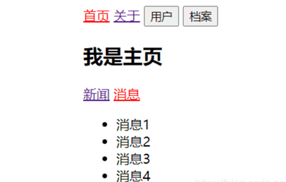

## 0.简介

Vue 是一套用于构建用户界面的**渐进式框架**。

> 2016年10月1日发布的2.0版本

**什么是渐进式？**

渐进式意味着不多做职责之外的事，你可以将**Vue**作为应用的一部分嵌入其中，也可以用它的全家桶开发，比如**Core+Vue-router+Vuex**。

## 1.声明式渲染

Vue.js 的核心是一个允许采用简洁的**模板语法**来声明式地将数据渲染进 DOM 的系统。

不再和 HTML 直接交互了。一个 Vue 应用会将其挂载到一个 DOM 元素上 (对于这个例子是 `#app`) 然后对其进行完全控制。

**“挂载” 的含义**：将组件渲染，并且构造 DOM 元素然后塞入页面的过程称为组件的挂载。    

**声明式编程**： 真正做到了**界面和数据分离**。关注 “我想要什么”，而不关注具体该怎么实现。

**命令式编程**：根据一条条命令告诉计算机应该如何做。

**案例**

```
<!DOCTYPE html>
<html lang="en">          <!--设置语言环境-->
<head>
    <meta charset="utf-8">
    <title>Hello</title>
</head>
<body>
<div id="app">
    <h3>{{title}}</h3>
    <ul>
        <li v-for="item in movies">{{item}}</li>
    </ul>
    <h3>{{title2}}</h3>
    <div>当前计数：{{counter}}</div>
    <button @click="add">+</button>
    <button @click="sub">-</button>
</div>

<!-- 开发环境版本，包含了有帮助的命令行警告 -->
<script src="https://cdn.jsdelivr.net/npm/vue@2/dist/vue.js"></script>
<script>
    //编程范式：声明式编程
    const app = new Vue({
        el:'#app',      //该属性决定我们要挂载到哪一个元素上
        data:{          //data属性用于存储数据(数据可以我们自己定义，也可以从服务器申请过来)
            title:'最喜欢的电影：',
            movies:['小丑', '阿甘正传','爆裂鼓手','天使爱美丽'],
            title2: '计数器',
            counter: 0
        },
        methods:{      // 该属性用于在Vue对象中定义方法
            add:function (){
                this.counter++;
            },
            sub:function (){
                this.counter--;
            }
        }
    })
    //原始js做法(编程范式：命令式编程)
    //1.创建div元素，设置id属性
    //2.定义message变量
    //3.在div中显示message => (document.getElementById('xxx').innerHTML="xxx“)
</script>
</body>
</html>
```


新的指令：@click，该指令用于监听某个元素的点击事件，可以写成**v-on:click**

@是v-on:的**语法糖**(Syntactic sugar)，**语法糖**就是用更简练的语言表示的意思。

## 2.MVVM

Vue 的设计受到了**MVVM模型**的启发。

MVVM是**Model-View-ViewModel**的缩写。


**View层（视图层）**：向用户展示各种信息 

**Model层（数据层）**：数据可以是我们自己定义的死数据，更多的是来自服务器，从网络上请求下来的数据。  

**ViewModel（视图模型层）**：是View和Model的桥梁。

一方面实现Data Bindings(数据绑定)：将Model的改变实时地反映到View中 

另一方面实现了DOM Listeners(DOM监听)：监听DOM发生一些的事件(如点击、滚动)时，并在需要的情况下改变对应的Data。

## 3.生命周期函数

**生命周期：**  事物从诞生到消亡的整个过程。

**生命周期函数**：vue实例在某一个时间点会自动执行的函数。


## 4.计算属性

模板内的表达式非常便利，但是设计它们的初衷是用于简单运算的。在模板中放入太多的逻辑会让模板过重且难以维护。对于任何复杂逻辑，应当使用**计算属性**。

```
<!DOCTYPE html>
<html lang="en">
<head>
  <meta charset="utf-8">
  <title>Title</title>
</head>
<body>
<div id="app">
  <h2>总价：{{totalPrice}}</h2>
</div>

<script src="https://cdn.jsdelivr.net/npm/vue@2/dist/vue.js"></script>
<script>
  const app = new Vue({
    el:'#app',
    data:{
      books: [
        {id: 110, name: '计算机操作系统', price: 119},
        {id: 111, name: '计算机组成原理', price: 69},
        {id: 112, name: '数据结构', price: 88},
        {id: 113, name: '代码大全', price: 39},
      ]
    },
    computed: {
      totalPrice: function () {
        let result=0;
        for(let i in this.books)
          result += this.books[i].price;
        return result;
      }
    }
  })
</script>
</body>
</html>
```

**计算属性和method的对比**：

computed在Vue中是有**缓存**的，只需要调用一次，发现每次显示的都一样就不再调用了。而使用methods的话，会调用多次。

```
<h2>总价：{{totalPrice}}</h2>
<h2>总价：{{totalPrice}}</h2>
<h2>总价：{{totalPrice}}</h2>
```

## 5.模板语法 - 插值（Mustache语法、v-once、v-html、v-cloak）

数据绑定最常见的形式就是使用**Mustache语法** (双大括号) 的文本插值。

Mustache语法中，不仅可以**直接写变量**，也可以写**简单的表达式**。

```
...
<div id="app">
  <h2>{{message}}</h2>
  <h2>{{message}}，李银河！</h2>
  <h2>{{firstname + lastname}}</h2>
  <h2>{{firstname}} {{lastname}}</h2>
  <h2>{{firstname + ' ' + lastname}}</h2>
</div>

<script>
  const app = new Vue({
    el:'#app',
    data:{
      message:'你好啊',
      firstname:'kanye',
      lastname:'west'
    }
  })
</script>
...
```

**v-once**指令：执行一次性地插值，当数据改变时，插值处的内容不会更新。

```
<h2 v-once>{{message}}</h2>
```

**v-html**指令：双大括号会将数据解释为 HTML 代码。

```
<div id="app">
  <h2>{{url}}</h2>
  <h2 v-html="url"></h2>
</div>
...
<script>
  const app = new Vue({
    el:'#app',
    data:{
      url:'<a href="https://www.baidu.com">百度一下</a>'
    },
  })
</script>
```


**v-cloak**指令：（cloak：斗篷）  

在某些情况下，我们的浏览器可能会直接显示出未编译的Mustache标签。

下面的代码，用setTimeout做了一个一秒的延迟 。

在vue解析之前，div中有一个属性v-cloak。在vue解析之后，这个属性消失。

如果不对v-cloak属性进行设置，页面会先显示{{message}}，过一秒再显示 "你好啊！"  。

如果对v-cloak属性进行display的设置，页面会先把{{message}}遮盖，什么也不显示，过一秒再显示 "你好啊！"。

```
<!DOCTYPE html>
<html lang="en">
<head>
  <meta charset="utf-8">
  <title>Title</title>
  <style>
    [v-cloak]{
      display: none;
    }
  </style>
</head>
<body>
<div id="app" v-cloak>
  <h2>{{message}}</h2>
</div>

<script src="https://cdn.jsdelivr.net/npm/vue@2/dist/vue.js"></script>
<script>
  setTimeout(function(){
    const app = new Vue({
      el:'#app',
      data:{
        message:'你好啊！'
      }
    })
  },1000)
</script>
</body>
</html>
```

## 6.动态绑定属性、class、style（v-bind）

**（1）动态绑定属性**

除了内容需要动态决定，有些属性我们也希望动态绑定，比如a元素的href属性、img元素的src属性。

```
<!DOCTYPE html>
<html lang="en">
<head>
  <meta charset="utf-8">
  <title>Title</title>
</head>
<body>
<div id="app">
  
  <a v-bind:href="aHref">百度一下</a>
</div>

<script src="https://cdn.jsdelivr.net/npm/vue@2/dist/vue.js"></script>
<script>
  const app = new Vue({
    el:'#app',
    data:{
      imgURL: '../images/01.jpg',
      aHref: 'https://www.baidu.com'
    }
  })
</script>
</body>
</html>
```

**语法糖写法**：就用一个冒号

```

<a :href="aHref">百度一下</a>
```

**（2）动态绑定class**

①：对象语法(class后面跟的是一个对象)  

```
<h2 class="{类名1：boolean, 类名2: boolean}">{{message}}}</h2>
```

当类名的值为true，那么这个class就被添加到当前标签，值为false就不添加

②：数组语法。如果{}中的内容很复杂，可以放到methods中，然后再调用这个方法。

当[]里面的类名加了引号就表示字符串它本身，不加引号就表示一个变量。

```
<h2 class="[类名1, 类名2]">{{message}}}</h2>
```

```
<!DOCTYPE html>
<html lang="en">
<head>
  <meta charset="utf-8">
  <title>Title</title>
  <style>
    .active {
      color:red;
    }
  </style>
</head>
<body>
<div id="app">
  <!--  对象语法-->
  <h2 class="title" :class="{active: isActive, line: isLine}">{{message}}</h2>
  <!--  数组语法-->
  <h2 class="title" :class="['active','line']">{{message}}</h2>
  <h2 class="title" :class="[active,line]">{{message}}</h2>
  <h2 class="title" :class="getClasses()">{{message}}</h2>
  <!--  按钮-->
  <button v-on:click="btnClick">改变颜色</button>
</div>

<script src="../js/vue.js"></script>
<script>
  const app = new Vue({
    el:'#app',
    data:{
      message:'你好啊！',
      isActive: true,
      isLine: false
    },
    methods: {
      btnClick: function(){
        this.isActive = !this.isActive;
      },
      getClasses: function(){
        return {active: this.isActive, line: this.isLine};
      }
    }
  })
</script>
</body>
</html>
```

**（3）动态绑定style**

①对象语法。style后面跟的是对象类。

写css属性名的时候，可以用**驼峰式**(camelCase)，如fontSize。也可以用**短横线分割**(kebab-case)，如front-size。

```
<h2 :style="{key: value}">{{message}}</h2>
```

②数组用法。style后面跟的是数组类型，多个值以‘,’分割。

```
<h2 :style=",[属性名1，属性值2]">{{message}}</h2>
```

```
<!DOCTYPE html>
<html lang="en">
<head>
  <meta charset="utf-8">
  <title>Title</title>
</head>
<body>
<div id="app">
  <!--  对象语法-->
  <!--  50px必须加上一对单引号，否则被当成变量去解析-->
  <h2 :style="{fontSize: '50px'}">{{message}}</h2>
  <!--  fSize被当成一个变量去解析-->
  <h2 :style="{fontSize: fSize, background: bColor}">{{message}}</h2>
  <h2 :style="{fontSize: fSize_value + 'px'}">{{message}}</h2>
  <!--  数组语法-->
  <h2 :style="[baseStyle1,baseStyle2]">{{message}}</h2>
</div>

<script src="https://cdn.jsdelivr.net/npm/vue@2/dist/vue.js"></script>
<script>
  const app = new Vue({
    el:'#app',
    data:{
      message:'你好啊！',
      fSize:'100px',
      fSize_value:100,
      bColor:'red',
      baseStyle1: {background:'blue'},
      baseStyle2: {fontSize: '30px'},
    }
  })
</script>
</body>
</html>
```

**（4）案例补充**

需求：点击列表的哪一项，哪一项就变为红色，一开始默认第一个为红色。

```
<!DOCTYPE html>
<html lang="en">
<head>
  <meta charset="utf-8">
  <title>Title</title>
  <style>
    .active {
      color: red;
    }
  </style>
</head>
<body>
<div id="app">
  <ul>
    <li v-for="(m,index) in movies" :class="{active:index==currentIndex}" @click="getIndex(index)">{{m}}</li>
  </ul>
</div>

<script src="https://cdn.jsdelivr.net/npm/vue@2/dist/vue.js"></script>
<script>
  const app = new Vue({
    el:'#app',
    data:{
      movies:['西西里的美丽传说','低俗小说','心灵捕手','超脱'],
      currentIndex:'0',
    },
    methods: {
      getIndex: function (obj) {
        this.currentIndex = obj;
      },
    }
  })
</script>
</body>
</html>
```

## 7.事件监听（v-on）

在前端开发中，我们需要经常和用户交互。

这个时候，我们必须监听用户发生的事件，比如点击、拖拽、键盘事件等等。

在Vue]中我们用**v-on指令**来监听事件。

**语法糖：** @      **参数:** event

```
<!DOCTYPE html>
<html lang="en">
<head>
  <meta charset="utf-8">
  <title>Title</title>
</head>
<body>
<div id="app">
    <!--  1.事件调用的方法没有参数，方法后面的参数可省略-->
  <button @click="btnClick">按钮1</button>
  <button @click="btnClick()">按钮1</button>

  <!-- 2.在事件定义时，写方法时省略了小括号，但是方法本身如果需要传一个参数，那么vue会默认将浏览器产生的事件对象当作实参传入到方法中 -->
  <button @click="btnClick2">按钮2</button>
  <button @click="btnClick2(123)">按钮2</button>
  <!--  有小括号却什么也不传，则方法的形参就变成undefined-->
  <button @click="btnClick2()">按钮2</button>

  <!--  3.方法定义时，我们需要event对象，又需要其它参数，获取事件对象：$event-->
  <button @click="btnClick3(123, $event)">按钮3</button>
</div>
<script src="https://cdn.jsdelivr.net/npm/vue@2/dist/vue.js"></script>
<script>
  const app = new Vue({
    el:'#app',
    methods: {
      btnClick(){
        console.log("btnClick");
      },
      btnClick2(event){
        console.log(event);
      },
      btnClick3(arg, event){
        console.log(arg, event)
      }
    }
  })
</script>
</body>
</html>
```

**v-on修饰符**

- .stop - 调用event.stopPropagation()  

- .prevent - 调用event.preventDefault()  

- .(keyCode | keyAlias) - 当事件是从特定键触发时才触发回调  

- .native - 监听组件根元素的原生事件  

- .once - 只触发一次回调

```
<!DOCTYPE html>
<html lang="en">
<head>
  <meta charset="utf-8">
  <title>Title</title>
</head>
<body>
<div id="app">
  <!--  1. .stop修饰符的使用，可以阻止事件的冒泡-->
  <div @click="divClick">
    <button @click="btnClick">按钮1</button>
    <button @click.stop="btnClick">按钮1</button>
  </div>

  <!--  2. .prevent修饰符的使用，阻止事件的发生-->
  <br>
  <form action="baidu">
    <input type="submit" value="提交" @click="submitClick" >
    <input type="submit" value="提交" @click.prevent="submitClick" >
  </form>

  <!--  3. 监听某个键盘的键帽-->
  <!--  监听任意键-->
  <input type="text" @keyup="keyUp">
  <!--  监听enter键-->
  <input type="text" @keyup.enter="keyUp">

  <!-- 4. .once修饰符的使用，点击回调只触发一次 -->
  <button @click.once="btnClick2">按钮2</button>
</div>

<script src="https://cdn.jsdelivr.net/npm/vue@2/dist/vue.js"></script>
<script>
  const app = new Vue({
    el:'#app',
    methods: {
      btnClick(){
        console.log("btnClick");
      },
      divClick(){
        console.log("divCLick");
      },
      submitClick(){
        console.log("submitClick");
      },
      keyUp(){
        console.log("keyClick");
      },
      btnClick2() {
        console.log("btnCLick2");
      }
    }
  })
</script>
</body>
</html>
```

## 8.条件渲染（v-if，v-else，v-else-if, v-show）

`v-if` 指令用于条件性地渲染一块内容。这块内容只会在指令的表达式返回 truthy 值的时候被渲染。

v-show的用法和v-if非常相似，都用于决定一个元素是否显示到页面上。

**两者对比**  

- v-if：当条件为false时候，包含v-if指令的元素不会显示在DOM中。

- v-show：当条件为false时候，包含v-show的指令只是给我们的元素添加了一个行内样式：display:none。

当需要在显示与隐藏之间切换很频繁时，使用v-show。当只有一次切换时，使用v-if。

```
<!DOCTYPE html>
<html lang="en">
<head>
  <meta charset="utf-8">
  <title>Title</title>
</head>
<body>
<div id="app">
  <!--  v-if和v-else的使用-->
  <h2 v-if="isShow">{{message}}</h2>
  <h2 v-else>如果isShow为false时，显示我</h2>
  <h2 v-show="isShow">{{message}}</h2>
  <!--  v-if，v-else，v-else-if的使用-->
  <h2 v-if="score>=90">优秀</h2>
  <h2 v-else-if="score>=80">良好</h2>
  <h2 v-else-if="score>=60">及格</h2>
  <h2 v-else>不及格</h2>
  <!--  上面这样做虽然可行，但是不推荐，建议调用一个计算属性-->
  <h1>{{result}}</h1>
</div>

<script src="https://cdn.jsdelivr.net/npm/vue@2/dist/vue.js"></script>
<script>
  const app = new Vue({
    el:'#app',
    data:{
      message:'你好啊！',
      isShow: true,
      score: 95,
    },
    computed:{
      result(){
        let showMessage='';
        if(this.score>=90){
          showMessage='优秀';
        }else if(this.message>=80){
          showMessage='良好';
        }else if(this.score>=60) {
          showMessage = '及格';
        }else{
          showMessage='不及格';
        }
        return showMessage;
      }
    }
  })
</script>
</body>
</html>
```

## 9. 列表渲染（v-for）

遍历数组和对象。

```
<!DOCTYPE html>
<html lang="en">
<head>
  <meta charset="utf-8">
  <title>Title</title>
</head>
<body>
<div id="app">
  <!--  遍历数组-->
  <!--  遍历的时候，没有使用索引值-->
  <ul>
      <li v-for="item in names">{{item}}</li>
  </ul>
  <!--  遍历的时候，使用索引值-->
  <ul>
    <li v-for="(item, index) in names">{{index+1}}.{{item}}</li>
  </ul>
  <!-- 遍历对象 -->
  <!-- 1.仅获取value-->
  <ul>
    <li v-for="value in info">{{value}}</li>
  </ul>
  <!-- 2.获取value和key-->
  <ul>
    <li v-for="(value,key) in info">{{value}}-{{key}}</li>
  </ul>
  <!-- 3.获取value,key和index-->
  <ul>
    <li v-for="(value,key,index) in info">{{value}}-{{key}}-{{index}}</li>
  </ul>
</div>

<script src="https://cdn.jsdelivr.net/npm/vue@2/dist/vue.js"></script>
<script>
  const app = new Vue({
    el:'#app',
    data:{
      names: ['kobe','bill','why','james'],
      info: {
        name: 'Brandan Eich',
        age:60,
        height: 1.88
      }
    }
  })
</script>
</body>
</html>
```

推荐使用v-for指令的时候，给对应的元素或组件加上一个**key**属性。为什么？

举例：如果我想在ABCDE序列中插一个F。

不使用key，原来ACBDE的Dom其实没有变化，只是在最后增加一个Dom，将原来显示C的Dom显示的内容改为显示F，依次类推。（因为Vue为了尽量减少Dom的渲染操作，会简单复用此处每个元素。）

使用key，key给每一个结点作一个唯一标识，这样就不能简单复用原来的元素了，而是找到对应的位置插入新结点，更有效率。

## 10.响应式与非响应式

**什么是响应式？**  

当数据发生改变时，页面能及时得到更新  

**非响应式方法**：通过修改索引值来改变数组中的元素  

**响应式方法**：  

- **push()** 在数组末尾添加元素，可添加多个  

- **pop()** 删除数组的最后一个元素

- **shift()** 删除数组的第一个元素

- **unshift()** 在数组最前面添加元素，可添加多个

- **splice()**
  
  - 删除元素：第一个参数传开始删除的位置，第二个参数传要删除元素的个数，如果没有传，就删除后面所有元素  
  
  - 替换元素：第一个参数传开始替换的位置，第二个参数传要替换的个数，后面是用于替换前面的元素  
  
  - 插入元素：第一个参数传开始插入的位置，第二个参数传0，后面是用于插入的元素

- **sort()** 排序

- **reverse()** 反转，数组元素的顺序倒过来

## 11.购物车案例

在调整价格显示的格式的时候，用到了**过滤器**。

Vue.js 允许你自定义过滤器，可被用于一些常见的文本格式化。过滤器可以用在两个地方：**双花括号插值**和 **v-bind 表达式**。

```html
<!-- 在双花括号中 -->
{{ message | capitalize }}
<!-- 在 `v-bind` 中 -->
<div v-bind:id="rawId | formatId"></div>
```

**注意**：购买的数量不能小于1，所以**动态绑定**一个**disabled**属性，数量小于等于1的时候减号按钮就不能点了 。

**计算总价**的时候要用到**计算属性**。

```
<!DOCTYPE html>
<html lang="en">
<head>
  <meta charset="UTF-8">
  <title>Title</title>
  <style>
    table{
      border: 1px solid #e9e9e9;
      border-collapse: collapse; /*表格边框合并*/
      border-spacing: 0;         /*设置相邻单元格间的距离*/
    }
    th,td {
      padding: 8px 16px;          /*设置页边距(上，右，下，左)*/
      border: 1px solid #e9e9e9;
      text-align: left;           /*文本靠左*/
    }
    th{
      background-color: #f7f7f7;
      color: #5c6b77;
      font-weight: 600;           /*设置文本粗细,400相当于关键字normal,700等价于bold*/
    }
  </style>
</head>
<body>
<div id="app">
  <div v-if="books.length">
    <table>
      <thead>
      <tr>
        <th></th>
        <th>书籍名称</th>
        <th>出版日期</th>
        <th>价格</th>
        <th>购买数量</th>
        <th>操作</th>
      </tr>
      </thead>
      <tbody>
      <tr v-for="(item,index) in books">
        <td>{{item.id}}</td>
        <td>{{item.name}}</td>
        <td>{{item.date}}</td>
        <td>{{item.price | showPrice}}</td>
        <td>
          <button @click="decrement(index)" :disabled="item.count<=1">-</button>
          {{item.count}}
          <button @click="increment(index)">+</button>
        </td>
        <td><button @click="remove(index)">移除</button></td>
      </tr>
      </tbody>
    </table>
    <h2>总价格：{{totalPrice | showPrice}}</h2>
  </div>
  <h2 v-else>购物车为空</h2>
</div>
<script src="https://cdn.jsdelivr.net/npm/vue@2/dist/vue.js"></script>
<script>
const app = new Vue({
  el: '#app',
  data: {
    books: [
    {
      id:1,
      name:'《算法导论》',
      date:'2006-9',
      price:85.00,
      count:1
    },
    {
      id:2,
      name:'《UNIX编程艺术》',
      date:'2006-2',
      price:59.00,
      count:1
    },
    {
      id:3,
      name:'《编程珠玑》',
      date:'2008-10',
      price:39.00,
      count:1
    },
    {
      id:4,
      name:'《代码大全》',
      date:'2006-3',
      price:128.00,
      count:1
    },
    ]
  },
  methods:{
    increment(index) {
      this.books[index].count++
    },
    decrement(index){
      this.books[index].count--
    },
    remove(index){
      this.books.splice(index,1);
    }
  },
  computed:{
    totalPrice(){
      let totalPrice=0;
      for(let i in this.books){
        totalPrice += this.books[i].price*this.books[i].count;
      }
      return totalPrice;
    }
  },
  filters:{
    showPrice(price){
      return '￥'+ price.toFixed(2); // 指定小数位数
    }
  }
})
</script>
</body>
</html>
```

## 12.表单输入绑定（v-model）

**v-model**可以实现表单元素和数据的**双向绑定**。

**什么是双向绑定？**  

例如`<input type=“text” v-model=“message”> ` ，message的数据改变，input输入框中的数据会随之变化  ，input输入框中

的数据变化了，message的数据也会改变。

**v-model**其实是一个**语法糖**，它背后的本质是两个操作：

- 1. v-bind绑定一个value属性

- 2. v-on指令给当前元素绑定input事件

`<input type=“text” :value=“message” @input = “message = $event.target.value”>  `

和 `<input type=“text” v-model=“message”>`等价。

**（1）基本案例**

```
<!DOCTYPE html>
<html lang="en">
<head>
  <meta charset="utf-8">
  <title>Title</title>
</head>
<body>
<div id="app">
  <input type="text" :value="message" @input="message=$event.target.value">
  <input type="text" v-model="message">
  <h2>{{message}}</h2>
</div>

<script src="https://cdn.jsdelivr.net/npm/vue@2/dist/vue.js"></script>
<script>
  const app = new Vue({
    el:'#app',
    data:{
      message:'你好啊！'
    }
  })
</script>
</body>
</html>
```

**（2）v-model和radio属性结合**

在input元素中radio为单选按钮属性。

name 属性用于**对提交到服务器后的表单数据进行标识**。

将name属性设置为**不同**的值，可对两个选择按钮进行同时选择。

将name属性设置为**相同**的值，就能实现**互斥**选择。

```
<!DOCTYPE html>
<html lang="en">
<head>
  <meta charset="utf-8">
  <title>Title</title>
</head>
<body>
<div id="app">
  <label for="male">
    <input type="radio" id="male" value="男" name="sex" v-model="sex">男
  </label>
  <label for="female">
    <input type="radio" id="female" value="女" name="sex" v-model="sex">女
  </label>
  <h2>您选择的性别是：{{sex}}</h2>
</div>

<script src="https://cdn.jsdelivr.net/npm/vue@2/dist/vue.js"></script>
<script>
  const app = new Vue({
    el:'#app',
    data:{
      sex: '男'
    }
  })
</script>
</body>
</html>
```


**（3）v-model结合checkbox属性**

```
<!DOCTYPE html>
<html lang="en">
<head>
  <meta charset="utf-8">
  <title>Title</title>
</head>
<body>
<div id="app">
  <!--  1.checkbox单选框-->
  <label for="">
    <input type="checkbox" id="license" v-model="isAgree">同意协议
  </label>
  <h2>您选择的是：{{isAgree}}</h2>
  <button :disabled="!isAgree">下一步</button><br>

  <!--  2.checkbox复选框-->
  <label v-for="item in originalHobbies" :for="item">
    <input type="checkbox" :value="item" :id="item" v-model="hobbies">{{item}}
  </label>
  <h2>您的爱好：{{hobbies}}</h2>
</div>

<script src="https://cdn.jsdelivr.net/npm/vue@2/dist/vue.js"></script>
<script>
  const app = new Vue({
    el:'#app',
    data:{
      isAgree: false,
      hobbies: [],
      originalHobbies: ['篮球','羽毛球','足球','乒乓球']
    }
  })
</script>
</body>
</html>
```


**（4）v-model结合select属性**

select添加一个**mutiple属性**就可以实现**选择多个选项**(选多个的时候要按Ctrl键)。

```
<!DOCTYPE html>
<html lang="en">
<head>
  <meta charset="utf-8">
  <title>Title</title>
</head>
<body>
<div id="app">
  <!--  1.select选择一个-->
  <select name="favorite" v-model="fruit">
    <option value="苹果">苹果</option>
    <option value="香蕉">香蕉</option>
    <option value="西瓜">西瓜</option>
    <option value="葡萄">葡萄</option>
  </select>
  <h2>您最喜欢的水果：{{fruit}}</h2>
  <!--  2.select选择多个-->
  <select name="favorite" v-model="fruits" multiple>
    <option value="苹果">苹果</option>
    <option value="香蕉">香蕉</option>
    <option value="西瓜">西瓜</option>
    <option value="葡萄">葡萄</option>
  </select>
  <h2>您选择的水果：{{fruits}}</h2>
</div>

<script src="https://cdn.jsdelivr.net/npm/vue@2/dist/vue.js"></script>
<script>
  const app = new Vue({
    el:'#app',
    data:{
      fruit: '',
      fruits: [],
    }
  })
</script>
</body>
</html>
```


**（5）修饰符**

**①lazy修饰符**  
v-model默认是在input事件中同步输入框的数据的，你只要改变输入框的数据，对于data中的数据就会立即跟着改变。

lazy修饰符可以让数据在失去焦点或者回车时才会更新。

**②number修饰符**  

默认情况下，在输入框中无论输入字母还是数字，都会被当作字符串类型进行处理。

但是如果我们希望处理的是数字类型，number修饰符可以让输入框中的内容自动转成数字类型。

**③trim修饰符**  

该修饰符可以过滤掉输入内容左右两侧的空格。

```
<!DOCTYPE html>
<html lang="en">
<head>
  <meta charset="utf-8">
  <title>Title</title>
</head>
<body>
<div id="app">
  <!--  1.lazy修饰符-->
  <input type="text" v-model.lazy="message">
  <h2>{{message}}</h2>

  <!--  2.number修饰符-->
  <input type="number" v-model.number="age"><br>
  <h2>{{age}}-{{typeof age}}</h2>

  <!--  3.trim修饰符-->
  <input type="text" v-model.trim="name"><br>
  <h2>您的名字是：{{name}}</h2>
</div>

<script src="https://cdn.jsdelivr.net/npm/vue@2/dist/vue.js"></script>
<script>
  const app = new Vue({
    el:'#app',
    data:{
      message:'aaa',
      age: 0,
      name: '',
    }
  })
</script>
</body>
</html>
```

## 13.组件化

组件化是Vue里面的重要思想。我们可以开发出一个个独立可复用的小组件来构造我们的应用，任何应用

都可以抽象为一棵组件树。

**组件使用的步骤**  

①创建组件构造器，调用Vue.extend()方法。**template**后面的内容表示我们自定义的模板。

②注册组件，调用Vue.component()方法  

需要传**两个参数**：1.注册组件的标签名 2.组件构造器  

③使用组件，组件必须挂载在某个Vue实例下，否则它不会生效

**（1）全局组件和局部组件**

**全局组件**：意味着可以在多个Vue实例下面使用  

**局部组件** ：在创建vue实例的时候，在components属性后面添加定义

```
<!DOCTYPE html>
<html lang="en">
<head>
  <meta charset="utf-8">
  <title>Title</title>
</head>
<body>
<div id="app">
<!--  3.使用组件-->
  <cpn1></cpn1>
  <cpn2></cpn2>
</div>

<script src="https://cdn.jsdelivr.net/npm/vue@2/dist/vue.js"></script>
<script>
  //1.创建组件构造器对象
  const cpnC = Vue.extend({
    template: `                
    <div>
      <p>人间烟火气</p>
      <p>最是抚人心</p>
    </div>`
  })
  //2.注册组件（全局）
  Vue.component('cpn1',cpnC);
  const app = new Vue({
    el:'#app',
    data:{
      message:'你好啊！'
    },
    components: {
      cpn2: cpnC     //注册组件（局部）
    }
  })
</script>
</body>
</html>
```

**注册组件的语法糖写法**

主要省去了调用Vue.extend()的步骤，而是直接用一个对象来代替。

```
<script>
  //注册全局组件的语法糖
  Vue.component('cpn1',{
    template: `
    <div>
      <p>人间烟火气</p>
    </div>`
  });
  const app = new Vue({
    el:'#app',
    data:{
    },
    components:{        //注册局部组件的语法糖
      'cpn2': {
        template: `
    <div>
      <p>最是抚人心</p>
    </div>`
      }
    }
  })
</script>
```

**（2）父组件和子组件**

在注册组件构造器的时候，在components后面添加。

```
<!DOCTYPE html>
<html lang="en">
<head>
  <meta charset="utf-8">
  <title>Title</title>
</head>
<body>
<div id="app">
  <cpn2></cpn2>
</div>

<script src="https://cdn.jsdelivr.net/npm/vue@2/dist/vue.js"></script>
<script>
  //创建子组件
  const cpnC1 = Vue.extend({
    template: `
    <div>
      <h2>我是组件1</h2>
      <p>哈哈哈</p>
    </div>
    `
  })
  //创建父组件
  const cpnC2 = Vue.extend({
    template: `
    <div>
      <h2>我是组件2</h2>
      <p>嘿嘿嘿</p>
      <cpn1></cpn1>
    </div>
    `,
    components:{
      cpn1:cpnC1
    }
  })
  //root组件
  const app = new Vue({
    el:'#app',
    data:{
      message:'你好啊！',
    },
    components: {
      cpn2: cpnC2,
    }
  })
</script>
</body>
</html>
```


**（3）模板的分离写法**

两种方案：  

①使用script标签  

②使用template标签

```
<!DOCTYPE html>
<html lang="en">
<head>
  <meta charset="utf-8">
  <title>Title</title>
</head>
<body>
<div id="app">
  <cpn1></cpn1>
  <cpn2></cpn2>
</div>

<!--1.使用script标签，注意类型是text/x-template-->
<script type="text/x-template" id="cpnC1">
  <div>
    <p>人间烟火气</p>
  </div>
</script>
<!--2.使用template标签-->
<template id="cpnC2">
  <div>
    <p>最是抚人心</p>
  </div>
</template>

<script src="https://cdn.jsdelivr.net/npm/vue@2/dist/vue.js"></script>
<script>
  Vue.component('cpn1', {
    template: `#cpnC1`
  })
  const app = new Vue({
    el:'#app',
    components:{
      'cpn2': {
        template: `#cpnC2`
      }
    }
  })
</script>
</body>
</html>
```

**（4）data必须是一个函数**

组件的data必须是一个函数，而且这个函数返回一个对象，对象里面保存着数据。

如果data后面是一个对象，那么多个组件就会共同拥有一个data，会相互影响，这是我们不愿意看到的，因为每个组件都有自己的功能和逻辑。

如果后面是一个函数，函数返回一个对象，那么每一个组件都会拥有一个自己的data，互不影响。

**代码示例**

```
<!DOCTYPE html>
<html lang="en">
<head>
  <meta charset="utf-8">
  <title>Title</title>
</head>
<body>
<div id="app">
  <cpn></cpn>
</div>

<template id="cpnC">
  <div>
    <p>天上剑仙三百万</p>
    <p>{{nextPoem}}</p>
  </div>
</template>

<script src="https://cdn.jsdelivr.net/npm/vue@2/dist/vue.js"></script>
<script>
  Vue.component('cpn', {
    template: `#cpnC`,
    data(){
      return {
        nextPoem: '见我也须尽低眉'
      }
    }
  })
  const app = new Vue({
    el:'#app',
    data:{
      message:'你好啊！'
    },
  })
</script>
</body>
</html>
```

## 14.父子组件间的通信

在开发中，往往有一些数据确实需要从上层传递到下层。

比如，在一个页面中，我们从服务器中请求了很多数据。其中一些数据，并非是由整个页面的大组件来展示的，而是需要下面的子组件进行展示，这个时候，我们不会让子组件发送一个网络请求，而是让大组件请求，然后把数据直接传给子组件。


**（1）父传子**

通过props向子组件传递数据，props后面可以跟一个数组。

```
<!DOCTYPE html>
<html lang="en">
<head>
  <meta charset="utf-8">
  <title>Title</title>
</head>
<body>
<div id="app">
  <cpn :one="firstSentence" :two="secondSentence"></cpn>
</div>

<template id="cpnC">
  <div>
    <p>{{one}}</p>
    <p>{{two}}</p>
  </div>
</template>

<script src="https://cdn.jsdelivr.net/npm/vue@2/dist/vue.js"></script>
<script>
  const cpn = {
    template: `#cpnC`,
    props: ['one','two']
  }
  const app = new Vue({
    el:'#app',
    data: {
      firstSentence: '人面不知何处去',
      secondSentence: '桃花依旧笑春风',
    },
    components: {
      cpn
    }
  })
</script>
</body>
</html>
```

**对props进行类型验证**

支持自定义类型

```
<!DOCTYPE html>
<html lang="en">
<head>
  <meta charset="utf-8">
  <title>Title</title>
</head>
<body>
<div id="app">
  <cpn :cmovies="movies" :cmessage="message" :cmessage2="message2"></cpn>
</div>

<template id="cpnC">
  <div>
    <h2>{{cmessage}}</h2>
    <ul>
      <li v-for="item in cmovies">{{item}}</li>
    </ul>
    <h2>{{cmessage2}}</h2>
    <ul>
      <li v-for="item in csongs">{{item}}</li>
    </ul>
  </div>
</template>
<script src="https://cdn.jsdelivr.net/npm/vue@2/dist/vue.js"></script>
<script>
  const cpn = {
    template: `#cpnC`,
    props: {
      //1.类型限制
      cmovies: Array,
      cmessage: [String, Number],   //多个可能的类型
      //2.提供一些默认值
      cmessage2: {
        type: String,
        default: '这是默认值',  //组件标签里若没有这句:cmessage2="message2"，就显示默认值
        required: true,       //组件标签里必须要有这句:cmessage2="message2",也就是说必须要接受父组件的传值
      },
      //类型是对象或者数组时，默认值必须是一个函数
      csongs: {
        type: Array,
        default(){
          return ['我','是','默认值']
        }
      }
    }
  }
  const app = new Vue({
    el:'#app',
    data: {
      movies: ['《美国丽人》','《美丽人生》','《勇敢的心》','《超脱》'],
      message: '你好',
      message2: '当时只道是寻常',
      songs: ['Cheap Hotel','I wanted you','Insomnia']
    },
    components: {
      cpn
    }
  })
</script>
</body>
</html>
```

props后面用来接收父组件数据的变量，如果定义成**小驼峰**的格式，如cInfo，在动态绑定该变量的时候，不能直接用，**要转化成小横线的格式**。  

**比如**：`<cpn :cInfo=“info” >`这样写会报错，要改成`<cpn :c-info=“info” >`。

**（2）子传父**

当子组件向父组件传递数据的时候，就要用到**自定义事件** 。

v-on指令不仅可以用于监听DOM事件，也可以用于监听组件间的自定义事件。

**具体流程**：

在子组件中，用`$emit()`来触发事件，在父组件中，用`v-on`来监听子组件事件。

```
<!DOCTYPE html>
<html lang="en">
<head>
  <meta charset="utf-8">
  <title>Title</title>
</head>
<body>
<!--父组件模板-->
<div id="app">
  <cpn @item-click="cpnClick"></cpn>
</div>
<!--子组件模板-->
<template id="cpn">
  <div>
    <button v-for="item in categories" @click="btnClick(item)">{{item.name}}</button>
  </div>
</template>

<script src="https://cdn.jsdelivr.net/npm/vue@2/dist/vue.js"></script>
<script>
  //子组件
  const cpn = {
    template: `#cpn`,
    data() {
      return {
        categories: [
          {id: 'rmtj', name: '热门推荐'},
          {id: 'sjsm', name: '手机数码'},
          {id: 'jyjd', name: '家用家电'},
          {id: 'dnbg', name: '电脑办公'},
        ]
      }
    },
    methods: {
      btnClick(item){
        //发射事件
        this.$emit('item-click',item)
      }
    }
  }
  //父组件
  const app = new Vue({
    el:'#app',
    methods: {
      cpnClick(item){
        console.log('cpnClick',item);
      }
    },
    components: {
      cpn
    }
  })
</script>
</body>
</html>
```

## 15.组件访问

**（1）父访子（$refs）**

在父组件里拿到子组件里的属性和方法。

\$refs能够拿到指定的子组件，只要在子组件里加个ref属性作为标识。

this.$refs默认是一个空的对象，子组件加了ref属性，才会在空对象里面追加其它属性。

```
<!DOCTYPE html>
<html lang="en">
<head>
  <meta charset="utf-8">
  <title>Title</title>
</head>
<body>
<div id="app">
  <div>
    <cpn ref="aaa"></cpn>
    <cpn ref="bbb"></cpn>
    <cpn ref="ccc"></cpn>
    <button @click="btnClick">按钮</button>
  </div>
</div>
<template id="cpn">
  <div>
    <h2>你我心境，都要四季如春</h2>
  </div>
</template>

<script src="https://cdn.jsdelivr.net/npm/vue@2/dist/vue.js"></script>
<script>
  const app = new Vue({
    el:'#app',
    methods: {
      btnClick(){
        console.log(this.$refs);
        console.log(this.$refs.aaa.name);
      }
    },
    components: {
      cpn: {
        template: `#cpn`,
        data() {
          return {
            name: '我是子组件的name',
          }
        },
        methods: {
          showMessage(){
            console.log("showMessage");
          }
        }
      }
    }
  })
</script>
</body>
</html>
```

**（2）子访父（$parent）**

在子组件中，访问父组件用\$parent属性，访问根组件用$root属性。

```
<!DOCTYPE html>
<html lang="en">
<head>
  <meta charset="utf-8">
  <title>Title</title>
</head>
<body>
<div id="app">
  <cpn></cpn>
</div>

<template id="cpn">
<div>
  <h2>我是cpn组件</h2>
  <button @click="btnClick">按钮</button>
  <ccpn></ccpn>
</div>
</template>

<template id="ccpn">
  <div>
    <h2>我是ccpn组件</h2>
    <button @click="btnClick2">按钮</button>
  </div>
</template>

<script src="https://cdn.jsdelivr.net/npm/vue@2/dist/vue.js"></script>
<script>
  const app = new Vue({
    el:'#app',
    data:{
      message:'你好啊！'
    },
    components:{
      cpn: {
        template: `#cpn`,
        data(){
          return {
            name: '我是cpn组件里面的name'
          }
        },
        methods: {
          btnClick(){
            //访问父组件$parent
            console.log(this.$parent)
          },
        },
        components: {
          ccpn: {
            template: `#ccpn`,
            methods: {
              btnClick2() {
                //访问父组件$parent
                console.log(this.$parent)
                console.log(this.$parent.name)
                //访问根组件$root
                console.log(this.$root)
                console.log(this.$root.message)
              }
            }
          }
        }
      }
    }
  })
</script>
</body>
</html>
```

## 16.插槽（slot）

使用插槽的目的是让我们的组件更加有**扩展性**，让使用者决定组件内部的内容，决定展现什么。  

比如，移动网站中的导航栏，我们把导航栏封装成一个nav-bar组件，一旦有了这个组件，我们就可以在多个页面中复用了。但是，每个页面的组件会有共性，也会有自己的独特性。这个时候就要用到**插槽**了

我们这样封装组件：将共性抽取出来，将独特性暴露为插槽，在插槽中我们可以根据自己的需求决定插入什么内容。

```
<!DOCTYPE html>
<html lang="en">
<head>
  <meta charset="utf-8">
  <title>Title</title>
</head>
<body>
<div id="app">
  <cpn></cpn>
  <cpn><span>哈哈</span></cpn>
  <cpn>
    <i>生如逆旅</i>
    <div>一苇以航</div>
  </cpn>
</div>
<template id="cpn">
  <div>
    <h2>我是子组件</h2>
    <slot></slot>
    <!-- slot标签里面可以加个默认值-->
    <slot><button>按钮</button></slot>
  </div>
</template>

<script src="https://cdn.jsdelivr.net/npm/vue@2/dist/vue.js"></script>
<script>
  const app = new Vue({
    el:'#app',
    components: {
      cpn: {
        template: `#cpn`,
      }
    }
  })
</script>
</body>
</html>
```


**给插槽添加name属性**

```
<!DOCTYPE html>
<html lang="en">
<head>
  <meta charset="utf-8">
  <title>Title</title>
</head>
<body>
<div id="app">
  <!--找到对应的slot进行替换，-->
  <cpn><button slot="left">返回</button><span slot="center">标题</span></cpn>
  <!--对于那些有name的插槽，如果这里不指定是哪个slot，就不替换-->
  <cpn></cpn>
</div>
<template id="cpn">
  <div>
    <slot name="left"><span>左边</span></slot>
    <slot name="center"><span>中间</span></slot>
    <slot name="right"><span>右边</span></slot>
  </div>
</template>

<script src="https://cdn.jsdelivr.net/npm/vue@2/dist/vue.js"></script>
<script>
  const app = new Vue({
    el:'#app',
    components: {
      cpn: {
        template: `#cpn`,
      }
    }
  })
</script>
</body>
</html>
```

**slot作用域插槽**

子组件中有一组数据，pLanguage: [‘JavaScript’,‘Java’,‘C#’,‘python’,‘Go’]

需要在多个界面展示：以**水平**方式展示或者以**列表**形式展示

内容在子组件，希望父组件告诉我们如何展示？=> 用slot作用域插槽

```
<!DOCTYPE html>
<html lang="en">
<head>
  <meta charset="utf-8">
  <title>Title</title>
</head>
<body>
<div id="app">
  <cpn></cpn>
  <cpn>
    <!--目的是获取子组件中的pLanguage-->
    <template slot-scope="slot">
      <span>{{slot.data.join(' - ')}}</span>
    </template>
  </cpn>
  <cpn>
    <template slot-scope="slot">
      <span>{{slot.data.join(' * ')}}</span>
    </template>
  </cpn>
</div>
<template id="cpn">
  <div>
    <slot :data="pLanguage">
      <ul>
        <li v-for="item in pLanguage">{{item}}</li>
      </ul>
    </slot>
  </div>
</template>

<script src="https://cdn.jsdelivr.net/npm/vue@2/dist/vue.js"></script>
<script>
  const app = new Vue({
    el:'#app',
    components: {
      cpn: {
        template: `#cpn`,
        data(){
          return {
            pLanguage: ['JavaScript','Java','C#','python','Go']
          }
        }
      }
    }
  })
</script>
</body>
</html>
```


## 17.Webpack打包

### 17.1 基础

webpack是一个JavaScript应用的**静态模块打包工具**。

**如何理解打包？**  

将webpack中的各种资源模块进行打包合并成一个或多个包(Bundle) ，并且，在打包的过程中，还可以对资源进行处理，比如压缩图片，将scss转成css，将ES6语法转成ES5语法，将TypeScript转成转成JavaScript等等。

目前使用前端模块化的方案：AMD、CMD、CommonJS、ES6。但是，这些方案有的浏览器是不支持的 。

webpack能够提供一些底层支撑，将你写的代码转化成大多数浏览器能识别的代码，并且，webpack还帮助我们处理模块间的依赖关系，不仅仅是javaScript文件，我们的CSS、图片、json文件在webpack中都可以被当做模块来使用。

Webpack为了可以正常运行，必须依赖node环境。

所以，先装node，再全局安装webpack(3.6.0)  ：`npm install webpack@3.6.0 -g`

执行打包指令：**webpack ./src/main.js ./dist/bundle.js**  

打包后的bundle.js放在dist文件夹中 ，之后index.html中只需要引用bundle.js。

**index.html**

```
<!DOCTYPE html>
<html lang="en">
<head>
  <meta charset="UTF-8">
  <title>Title</title>
</head>
<body>

<script src="./dist/bundle.js"></script>
</body>
</html>
```

**src/main.js**

```
//1.使用commonjs的模块化规范
const {add, mul} = require('./mathUtil.js')

console.log(add(2,3));
console.log(mul(5,6));

//2.使用ES6的模块化规范
import {name,age,height} from "./info";

console.log(name);
console.log(age);
console.log(height);
```

**src/mathUtil.js**

```
function add(num1,num2){
  return num1 + num2
}

function mul(num1,num2){
  return num1 * num2
}

module.exports = {
  add,
  mul
}
```

**src/info.js**

```
export const name = "fyx";
export const age = 20;
export const height = 1.75;
```

如果想通过在终端执行一句webpack实现自动打包，需要创建**webpack.config.js**。 

**webpack.config.js**

```
const path = require('path')  //从node包里面找path,path其实是一个模块

module.exports={
  entry:'./src/main.js',     //入口
  output: {     //出口
    path: path.resolve(__dirname, 'dist'),//动态获取路径
    filename:'bundle.js'
  }
}
```

考虑到，在配置的过程中，需要用到node里面的包，所以通过执行`npm init` 指令生成 **package.json** 文件。 
（该文件定义了项目的配置信息以及所需要的各种模块，通过`npm install`命令，能自动下载所需的模块）

如果我想做一个打包命令的映射，让指令**npm run build**等同于**webpack**。

=> 在package.json文件中的scripts后面添加`"build": “webpack”`

```
{
  "name": "meetwebpack",
  "version": "1.0.0",
  "description": "",
  "main": "webpack.config.js",
  "scripts": {
    "test": "echo \"Error: no test specified\" && exit 1",
    "build": "webpack"
  },
  "author": "",
  "license": "ISC"
}
```

npm run还有个**特点**：它会**优先**使用本地的webpack。

在Terminal中执行直接用webpack指令，会默认使用全局的webpack，但有时候我们本地需要依赖的webpack版本和全局的不一致，所以，我们往往要安装本地webpack：n`pm install webpack@3.6.0 --save-dev`

–save-dev表示这是**开发时依赖**，就是说项目打包后不需要再使用的  

安装后当前项目会多出一个**node_modules**文件夹。

webpack可以实现基本的js代码的处理，但是对于加载css，图片，或者将高级的ES6转成ES5代码等操作，还需要给webpack扩展对应的loader。

```
npm install --save-dev css-loader@2.0.2
npm install --save-dev style-loader@0.23.1
```

### 17.2 配置css文件、less文件

webpack可以实现基本的js代码的处理，但是对于加载css，图片，或者将高级的ES6转成ES5代码等操作，还需要给webpack扩展对应的loader。

```
npm install --save-dev css-loader@2.0.2
npm install --save-dev style-loader@0.23.
npm install --save-dev less-loader@4.1.0 less@3.9.01
```

**添加normal.css**

```
body {
  background-color: cornflowerblue;
}
```

**special.less**

```
@fontSize: 50px;
@fontColor: orange;

body{
  font-size: @fontSize;
  color: @fontColor;
}
```

**修改main.js**

```
...
//3.依赖css文件
require('./css/normal.css')

//4.依赖less文件
require('./css/special.less')
document.writeln('<h2>你好哇，李银河！</h2>')
```

**修改webpack.config.js**

```
const path = require('path')  //从node包里面找path,path其实是一个模块

module.exports={
  entry:'./src/main.js',     //入口
  output: {     //出口
    path: path.resolve(__dirname, 'dist'),//动态获取路径,resolve函数用来做路径的拼接,__direname是node里面的全局变量，存放当前文件的路径
    filename:'bundle.js'
  },
  module: {
    rules: [
      {
        test: /\.css$/i,      //作用匹配所有css文件（语法：正则表达式）
        //css-loader只负责对css文件的加载
        //style-loader负责将样式添加到DOM中
        //使用多个loader时，从右向左加载
        use: ["style-loader", "css-loader"],
      },
      {
        test: /\.less$/,
        use: [{
          loader: "style-loader" // creates style nodes from JS strings
        }, {
          loader: "css-loader"  // translates CSS into CommonJS
        }, {
          loader: "less-loader" // compiles Less to CSS
        }]
      }
    ],
  },
}
```

### 17.3 配置图片

建了img文件夹，存放图片img1.jpg（10KB）和img2.jpg（4KB）。

想让页面的背景换成图片img2.jpg，所以修改了normal.css文件。

```
body {
  background: url("../img/img2.jpg");
}
```

安装loader

```
npm install --save-dev url-loader@1.1.2
```

配置webpack.config.js文件

```
const path = require('path')  

module.exports={
  entry:'./src/main.js',     
  output: {     
    path: path.resolve(__dirname, 'dist'),
    filename:'bundle.js',   
  },
  module: {
    rules: [
      ...,
      ...,
      {
        test: /\.(png|jpg|gif|jpeg)$/,
        use: [
          {
            loader: 'url-loader',
            options: {
              //当加载的图片的大小，小于limit时，会将图片编译成base64字符串行式
              //当加载的图片的大小，大于limit时，要使用file-loader模块进行加载
              limit: 8192
            }
          }
        ]
      }
    ],
  },
}
```

**如注释所说**，当图片的大小，小于limit的值时，会将图片编译成base64字符串形式，所以图片img1.jpg能够加载到页面上。

不过，现在我要想让页面的背景换成图片img1.jpg。

因为img1.jpg的大小大于limit，这个时候就要安装一个**file-loader模块**进行加载了。

```
npm install --save-dev file-loader@3.0.1
```

重新打包 `npm run build`，我们发现在dist文件夹下面生成了一个图片文件。

为了让图片正常显示，还需要配置webpack.config.js

```
const path = require('path')  

module.exports={
  entry:'./src/main.js',     
  output: {     
    path: path.resolve(__dirname, 'dist'),
    filename:'bundle.js',
    publicPath: 'dist/'
  },
  module: {
    ...
  },
}
```

dist文件夹下面生成的图片名是一个32位的hash值，目的是防止名字重复。

然而，真实开发中，我们需要对打包的图片的名字有要求，继续配置webpack.config.js。

```
options: {
  limit: 8192,
  name: 'img/[name].[hash:8].[ext]'
}
```

### 17.4 Vue配置webpack

**安装依赖**

```
npm install vue --save
npm install vue-loader@13.0.0 vue-template-compiler@2.6.14
```

**配置webpack.config.js**

正常导入：` import App from ‘./vue/App.vue’`  

**想省去后缀名**：`import App from ‘./vue/App’ ` ，可以在webpack.config.js中的resolve后面添加extensions

```
module: {
    rules: [
      ...,
      ...,
      {
        test: /\.vue$/,
        use: ['vue-loader']
      }
    ],
},
resolve: {
    extensions: ['.js', '.vue', '.css'],
    alias: {
        'vue$': 'vue/dist/vue.esm.js'
    }
}
```

**index.html**

```
<!DOCTYPE html>
<html lang="en">
<head>
  <meta charset="UTF-8">
  <title>Title</title>
</head>
<body>
<div id="app">
</div>
<script src="./dist/bundle.js"></script>
</body>
</html>
```

**main.js**

```
import Vue from 'vue'
import App from './vue/App.vue'

new Vue({
  el: '#app',
  template: `<App/>`,
  components: {
    App
  }
})
```

**App.vue**

```
<template>
  <div>
    <h2 class="title">{{message}}</h2>
    <button @click="btnClick">按钮</button>
    <Cpn></Cpn>
  </div>
</template>
<script>
import Cpn from './Cpn.vue'
export default {
  name: "App",
  components: {
    Cpn
  },
  data() {
    return {
      message: 'Hello webpack!',
    }
  },
  methods: {
    btnClick(){
    }
  }
}
</script>
<style scoped>
  .title {
    color: green;
  }
</style>
```

**Cpn.vue**

```
<template>
  <div>
    <h2>我是cpn组件的标题</h2>
    <p>我是cpn组件的内容</p>
    <h2>{{name}}</h2>
  </div>
</template>
<script>
export default {
  name: "Cpn",
  data(){
    return {
      name: 'cpn组件的name'
    }
  }
}
</script>
<style scoped>
</style>
```

### 17.5 plugin插件

webpack中的插件，就是对webpack现有功能的各种扩展，比如打包优化，文件压缩等等。

**loader和plugin的区别**  

loader主要用于转换某些类型的模块，是一个转换器  
plugin是一个插件，它是对webpack本身的扩展，是一个扩展器

**（1）BannerPlugin**（webpack自带的插件） 

作用：为打包的文件添加版权声明

修改webpack.config.js文件

```
const webpack = require(‘webpack’)

module.exports = {
    ...,
    plugins: [
        new webpack.BannerPlugin('最终版权归xxx所有')
    ]
}
```

**（2）HtmlWebpackPlugin插件**

目前，index.html文件是存放在项目的根目录下的。但是，项目发布的时候，发布的是dist文件夹的内容，所以我们需要将index.html文件打包到dist文件夹中 => **HtmlWebpackPlugin插件**。

**插件作用**  

①自动生成一个index.html文件（可以指定模板来生成）  

②将打包的js文件，自动通过script标签插入到body中

```
npm install html-webpack-plugin@3.2.0 --save-dev
```

webpack.config.js

```
const HtmlWebpackPlugin = require(‘html-webpack-plugin’)

module.exports = {
    ...,
    plugins: [
        new webpack.BannerPlugin('最终版权归xxx所有'),
        new HtmlWebpackPlugin({
            template: 'index.html'
        })
    ]
}
```

这里的template表示根据什么模板来生成index.html（这里的模板是：项目根目录下的index.html）

```
<!DOCTYPE html>
<html lang="en">
<head>
  <meta charset="UTF-8">
  <title>Title</title>
</head>
<body>
<div id="app">
</div>
</body>
</html>
```

另外，我们需要删除之前在output后面添加的publicPath属性，否则插入的script标签中的src就会有问题

**（3）uglifyjs-webpack-plugin插件（对js文件进行压缩）**

```
npm install uglifyjs-webpack-plugin@1.1.1 --save-dev
```

webpack.config.js

```
const UglifyjsWebpackPlugin = require('uglifyjs-webpack-plugin')

module.exports = {
    ...,
    plugins: [
        new webpack.BannerPlugin('最终版权归xxx所有'),
        new HtmlWebpackPlugin({
            template: 'index.html'
        }),
        new UglifyjsWebpackPlugin()
    ]
}
```

### 17.6 webpack-dev-server本地服务器

webpack提供了一个可选的本地开发服务器，这个本地服务器基于node.js搭建，内部使用express框架。

可以实现：浏览器**自动刷新显示**我们修改后的结果，不用每次修改之后重新打包`npm run build`。

```
npm install webpack-dev-server@2.9.1 --save-dev
```

在webpack.config.js中配置devServer选项

```
module.exports = {
    ...,
    devServer: {
        contentBase: './dist',  // 服务于dist文件夹
        inline: true  // 实时监听
    }
}
```

修改package.json

```
"scripts": {
    ...
    "dev": "webpack-dev-server"
}
```

在终端输入命令： `npm run dev`

### 17.7 配置文件的分离

对开发时和打包时要用到的一些东西进行一个分离，建一个build文件夹。

**用三个js文件实现之前的webpack.config.js**

- base.config.js //存放公共的部分

- dev.config.js //存放开发时要用到的一些东西  

- pro.config.js //存放打包时要用到的一些东西

也就是说`base.config.js+dev.config.js`用来开发，`base.config.js+pro.config.js` 用来打包。

**安装依赖**

```
npm install webpack-merge@4.1.5 --save-dev
```

**base.config.js**


**pro.config.js**

```
const webpackMerge = require('webpack-merge')
const baseConfig = require('./base.config')
const UglifyjsWebpackPlugin = require('uglifyjs-webpack-plugin')

module.exports = webpackMerge(baseConfig,{
  plugins: [
    new UglifyjsWebpackPlugin()
  ]
})
```

**dev.config.js**

```
const webpackMerge = require('webpack-merge')
const baseConfig = require('./base.config')

module.exports = webpackMerge(baseConfig,{
  devServer: {
    contentBase: './dist',  //服务于dist文件夹
    inline: true            //实时监听
  }
})
```

**package.json**

```
"scripts": {
    "test": "echo \"Error: no test specified\" && exit 1",
    "build": "webpack --config ./build/pro.config.js",
    "dev": "webpack-dev-server --open --config ./build/dev.config.js"
}
```

在base.config.js中还要再改一下path。  

此时的base.config.js在项目根目录下的build文件里，所以是路径拼接的时候用 ‘../dist’ 。

原来的webpack.config.js在根目录下，所以路径拼接的时候用 ‘./dist’ 。

Node.js 中，**_ _dirname** 总是指向被执行 js 文件的绝对路径。

```
output: {
  path: path.resolve(__dirname,'../dist')
  filename: 'bundle.js'
}
```

## 18.Vue CLI2

CLI(Command Line Interface)[命令行](https://so.csdn.net/so/search?q=%E5%91%BD%E4%BB%A4%E8%A1%8C&spm=1001.2101.3001.7020)界面，俗称**脚手架**。

Vue CLI是官方发布Vue.js的脚手架，使用vue-cli可以快速搭建Vue开发环境以及对应的webpack配置。

**安装**

```
npm install @vue/cli -g
npm install @vue/cli-init -g
```

**项目初始化**

```
vue init webpack 项目名称
```


**vuecli-CLI2目录结构**


在用脚手架创建项目的时候，会让你选择runtime-compiler还是runtime-only。

**vue程序的运行过程**：  

①template解析成ast(abstract syntax tree抽象语法树)  
②ast编译成render函数  
③render函数走向虚拟dom（vdom）  
④最后虚拟dom渲染成真实的UI

通过观察main.js，可以发现：
runtime-compiler，程序执行过程：template->ast->rander->vdom->UI  
runtime-only，程序执行过程：rander->vdom->UI  
所以，runtime-only创建的项目**性能更高，代码量更少**。

## 19.vue-router

**后端路由**

早期的网站开发，服务器直接生成渲染好的HTML页面，返回给客户端进行显示。

每个页面都有自己的URL（网址），URL会发送到服务器，服务器会通过正则对URL进行匹配，并且最后交给一个Controller进行处理，最终生成HTML或者数据返回给前端。

**缺点**：  

- 整个页面的模块由后端人员来编写和维护  

- HTML和数据混在一起，编写和维护比较麻烦

**前后端分离**

前端通过Ajax获取数据，并通过浏览器执行js将数据渲染到页面中。

静态资源服务器提供许多套html+css+js，每一套对应一个url，浏览器通过url向静态资源服务器申请自己的一套html+css+js。

**优点**：

- 前后端责任清晰，后端专注于数据上，前端专注于交互和可视化上

- 并且当移动端(iOS/Android)出现后，后端不需要进行任何处理，依旧使用之前的一套API即可

**单页面应用**  

**SPA**(simple page web application)主要的特点就是在前后端分离的基础上加了一层**前端路由**。

整个页面只有一个html页面，改变URL，但是页面不进行整体的刷新。

**和前后端分离阶段不同**，此时静态资源服务器只提供一套html+css+js，浏览器通过不同的url，利用前端路由从中提取自己一部分的js。

目前流行的三大前端框架，都有自己的路由实现

- Angular的ngRouter

- React的ReactRouter

- Vue的vue-router

vue-router是Vue.js官方的路由插件，它是和vue.js深度集成的，适用于构建单页面应用。

路由用于设定访问路径，将路径和组件映射起来。在vue-router的单页面应用中，页面路径的改变就是**组件的切换**。

**基本使用**

```
vue init webpack 项目名
安装的过程中就可以安装vue-router
也可以用指令
npm install vue-router --save
```

**components/Home.vue**

```
<template>
<h2>我是主页</h2>
</template>

<script>
export default {
  name: "home"
}
</script>

<style scoped>
</style>
```

**components/About.vue**

```
<template>
<h2>我是关于</h2>
</template>

<script>
export default {
  name: "about"
}
</script>

<style scoped>
</style>
```

**router/index.js**

①导入路由对象，并调用Vue.use(VueRouter)  
②创建路由实例，并且传入路由映射配置

```
import Vue from 'vue'
import Router from 'vue-router'
import Home from '../components/Home'
import About from '../components/About'

Vue.use(Router)  //通过Vue.use(插件)，安装插件

//配置路由和组件之间的应用关系
const routes = [
 {
    path: '/',        
    redirect: '/home'    //重定向，将根路径重定向到/home的路径下
  },
  {
    path:'/home',
    component: Home
  },
  {
    path:'/about',
    component: About
  }
]

//创建Router对象并导出
export default new Router({
  routes
})
```

**main.js**

在Vue实例中挂载创建的路由实例

```
import Vue from 'vue'
import App from './App'
import router from './router'  
//不必写'./router/index.js'，因为它会默认去找index.js文件

Vue.config.productionTip = false

new Vue({
  el: '#app',
  router,         //挂载路由实例
  render: h => h(App)
})
```

使用路由：通过`<router-link>`和`<router-view>` 
`<router-link>`标签是一个vue-router中已经内置的组件，它会被渲染成一个`<a>`标签。
`<router-view>`标签会根据当前的路径，动态渲染出不同的组件。在路由切换时，切换的是`<router-view>`挂载的组件，其它内容不会发生改变。

**App.vue**

```
<template>
  <div id="app">
    <router-link to="/home">首页</router-link>
    <router-link to="/about">关于</router-link>
    <router-view></router-view>
  </div>
</template>

<script>
export default {
  name: 'App'
}
</script>

<style>
</style>
```

默认情况下，路径改变使用的是URL的hash：`http://localhost:8080/#/home`
如果希望用HTML5的 history 模式`http://localhost:8080/home`，进行如下配置。

```html
export default new Router({
  routes,
  mode: 'history'
})
```

在前面我们只用了`<router-link>`的to属性，用来指定跳转的路径。还有一些其它属性：  

**tag**: 该属性可以指定`<router-link>`之后渲染成什么组件，比如button,li (不设置该属性默认渲染成a标签)  。
**replace**: 使用了该属性就不会留下history记录，后退键返回不能返回到上一个页面中 。 
**active-class**: 当`<router-link>`对应的路由匹配成功的时候，会自动给当前元素设置一个router-link-active的class，设置active-class属性可以修改默认的名称(在设置高亮的导航菜单或底部tabbar的时候会用到该类)。

**App.vue**

```
<template>
  <div id="app">
    <router-link to="/home" tag="button" replace active-class="active">首页</router-link>
    <router-link to="/about" tag="button" replace active-class="active">关于</router-link>
    <router-view></router-view>
  </div>
</template>

<script>
export default {
  name: 'App'
}
</script>

<style>
 .active{
  color: #f00;
 }
</style>
```

**也可以这样设置：**  
在路由中添加linkActiveClass表示对激活的组件设置active类型的class

**src/router/index.js**

```
export default new Router({
  routes,
  mode: 'history',
  linkActiveClass: 'active'
})
```

**通过代码实现路由的跳转**

App.vue

```
<template>
  <div id="app">
    <button @click="homeClick">首页</button>
    <button @click="aboutClick">关于</button>
    <router-view></router-view>
  </div>
</template>

<script>
export default {
  name: 'App',
  methods: {
    homeClick(){
      this.$router.push('/home')
    },
    aboutClick(){
      this.$router.push('/about')
    }
  }
}
</script>

<style>
 .active{
  color: #f00;
 }
</style>
```

## 20. vue-router（动态路由、路由懒加载、路由嵌套）

在某些情况下，一个页面的URL可能是不确定的，比如我们进入用户界面，希望网页是如下的路径  `…/user/aaa` 或 `…/user/bbb`。

除了有前面的/user之外，后面还跟上了用户的ID，这种path和component的匹配关系，我们称之为**动态路由**。

**components/User.vue**

```
<template>
  <div>
    <h2>我是用户</h2>
    <!--index.js里面的routes有很多映射关系，$route获取的是当前状态下的那个-->
    <h2>用户名：{{$route.params.user_id}}</h2>
  </div>
</template>

<script>
export default {
  name: "User"
}
</script>

<style scoped>
</style>
```

**App.vue**

```
<template>
  <div id="app">
    <router-view></router-view>
    <router-link to="/home">首页</router-link>
    <router-link to="/about">关于</router-link>
    <router-link :to="'/user/'+userId">用户</router-link>
  </div>
</template>

<script>
export default {
  name: 'App',
  data(){
    return{
      userId:'ZhangSan'
    }
  }
}
</script>

<style>
 .active{
  color: #f00;
 }
</style>
```

**router/index.js**

```
import Vue from 'vue'
import Router from 'vue-router'
import Home from '../components/Home'
import About from '../components/About'
import User from '../components/User'

Vue.use(Router)

const routes = [
  {
    path: '/',
    redirect: '/home'
  },
  {
    path:'/home',
    component: Home
  },
  {
    path:'/about',
    component: About
  },
  {
    path: '/user/:user_id',
    component: User
  }
]

export default new Router({
  routes,
  mode: 'history',
  linkActiveClass:'active'
})
```

**路由的懒加载**

在上面的基础上，npm run build项目打包后，生成了三个js文件如图

- 含app的js文件存放当前应用程序开发的所有代码 

- 含manifest的文件是为打包的代码做底层支撑

- 含vendor的文件存放引用的一些第三方的东西


但是，当打包构建应用时，路由的许多页面都打包到一个js文件中，会造成这个页面非常大，如果我们一次性从服务器请求下来这个页面，要花一定的时间.

**如何才能更高效？**  => 使用**路由的懒加载**，把路由对应的组件打包成一个个的js代码块，当路由被访问时才加载对应组件。

**router/index.js**

```
import Vue from 'vue'
import Router from 'vue-router'

//懒加载的写法
const Home = ()=>import('../components/Home')
const About = ()=>import('../components/About')
const User = ()=>import('../components/User')

Vue.use(Router)

const routes = [
  {
    path: '/',
    redirect: '/home'
  },
  {
    path:'/home',
    component: Home
  },
  {
    path:'/about',
    component: About
  },
  {
    path: '/user/:user_id',
    component: User
  }
]

export default new Router({
  routes,
  mode: 'history',
  linkActiveClass:'active'
})
```

因为对三个组件进行了懒加载，所以打包后会多出三个js文件。

**路由的嵌套**

在home页面中，我们希望通过/home/news和/home/message访问一些内容，一个路径映射一个组件，访问这两个路径也会分别渲染两个组件。

**components/HomeNews.vue**

```
<template>
<div>
  <ul>
    <li>新闻1</li>
    <li>新闻2</li>
    <li>新闻3</li>
    <li>新闻4</li>
  </ul>
</div>
</template>

<script>
export default {
  name: "HomeNews"
}
</script>

<style scoped>
</style>
```

**components/HomeMessage.vue**

```
<template>
<div>
  <ul>
    <li>消息1</li>
    <li>消息2</li>
    <li>消息3</li>
    <li>消息4</li>
  </ul>
</div>
</template>

<script>
export default {
  name: "HomeMessage"
}
</script>

<style scoped>
</style>
```

**router/index.js**

```
import Vue from 'vue'
import Router from 'vue-router'

const Home = ()=>import('../components/Home')
const About = ()=>import('../components/About')
const User = ()=>import('../components/User')
const HomeNews = ()=>import('../components/HomeNews')
const HomeMessage = ()=>import('../components/HomeMessage')

Vue.use(Router)

const routes = [
  {
    path: '/',
    redirect: '/home'
  },
  {
    path: '/home',
    component: Home,
    children: [
      {
        path: '',
        redirect: 'news'
      },
      {
        path: 'news',
        component: HomeNews
      },
      {
        path: 'message',
        component: HomeMessage
      }
    ]
  },
  {
    path:'/about',
    component: About
  },
  {
    path: '/user/:user_id',
    component: User
  }
]

export default new Router({
  routes,
  mode: 'history',
  linkActiveClass:'active'
})
```

**Home.vue**

```
<template>
  <div>
    <h2>我是主页</h2>
    <router-link to="/home/news">新闻</router-link>
    <router-link to="/home/message">消息</router-link>
    <router-view></router-view>
  </div>
</template>

<script>
export default {
  name: "home"
}
</script>

<style scoped>
</style>
```


## 21.vue-router 参数传递

传递参数的方式：**param** 和 **query**

**①params**

前面动态路由的时候用到过

- 配置路由映射的path: /router/:id

- 指定`<router-link> `中的to属性：/router/123（也就是传递之后形成的路径） 

- 这样通过$route.params.id就可以拿到123

**②query** 

配置路由映射的path: /router 

**src/router/index.js**

```
const Profile () => import('../components/profile')

Vue.use(Router)

const routes = [
    {
        path:'/profile',
        component:Profile
    }
]
```

指定`<router-link>` 中的to属性，to后面是一个对象，对象里面有个query选项，这里可以传参数。

```
<router-link :to="{path: '/profile', query: {name: 'fyx', age: 20, height:175}}">档案</router-link>
```

最后形成的路径：`http://localhost:8080/profile?name=fyx&age=20&height=175`。

**components/profile.vue**

```
<template>
<div>
  <h2>我是profile组件</h2>
  <h2>{{$route.query}}</h2>
  <h2>{{$route.query.name}}</h2>
  <h2>{{$route.query.age}}</h2>
  <h2>{{$route.query.height}}</h2>
</div>
</template>

<script>
export default {
  name: "profile"
}
</script>

<style scoped>
</style>
```


## 22.全局导航守卫

网页标题是通过`<title>`来显示的，但是一个SPA应用只有一个HTML，切换不同页面时，标题并不会改变。

**怎么修改？** => 修改src/router/index.js

```
import Vue from 'vue'
import Router from 'vue-router'

const Home = ()=>import('../components/Home')
const About = ()=>import('../components/About')
const User = ()=>import('../components/User')
const HomeNews = ()=>import('../components/HomeNews')
const HomeMessage = ()=>import('../components/HomeMessage')
const Profile = ()=>import('../components/profile')

Vue.use(Router)

const routes = [
  {
    path: '/',
    redirect: '/home'
  },
  {
    path: '/home',
    component: Home,
    children: [
      {
        path: '',
        redirect: 'news'
      },
      {
        path: 'news',
        component: HomeNews
      },
      {
        path: 'message',
        component: HomeMessage
      }
    ],
    meta: {
      title: '首页'
    }
  },
  {
    path:'/about',
    component: About,
    meta: {
      title: '关于'
    }
  },
  {
    path: '/user/:user_id',
    component: User,
    meta: {
      title: '用户'
    }
  },
  {
    path: '/profile',
    component: Profile,
    meta: {
      title: '档案'
    }
  }
]

const router = new Router({
  routes,
  mode: 'history',
  linkActiveClass:'active'
})

router.beforeEach((to, from, next) => {
  document.title = to.matched[0].meta.title
  next()
})

export default router
```

vue-router提供的导航守卫主要用来监听路由的进入和离开。

vue-router提供的beforeEach和afterEach的钩子函数，它们会在路由改变前和改变后触发

在路由映射routes中添加meta，在里面定义了标题

调用了beforeEach方法，三个参数：

- to: 即将要进入的目标路由对象

- from: 当前导航即将要离开的路由对象

- next: 调用该方法后，才能进入下一个钩子

## 23.keep-alive组件

keep-alive是Vue内置的一个组件，可以使被包含的组件保留状态，避免重新渲染。

router-view也是一个组件，如果直接被包在keep-alive里面，所有路径匹配到的视图组件都会被缓存。

**App.vue**

```
<keep-alive>
  <router-view/>
</keep-alive>
```

**components/Home.vue**

路由在离开当前组件时，保存下状态，也就是当前path，下次回来时调用activated函数，跳转到之前保存的path。

在程序中用到了组件内的导航守卫beforeRouteLeave，用到了activated()这个生命周期函数，该组件处于活跃状态就调用这个函数。

这个函数只有组件被保持状态使用了keep-alive时，才是有效的。

```
<template>
  <div>
    <h2>我是主页</h2>
    <router-link to="/home/news">新闻</router-link>
    <router-link to="/home/message">消息</router-link>
    <router-view></router-view>
  </div>
</template>

<script>
export default {
  name: "home",
  activated() {
    this.$router.push(this.path).catch(e=>e);
  },
  beforeRouteLeave(to, from, next) {
    // 导航离开该组件的对应路由时调用
    this.path = this.$route.path;
    next()
  }
}
</script>

<style scoped>
</style>
```

点击”首页“后再点击”关于“，再点击首页，保存了上次浏览记录。



keep-alive有两个重要的属性。

- include=“字符串或正则表达式”，只有匹配的组件会被缓存

- exclude=“字符串或正则表达式”，任何匹配的组件都不会被缓存

```
<keep-alive exclude="profile,User">
   <router-view/>
</keep-alive>
```

这里的profile和User对应于，profile.vue和User.vue文件各自name选项后面的值。

## 24.Vuex

Vuex是一个专为Vue.js应用程序开发的状态管理模式。

**什么是状态管理？**

把多个组件需要的共享变量全部存储在一个对象里面，然后将这个对象放在顶层的Vue实例中，让其它组件可以使用。

**管理什么状态？**

比如用户的登录状态、用户名称、头像、地理信息位置。比如商品的收藏、购物车中的物品。

这些状态信息，我们都可以放在统一的地方，对它进行保存和管理，而且它们还是响应式的。

**（1）单界面的状态管理**


State:状态

View:视图层，可以针对State的变化显示不同的信息

Actions:主要是用户的各种操作：点击、输入等，会导致State的变化

```
<template>
  <div id="app">
    <h2>{{message}}</h2>
    <h2>{{counter}}</h2>
    <button @click="counter++">+</button>
    <button @click="counter--">-</button>
  </div>
</template>

<script>
export default {
  name: 'App',
  data() {
    return {
      message: '我是App组件',
      counter: 0
    }
  }
}
</script>

<style>
</style>
```

**（2）多界面的状态管理**

①提取一个公共的store对象，用于保存在多个组件中共享的状态。

**store/index.js**

```
import Vue from 'vue'
import Vuex from 'vuex'

//1.安装插件
Vue.use(Vuex)

//2.创建对象
const store = new Vuex.Store({
  state: {
    counter: 100
  },
  mutations: {
    increment(state) {
      state.counter++;
    },
    decrement(state) {
      state.counter--;
    }
  }
})

//3.导出store对象
export  default store
```

②将store对象放置在new Vue对象中，这样可以保证在所有组件中都可以使用到

**main.js**

```
import Vue from 'vue'
import App from './App'
import store from "./store";

Vue.config.productionTip = false

new Vue({
  el: '#app',
  store,
  render: h => h(App)
})
```

③在其他组件中使用store对象保存的状态

通过`this.$store.state`属性的方式来访问状态，通过`this.$store.commit('mutation中方法')`来修饰状态。

**components/HelloVuex.vue**

```
<template>
  <div>
    <h2>{{$store.state.counter}}</h2>
  </div>
</template>

<script>
export default {
  name: "HelloVuex"
}
</script>

<style scoped>
</style>
```

**App.vue**

```
<template>
  <div id="app">
    <h2>{{$store.state.counter}}</h2>
    <button @click="addition">+</button>
    <button @click="subtraction">-</button>
    <hello-vuex/>
  </div>
</template>

<script>
import HelloVuex from "./components/HelloVuex";

export default {
  name: 'App',
  components: {
    HelloVuex
  },
  methods: {
    addition() {
      this.$store.commit('increment');
    },
    subtraction() {
      this.$store.commit('decrement');
    }
  }
}
</script>

<style>
</style>
```

**注意**：我们通过提交mutation的方式，而非直接改变store.state.count

**这是因为Vuex可以更明确地追踪状态的变化，所以不要直接改变store.state.count的值**

Vuex使用了**单一状态树**来管理应用层级的全部状态。

也就是说所以的共享状态信息都保存在一个store对象中，不保存在多个对象中，这样方便管理和维护。

**（3）Getters的基本使用**

有时候，我们需要从store中获取一些state变异后的状态。=> 修改store对象

```
const store = new Vuex.Store({
  state: {
    counter: 100,
    students: [
      {id: 110, name:'fyx', age: 18},
      {id: 111, name:'cxl', age: 20},
      {id: 112, name:'pjt', age: 22}
    ]
  },
  mutations: {
    increment(state) {
      state.counter++;
    },
    decrement(state) {
      state.counter--;
    }
  },
  getters: {
    powerCounter(state) {
      return state.counter * state.counter
    },
    more20stu(state) {
      return state.students.filter(s => s.age > 20)
    },
    //getters可作为参数
    more20stuLength(state ,getters) {
      return getters.more20stu.length
    },
    //getters里面的函数如果想传参数
    moreAgeStu(state) {
      return age => {
        return state.students.filter(s => s.age > age)
      }
    }
  }
})
```

修改App.vue里面的template标签内容

```
<template>
  <div id="app">
    <h2>{{$store.state.counter}}</h2>
    <button @click="addition">+</button>
    <button @click="subtraction">-</button>
    <hello-vuex/>
    <h2>...Vuex相关内容...</h2>
    <h2>{{$store.getters.powerCounter}}</h2>
    <h2>年龄大于20的学生信息：{{$store.getters.more20stu}}</h2>
    <h2>年龄大于20的学生人数：{{$store.getters.more20stuLength}}</h2>
    <h2>年龄大于x的学生人数,x自己传：{{$store.getters.moreAgeStu(18)}}</h2>
  </div>
</template>
```

**（4）Mutation传递参数**

在通过mutation更新数据的时候，有可能我们希望携带一些额外的参数

这个参数被认为是mutation的**载荷**(Payload)，如果你想传的参数不止一个，我们通常会传一个对象

**App.vue**

```
<button @click="addCount(5)">+5</button>
<button @click="addCount(10)">+10</button>
<button @click="addStudent">添加学生</button>


  methods: {
    addition() {
      this.$store.commit('increment');
    },
    subtraction() {
      this.$store.commit('decrement');
    },
    addCount(count) {
      this.$store.commit('incrementCount', count)
    },
    addStudent() {
      const stu = {id: 113, name: 'gy', age: 25}
      this.$store.commit('addStudent', stu)
    }
  }
```

**store/index.js**

```
  mutations: {
    increment(state) {
      state.counter++;
    },
    decrement(state) {
      state.counter--;
    },
    incrementCount(state, count) {
      state.counter += count
    },
    addStudent(state, stu) {
      state.students.push(stu)
    }
  },
```

**（5）mutation的响应规则**

Vuex的store中的state是响应式的，当state中的数据发生改变时，Vue组件会自动更新，页面会发生变化

**App.vue**

```
<h2>....info对象内容...</h2>
<h2>{{$store.state.info}}</h2>
<button @click="updateInfo">修改信息</button>
```

**store/index.js**

在mutations中添加方法

```
updateInfo(state) {
   state.info.name='hzr'
   // state.info['address'] = 'Los Angeles'
   Vue.set(state.info, 'address', 'Los Angeles')
   // delete state.info.age
   //该方法做不到响应式
   Vue.delete(state.info, 'age')
}
```

**（6）类型常量**

当项目增大时，mutations里面的方法会很多，官方建议将方法名抽成常量，commit提交的时候也用常量。

```
export const INCREMENT 'increment'
```

**（7）Mutation同步函数**

Vuex要求我们Mutations中的方法必须是**同步方法**，因为我们在使用devtools时，devtools可以帮助我们捕捉mutation的快照

但如果是异步操作，那么devtools将不能很好地追踪这个操作什么时候会被完成

Action类似于Mutation，是用来代替Mutation进行异步操作的


**App.vue**

```
<h2>....info对象内容...</h2>
<h2>{{$store.state.info}}</h2>
<button @click="updateInfo">修改信息</button>

// methods中的方法
updateInfo() {
   // this.$store.commit('updateInfo')
   this.$store
      .dispatch('aUpdateInfo', '我是携带的信息')
      .then(res => {
        console.log('里面完成了提交')
        console.log(res)
   })
}
```

**store/index.js**

store对象里mutations的updateInfo方法不变，添加actions。

```
actions: {
    //context: 上下文
    aUpdateInfo(context, payload) {
      return new Promise((resolve, reject) => {
        setTimeout(() => {
          context.commit('updateInfo')
          console.log(payload)
          resolve('2222')   //一旦执行了resolve()，就去执行then()
        }, 1000)
      })
    }
  },
```


**（8）modules的使用**

Vue使用单一状态树，这意味着很多状态都会交给Vuex来管理。

为了解决这个问题，Vuex允许我们将store分割成模块(Module)，而每个模块拥有自己的state,mutations,actions,getters等。

**App.vue**

```
<h2>...modules中的内容...</h2>
<h2>{{$store.state.a.name}}</h2>
<button @click="updateName">修改名字</button>
<h2>{{$store.getters.fullname}}</h2>
<h2>{{$store.getters.fullname2}}</h2>
<h2>{{$store.getters.fullname3}}</h2>
<button @click="asyncUpdateName">异步修改名字</button>

// methods中的方法
updateName() {
   this.$store.commit('updateName', 'LiSi')
},
asyncUpdateName() {
   this.$store.dispatch('aUpdateName')
}
```

**store/index.js**

```
// store对象中的modules 
modules: {
  a: moduleA
}

const moduleA = {
  state: {
    name: 'ZhangSan'
  },
  mutations: {
    updateName(state, payload) {
      state.name = payload;
    }
  },
  getters: {
    fullname(state) {
      return state.name + '1111'
    },
    fullname2(state, getters) {
      return getters.fullname + '222'
    },
    //调用根state中的变量
    fullname3(state, getters, rootState) {
      return getters.fullname2 + rootState.counter
    }
  },
  actions: {
    aUpdateName(context) {
      setTimeout(() => {
        context.commit('updateName', 'WangWu')
      }, 1000)
    }
  },
}
```

## 25.vue项目结构


## 26.axios

**网络请求模块的选择**

- 选择一：传统的Ajax(基于XMLHttpRequest(XML))，配置和调用混乱，所以不用。

- 选择二：jQuery-Ajax，在Vue的整个开发中都不需要使用jQuery。jQqery的代码1w+行，没必要用这样一个重量级的框架

- 选择三：官方在Vue1.x的时候推出了Vue-resource，Vue-resource的体积相对于jQuery小很多，但是作者已经不维护了

- 选择四：**axios框架**，功能：
  
  在浏览器中发送XMLHttpRequest请求
  
  在node.js中发送http请求
  
  支持Promise API
  
  拦截请求和响应
  
  转换请求和响应数据

**基本使用**

默认是get 方法

```
axios({
  url: 'http://httpbin.org/get'
}).then(res => {
  console.log(res)
})

axios({
  url: 'http://httpbin.org/post',
  method: 'post'
}).then(res => {
  console.log(res)
})
```

**axios处理并发请求**

```
axios.all([axios({
  url: 'http://httpbin.org/get'
}), axios({
  url: 'http://httpbin.org/post',
  method: 'post'
})]).then(res => {
  console.log(res)
})
```

**全局配置**

```
axios.defaults.baseURL = 'http://httpbin.org'
axios.defaults.timeout = 5000

axios.all([axios({
  url: '/get'
}), axios({
  url: '/post',
  method: 'post'
})]).then((res1, res2) => {
  console.log(res1)
  console.log(res2)
})
```

**常见的配置选项**

- 请求地址：url:'/user'

- 请求类型：method:'get'

- 请求根路径：baseURL:' '

- URL查询对象：params:{id:12}

- 请求体：data: {key:'aa'}

- 超时设置： timeout: 1000

**配置选项中params和data的区别**

因为params是添加到url的请求字符串中的，用于get请求，而data是添加到请求体（body）中的， 用于post请求

**封装网络请求**

network/request.js

```
export function request(config) {
    // 创建axios实例
    const instance = axios.create({
      baseURL: 'http://httpbin.org',
      timeout: 5000
    })
    return instance(config)
}
```

main.js

```
import {request} from "../network/request";

request({
  url: '/get'
}).then(res => {
  console.log(res)
}).catch(err => {
  console.log(err)
})
```

**为什么要创建axios实例？**

我们从axios模块导入对象时，使用的实例时默认的实例，但是在后续的开发中，不同请求需要使用的配置不一样，比如baseURL

这个时候，我们需要创建新的实例，传入该请求的配置信息

**axios的拦截器**

拦截器用于我们在每次发送请求或得到响应后，进行对应的处理。

network/request.js

```
export function request(config) {
    const instance = axios.create({
      baseURL: 'http://httpbin.org',
      timeout: 5000
    })
    //axios的拦截器
    //请求拦截
    instance.interceptors.request.use(config => {
      console.log(config)
      //1.config中的一些信息不符合服务器端要求，所以拦截下来处理
      //2.比如每次发送网络请求时，都希望在界面中显示一个请求的图标
      //3.某些网络请求(比如登陆(token)),必须携带一些特殊的信息
      return config
    }, err => {
      console.log(err)
    })
    //响应拦截
    instance.interceptors.response.use(res => {
      console.log(res.data)
      return res.data
    }, err => {
      console.log(err)
    })

    return instance(config)
}
```
