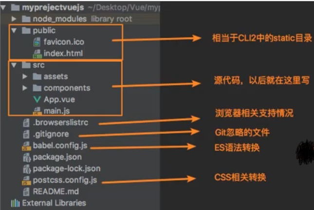
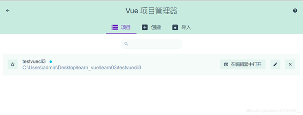

## 1.VueCLI3

vue-cil 3和2版本有很大区别

vue-cil 3是基于webpack4打造，vue-cil 2是基于webpack3打造 

vue-cil 3的设计原则是“0配置”，移出了配置文件根目录下面的build,config等目录 

vue-cil 3提供了vue ui命令，提供了可视化配置，更加人性化 

移除了static文件夹，新增了public文件夹，并将index.html移动到public中

**创建项目：**

```
vue create 项目名称
```

**运行项目：**

```
npm run serve
```

**目录结构解析：**



**执行`vue ui`，进入可视化管理**


